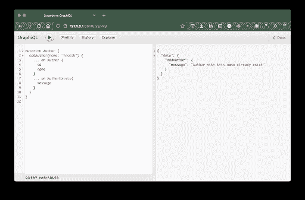
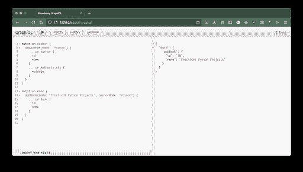

# 将 GraphQL 用于 Strawberry、FastAPI 和 Next.js 

> 原文：<https://blog.logrocket.com/using-graphql-strawberry-fastapi-next-js/>

大家好！👋

你可能听说过 FastAPI、Strawberry、GraphQL 等等。现在，我们将向您展示如何在 Next.js 应用程序中将它们放在一起。我们将专注于通过类型化代码获得良好的开发者体验(DX)。很多文章可以教你如何单独使用每一个，但是没有很多资源可以把它们放在一起，特别是草莓。

有多个基于 Python 的 GraphQL 库，它们彼此略有不同。很长一段时间以来，[石墨烯](https://graphene-python.org/)是一个自然的选择，因为它是最古老的，并在不同公司的生产中使用，但现在其他较新的库也开始获得一些关注。

我们将关注这样一个名为 [Strawberry](https://strawberry.rocks/) 的库。它相对较新，需要 Python 3.7+版本，因为它使用了 Python 语言早期版本中没有的特性。它大量使用数据类，并使用 mypy 完全类型化。

*注意，你可以在 [GitHub](https://github.com/yasoob/sqlalchemy-strawberry-fastapi-nextjs) 上找到这篇文章的完整代码。*

## 最终产品:一个图书数据库

我们将有一个基本的项目结构，它将演示如何成功地开始编写 SQLAlchemy + Strawberry + FastAPI 应用程序，同时利用类型并自动生成类型化的 React 挂钩，以利用 GraphQL 查询和类型脚本代码中的变化。React 钩子将利用`urql`，但是你可以很容易地把它换成 Apollo。

我将基于书店的想法创建 DB 模式。我们将存储关于作者和他们的书的信息。我们不会使用 React/Next.js 创建一个完整的应用程序，但是如果需要的话，我们会准备好所有必要的组件来完成这个任务。

目标是通过在任何地方使用类型和尽可能多地自动生成代码来获得更好的开发体验。这将有助于在开发中捕获更多的 bug。

这个帖子的灵感来自于[这个 GitHub repo](https://github.com/jokull/python-ts-graphql-demo) 。

## 入门指南

在开始工作之前，我们首先需要安装以下库/包:

*   这是我们的 GraphQL 库，将在 Python 端提供 GraphQL 支持
*   FastAPI :这是我们为基于草莓的 GraphQL API 服务的 web 框架
*   这是一个 ASGI web 服务器，将为我们的 FastAPI 应用程序提供服务
*   Aiosqlite :为 sqlite 提供异步支持
*   这是我们使用 SQLite DB 的 ORM

让我们创建一个新文件夹，并使用 pip 安装这些库。我将使用`[create-next-app]([https://nextjs.org/docs/api-reference/create-next-app](https://nextjs.org/docs/api-reference/create-next-app))`命令来创建新文件夹，而不是手动创建。我们将把这个命令创建的文件夹视为整个项目的根文件夹。这只是使解释更容易。稍后我将讨论所需的 JS/TS 库。现在，我们将只关注 Python 方面。

确保您的系统中有有效的命令`create-next-app`。完成后，在终端中运行以下命令:

```
$ npx [email protected] --typescript strawberry_nextjs

```

上面的命令应该会创建一个`strawberry_nextjs`文件夹。现在进入该文件夹，安装所需的基于 Python 的依赖项:

```
$ cd strawberry_nextjs

$ python -m venv virtualenv
$ source virtualenv/bin/activate

$ pip install 'strawberry-graphql[fastapi]' fastapi 'uvicorn[standard]' aiosqlite sqlalchemy

```

## 草莓+ FastAPI:你好，世界！

让我们从一句“你好，世界！”示例，它将向我们展示组成一个草莓应用程序的一点一滴。创建一个名为`app.py`的新文件，并添加以下代码:

```
import strawberry

from fastapi import FastAPI
from strawberry.fastapi import GraphQLRouter

authors: list[str] = []

@strawberry.type
class Query:
    @strawberry.field
    def all_authors(self) -> list[str]:
        return authors

@strawberry.type
class Mutation:
    @strawberry.field
    def add_author(self, name: str) -> str:
        authors.append(name)
        return name

schema = strawberry.Schema(query=Query, mutation=Mutation)

graphql_app = GraphQLRouter(schema)

app = FastAPI()
app.include_router(graphql_app, prefix="/graphql")

```

让我们分块来看这段代码。我们从导入所需的库和包开始。我们创建一个作者列表，作为我们的临时数据库，保存作者姓名(我们将简单地创建一个实际的数据库)。

然后，我们创建查询类，并用 strawberry.type 装饰器装饰它。这会将其转换为 GraphQL 类型。在这个类中，我们定义了一个从列表中返回所有作者的`all_authors`解析器。解析器也需要声明它的返回类型。我们将在下一节研究定义稍微复杂的类型，但是现在，一个字符串列表就足够了。

接下来，我们创建一个新的`Mutation`类，包含所有的 GraphQL 变体。目前，我们只有一个简单的`add_author`突变，它接受一个名字并将其添加到作者列表中。

然后我们将查询和变异类传递给`strawberry.Schema`来创建一个 GraphQL 模式，然后将它传递给`GraphQLRouter`。最后，我们将`GraphQLRouter`插入 FastAPI，让 GraphQLRouter 处理所有传入/graphql 端点的请求。

如果你不知道这些术语的意思，那么让我给你一个快速复习:

*   查询:发送到服务器以检索数据/记录的一种请求
*   [突变](https://blog.logrocket.com/supporting-opt-in-nested-mutations-in-graphql/) —发送给服务器的一种创建/更新/删除数据/记录的请求
*   类型:我们在 GraphQL 中与之交互的对象。这些代表数据/记录/错误以及其间的一切
*   [解析器](https://blog.logrocket.com/properly-designed-graphql-resolvers/) —一个为我们的模式中的单个字段填充数据的函数

你可以在[官方文档页面](https://strawberry.rocks/docs/general/schema-basics)中阅读更多关于草莓模式的基础知识。

要运行这段代码，跳到终端并执行以下命令:

```
$ uvicorn app:app --reload --host '::'

```

这应该会输出如下内容:

```
INFO: Will watch for changes in these directories: ['/Users/yasoob/Desktop/strawberry_nextjs']
INFO: Uvicorn running on http://[::]:8000 (Press CTRL+C to quit)
INFO: Started reloader process [56427] using watchgod
INFO: Started server process [56429]
INFO: Waiting for application startup.
INFO: Application startup complete.

```

现在转到[https://127 . 0 . 0 . 1:8000/graphql](https://127.0.0.1:8000/graphql)，你应该会看到交互式 graph QL 游乐场:


尝试执行以下查询:

```
query MyQuery {
    allAuthors
}
/pre>
```

这将输出一个空列表。这是意料之中的，因为我们的列表中没有任何作者。然而，我们可以通过首先运行一个变异，然后运行上面的查询来解决这个问题。

要创建一个新作者，运行`addAuthor`突变:

```
mutation MyMutation {
    addAuthor(name: "Yasoob")
}

```

现在，如果您重新运行`allAuthors`查询，您应该在输出列表中看到 Yasoob:

```
{
  "data": {
    "allAuthors": [
      "Yasoob"
    ]
  }
}

```

现在您可能已经意识到了这一点，但是 Strawberry 自动将我们的 camel *case 字段转换为内部 PascalCase 字段，这样我们就可以遵循在 GraphQL API 调用中使用 PascalCase 和在 Python 代码中使用 camel* case 的惯例。
有了基础知识，让我们继续工作，开始我们的书店类型的应用程序。

## 定义模式

我们需要弄清楚的第一件事是我们的模式将会是什么。我们需要为我们的应用程序定义什么样的查询、突变和类型。

在本文中，我将不再关注 GraphQL 的基础知识，而只关注草莓特有的部分。正如我已经提到的，我们将遵循书店的理念。我们将为作者和他们的书存储数据。这是我们的数据库最终的样子:


## 定义 SQLAlchemy 模型

我们将使用 SQLAlchemy，所以让我们将两个模型都定义为类。我们将使用异步 SQLAlchemy。在`strawberry_nextjs`文件夹中创建一个新的`models.py`文件，并添加以下导入:

```
import asyncio
from contextlib import asynccontextmanager
from typing import AsyncGenerator, Optional

from sqlalchemy import Column, ForeignKey, Integer, String
from sqlalchemy.ext.asyncio import AsyncSession, create_async_engine
from sqlalchemy.ext.declarative import declarative_base
from sqlalchemy.orm import relationship, sessionmaker

```

这些进口很快就会有意义。我们将使用从 SQLAlchemy 的声明性基础模型继承的类来声明性地定义我们的模型。SQLAlchemy 为我们提供了`declarative_base()`函数来获取声明性基础模型。让我们利用这一点来定义我们的模型:

```
Base = declarative_base()

class Author(Base):
    __tablename__ = "authors"
    id: int = Column(Integer, primary_key=True, index=True)
    name: str = Column(String, nullable=False, unique=True)

    books: list["Book"] = relationship("Book", lazy="joined", back_populates="author")

class Book(Base):
    __tablename__ = "books"
    id: int = Column(Integer, primary_key=True, index=True)
    name: str = Column(String, nullable=False)
    author_id: Optional[int] = Column(Integer, ForeignKey(Author.id), nullable=True)

    author: Optional[Author] = relationship(Author, lazy="joined", back_populates="books")

```

我们的`Author`类定义了两列:`id`和`name`。`books`只是一个关系属性，帮助我们导航模型之间的关系，但并不作为单独的列存储在 authors 表中。我们将 books 属性填充为 author。这意味着我们可以访问`book.author`来访问一本书的链接作者。

`Book`类与`Author`类非常相似。我们定义了一个链接作者和书籍的额外的`author_id`列。与关系不同，它存储在 book 表中。我们还将`author`属性回填为`books`。这样我们就可以像这样访问某个特定作者的书籍:`author.books`。

现在我们需要告诉 SQLAlchemy 使用哪个 DB 以及在哪里可以找到它:

```
engine = create_async_engine(
    "sqlite+aiosqlite:///./database.db", connect_args={"check_same_thread": False}
)

```

我们使用`aiosqlite`作为连接字符串的一部分，因为`aiosqlite`允许 SQLAlchemy[以异步方式](https://docs.sqlalchemy.org/en/14/dialects/sqlite.html#aiosqlite)使用 SQLite DB。我们传递`check_same_thread`参数来确保我们可以在多个线程中使用相同的连接。

以多线程方式使用 SQLite 而不特别注意确保数据在并发写操作时不被破坏是不安全的，因此建议在生产中使用 PostgreSQL 或类似的高性能数据库。

接下来，我们需要创建一个会话:

```
async_session = sessionmaker(
    bind=engine,
    class_=AsyncSession,
    expire_on_commit=False,
    autocommit=False,
    autoflush=False,
)

```

为了确保我们正确关闭每个交互的会话，我们将创建一个新的上下文管理器:

```
@asynccontextmanager
async def get_session() -> AsyncGenerator[AsyncSession, None]:
    async with async_session() as session:
        async with session.begin():
            try:
                yield session
            finally:
                await session.close()

```

我们也可以在没有上下文管理器的情况下使用会话，但这意味着我们必须在每次使用会话后手动关闭会话。

最后，我们需要确保创建了新的数据库。如果我们尝试直接执行`models.py`文件，我们可以向`models.py`文件添加一些代码，使用我们声明的模型创建一个新的 DB 文件:

```
async def _async_main():
    async with engine.begin() as conn:
        await conn.run_sync(Base.metadata.drop_all)
        await conn.run_sync(Base.metadata.create_all)
    await engine.dispose()

if __name__ == "__main__":
    print("Dropping and re/creating tables")
    asyncio.run(_async_main())
    print("Done.")

```

这将删除 DB 中所有现有的表，并根据该文件中定义的模型重新创建它们。我们可以添加安全措施，确保不会意外删除我们的数据，但这超出了本文的范围。我只是想向你展示一切是如何联系在一起的。

* * *

### 更多来自 LogRocket 的精彩文章:

* * *

现在我们的`models.py`文件完成了，我们准备定义草莓`Author`和`Book`类型，它们将映射到 SQLAlchemy 模型上。

## 定义草莓类型

在您阅读本文时，Strawberry 可能已经稳定地内置了对直接使用 SQLAlchemy 模型的支持，但是现在，我们必须定义将映射到 SQLAlchemy 模型的自定义 Strawberry 类型。让我们先定义它们，然后理解它们是如何工作的。将这段代码放在`app.py`文件中:

```
import models

# ...

@strawberry.type
class Author:
    id: strawberry.ID
    name: str

    @classmethod
    def marshal(cls, model: models.Author) -> "Author":
        return cls(id=strawberry.ID(str(model.id)), name=model.name)

@strawberry.type
class Book:
    id: strawberry.ID
    name: str
    author: Optional[Author] = None

    @classmethod
    def marshal(cls, model: models.Book) -> "Book":
        return cls(
            id=strawberry.ID(str(model.id)),
            name=model.name,
            author=Author.marshal(model.author) if model.author else None,
        )

```

要定义一个新类型，我们只需创建一个类并用`strawberry.type`装饰器来装饰它。这与我们如何定义`Mutation`和`Query`类型非常相似。唯一不同的是，这一次，我们不会将这些类型直接传递给`strawberry.Schema`，所以草莓不会将它们视为`Mutation`或`Query`类型。

每个类都有一个`marshal`方法。这个方法允许我们接受一个 SQLAlchemy 模型，并从中创建一个 Strawberry 类型的类实例。Strawberry 使用`strawberry.ID`来表示一个对象的惟一标识符。默认情况下，Strawberry 提供了一些标量类型，它们的工作方式就像`strawberry.ID`。如何使用它们将我们的 SQLAlchemy 数据映射到这个自定义类型类属性取决于我们自己。我们通常试图找到 SQLAlchemy 列类型的最佳和最相似的替代类型，并使用它。

在`Book`类中，我还展示了如何将一个类型属性标记为可选的，并提供一个默认值。我们将作者标记为可选。这只是向你展示它是如何做的；稍后，我会将此标记为必填。

另一件要注意的事情是，我们还可以为我们的变异和查询调用定义一个返回类型列表。这有助于确保我们的 GraphQL API 消费者能够根据它接收到的返回类型适当地处理输出。

如果你了解 GraphQL，那么这就是我们定义片段的方式。让我们首先定义类型，然后当我们开始定义新的变异和查询类时，我将向您展示如何使用它们:

```
@strawberry.type
class AuthorExists:
    message: str = "Author with this name already exists"

@strawberry.type
class AuthorNotFound:
    message: str = "Couldn't find an author with the supplied name"

@strawberry.type
class AuthorNameMissing:
    message: str = "Please supply an author name"

AddBookResponse = strawberry.union("AddBookResponse", (Book, AuthorNotFound, AuthorNameMissing))
AddAuthorResponse = strawberry.union("AddAuthorResponse", (Author, AuthorExists))

```

我们基本上是说我们的`AddBookResponse`和`AddAuthorResponse`类型是联合类型，可以是元组中列出的三种(或两种)类型中的任何一种。

## 定义查询和突变

现在让我们定义我们的查询。我们只有两个问题。一个列出所有的书，一个列出所有的作者:

```
from sqlalchemy import select

# ...

@strawberry.type
class Query:
    @strawberry.field
    async def books(self) -> list[Book]:
        async with models.get_session() as s:
            sql = select(models.Book).order_by(models.Book.name)
            db_books = (await s.execute(sql)).scalars().unique().all()
        return [Book.marshal(book) for book in db_books]

    @strawberry.field
    async def authors(self) -> list[Author]:
        async with models.get_session() as s:
            sql = select(models.Author).order_by(models.Author.name)
            db_authors = (await s.execute(sql)).scalars().unique().all()
        return [Author.marshal(loc) for loc in db_authors]

```

这里好像发生了很多事情，我们来分解一下。

首先，看看图书解析器。我们使用`get_session`上下文管理器来创建一个新的会话。然后我们创建一个新的 SQL 语句，该语句选择`Book`模型并根据图书名称对它们进行排序。

之后，我们使用之前创建的会话执行 SQL 语句，并将结果放入`db_books`变量中。最后，我们将每本书整理成一个草莓书类型，并将其作为输出返回。我们还将 books resolver 的返回类型标记为`Books`的`list`。

`authors`解析器与`books`解析器非常相似，所以我不需要解释。

现在让我们写下我们的突变:

```
@strawberry.type
class Mutation:
    @strawberry.mutation
    async def add_book(self, name: str, author_name: Optional[str]) -> AddBookResponse:
        async with models.get_session() as s:
            db_author = None
            if author_name:
                sql = select(models.Author).where(models.Author.name == author_name)
                db_author = (await s.execute(sql)).scalars().first()
                if not db_author:
                    return AuthorNotFound()
            else:
                return AuthorNameMissing()
            db_book = models.Book(name=name, author=db_author)
            s.add(db_book)
            await s.commit()
        return Book.marshal(db_book)

    @strawberry.mutation
    async def add_author(self, name: str) -> AddAuthorResponse:
        async with models.get_session() as s:
            sql = select(models.Author).where(models.Author.name == name)
            existing_db_author = (await s.execute(sql)).first()
            if existing_db_author is not None:
                return AuthorExists()
            db_author = models.Author(name=name)
            s.add(db_author)
            await s.commit()
        return Author.marshal(db_author)

```

突变相当简单。先说`add_book`突变。

`add_book`接受书的名字和作者的名字作为输入。我将`author_name`定义为可选的，只是为了向您展示如何定义可选的参数，但是在方法体中，如果没有传入`author_name`，我通过返回`AuthorNameMissing`来加强`author_name`的存在。

我根据传入的`author_name`过滤`db`中的`Authors`,并确保具有指定名称的作者存在。否则，我返回`AuthorNotFound`。

如果这两个检查都通过了，我将创建一个新的`models.Book`实例，通过会话将其添加到`db`中，并提交它。最后，我返回一个封送的书作为返回值。`add_author`和`add_book`几乎一样，所以没有理由再重复一遍代码。

草莓这边我们也差不多做好了；再过几分钟我们就结束了。

GraphQL 的另一个(不总是)有趣的特性是递归解析器。你可以在上面看到，在本书的`marshal`方法中，我也定义了`author`。这样，我们可以像这样运行一个 GraphQL 查询:

```
query {
  book {
    author {
      name
    }
  }
}

```

但是，假设我们想要运行这样一个查询:

```
query {
  author {
    books {
      name
    }
  }
} 
```

这将不起作用，因为我们还没有在草莓类型上定义一个`books`属性。让我们重写我们的`Author`类，并添加一个`DataLoader`到草莓在我们的类方法中提供的默认上下文中:

```
from strawberry.dataloader import DataLoader

# ...

@strawberry.type
class Author:
    id: strawberry.ID
    name: str

    @strawberry.field
    async def books(self, info: Info) -> list["Book"]:
        books = await info.context["books_by_author"].load(self.id)
        return [Book.marshal(book) for book in books]

    @classmethod
    def marshal(cls, model: models.Author) -> "Author":
        return cls(id=strawberry.ID(str(model.id)), name=model.name)

# ...

async def load_books_by_author(keys: list) -> list[Book]:
    async with models.get_session() as s:
        all_queries = [select(models.Book).where(models.Book.author_id == key) for key in keys]
        data = [(await s.execute(sql)).scalars().unique().all() for sql in all_queries]
        print(keys, data)
    return data

async def get_context() -> dict:
    return {
        "books_by_author": DataLoader(load_fn=load_books_by_author),
    }

# ...

```

让我们自下而上地理解这段代码。Strawberry 允许我们通过上下文将自定义函数传递给我们的类(那些用`@strawberry.type`包装的)方法。这个上下文在单个请求中共享。

DataLoader 允许我们批处理多个请求，这样我们可以减少对`db`的来回调用。我们创建一个`DataLoader`实例，并通知它如何为传入的作者从`db`加载书籍。我们将这个`DataLoader`放入字典，并将其作为`context_getter`参数传递给`GraphQLRouter`。这使得字典可以通过`info.context`用于我们的类方法。我们用它来加载每个作者的书籍。

在这个例子中，DataLoader 不是非常有用。当我们用一系列参数调用`DataLoader`时，它的主要好处就显现出来了。这大大减少了数据库调用。和`DataLoaders`也缓存输出，它们在单个请求中共享。因此，如果您在一个请求中多次向数据加载器传递相同的参数，将不会导致额外的数据库命中。超级厉害！

## 定义自定义输入类型

Strawberry 允许我们为突变和查询定义定制的输入类型。这是 GraphQL 本身的一个特性，由 Strawberry 支持，允许我们限制不同字段可以使用的类型数量。

让我们使用自定义输入类型向我们的`books`查询添加一个过滤器，以便让用户能够过滤特定作者的书籍。

我们将从定义自定义输入类型开始:

```
@strawberry.input
class BooksQueryInput:
    author_name: Optional[str] = strawberry.UNSET

```

这个类将封装我们期望从我们的`books`查询中收到的所有输入。我们将`author_name`设为可选。如果这个值存在，我们将根据它来过滤书籍。`strawberry.UNSET`使生成的 GraphQL 模式中的字段可选。

接下来，我们需要在我们的`books`查询中使用这个自定义输入，并根据`author_name`过滤书籍(如果存在的话):

```
@strawberry.type
class Query:
    @strawberry.field
    async def books(self, query_input: Optional[BooksQueryInput] = None) -> list[Book]:
        async with models.get_session() as s:
            if query_input:
                sql = select(models.Book).join(models.Author) \
                        .filter(models.Author.name == query_input.author_name)
            else:
                sql = select(models.Book).order_by(models.Book.name)
            db_book = (await s.execute(sql)).scalars().unique().all()
        return [Book.marshal(book) for book in db_book]

```

在上面的代码中，我们定义了一个名为`query_input`的新的可选方法参数。我们将其默认值设置为`None`,以确保我们的查询即使在它不存在时也能工作。然后，我们修改 SQL 查询，并添加一个基于作者姓名的过滤器(如果存在的话)。

## 测试草莓

一旦您做出这些代码更改并保存它们，uvicon 实例应该会自动重新加载。转到[http://127 . 0 . 0 . 1:8000/graph QL](http://127.0.0.1:8000/graphql)并测试最新的代码。
尝试执行两次以下突变:

```
mutation Author {
  addAuthor(name: "Yasoob") {
    ... on Author {
      id
      name
    }
    ... on AuthorExists{
      message
    }
  }
}

```

它第一次应该输出这个:

```
{
  "data": {
    "addAuthor": {
      "id": "1",
      "name": "Yasoob"
    }
  }
}

```

第二次它应该输出这个:

```
{
  "data": {
    "addAuthor": {
      "message": "Author with this name already exist"
    }
  }
}

```




现在，让我们尝试添加新书:

```
mutation Book {
  addBook(name: "Practical Python Projects", authorName: "Yasoob") {
    ... on Book {
      id
      name
    }
  }
}

```




最后再加一个`A``uthor`和`B``ook`。为此，运行这个新的突变:

```
mutation addAuthors {
  secondAuthor: addAuthor(name: "Ahmed") {
    ... on Author {
      id
      name
    }
    ... on AuthorExists{
      message
    }
  }

  ahmedBook: addBook(name: "Ahmed's book", authorName: "Ahmed") {
    ... on Book{
      id
      name
    }
    ... on AuthorNotFound {
      message
    }
    ... on AuthorNameMissing{
      message
    }
  }
}

```

现在我们可以尝试使用`books`查询来确保得到我们期望的结果:

```
query filterBooks {
  all: books{
    name
    author {
      name
    }
  }
  byAuthor: books(queryInput:  {authorName: "Yasoob"}) {
    name
    author {
      name
    }
  }
}

```

第一个查询应该列出两本书；第二个查询应该只列出一本书:

```
{
  "data": {
    "all": [
      {
        "name": "Ahmed's book",
        "author": {
          "name": "Ahmed"
        }
      },
      {
        "name": "Practical Python Projects",
        "author": {
          "name": "Yasoob"
        }
      }node depen
    ],
    "byAuthor": [
      {
        "name": "Practical Python Projects",
        "author": {
          "name": "Yasoob"
        }
      }
    ]
  }
}
```

```
太棒了。我们的 Python/Strawberry 端工作得非常好。但是现在我们需要将它绑定在 Node/Next.js 端。
设置节点相关性
我们将使用`graphql-codegen`为我们自动创建类型化的钩子。因此，基本的工作流程是，在我们可以在类型脚本代码中使用 GraphQL 查询、变异或片段之前，我们将在 GraphQL 文件中定义它。然后`graphql-codegen`将自省我们的 Strawberry GraphQL API，创建类型并使用我们自定义的 GraphQL
查询/突变/片段来创建定制的`urql`钩子。
`urql`是 React 的一个功能相当全面的 GraphQL 库，它使得与 GraphQL APIs 的交互变得更加简单。通过这样做，在我们可以在我们的 Next.js/React 应用程序中使用我们的 GraphQL API 之前，我们将减少自己编写类型化钩子的大量工作。
在我们继续之前，我们需要安装一些依赖项:

```
$ npm install graphql
$ npm install @graphql-codegen/cli
$ npm install @graphql-codegen/typescript
$ npm install @graphql-codegen/typescript-operations
$ npm install @graphql-codegen/typescript-urql
$ npm install urql

```

这里我们正在为`@graphql-codegen`安装`urql`和一些插件。
设置 graphql-codegen
现在我们将在项目的根目录下创建一个`codegen.yml`文件，它将告诉`graphql-codegen`该做什么:

```
overwrite: true
schema: "http://127.0.0.1:8000/graphql"
documents: './graphql/**/*.graphql'
generates:
  graphql/graphql.ts:
    plugins:
      - "typescript"
      - "typescript-operations"
      - "typescript-urql"

```

我们通知`graphql-codegen`它可以在[http://127 . 0 . 0 . 1:8000/graph QL](http://127.0.0.1:8000/graphql)找到我们的 GraphQL API 的模式。我们还告诉它(通过`documents`键)我们已经在位于`graphql`文件夹中的 graphql 文件中定义了我们的定制片段、查询和变异。然后我们指示它通过三个插件运行模式和文档来生成`graphql/graphql.ts`文件。
现在在我们的项目目录中创建一个`graphql`文件夹，并在其中创建一个新的`operations.graphql`文件。我们将定义我们计划在应用程序中使用的所有片段、查询和变异。
我们可以为这三个创建单独的文件，`graphql-codegen`会在处理时自动合并它们，但我们会保持简单，现在把所有东西放在一个文件中。让我们将下面的 GraphQL 添加到`operations.graphql`中:

```
query Books {
  books {
    ...BookFields
  }
}

query Authors {
  authors {
    ...AuthorFields
  }
}

fragment BookFields on Book {
  id
  name
  author {
    name
  }
}

fragment AuthorFields on Author {
  id
  name
}

mutation AddBook($name: String!, $authorName: String!) {
  addBook(name: $name, authorName: $authorName) {
      __typename
    ... on Book {
      __typename
      ...BookFields
    }
  }
}

mutation AddAuthor($name: String!) {
  addAuthor(name: $name) {
    __typename
    ... on AuthorExists {
      __typename
      message
    }
    ... on Author {
      __typename
      ...AuthorFields
    }
  }
}

```

这与我们在 GraphiQL 在线界面中执行的代码非常相似。这个 GraphQL 代码将告诉`graphql-codegen`它需要为我们产生哪些`urql`变异和查询钩子。
[一直在讨论](https://github.com/dotansimha/graphql-code-generator/discussions/2349)让`graphql-codegen`通过内省我们的在线 GraphQL API 来生成所有的突变和查询，但到目前为止，仅仅使用`graphql-codegen`是不可能的。确实有[工具](https://npm.io/package/gql-typescript-generator)允许你这样做，但是我不打算在本文中使用它们。你可以自己探索它们。
接下来让我们编辑 package.json 文件，并添加一个命令来通过 npm 运行`graphql-codegen`。将此代码添加到`scripts`部分:

```
"codegen": "graphql-codegen --config codegen.yml"

```

现在我们可以到终端运行`graphql-codegen`:

```
$ npm run codegen

```

如果命令成功，您应该在`graphql`文件夹中有一个`graphql.ts`文件。我们可以在下一段代码中使用生成的`urql`钩子，如下所示:

```
import {
  useAuthorsQuery,
} from "../graphql/graphql";

// ....

const [result] = useAuthorsQuery(...);

```

你可以在这里阅读更多关于 [graphql-codegen](https://www.graphql-code-generator.com/plugins/typescript-urql) `[urql]([https://www.graphql-code-generator.com/plugins/typescript-urql](https://www.graphql-code-generator.com/plugins/typescript-urql))` [插件的内容。](https://www.graphql-code-generator.com/plugins/typescript-urql)
解决 CORS 问题
在生产环境中，您可以从同一个域+端口提供 GraphQL API 和 Next.js/React 应用程序，这将确保您不会遇到 CORS 问题。
对于开发环境，我们可以向`next.config.js`文件添加一些代理代码，以指示 NextJS 将对`/graphql`的所有调用代理到运行在不同端口上的`uvicorn`:

```
/** @type {import('next').NextConfig} */
module.exports = {
  reactStrictMode: true,
  async rewrites() {
    return {
      beforeFiles: [
        {
          source: "/graphql",
          destination: "http://localhost:8000/graphql",
        },
      ],
    };
  },
};

```

这将确保你不会在当地发展中遇到任何 CORS 问题。
替代 GraphQL 库(石墨烯和 Ariadne)
当然，Strawberry 并不是 Python 和 FastAPI 唯一可用的 GraphQL 客户端。[石墨烯](https://graphene-python.org/)和[阿里阿德涅](https://github.com/mirumee/ariadne)都是可行的替代品；让我们检查一下关于这两个库的一些细节。
这些 GraphQL 库之间最大的区别是它们遵循的哲学。石墨烯类似于草莓，遵循代码优先的方法；我们编写用于生成 GraphQL 模式的代码。
Graphene 是 Python 最古老的 GraphQL 库，拥有广泛的支持。它曾经是用 Python 实现 GraphQL 相关内容的自然选择。它支持一些旧的 Python 版本，这些版本不允许它完全依赖 Python 的新特性。因此，与草莓不同，石墨烯的 API 有点繁琐。与 Strawberry 相比，启动和运行 GraphQL API 需要更多的样板代码。
如果我要开始一个新的 Python 项目，我会选择草莓而不是石墨烯。但是，如果我想支持旧的 Python 版本(Strawberry 不支持)，并且仍然使用代码优先的 GraphQL 库，我会选择 Graphene。
或者，Ariadne 遵循模式优先的方法。我们编写 GraphQL 模式，然后用 Python 编写一些最小的样板代码来启动和运行我们的 GraphQL API。Ariadne 是偏爱这种哲学的开发人员的自然选择。Ariadne 提供了一个简单的 API，使其易于使用。我建议你去看看 Ariadne，看看它的理念是否能引起你的共鸣。
结论
我希望你能从这篇文章中学到一些东西。我故意没有对任何一个单独的主题进行过多的描述，因为这样的文章已经在网上存在了，但是很难找到一篇文章向你展示所有的事情是如何联系在一起的。
你可以在我的 GitHub 上找到这篇文章[的所有代码。将来，我可能会创建一个完整的项目，向您展示如何在您的应用程序中使用生成的代码的更具体的示例。同时，你可以看看](https://github.com/yasoob/sqlalchemy-strawberry-fastapi-nextjs)[这个回购](https://github.com/jokull/python-ts-graphql-demo/)，它是这篇文章的灵感来源。Jokull 可能是第一个公开主持结合所有这些不同工具的项目的人。谢谢你，雪山！
此外，如果您有任何 Python 或 web 开发项目，请通过[【电子邮件保护】](/cdn-cgi/l/email-protection)联系我，分享您的想法。我做各种各样的项目，所以几乎没有什么是不寻常的。让我们一起创造一些令人敬畏的东西。
😄
See you later! 👋 ❤️

## 监控生产中失败和缓慢的 GraphQL 请求

虽然 GraphQL 有一些调试请求和响应的特性，但确保 GraphQL 可靠地为您的生产应用程序提供资源是一件比较困难的事情。如果您对确保对后端或第三方服务的网络请求成功感兴趣，

[try LogRocket](https://lp.logrocket.com/blg/graphql-signup)

.

[](https://lp.logrocket.com/blg/graphql-signup)[https://logrocket.com/signup/](https://lp.logrocket.com/blg/graphql-signup)

LogRocket 就像是网络和移动应用的 DVR，记录下你网站上发生的每一件事。您可以汇总并报告有问题的 GraphQL 请求，以快速了解根本原因，而不是猜测问题发生的原因。此外，您可以跟踪 Apollo 客户机状态并检查 GraphQL 查询的键值对。

##  [LogRocket](https://lp.logrocket.com/blg/nextjs-signup) :全面了解生产 Next.js 应用

调试下一个应用程序可能会很困难，尤其是当用户遇到难以重现的问题时。如果您对监视和跟踪状态、自动显示 JavaScript 错误、跟踪缓慢的网络请求和组件加载时间感兴趣，

[try LogRocket](https://lp.logrocket.com/blg/nextjs-signup)

. 

[](https://lp.logrocket.com/blg/nextjs-signup)[](https://lp.logrocket.com/blg/nextjs-signup)

LogRocket 就像是网络和移动应用的 DVR，记录下你的 Next.js 应用上发生的一切。您可以汇总并报告问题发生时应用程序的状态，而不是猜测问题发生的原因。LogRocket 还可以监控应用程序的性能，报告客户端 CPU 负载、客户端内存使用等指标。

LogRocket Redux 中间件包为您的用户会话增加了一层额外的可见性。LogRocket 记录 Redux 存储中的所有操作和状态。

让您调试 Next.js 应用的方式现代化— [开始免费监控](https://lp.logrocket.com/blg/nextjs-signup)。

LogRocket 检测您的应用程序以记录基线性能计时，如页面加载时间、到达第一个字节的时间、慢速网络请求，还记录 Redux、NgRx 和 Vuex 操作/状态。

[Start monitoring for free](https://lp.logrocket.com/blg/graphql-signup)

。

参考资料:

```