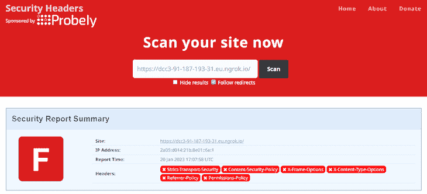
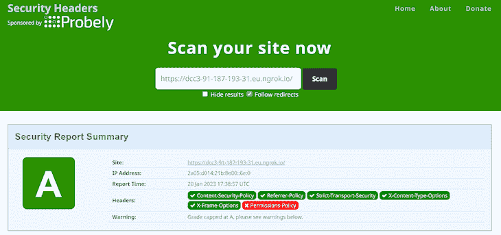

# 在 Node.js 中使用头盔保护应用程序

> 原文：<https://blog.logrocket.com/using-helmet-node-js-secure-application/>

Express.js 是用于在 Node.js 中开发 web 应用程序的最流行的 web 框架。它提供了几个特性来使 API 开发更快更容易。

然而，Express 在安全性方面有所欠缺，不能确保针对常见漏洞的足够保护级别。幸运的是，由于中间件，它可以很容易地扩展，中间件是在处理 HTTP 请求时执行的一组功能。

Helmet.js 是基于中间件的技术，通过保护 Node.js 应用程序返回的 HTTP 头来提高安全性。在这里，您将了解什么是头盔，为什么需要它，以及如何将它集成到 Node.js 中以保护 Express.js 应用程序中的 HTTP 头。我们将涵盖:

让我们在 Node.js 中深挖头盔吧！

## 头盔是什么？

[Helmet.js 是一个开源的 JavaScript 库](https://helmetjs.github.io/)，它通过设置几个 HTTP 头来帮助你保护 Node.js 应用。它充当了 [Express 和类似技术](https://blog.logrocket.com/nestjs-vs-express-js/)的中间件，自动[添加或删除 HTTP 头](https://blog.logrocket.com/using-next-js-security-headers/)以符合网络安全标准。

虽然不是银弹，头盔使攻击者更难利用已知的漏洞。它有助于保护 Node.js Express 应用免受常见安全威胁，如[跨站点脚本(XSS)](https://developer.mozilla.org/en-US/docs/Glossary/Cross-site_scripting) 和[点击劫持攻击](https://developer.mozilla.org/en-US/docs/Web/Security/Types_of_attacks#click-jacking)。

头盔是特别有用的，因为快速应用程序不带有现成的安全 HTTP 头。这解释了为什么[的](https://www.npmjs.com/package/helmet) `[helmet](https://www.npmjs.com/package/helmet)` [npm 包](https://www.npmjs.com/package/helmet)有超过 200 万的周下载量，而它的 [GitHub repo 号称超过 94k 星](https://github.com/helmetjs/helmet)！

现在让我们更深入地了解为什么在 Node.js 中采用头盔如此重要。

## 为什么一个 Node.js app 里需要头盔？

如果没有头盔，Express 返回的默认头会暴露敏感信息，并使 Node.js 应用程序容易受到恶意参与者的攻击。相比之下，在 Node.js 中使用头盔可以保护您的应用程序免受 XSS 攻击、内容安全策略漏洞和其他安全问题的影响。

让我们通过一个例子来进一步探讨这个问题。您将设置一个 Node.js Express 应用程序，看看它的默认 HTTP 头提供了什么级别的安全性。

### 设置 Node.js Express 项目

首先，确保您的机器上安装了 Node.js 和 npm。如果您还没有安装，请下载 Node.js 并按照安装向导进行安装。

现在，让我们建立一个快速项目。运行以下命令创建`express-demo`项目文件夹:

```
mkdir express-demo 

```

然后，通过运行以下命令进入终端中的`express-demo`文件夹:

```
cd express-demo

```

启动以下命令来初始化默认 npm 项目:

```
npm init -y

```

`[npm init](https://docs.npmjs.com/cli/v9/commands/npm-init)`[命令](https://docs.npmjs.com/cli/v9/commands/npm-init)会为你配置一个空白的 npm 项目。请注意，`-y`标志将自动对 npm 在流程中询问的所有问题回答“是”。

您需要将 Express 添加到项目的依赖项中。使用以下组件安装快速模块:

```
npm install express

```

然后，在`express-demo`文件夹中创建一个`index.js`文件，并用以下代码行初始化它:

```
// index.js

const express = require("express")

// creating an Express instance
const app = express()
const PORT = process.env.PORT || 3000

// initializing a basic API that
// returns the "Hello, World!" message
app.get("/", (req, res) => {
    res.json("Hello, World!")
})

// running the server
app.listen(PORT, () => {
    console.log(`Starting Express server on http://localhost:${PORT}`)
})

```

这只不过是具有单个端点的基本 Express 服务器设置。

使用以下命令启动服务器:

```
node index.js

```

Express 服务器现在应该在`[http://localhost:3000](http://localhost:3000)`运行。在您的终端中启动下面的命令来测试`/`端点:

```
curl http://localhost:3000/

```

这应该会打印出以下输出:

```
"Hello, World!"

```

瞧啊！你现在有一个工作的快递应用程序！

### 探索不戴头盔的快递安全

现在，让我们使用刚刚创建的演示应用程序来验证 Express 在安全 HTTP 头方面的默认行为。

使用`--include`标志重复上面的`curl`命令，以获得 HTTP 响应头:

```
curl http://localhost:3000/ --include

```

如果您的计算机上没有安装 cURL，请使用 T2 的 HTTP 客户端，如 Postman T3 或 T4 失眠 T5 来检查响应的 HTTP 头。

在响应标头部分，您应该会看到以下内容:

```
X-Powered-By: Express
Content-Type: application/json; charset=utf-8
Content-Length: 15
ETag: W/"f-pob1Yw/KBE+3vrbZz9GAyq5P2gE"
Date: Fri, 20 Jan 2023 16:29:40 GMT
Connection: keep-alive
Keep-Alive: timeout=5

```

注意`X-Powered-By`标题。与所有以`X-`开头的头一样，它是非标准头。具体来说，后端技术一般使用`X-Powered-By`来表示服务器用来生成 HTTP 响应的框架或库的名称和版本号。

正如致力于改善网络安全的非营利基金会 OWASP 所建议的那样，`[X-Powered-By](https://cheatsheetseries.owasp.org/cheatsheets/HTTP_Headers_Cheat_Sheet.html#x-powered-by)` [应该被省略](https://cheatsheetseries.owasp.org/cheatsheets/HTTP_Headers_Cheat_Sheet.html#x-powered-by)。这是因为你不应该向攻击者透露你的技术栈的细节。否则，他们可能会利用这些信息来利用该框架或库中的已知漏洞。

现在，让我们来看看 [Security Headers online 项目](https://securityheaders.com/)对您的 Express 应用程序的安全级别有什么看法。

因为安全头只允许您测试公共地址，所以您需要公开您的本地 Express 服务器。你可以将你的 Express 应用程序部署到一个服务器上，或者利用 ngrok ，它允许你将一个本地 web 服务器暴露在互联网上。

[下载 ngrok](https://ngrok.com/download) ，解压，打开终端中的文件夹。然后，启动以下命令，用 ngrok 托管您的本地服务器:

```
ngrok http 3000

```

您应该会得到与下面类似的结果:


“转发”字段包含公开访问您的本地服务器的 URL。由于要测试的端点是`/`，复制 URL，添加一个尾随的`/`字符，并将其粘贴到安全头输入中，如下所示:


单击“扫描”按钮，您应该会得到以下结果:



正如你在这里看到的，安全头项目给了演示应用一个令人担忧的“F”级。原因是用不带头盔的 Express 开发的 API 响应缺少了所有最相关的 HTTP 安全头。

这也是为什么官方 Express [“生产最佳实践:安全性”](https://blog.logrocket.com/build-shopify-app-with-node-js/)页面提到采用头盔作为生产应用的最佳实践。现在让我们学习如何在 Node.js 中集成头盔！

## 用头盔保护快递

让我们扩展前面实现的 Express demo 项目，用头盔保护它。正如您将要了解的，这只需要几行代码。

### 在您的快速项目中安装头盔

首先，您需要将 Helmet.js 添加到项目的依赖项中。使用以下命令安装`helmet` npm 包:

```
npm i helmet

```

您的`package.json`文件现在将在`[dependencies](https://docs.npmjs.com/cli/v9/configuring-npm/package-json#dependencies)`[字段](https://docs.npmjs.com/cli/v9/configuring-npm/package-json#dependencies)中包含`helmet`。

### 在 Express 中设置头盔

将头盔集成到 Node.js Express 应用程序中很简单。如有问题，[遵循官方指南](https://github.com/helmetjs/helmet#quick-start)。

在您的`index.js`文件中，使用以下命令导入`helmet`:

```
const helmet = require("helmet")

```

现在，在您的快速应用程序中注册`helmet`,如下所示:

```
app.use(helmet())

```

记住`helmet()`只不过是[一个快递中间件](https://expressjs.com/en/guide/using-middleware.html)。具体来说，顶层的`helmet()`函数是 15 个子中间件的包装器。所以，通过注册`helmet()`，你为你的应用程序增加了 15 个快速中间件。

注意，每个中间件负责设置一个 HTTP 安全头。

您的`index.js`文件现在将如下所示:

```
// index.js

const express = require("express")
const helmet = require("helmet")

const PORT = process.env.PORT || 3000

const app = express()

// enabling the Helmet middleware
app.use(helmet())

// initializing a basic API that
// returns the "Hello, World!" message
app.get("/", (req, res) => {
    res.json("Hello, World!")
})

// running the server
app.listen(PORT, () => {
    console.log(`Starting Express server on http://localhost:${PORT}`)
})

```

就是这样！将头盔添加到 Node.js 应用程序中只需要两行代码！

### 用头盔探索快递安全

让我们重复前面执行的安全测试。使用以下命令停止 Node.js 本地服务器并重新启动它:

```
node index.js 

```

重复`curl`命令或使用 HTTP 客户端查看新响应的 HTTP 头:

```
curl http://localhost:3000/ --include

```

响应 HTTP 头部分现在将包括以下内容:

```
Content-Security-Policy: default-src 'self';base-uri 'self';font-src 'self' https: data:;form-action 'self';frame-ancestors 'self';img-src 'self' data:;object-src 'none';script-src 'self';script-src-attr 'none';style-src 'self' https: 'unsafe-inline';upgrade-insecure-requests
Cross-Origin-Embedder-Policy: require-corp
Cross-Origin-Opener-Policy: same-origin
Cross-Origin-Resource-Policy: same-origin
X-DNS-Prefetch-Control: off
X-Frame-Options: SAMEORIGIN
Strict-Transport-Security: max-age=15552000; includeSubDomains
X-Download-Options: noopen
X-Content-Type-Options: nosniff
Origin-Agent-Cluster: ?1
X-Permitted-Cross-Domain-Policies: none
Referrer-Policy: no-referrer
X-XSS-Protection: 0
Content-Type: application/json; charset=utf-8
Content-Length: 15
ETag: W/"f-pob1Yw/KBE+3vrbZz9GAyq5P2gE"
Date: Fri, 20 Jan 2023 18:15:32 GMT
Connection: keep-alive
Keep-Alive: timeout=5

```

如您所见，响应中有许多新的 HTTP 头。还有，`X-Powered-By`被删除。

如果关闭了 ngrok，请使用以下命令再次运行它:

```
ngrok http 3000

```

否则，请立即访问安全标题网站。就像之前一样，复制 ngrok 提供的网址，点击“扫描”。这一次，结果将会不同:



请注意，API 响应现在涉及所有主要的 HTTP 安全头，除了`[Permissions-Policy](https://developer.mozilla.org/en-US/docs/Web/HTTP/Permissions_Policy)`。这使得 Express 应用程序从“F”级升至“A”级。仅仅两行代码带来了多么巨大的变化啊！

此外，正如 Helmet.js 的主要开发者之一在 GitHub 上提到的[，Helmet 不会自动支持`Permissions-Policy`，只是因为 header 规范仍处于草案状态。所以，这种情况可能很快就会改变。](https://github.com/helmetjs/helmet/issues/234)

正如你刚刚了解到的，头盔默认设置了很多头。由于安全策略会随着时间的推移而变化，因此始终保持`helmet`最新是至关重要的。这样，头盔引入的安全头将始终符合安全标准。

所有这些头文件都对应用程序的安全性有影响，但有些头文件比其他头文件更相关。现在让我们关注最重要的安全头，以理解它们为什么有用，头盔如何默认处理它们，以及如何用头盔配置它们。

[内容安全策略](https://developer.mozilla.org/en-US/docs/Web/HTTP/CSP)，也称为 CSP，是一种安全措施，可帮助您缓解多种攻击，如跨站点脚本(XSS)和数据注入攻击。

具体来说，CSP 允许您指定允许网页加载和执行哪些内容源。例如，您可以使用 CSP 阻止网页从其他网站加载图像和 iframes。

您可以通过`[Content-Security-Policy](https://developer.mozilla.org/en-US/docs/Web/HTTP/Headers/Content-Security-Policy)` [HTTP 头](https://developer.mozilla.org/en-US/docs/Web/HTTP/Headers/Content-Security-Policy)配置 CSP。默认情况下，头盔赋予`Content-Security-Policy`头以下值:

```
Content-Security-Policy: default-src 'self';base-uri 'self';font-src 'self' https: data:;form-action 'self';frame-ancestors 'self';img-src 'self' data:;object-src 'none';script-src 'self';script-src-attr 'none';style-src 'self' https: 'unsafe-inline';upgrade-insecure-requests

```

使用此策略，您的网页无法加载远程字体或样式。这是因为`font-src`和`style-src`分别被设置为`self`。默认情况下，头盔定义的 CSP 策略非常严格，但是您可以使用`contentSecurityPolicy()`对其进行如下更改:

```
// overriding "font-src" and "style-src" while
// maintaining the other default values
helmet.contentSecurityPolicy({
  useDefaults: true,
  directives: {
    "font-src": ["'self'", "external-website.com"],
    // allowing styles from any website
    "style-src": null,
  },
})

```

`useDefaults`应用默认值。然后，以下指令会覆盖默认值。将`useDefaults`设置为`false`以从头定义 CSP 策略。

`[Referrer-Policy](https://developer.mozilla.org/en-US/docs/Web/HTTP/Headers/Referrer-Policy)` [HTTP 头](https://developer.mozilla.org/en-US/docs/Web/HTTP/Headers/Referrer-Policy)定义了什么数据应该在`[Referer](https://developer.mozilla.org/en-US/docs/Web/HTTP/Headers/Referer)`[头](https://developer.mozilla.org/en-US/docs/Web/HTTP/Headers/Referer)中作为 referrer 信息发送。默认情况下，`Referer`通常包含执行 HTTP 请求的当前 URL。

例如，如果你点击一个第三方网站的链接，`Referer`将包含当前网页的地址。因此，第三方网站可以使用标题来跟踪您或了解您正在访问的内容。

如果当前地址包含私人用户信息，第三方站点将能够从`Referer`头中窃取这些信息。正因为如此，即使这个头通常用于缓存或分析，它也会带来一些隐私问题，因为它可能会泄漏敏感信息。

头盔默认设置为`no-referrer`。这意味着`Referer`标题将总是空的。因此，由 Node.js 应用程序服务的网页执行的请求将不包含任何推荐人信息。

如果你想改变这种限制性政策，你可以用下面的`refererPolicy`来做:

```
// setting "Referrer-Policy" to "no-referrer"
app.use(
  helmet.referrerPolicy({
    policy: "no-referrer",
  })
)

```

HTTP 头`Strict-Transport-Security`，[，也称为 HSTS](https://developer.mozilla.org/en-US/docs/Glossary/HSTS) ，指定一个站点或资源只能通过 HTTPS 访问。详细地说，`maxAge`参数定义了浏览器应该记住优先选择 HTTPS 而不是 HTTP 的秒数。

默认情况下，头盔按如下方式设置`Strict-Transport-Security`头:

```
max-age=15552000; includeSubDomains

```

请注意，`15552000`秒相当于 180 天，`includeSubDomains`将 HSTS 策略扩展到了网站的所有子域。

您可以使用`hsts`头盔功能配置`Strict-Transport-Security`割台，如下所示:

```
app.use(
  helmet.hsts({
    // 60 days
    maxAge: 86400,
    // removing the "includeSubDomains" option
    includeSubDomains: false,
  })
 )

```

`[X-Content-Type-Options](https://developer.mozilla.org/en-US/docs/Web/HTTP/Headers/X-Content-Type-Options)` [HTTP 头](https://developer.mozilla.org/en-US/docs/Web/HTTP/Headers/X-Content-Type-Options)定义了必须遵循`[Content-Type](https://developer.mozilla.org/en-US/docs/Web/HTTP/Headers/Content-Type)` [头](https://developer.mozilla.org/en-US/docs/Web/HTTP/Headers/Content-Type)中使用的 [MIME 类型](https://developer.mozilla.org/en-US/docs/Web/HTTP/Basics_of_HTTP/MIME_types)。这减轻了 [MIME 类型嗅探](https://developer.mozilla.org/en-US/docs/Web/HTTP/Basics_of_HTTP/MIME_types#mime_sniffing)，这可能导致 XSS 攻击和其他漏洞。

例如，攻击者可以在一个`.png`文件中隐藏 HTML 代码。浏览器可能会执行 MIME 类型嗅探来确定资源的内容类型。

由于该文件包含 HTML 代码，浏览器将确定它是一个 HTML 文件，而不是 JPG 图像。因此，在呈现页面时，浏览器会相应地执行攻击者的代码。

默认情况下，头盔将`X-Content-Type-Options`设置为`nosniff`。这将禁用并阻止 MIME 类型嗅探。

注意`helmet()`中包含的`noSniff()`头盔功能不接受参数。如果你想禁用这种行为，违背推荐的安全策略，你可以用下面的方法阻止头盔导入`nosniff()`:

```
app.use(
  // not loading the noSniff() middleware
  helmet({
    noSniff: false,
  })
)

```

`[X-Frame-Options](https://developer.mozilla.org/en-US/docs/Web/HTTP/Headers/X-Frame-Options)` [HTTP 响应头](https://developer.mozilla.org/en-US/docs/Web/HTTP/Headers/X-Frame-Options)指定是否允许浏览器在`<frame>`、`<iframe>`、`<embed>`和`<object>` HTML 元素中呈现页面。

通过防止您站点的内容嵌入到其他站点，您可以避免点击劫持攻击。点击劫持攻击包括诱骗用户点击与他们感知或预期不同的内容。

默认情况下，头盔将`X-Frame-Options`设置为`SAMEORIGIN`。这允许将网页嵌入到与页面本身具有相同原点的页面上的框架中。您可以使用`frameguard()`在头盔中设置此标题，如下所示:

```
// setting "X-Frame-Options" to "DENY"
app.use(
  helmet.frameguard({
    action: "deny",
  })
);

```

如果您想完全省略`X-Frame-Options`头，您可以使用以下命令禁用`frameguard()`中间件:

```
app.use(
  // not including the frameguard() middleware
  helmet({
    frameguard: false,
  })
)

```

请注意，出于安全原因，不建议这样做。

## 结论

在本文中，您了解了什么是 Helmet.js，以及为什么它在保护 Node.js 应用程序时扮演着如此重要的角色。

正如您在这里看到的，在 Express 中开发的 API 不涉及安全 HTTP 头。因此，默认的 Express 应用程序会带来一些安全问题。

使用 Helmet，您只需一行代码就可以为 Node.js 添加一个安全层，保护您的应用程序免受最常见的攻击和漏洞。

## 200 只显示器出现故障，生产中网络请求缓慢

部署基于节点的 web 应用程序或网站是容易的部分。确保您的节点实例继续为您的应用程序提供资源是事情变得更加困难的地方。如果您对确保对后端或第三方服务的请求成功感兴趣，

[try LogRocket](https://lp.logrocket.com/blg/node-signup)

.

[](https://lp.logrocket.com/blg/node-signup)[https://logrocket.com/signup/](https://lp.logrocket.com/blg/node-signup)

LogRocket 就像是网络和移动应用程序的 DVR，记录下用户与你的应用程序交互时发生的一切。您可以汇总并报告有问题的网络请求，以快速了解根本原因，而不是猜测问题发生的原因。

LogRocket 检测您的应用程序以记录基线性能计时，如页面加载时间、到达第一个字节的时间、慢速网络请求，还记录 Redux、NgRx 和 Vuex 操作/状态。

[Start monitoring for free](https://lp.logrocket.com/blg/node-signup)

.