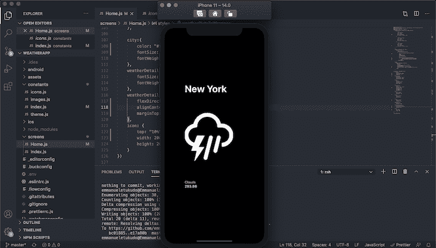
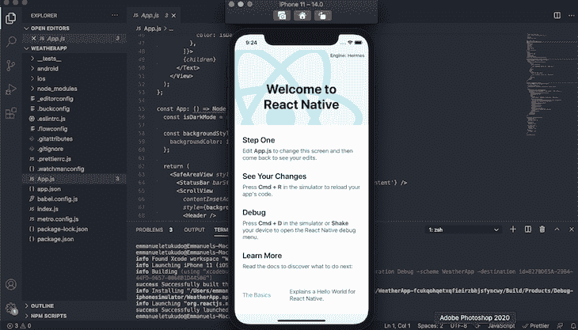
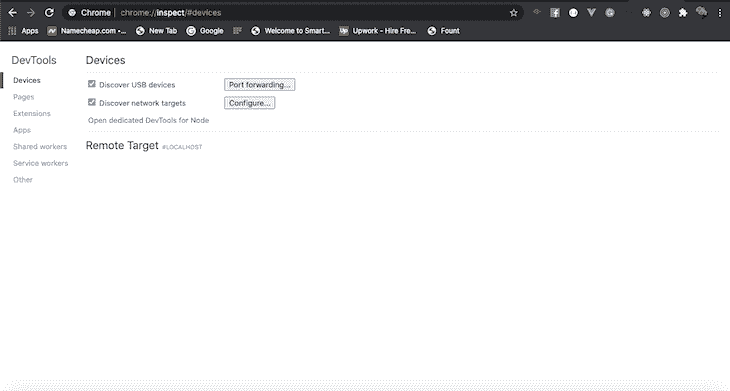
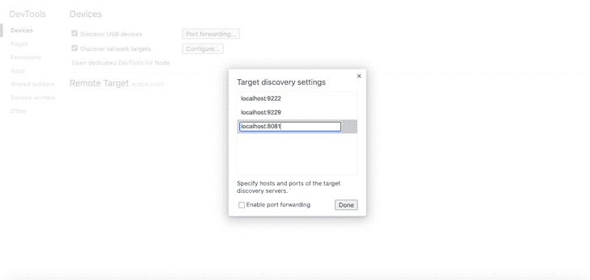

# 在 React Native - LogRocket 博客中使用 Hermes

> 原文：<https://blog.logrocket.com/using-hermes-react-native/>

***编者按:*** *本帖于 2022 年 9 月 9 日更新，内容包括关于 React Native 0.70 的信息，为什么 Hermes 与 React Native 配合良好，以及 Hermes 如何以及为什么让 React Native 更快。*

[React Native 0.64](https://reactnative.dev/blog/2021/03/12/version-0.64) 的发布在 iOS 上引入了对 Hermes 的完全选择加入支持。这有望成为 React 原生移动应用开发生态系统中的一个重大转变。

在本教程中，我们将探索使用 Hermes 作为 React 本机应用程序的 JavaScript 引擎的好处，并演示如何使用 Hermes 构建和运行 React 本机应用程序。我们将带您完成必要的步骤，使用 Hermes 作为 JavaScript 引擎启动并运行 React 原生应用程序。

以下是我们将要介绍的内容:

## 爱马仕到底是什么？

Hermes 是一个开源的 JavaScript 引擎，旨在通过减少应用启动时间和将 JavaScript 预编译成高效的字节码来优化性能。

## React 原生 0.64 中的新特性:iOS 的 Hermes 支持

由于使用率低，React Native 0.64 的发布附带了对 Android API 级别 16–20 的支持。Hermes 是此版本附带的主要功能。其他变化包括为 Metro bundler 启用 inline require，为 Google Chrome 启用 Hermes traces，为 Hermes 启用代理支持，以及 React 17 的其他变化。让我们探讨一下这些变化中的一些，它们可能会影响 React Native 未来如何构建移动应用程序。

Hermes 对 Android 的支持已经活跃了一段时间。有了 React Native 0.64 中对 iOS 的可选支持，您现在可以构建一个快速、高效、高性能的应用程序。

## React Native 0.70 中的更多内容

[根据 React 原生网站](https://reactnative.dev/blog/2022/07/08/hermes-as-the-default)的一篇博文，从 React 原生 0.70 开始，Hermes 将是默认引擎。对于 React 本地开发者来说，这意味着他们将如何构建和测试移动应用的范式转变。由于对性能优化的强烈关注，很明显开发人员将节省大量的开发时间来发布新软件。

以下是 React Native 0.70 中 Hemes 的磨合变化列表:

*   更多性能方面的工作
*   React Native Hermes 集成:展望未来，Hermes 的新特性将与 React Native 一起构建，以确保兼容性
*   iOS Intl: iOS 开发者现在将拥有对 Intl 的本地支持

你可以在这个[公告](https://reactnative.dev/blog/2022/07/08/hermes-as-the-default#react-nativehermes-integration)中阅读更多关于爱马仕的新内容:反应 0.70。

## 爱马仕用 React Native 好吗？

在 React Native 0.64 中引入 Hermes 作为可选的 JavaScript 编译引擎后，JavaScript 引擎得到了 React 原生开发者生态系统的巨大支持，这主要是由于它的高性能。

Hermes 不仅对 React 原生应用有好处，而且有助于显著减少包大小、加载时间和消耗大小，并在开发过程中使用 GUI 来可视化应用程序的性能指标。这个特性非常有助于开发人员了解应用程序在发布和生产后的表现。

## 爱马仕会让原生反应更快吗？

简而言之，答案是肯定的，长的答案是 Hermes 是构建 React 原生应用程序最具性能的 JavaScript 引擎(根据 React Native 维护者的研究)。这项研究是根据开发者认为重要的三个指标进行的:交互时间(TTI)、二进制大小和消耗大小。

*   互动时间(TTI)是从应用程序启动到用户可以与之互动之间的持续时间
*   二进制大小是捆绑的 React 本地应用在 APK (Android)或 APA (iOS)中的大小
*   内存消耗是应用程序安装到设备上后的大小。

[这里有一个链接，可以链接到涵盖这项研究的完整文章](https://reactnative.dev/blog/2022/07/08/hermes-as-the-default)。

用 Hermes 构建一个应用程序非常简单——只需要三行代码来配置 Hermes 并启动和运行:

```
use_react_native!(
   :path => config[:reactNativePath],
   :hermes_enabled => true
)

```

请注意，iOS 上的 Hermes 仍处于婴儿阶段，尚未获得完全的稳定性。如果遇到 bug，可以访问官方 [React 原生 GitHub repo](https://github.com/facebook/react-native) 提出问题。

### 为什么性能优化很重要？

无论您的应用程序是仍在开发中还是已部署到生产中，性能都是构建移动应用程序时需要关注的关键属性之一。Hermes 弥补了 React Native 的性能差距。

### Hermes 如何提高整体 React 本机性能

在考虑将 Hermes 作为 React 本机应用程序的 JavaScript 引擎之前，让我们先来看看选择 Hermes 作为默认编译引擎的好处:

*   预编译:Hermes 在启动前将应用源代码预编译成字节码
*   更快的 TTI:爱马仕减少了交互时间，带来了更好的用户体验
*   更小的应用捆绑包大小:与用其他 JavaScript 引擎开发的应用相比，Hermes 编译的应用在大小上相当小

以下是爱马仕的幕后工作方式:


左侧窗格由 Hermes playground 上的代码输入组成，而右侧窗格以字节码的形式显示输出。还显示了加载时间。在这种情况下，sum 函数编译和运行需要 60 毫秒。

## 爱马仕如何在 React Native 中工作？

正如我们所讨论的，Hermes 是 React Native 的 JavaScript 引擎，它将 JavaScript 预编译成高效的字节码以减少构建时间。Hermes 已经被证明在 APK 尺寸上很小，减少了内存，并且立即启动，导致了更好的用户体验。

为了更好地理解 Herms 如何使用 React Native，您可以按照后续部分中的教程将 Herms 配置为您的应用程序引擎。然而，如果你使用的是 React Native 0.70，Hermes 将是你的默认设置，所以你可以跳到本博客的调试部分。

## 在 React Native 中使用 Hermes

在本教程中，我们将向您展示如何构建一个相当简单的 React 本地应用程序来显示来自模拟数据的天气信息。该应用程序将显示美国当前的天气预报。

完成的应用程序应该如下所示:



开始之前，确保您使用的是 [React Native ≥0.64](https://github.com/facebook/react-native/releases/tag/v0.64.0) 。

要创建新的 React 本地项目，请通过终端导航到您的工作目录，并复制/粘贴以下代码:

```
 npx react-native init WeatherApp

```

### 在 Android 上启用 Hermes

要在 Android 上启用 Hermes，请在您喜欢的代码编辑器中打开您新创建的项目，并更新您的`android/app/build.gradle`文件，如下所示:

```
   project.ext.react = [
      entryFile: "index.js",
      enableHermes: true 
  ]

```

接下来，在 Android 上运行项目，代码如下:

```
$ npx react-native run-android

```

### 在 iOS 上启用 Hermes

要在 iOS 上启用 Hermes，请在您喜欢的代码编辑器中打开您新创建的项目，并更新您的`Podfile`，设置`hermes_enabled`。请参见下面的代码片段:

```
 use_react_native!(
     :path => config[:reactNativePath],
     :hermes_enabled => true
   )

```

接下来，运行 pod 安装。

```
$ cd ios && pod install

```

最后，使用下面的代码运行您的 iOS 应用程序:

```
>$ npx react-native run-ios

```

您的应用程序应该如下所示:



你会注意到，在右上角，Hermes 被标识为应用程序的引擎。这说明爱马仕在积极奔跑。

现在我们已经完成了 Hermes 的设置，让我们继续构建我们的应用程序。

### 在 Hermes 支持下构建 React 原生应用

首先，从`Github`克隆启动文件:

```
$ git clone https://github.com/emmanueletukudo/herms-starter.git

```

用以下代码替换`Home`屏幕中的内容:

```
import React from "react";
import {StyleSheet, Text, Image, View, TouchableOpacity, FlatList} from "react-native";
import axios from "axios";
import {data, icons} from "../constants/"
const Home = () => {
    const [weatherData, setWeatherData] = React.useState([
        {
            id: 0,
            city: "New York",
            temp: 283.88,
            main: "Clouds",
            icon: icons.thunder,
            description: "overcast clouds",
        },
        {
            id: 1,
            city: "San Francisco",
            temp: 285.52,
            main: "Rain",
            icon: icons.rainy,
            description: "broken clouds",
        },
        {
            id: 2,
            city: "Chicago",
            temp: 283.88,
            main: "Rain",
            icon: icons.metro,
            description: "overcast clouds",
        },
    ]);
    function renderWeather(item, index){
        return(

                {item.city}

                        {item.main}
                        {item.temp}

        )
    }
    return(

            item.id.toString()}
           renderItem ={({item, index}) => renderWeather(item, index)}
           />

    )
}
const styles =  StyleSheet.create({
    constainer: {
        flex: 1,
        backgroundColor: "#000",
        alignItems: "center",
        padding: 70,
    },
    weatherContainer: {
        width: 350, 
        justifyContent: "center", 
        marginHorizontal: 14,
        backgroundColor: "#000",
    },
    hello:{
        flex: 1,
        alignItems: "center",
        fontSize: 12,
        fontWeight: "700",
        color: "#000"
    },
    weatherDtails1:{
        flex: 1,
        justifyContent: "center",
        marginTop: "20%",
        borderRadius: 10,
        marginRight: 15,
        paddingRight: 12,
        paddingBottom: 12,
    },
    temp: {
        color: "#ffffff", 
        fontSize: 14,
        fontWeight: "700",
    },
    main:{
        color: "#ffffff",
        fontSize: 14,
        marginTop: 15
    },
    city:{
        color: "#ffffff", 
        fontSize: 40, 
        fontWeight:"700"
    },
    weatherDetails: {
        fontSize: 17,
        fontWeight: "400",
    },
    weatherDetailsWrapper: {
        flexDirection: "column",
        alignContent: "center",
        marginTop: "40%",
    },
    icon: {
        top: "10%",
        width: 200,
        height: 200,
    }
})
export default Home;

```

代码是不言自明的。我们有三个部分:带有 React `useState`钩子的模拟数据[，将数据呈现到 React 组件中的函数，以及使用](https://blog.logrocket.com/a-guide-to-usestate-in-react-ecb9952e406c/) [React Native `FlatList`](https://blog.logrocket.com/how-to-use-flatlist-component-in-react/) 在`Home`组件中呈现数据的代码。您可以采用同样的方法从 API 获取实际数据，但这超出了本教程的范围。

## 在 Chrome 中调试 React 原生应用

Hermes 通过实现 Chrome inspector 协议，支持通过 [Chrome DevTools](https://developer.chrome.com/docs/devtools/) 调试 JavaScript。Chrome 通过它当前监听的端口连接 Metro，所以你需要知道 Metro 监听的端口。Metro 默认监听端口 8181，因此您可以使用`[http://localhost:8081](http://localhost:8081)`通过浏览器访问您的应用程序。

一旦你弄清楚你的应用程序运行的端口，在 Chrome 上打开一个新的点击并输入`chrome://inspect`。点击**配置…** 按钮，添加您的 app Metro 服务器地址(如`[http://localhost:8081](http://localhost:8081)`)。



在弹出的模板上添加地址:



你现在应该能够使用 Chrome DevTools 调试你的 React 原生应用了。要访问调试器，点击**检查**。


## 结论

得益于轻量级 JavaScript 引擎 Hermes，React Native 的移动应用性能优化变得更加容易。你可以在[官方文档](https://hermesengine.dev/)中了解更多关于爱马仕的信息。

## [LogRocket](https://lp.logrocket.com/blg/react-native-signup) :即时重现 React 原生应用中的问题。

[](https://lp.logrocket.com/blg/react-native-signup)

[LogRocket](https://lp.logrocket.com/blg/react-native-signup) 是一款 React 原生监控解决方案，可帮助您即时重现问题、确定 bug 的优先级并了解 React 原生应用的性能。

LogRocket 还可以向你展示用户是如何与你的应用程序互动的，从而帮助你提高转化率和产品使用率。LogRocket 的产品分析功能揭示了用户不完成特定流程或不采用新功能的原因。

开始主动监控您的 React 原生应用— [免费试用 LogRocket】。](https://lp.logrocket.com/blg/react-native-signup)