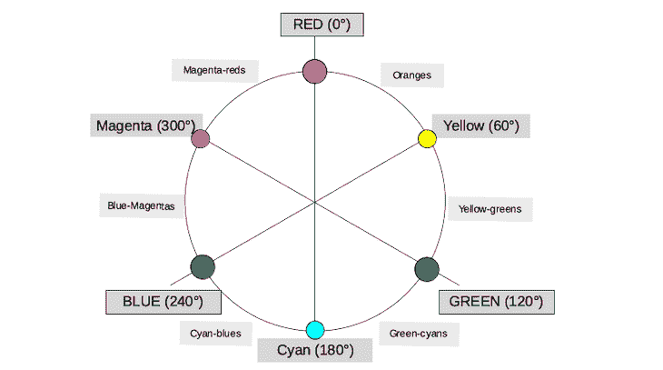

# 在 CSS 中使用 HSL 颜色

> 原文：<https://blog.logrocket.com/using-hsl-colors-css/>

在 CSS 中指定颜色时，您有很多选择。

使用十六进制(HEX)颜色有时会令人沮丧，因为你不容易分辨它是什么颜色(除非你是一台计算机——或者一个向导！).在调整十六进制值以使颜色变得更亮或更暗、更饱和或更不饱和时，您可能会遇到很多困难。

RGB 颜色更容易辨认，尤其是在查看 alpha 值的时候。然而，在调整或修改颜色时，这种颜色模型仍然不是很有效或特别直观。

这就是 HSL 的用武之地。在本教程中，你将学习什么是 HSL，它的用例，以及为什么它在 CSS 的其他颜色模型中脱颖而出。我们将涵盖:

让我们直接跳进来吧！

## 什么是 HSL？

HSL 是色调、饱和度和亮度的缩写。这个颜色模型是围绕 RGB 色轮构建的。颜色的透明度由可选的 alpha 组件表示，将 HSL 转换为 HSLA。看看下面的语法:

```
Syntax:
/* writing hsl with space-separated values */
hsl(hue saturation lightness)
hsl(hue saturation lightness / alpha)

/* writing hsl with comma-separated values */
hsl(hue, saturation, lightness)
hsl(hue, saturation, lightness, alpha)

```

让我们回顾一下色调、饱和度和亮度，以及如何测量这些值。

### 顺化(越南城市)

色调测量色轮上的角度值，如 MDN 文档中的[图所示:](https://developer.mozilla.org/en-US/docs/Web/CSS/color_value/hsl/hue-wheel.png)



默认情况下，色调以度为单位:

*   红色:0 度和 360 度
*   黄色:60 度
*   绿色:120 度
*   青色:120 度
*   蓝色:240 度
*   洋红色:300 度

所有其他颜色以直观的方式介于这些值之间。例如，橙色——可见光光谱中介于红色和黄色之间的第二种颜色——介于 0 度和 60 度之间，这取决于你想要的特定橙色色调。

### 浸透

颜色的强度可以描述为饱和度，用百分比值来衡量。请看下图，它展示了红色的不同饱和度百分比看起来是怎样的:


如您所见，0%饱和度表示灰色阴影，而 100%值表示最鲜明色调的完全饱和颜色。建议选择 10%到 100%之间的值，以便用户可以看到颜色。

### 轻

我们可以把一种颜色的亮度描述为你给这种颜色多少光。和饱和度一样，HSL 中的明度也是用百分比来衡量的。了解红色在不同亮度下的外观:


0%的亮度将显示为黑色。50%既不亮也不黑；我们可以说这是中性的。100%的亮度将显示为白色，因此，最好选择 10%到 90%之间的值，因为这将使我们能够看到基色。

## 如何在 CSS 中使用 HSL

要在 CSS 中使用 HSL，我们必须指定每个组件的值。

记住 HSL 的语法；提供给 HSL 的第一个值是色调，接下来是饱和度，最后是亮度。例如:

```
.box{
    height: 70px;
    width:70px;
    background-color:hsl(211, 96%, 44%);
  }

```

上面代码的结果将是一个蓝色阴影——由我们的色相值`211`表示——饱和度为`96%`，亮度为`44%`。我们还可以调整亮度，以获得更亮的颜色。

让我们再看一些 CSS 中 HSL 的例子和用例。

### 对 CSS 变量使用 HSL

在 CSS 变量旁边指定 HSL [颜色是构建配色方案的一种很好的方式。例如，保持相同的色调和饱和度值，同时改变亮度值，可以让您选择不同的颜色，即亮度值越高，颜色越亮。这是和 HSL 一起使用 CSS 变量的真正力量之一](https://blog.logrocket.com/how-to-create-better-themes-with-css-variables-5a3744105c74/)

```
.root{
    --primary-300:hsl(7, 82%, 83%);
    --primary-400:hsl(7, 82%,63%);
    --primary-500:hsl(7, 82%,43%);
    --primary-550:hsl(7, 82%,33%);
    --primary-600:hsl(7, 82%,23%);
// Neutral
    --neutral-700:hsl(0,0%, 23%);
    --neutral-400:hsl(0,0%,43%);
    --neutral-200:hsl(0,0%,83%);
}

```

在这里，我们使用 CSS 变量来安排我们的颜色红色的不同变化，从最亮的版本到最暗的版本。你可能已经注意到，我们还通过将饱和度值设置为`0%`和三种亮度变化来添加中性版本。

### 用 CSS 中的 HSL 创建悬停效果

HSL 颜色模型对于按钮、卡片和其他元素上的悬停效果非常方便。例如，我们可能需要一个组件，当用户将鼠标悬停在它上面时，它会变暗，如下面的代码笔所示:

参见 [CodePen](https://codepen.io) 上 Temitope Oyedele([@ oyedeletemotope](https://codepen.io/oyedeletemitope))
的带悬停效果的笔[按钮。](https://codepen.io/oyedeletemitope/pen/PoeJXQp)

如果你看一下这个例子的 CSS 代码，你会看到按钮的色调和饱和度是相同的，不管悬停状态如何。唯一的区别是，我们通过降低亮度的百分比将颜色设置为更暗的版本，给我们一个非常好的悬停效果。

### 在 CSS 中使用 HSL 创建渐变效果

我们可以通过将一种颜色与其浅色版本混合来使用 HSL 实现渐变效果，帮助我们在它们之间创建一个平滑的过渡:

请看 [CodePen](https://codepen.io) 上 Temitope Oyedele([@ oyedeletemotope](https://codepen.io/oyedeletemitope))
的笔[由浅至深红色渐变](https://codepen.io/oyedeletemitope/pen/LYmzMgV)。

如果你看一下上面 Codepen 中的 [CSS 代码，你会注意到我们正在合并相同颜色的两个版本——一个较亮的版本和一个较暗的版本——以帮助我们实现一个漂亮的线性渐变。这种渐变效果从较暗的版本渐隐到较亮的版本。](https://codepen.io/oyedeletemitope/pen/LYmzMgV)

### 用 HSLA 调整透明度

为了得到一个组件的不透明度，我们将不得不使用阿尔法符号，所以 HSL 成为 HSLA。

alpha 符号表示一个值，该值可以是指定颜色不透明度的数字或百分比。通过指定不透明度，我们可以确定颜色或对象的透明度:

参见 [CodePen](https://codepen.io) 上 Temitope Oyedele([@ oyedeletemotope](https://codepen.io/oyedeletemitope))
的笔[透明红方](https://codepen.io/oyedeletemitope/pen/GRdQKPM)。

如果你在上方的代码栏中查看 [CSS 代码，你会注意到我们将不透明度设置为`0.473`。](https://codepen.io/oyedeletemitope/pen/GRdQKPM)

当包含一个 alpha 组件来改变颜色的透明度时，你可以在`0`和`1`之间添加一个百分比值或数字。数字`1.0`对应于 100%，表示完全不透明，而`0.0`对应于 0%，表示完全透明。

最好将你的 alpha 值设置为大于`0.0`的数字，以达到你想要的透明效果。

### 用 CSS 中的 HSL 创建调色板

我们可以创建一个可爱的调色板，通过改变色调值来获得不同的颜色，并改变亮度值来获得这些颜色的变化:

参见 [CodePen](https://codepen.io) 上 Temitope Oyedele([@ oyedeletemotope](https://codepen.io/oyedeletemitope))
的[带色调变化滑块的钢笔调色板](https://codepen.io/oyedeletemitope/pen/ZEoXyZx)。

如果你看一下 Codepen 中这个例子的 [CSS 代码，你会注意到我们使用 HSL 符号给我们的颜色不同的亮度值来创建不同的颜色阴影。](https://codepen.io/oyedeletemitope/pen/ZEoXyZx)

同时，滑块负责改变色调值。每当我们调整滑块时，就会出现不同的颜色，由于亮度值的变化，颜色会以不同的阴影显示。

## 是什么让 HSL 独一无二？

正如我提到的，在 CSS 中有[多种指定颜色的选项。那么，是什么让 HSL 与众不同呢？](https://blog.logrocket.com/advanced-guide-setting-colors-css/)

### 可读性

HSL 最显著的优点之一是它的可读性。你不需要花太多时间去学习如何解释 HSL 代码，不像十六进制代码。例如，试着通过查看来猜测这段代码的颜色:

```
/*hex*/
#00aaff;

```

你能猜出颜色吗？答案几乎肯定是否定的。此外，如果您更改了字符串中的一个字符，很难猜测结果是更亮、更暗还是完全不同的颜色。

十六进制值被认为是机器可读的，不像 HSL 那样是人类可读的。但是有了 HSL，我们可以破译代码中显示的是什么颜色，是饱和还是不饱和，是亮还是暗。

### 修改颜色

HSL 不仅读起来更直观——因为它比其他颜色模型更容易被人类理解——而且它也使修改颜色更容易。

比如[我们来对比一下 HSL 和 RGB](https://blog.logrocket.com/hsl-hsla-vs-rgb-rgba-css/) 。想象 HSL 颜色比想象 RGB 颜色要简单得多，因为我们可以使用色调值来指定我们想要的颜色。

因此，虽然调整 HSL 颜色相当简单，但如果不使用像拾色器这样的工具[来调整 RGB 颜色可能会很有挑战性。我们必须猜测正确的红色、绿色和蓝色值才能得到想要的结果。](https://blog.logrocket.com/color-picker-libraries-to-use-in-2021/)

考虑前面部分中的悬停效果示例。我们所做的只是改变一个值来得到一个稍微暗一点的版本。如果我们要使用十六进制或 RGB 颜色，我们会遇到一些困难，或者必须使用颜色选择器或其他一些工具。

## 结论

在本教程中，我们讨论了 HSL 以及如何用一些例子在 CSS 中使用它。我们还讨论了 HSL 与 RGB 和十六进制颜色相比是如何脱颖而出的。

当正确使用时，HSL 颜色模型是一个强大的工具，因为它使选择和更改颜色的过程更加直观。更好的是，你不必是一个专业人士开始使用它！

开始在 CSS 中使用 HSL。或者，如果你感兴趣，探索一下 [CSS 颜色模块级别 5](https://blog.logrocket.com/exploring-css-color-module-level-5/) 中的一些新的 CSS 颜色函数。

## 你的前端是否占用了用户的 CPU？

随着 web 前端变得越来越复杂，资源贪婪的特性对浏览器的要求越来越高。如果您对监控和跟踪生产环境中所有用户的客户端 CPU 使用、内存使用等感兴趣，

[try LogRocket](https://lp.logrocket.com/blg/css-signup)

.

[](https://lp.logrocket.com/blg/css-signup)[https://logrocket.com/signup/](https://lp.logrocket.com/blg/css-signup)

LogRocket 就像是网络和移动应用的 DVR，记录你的网络应用或网站上发生的一切。您可以汇总和报告关键的前端性能指标，重放用户会话和应用程序状态，记录网络请求，并自动显示所有错误，而不是猜测问题发生的原因。

现代化您调试 web 和移动应用的方式— [开始免费监控](https://lp.logrocket.com/blg/css-signup)。