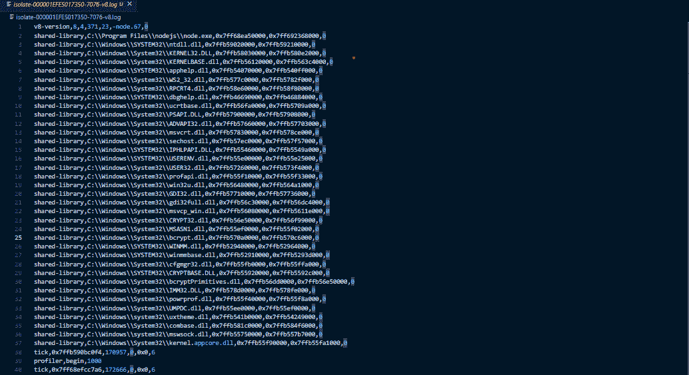
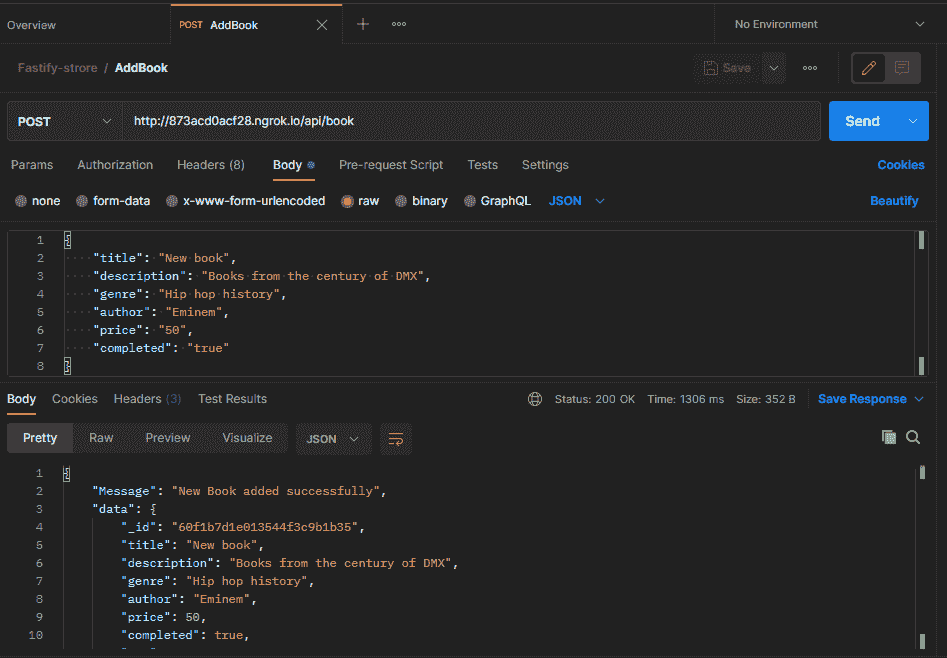

# 使用内置的 Node.js profiler - LogRocket 博客

> 原文：<https://blog.logrocket.com/using-inbuilt-node-js-profiler/>

作为一名软件开发人员，建议遵循更实用的方法来开发软件。

随着时间的推移，当您开始构建服务于数千或数百万用户的更复杂的软件时，更加关注诸如架构、系统设计、测试、安全性、部署，尤其是性能等概念变得至关重要。此外，在性能方面，通常的做法是遵循关键的性能指标，如平均响应时间、流量率以及应用程序和服务器的 CPU 使用率。

现在的主要问题源于获得最佳的分析器工具，该工具根据这些指标来测量 Node.js 应用程序的性能，并且不会影响软件的响应性。


请注意，CPU 分析和 CPU 监控通常可以互换使用，但它们是不同的。

在本文中，您将了解 Node.js 中推荐的内置分析工具。

## 为什么要侧写？

性能分析是收集和分析关于代码中的函数在执行时如何执行的数据，包括时间复杂度、吞吐量、输入工作负载、垃圾收集以及调用和执行函数的时间等性能测量参数。

这里的目的是识别代码中的瓶颈。当一行/一块代码或函数的执行不如程序的其余部分时，就会出现瓶颈。其中一些瓶颈可能很明显，但大多数并不明显。

所以本质上，一个评测器会告诉你，“嘿，不要强调去猜测让你的应用程序变慢的 bug 藏在哪里。让我以编程的方式帮你做到这一点。”

## Node.js 探查器

Node.js 中分析应用程序最简单的方法是使用内置的分析器，它从函数中收集所有数据并将其记录到一个文件中。Node.js 通过引入`--prof`标志来实现这一点，该标志与 V8 profiler 通信，然后记录数据。

让我们用一个示例 Node.js 应用程序来说明这是如何工作的。这个例子使用 Node.js 框架 Fastify。Fastify 自称是“镇上最快的 web 框架！”所以我觉得用这个做演示会很完美。

Fastify API 为书店应用程序执行 CRUD 操作。接下来，您可以克隆 [GitHub repo](https://github.com/ammezie/fastify-store) 。

让我们检查一下`controllers/bookController.js`中的处理函数，并对它们进行分析:

```
//controllers/bookController.js

const boom = require('boom')
const Book = require('../models/Book')

// get all books
exports.getAllBooks = async (req, reply) => {
  try {
    const books = await Book.find()
    return reply.code(200)
    .send(
        {
         Message: "Success",
         data: books
        }
    )
  } catch (err) {
    throw boom.boomify(err)
  }
}

// get a single book by id
exports.getSingleBook = async (req, reply) => {
  try {
    const id = req.params.id
    const book = await Book.findById(id)

    return reply.code(200)
      .send({
        Message: "Success",
        data: book
      })
  } catch (err) {
    throw boom.boomify(err)
  }
}

// add a new book
exports.addNewBook = async (req, reply) => {
  try {
    const book = new Book(req.body)
    const newBook = await book.save()

    return reply.code(200)
      .send({
        Message: "New Book added successfully",
        data: newBook
      })
  }
    catch (err) {
      throw boom.boomify(err)
    }
}

// edit a book
exports.updateBook = async (req, reply) => {
  try {
    const id = req.params.id
    const updatedBook = await Book.findByIdAndUpdate(id, req.body, {
      new: true
    })

    return reply.code(200)
      .send({
        Message: "Book updated successfully",
        data: updatedBook
      })
  } catch (err) {
    throw boom.boomify(err)
  }
}

// delete a book
exports.deleteBook = async (req, reply) => {
  try {
    const id = req.params.id
    const deletedBook = await Book.findByIdAndDelete(id);

    return reply.code(200)
      .send({
        Message: `${deletedBook.title} has been deleted successfully`,
        data: id
      })
  } catch (err) {
    throw boom.boomify(err)
  }
}

```

您可以像这样向 MongoDB 添加一些数据:

```
> db.user.insert({ title: "The book for old people", genre: "Self Help" })

```

我们正在添加一些数据，以帮助我们模拟用户向您的应用发出请求时出现延迟问题的场景。因此，您可以继续在数据库中创建尽可能多的数据。

在您的终端上运行以下命令:

```
node --prof controllers/bookController.js
```

该命令创建一个`isolate-0xnnnnnnnnn-v8.log`(其中 n 是一个数字)日志文件，它应该如下所示:



不可读，对吧？这就是为什么我们将运行`--prof-process`标志来将该日志文件转换成可读性更好的文件。

在您的终端上运行以下命令:

```
node --prof-process isolate-000001EFE5017350-7076-v8.log > processed.txt

```

这将创建一个包含日志的`processed.txt`文件。

让我们检查日志，从摘要部分开始。


这表明 97%的样本是从共享库中获得的。所以让我们关注[共享库]部分，忽略其他部分。


我们可以看到，89%的 CPU 时间被 Node.js 运行时环境占用，8%被 Windows 内核函数占用。此外，它清楚地表明，在本地开发服务器上分析代码并不理想。从 HTTP 服务器运行测试是更好的选择。所以，让我们用 Ngrok 模拟一个生产环境。

Ngrok 使您能够创建公开开发 web 服务器的公共 URL。你可以[在这里](https://ngrok.com)学习如何设置 Ngrok。

典型的 Ngrok URL 看起来像`[http://873acd0acf28.ngrok.io](http://873acd0acf28.ngrok.io)`。

现在我们不再依赖 Node.js 运行时和 OS 内核来运行我们的节点服务器。我们将再次运行`--prof`属性。首先，给服务器增加一些负载。我使用 [Postman](https://www.postman.com) 作为 API 客户端来测试我的 API 端点，但是你可以使用任何你想要的工具。



您可以继续添加更多图书:


让我们使用 [Apache 基准测试工具](https://www.cedric-dumont.com/2017/02/01/install-apache-benchmarking-tool-ab-on-windows/)获得 AB 输出。如果您不知道如何安装这个工具，我在下面的参考资料部分放了一个链接。

AB 输出:


有趣的是，在我们的简单示例中，每个请求(无论成功与否)往返一次平均需要三秒钟，每秒钟大约处理四个请求。在现实世界的应用程序中，您可能想出提高这些数字的策略，这样当流量增加时，用户就不会对您的应用程序响应有问题。

目前为止还不错。现在，让我们重新运行`--prof-process`命令并尝试分析报告。

在您的终端上运行以下命令:

```
NODE_ENV=production node --prof index.js

node --prof-process isolate-000001E540DA5730-19636-v8.log

```

此时，如果有任何瓶颈，您应该能够阅读、分析和实现解决方案。

## 结论

内置的 Node.js 分析器是最简单、最适合分析您的 [Node.js](https://blog.logrocket.com/node-js-logging-best-practices/) 应用程序的工具。在本文中，我们讨论了为什么分析很重要，以及如何使用`--prof`和`--prof-process`标志来调试瓶颈。

我希望你从阅读这篇文章中学到了一些新的东西。如果你有问题或建议，请在评论区提出。

## 200 只显示器出现故障，生产中网络请求缓慢

部署基于节点的 web 应用程序或网站是容易的部分。确保您的节点实例继续为您的应用程序提供资源是事情变得更加困难的地方。如果您对确保对后端或第三方服务的请求成功感兴趣，

[try LogRocket](https://lp.logrocket.com/blg/node-signup)

.

[](https://lp.logrocket.com/blg/node-signup)[https://logrocket.com/signup/](https://lp.logrocket.com/blg/node-signup)

LogRocket 就像是网络和移动应用程序的 DVR，记录下用户与你的应用程序交互时发生的一切。您可以汇总并报告有问题的网络请求，以快速了解根本原因，而不是猜测问题发生的原因。

LogRocket 检测您的应用程序以记录基线性能计时，如页面加载时间、到达第一个字节的时间、慢速网络请求，还记录 Redux、NgRx 和 Vuex 操作/状态。

[Start monitoring for free](https://lp.logrocket.com/blg/node-signup)

.