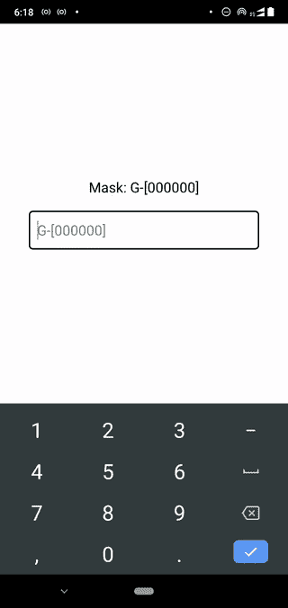
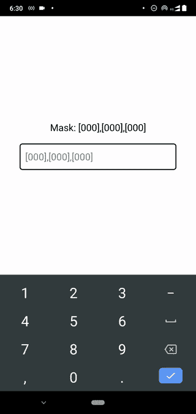
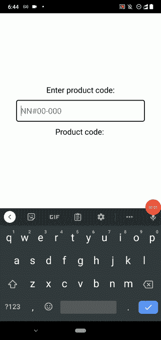
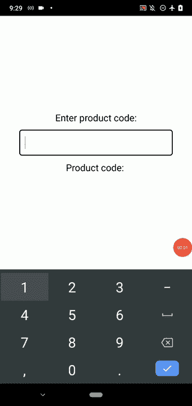
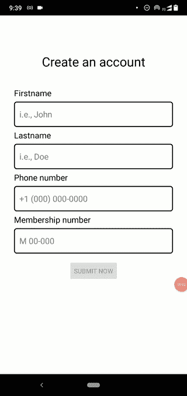
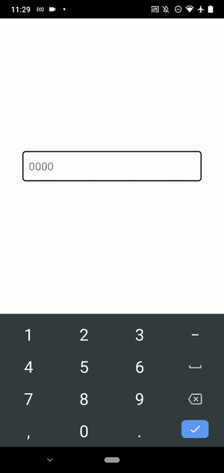

# 在 React Native 中使用输入掩码

> 原文：<https://blog.logrocket.com/using-input-masks-react-native/>

React 本地开发人员经常在他们的移动应用程序中实现各种输入表单，这些表单通常包含并接受各种输入元素和输入字符串，如姓名、手机号码、日期、时间或邮政编码。

许多开发人员使用表单输入元素实现输入掩码，以添加用户友好的输入约束。输入掩码是字符串模板，指导用户根据预定义的格式输入有效数据，通常是通过阻止无效的击键并将允许的字符串格式显示为占位符。例如，用户只能在屏蔽的 PIN/OTP 输入框中输入数字。

[react-native-text-input-mask 库](https://github.com/react-native-text-input-mask/react-native-text-input-mask)在 Android 和 iOS 平台上都提供了输入屏蔽功能。在本教程中，我们将涵盖:

## 反应本地文本输入掩码的特征

react-native-text-input-mask 提供了一个本地模块，通过两个特定于平台的屏蔽输入库来创建屏蔽文本输入:`[input-mask-android](https://github.com/RedMadRobot/input-mask-android)`和`[input-mask-ios](https://github.com/RedMadRobot/input-mask-ios)`。这个跨平台的输入掩码库具有以下令人印象深刻的特性:

### 简易屏蔽语法

该库提供了一个最小的、开发人员友好的语法来定义输入掩码约束，而不是使用典型的 regex 语法。因此，RN 开发人员可以使用自解释的掩码定义更快地定义输入掩码约束。

### 表演

react-native-text-input-mask 是一个原生模块，因此模式匹配和处理由 Kotlin 和 Swift 处理——基于 JavaScript 的组件仅充当原生 rn 模块的包装器。因此，即使对于复杂的输入掩码定义，您也不会遇到性能问题，例如轻微可见的无效按键，也不会在低端设备上遇到问题，因为本机代码处理掩码逻辑。

### 平台支持和社区支持

react-native-text-input-mask 在 Android 和 iOS 平台上都可以工作。两个特定于平台的屏蔽库存储库都被正确地同步和主动维护，因此它们很容易在生产中使用。

### 灵活的配置

这个库提供了各种有用的定制支持，为您的每个输入屏蔽需求配置屏蔽输入。您可以扩展默认遮罩语法，动态更新遮罩，并使用 React 组件属性更改遮罩方向。这个 RN 库基本上公开了`input-mask-android`和`input-mask-ios`实现的每一个特性。

## 基本 React 本地输入屏蔽教程

让我们构建一些示例输入掩码，以便实际理解我们刚刚了解的所有这些特性。在尝试了几个示例输入掩码之后，我们将使用几个输入掩码构建一个完整的注册表单。

### 项目设置和安装遮罩库

首先，确保你的项目使用 React Native≥v 0.60——这个库不正式支持 RN 版本≤ 0.60。您可以创建一个新的 RN 项目，或者使用一个现有的项目来尝试即将到来的示例代码。

如果您需要创建一个新项目来开始，请在您的终端上使用以下命令:

```
npx react-native init inputmasks
cd inputmasks

```

接下来，运行新创建的应用程序，检查项目创建和设置是否成功。使用`npm start`或`yarn start`启动 Metro bundler，并运行以下命令启动应用程序:

```
npx react-native run-android
# --- or ---
npx react-native run-ios

```

现在，安装输入屏蔽库。

```
npm install react-native-text-input-mask
# --- or ---
yarn add react-native-text-input-mask

```

对于 Android 平台，您可能需要使用以下配置来更新`android/build.gradle`文件的`allprojects`属性，以便成功构建:

```
configurations.all {
        resolutionStrategy {
            dependencySubstitution {
                substitute module("com.redmadrobot:input-mask-android:6.0.0") using module('com.github.RedMadRobot:input-mask-android:6.1.0')
            }
        }
    }

```

之所以会这样，是因为 react-native-text-input-mask 库无法从 JCenter 下载 input-mask-Android；这是因为这个特定的库使用 JitPack 进行分发，Android 项目也不再使用 JCenter。上面的配置是使用 JitPack 工件而不是 JCenter 工件的一种变通方法，直到 react-native-text-input-mask 库[的维护者向 JitPack](https://github.com/react-native-text-input-mask/react-native-text-input-mask/issues/252) 查询依赖关系。

您可以在 [my GitHub repository](https://github.com/codezri/react-native-input-masks/blob/main/android/build.gradle) 中查看完整的修改后的 Gradle 文件。

### 创建电话号码掩码

现在，我们将创建一个屏蔽输入，用于输入一个标准的美国电话号码，以开始使用该库。首先，在您的`App.js`文件中使用以下导入:

```
import React from 'react';
import {
  StyleSheet,
  Text,
  View
} from 'react-native';
import TextInputMask from 'react-native-text-input-mask';

```

这里，我们导入`TextInputMask` UI 组件来实现屏蔽输入。`TextInputMask`组件通过特定于平台的屏蔽实现扩展了本机内置的`TextInput`。接下来，用下面的代码定义主`App`组件:

```
const App = () => {
  const mask = '+1 ([000]) [000]-[0000]';
  return (
    <View
      style={styles.wrapper}>
      <Text style={styles.label}>Mask: {mask}</Text>
      <TextInputMask
        onChangeText={(formatted, extracted) => {
            console.log(`Formatted: ${formatted}`); // +1 (123) 456-7890
            console.log(`Extracted: ${extracted}`); // 1234567890
        }}
        style={styles.maskedInput}
        mask={mask}
        placeholder={mask}
        keyboardType="numeric"
        placeholderTextColor="grey"
        />
    </View>
  );
};

```

屏蔽输入组件通过`mask`属性接受输入屏蔽定义。电话号码掩码定义使用以下规则:

面具:`+1 ([000]) [000]-[0000]`

*   `+1()-`字符是固定的模板字符，因此用户的数字输入将被格式化为这些字符
    *   例如，当用户键入`555`时，屏蔽的输入将在屏幕上呈现`+1 (555)`，而`onChangeText`回调不会在`extracted`参数变量中包含这些字符
*   `0`代表一个强制数字(0–9)—我们用了十次这个字符，因为十位数是美国电话号码的标准数字
*   用户在`[]`块中输入的字符可以用`onChangeText`回调提取，所以我们可以在`extracted`参数变量中看到这些字符

此外，我们可以使用任何内置的`TextInput`道具，如`placeholder`、`style`和`keyboardType`。现在，我们只是通过`onChangeText`回调将格式化的输入和提取的输入(通常没有固定的掩码字符)记录到控制台。

最后，添加样式定义并导出`App`组件，如下所示。

```
const styles = StyleSheet.create({
  wrapper: {
    flex: 1,
    justifyContent: 'center',
    alignItems: 'center',
    backgroundColor: 'white'
  },
  label: {
    color: 'black',
    paddingBottom: 20,
    fontSize: 20
  },
  maskedInput: {
    borderWidth: 2,
    borderRadius: 6,
    width: '80%',
    padding: 12,
    color: 'black',
    fontSize: 20
  }
});

export default App;

```

下面是完整的`App.js`源代码:

```
import React from 'react';
import {
  StyleSheet,
  Text,
  View
} from 'react-native';
import TextInputMask from 'react-native-text-input-mask';

const App = () => {
  const mask = '+1 ([000]) [000]-[0000]';
  return (
    <View
      style={styles.wrapper}>
      <Text style={styles.label}>Mask: {mask}</Text>
      <TextInputMask
        onChangeText={(formatted, extracted) => {
            console.log(`Formatted: ${formatted}`); // +1 (123) 456-7890
            console.log(`Extracted: ${extracted}`); // 1234567890
        }}
        style={styles.maskedInput}
        mask={mask}
        placeholder={mask}
        keyboardType="numeric"
        placeholderTextColor="grey"
        />
    </View>
  );
};

const styles = StyleSheet.create({
  wrapper: {
    flex: 1,
    justifyContent: 'center',
    alignItems: 'center',
    backgroundColor: 'white'
  },
  label: {
    color: 'black',
    paddingBottom: 20,
    fontSize: 20
  },
  maskedInput: {
    borderWidth: 2,
    borderRadius: 6,
    width: '80%',
    padding: 12,
    color: 'black',
    fontSize: 20
  }
});

export default App;

```

启动 Metro bundler 并运行应用程序，您将看到以下结果:


让我们用不同的掩码定义更新`mask`常量，并更加熟悉掩码语法。

### OTP 屏蔽输入

开发人员通常使用一次性密码(OTP)机制来增强移动应用程序的安全性。让我们为一个六位数的 Google 风格的 OTP 创建一个输入掩码。

使用以下掩码并检查应用:

```
const mask = 'G-[000000]';

```

类似于以前的电话号码掩码，`G-`字符将作为静态模板工作，当用户用键盘键入数字时立即可见。另外，`[000000]`块请求六个强制数字。

当您使用上述遮罩时，您将看到以下结果:



### 创建日期和时间格式掩码

移动应用程序开发人员通常使用原生的、特定于平台的日期和时间选择器来捕获来自用户的日期/时间输入。但是，在某些情况下，比如信用卡到期日期输入，从 UX 的角度来看，屏蔽文本输入表现得更好。

#### 日期格式掩码

我们可以使用`0`和`9`符号以及我们选择的三个日期格式分隔符轻松实现屏蔽的日期输入元素，如下表所示:

| 面具 | 描述 | 样本输入 |
| `[00]{/}[00]` | `MM/YY`信用卡到期日的格式。`/`用作分隔符 | `07/22` |
| `[00]{.}[00]{.}[0000]` | `DD.MM.YYYY`格式。`.`用作分隔符 | `12.02.2023` |
| `[00]{-}[00]{-}[0099]` | 允许`DD.MM.YYYY`和`DD.MM.YY`两种速记模板。`-`被用作分隔符。`9`符号接受可选数字 | `12-02-90`
 |

时间格式掩码

#### 我们也可以对时间格式掩码使用相同的日期掩码表示法，如下表所示:

面具

| 描述 | 样本输入 | `[00]{:}[00]` |
| `HH:MM`格式，带`:`分隔符 | `20:30` | `[00]{:}[00]{:}[00]` |
| `HH:MM:SS`格式，带`:`分隔符 | `20:30:20` | 这里，我们使用使用过的`{}`常量块来包装日期/时间分隔符。如果我们使用`[00]/[00]`作为`MM/YY`掩码并输入`08/22`，提取的值将变成`0822` —而不是`08/22`。我们用`{}`常量块包装的任何字符串都将包含在提取的值中，但是用户不能编辑这些字符串作为`[]`块的内容。 |

关于输入验证的一个注记

### 一旦您试验了这些日期/时间输入掩码，您会注意到这些输入也允许无效输入。例如，即使`MM`部分的值无效，您也可以为基于`HH:MM`的时间输入掩码输入`55:95`。输入屏蔽概念总是提供一个模板来根据预定义的格式格式化原始用户输入。在这个场景中，`[00]{:}[00]`定义了一个模板，但是它不提供严格的验证。

因此，需要注意的是，几乎所有的输入屏蔽库，包括 react-native-text-input-mask，都不提供内置的验证支持。验证是特定于领域的，需要在前端和后端都实现，以获得更好的可用性和数据一致性。

我们可以使用 [Formik 和 Yup](https://blog.logrocket.com/react-native-form-validations-with-formik-and-yup/) 来验证任何输入字段，包括 RN 输入表单中的掩码。

信用卡的输入掩码

### 使用以下内容更新示例应用程序的掩码定义，以获得标准的 16 位 Visa 信用卡号的输入掩码:

您还可以添加一个验证规则来检查 Visa 系统编号(4)，如下所示——根据您的偏好(可用性和`onChangeText`用法)选择一个掩码。

```
const mask = '\[0000\] [0000] \[0000\] [0000]';

```

此外，您可以使用`[000]`掩码表示 CVV 号码，并且如上所述，使用`[00]/[00]`表示信用卡到期日期。

```
const mask = '4\[000\] [0000] \[0000\] [0000]';

```

数值和货币值的输入掩码

### 移动应用程序开发人员经常需要从用户那里获取一般的数字输入，如货币值、长度和数量，以及各种格式，如千位分隔符和小数。这个屏蔽库提供了数字输入处理特性，所以我们可以很容易地实现各种数字格式的数字输入屏蔽。

首先，让我们创建一个只接受数字的屏蔽输入。我们可以使用这种类型的元素来捕获产品数量，比如完整的整数值。在您的应用程序中使用以下掩码:

这里，使用`9`符号来定义一个可选数字，并使用省略号符号(`…`)来扩展掩码以接受任意数量的数字。注意，这是单个 [Unicode 省略号](https://en.wikipedia.org/wiki/Ellipsis) ( `U+2026`)字符，而不是三个单独的点字符。

```
const mask = '[9…]';

```

我们可以实现数千个分隔符掩码，如下所示:

默认情况下，蒙版将使用从左到右(LTR)处理，所以如果我们使用上面的蒙版，`2500`将变成`250,0`——而不是`2,500`。我们可以通过添加以下属性来使用从右到左(RTL)处理:

```
const mask = '[000],[000],[000]';

```

以下是完整的`App`组件代码:

```
rightToLeft={true}

```

使用上面的源代码片段，您将看到以下结果:

```
const App = () => {
  const mask = '[000],[000],[000]';
  return (
    <View style={styles.wrapper}>
      <Text style={styles.label}>Mask: {mask}</Text>
      <TextInputMask
        onChangeText={(formatted, extracted) => {
            console.log(`Formatted: ${formatted}`);
            console.log(`Extracted: ${extracted}`);
        }}
        style={styles.maskedInput}
        mask={mask}
        placeholder={mask}
        rightToLeft={true}
        keyboardType="numeric"
        placeholderTextColor="grey"
        />
    </View>
  );
};

```



创建自定义遮罩

### 我们已经在前面的例子中讨论了一些常见的屏蔽输入，但是在某些场景中，我们需要实现特定于域的输入屏蔽。

假设您需要根据以下规则创建产品代码掩码:

产品代码以两个不区分大小写的英文字母开头，即`Ar`、`AR`

*   在两个字母的代码之后，总是有一个散列字符(`#`)
*   在散列字符之后，有五个数字，在前两个数字之后有一个连字符(`-`)
*   考虑以下示例产品代码:

`AR#40-200`

*   `Be#12-100`
*   `ta#10-500`
*   我们可以在可重用的`ProductCodeInput`组件中使用以下掩码来满足上述所有需求:

`A`符号帮助我们匹配强制性的英文字母，`[AA]`寻找两个英文字母。我们用`{}`块包装固定字符`#`和`-`，因为我们需要将它们包含在提取的值中。

```
const ProductCodeInput = ({value, onChangeText}) => {
  const mask = '[AA]{#}[00]{-}[000]';
  return (
    <TextInputMask
      style={styles.maskedInput}
      mask={mask}
      value={value}
      onChangeText={onChangeText}
      placeholder="NN#00-000"
      placeholderTextColor="grey"
    />
  );
}

```

将以下代码添加到`App.js`文件，并检查产品代码屏蔽输入:

产品代码屏蔽输入将按如下方式工作:

```
import React, {useState} from 'react';
import {
  StyleSheet,
  Text,
  View
} from 'react-native';
import TextInputMask from 'react-native-text-input-mask';

const ProductCodeInput = ({value, onChangeText}) => {
  const mask = '[AA]{#}[00]{-}[000]';
  return (
    <TextInputMask
      style={styles.maskedInput}
      mask={mask}
      value={value}
      onChangeText={onChangeText}
      placeholder="NN#00-000"
      placeholderTextColor="grey"
    />
  );
};

const App = () => {
  const [productCode, setProductCode] = useState('');
  return (
    <View style={styles.wrapper}>
      <Text style={styles.label}>Enter product code:</Text>
      <ProductCodeInput value={productCode} onChangeText={(formatted) => setProductCode(formatted)}/>
      <Text style={styles.label}>Product code: {productCode}</Text>
    </View>
  );
};
const styles = StyleSheet.create({
  wrapper: {
    flex: 1,
    justifyContent: 'center',
    alignItems: 'center',
    backgroundColor: 'white'
  },
  label: {
    color: 'black',
    paddingBottom: 20,
    fontSize: 20
  },
  maskedInput: {
    borderWidth: 2,
    borderRadius: 6,
    width: '80%',
    padding: 12,
    color: 'black',
    fontSize: 20
  }
});

export default App;

```



使用仿射遮罩动态更改遮罩

### react-native-text-input-mask 通过仿射遮罩功能支持基于用户输入的动态遮罩。仿射遮罩是一组基于数学计算值(称为“相似度”)应用的遮罩。

例如，假设我们需要使用以下规则实现产品代码掩码:

产品代码仅包含数字，以`1`或`2`开头

*   所有产品代码都以`1`开头，共有四位数字，包括前缀`1`。假设大约 90%的产品代码以`1`开头，那么我们可以初始设置`1xxxx`模板
*   所有以`2`开头的产品代码共有五位数字，包括前缀`2`
*   我们可以为上述要求实现屏蔽输入组件，如下所示:

这里，我们使用主掩码`1[000]`来接受以`1`开头的产品代码。否则，如果输入的产品代码前缀是`2`，我们使用二级掩码`2[0000]`接受其他产品代码。`affinityCalculationStrategy="PREFIX"`配置属性告诉掩码库的模式匹配模块根据用户输入的前缀切换仿射掩码。你可以从[官方库 wiki](https://github.com/RedMadRobot/input-mask-android/wiki/2.1-Affine-Masks#affinity-calculation-strategy) 中了解所有亲和度计算策略选项。

```
const ProductCodeInput = ({value, onChangeText}) => {
  const mask = '1[000]';
  const affineMasks = ['2[0000]'];
  return (
    <TextInputMask
      style={styles.maskedInput}
      mask={mask}
      value={value}
      onChangeText={onChangeText}
      affineFormats={affineMasks}
      keyboardType="numeric"
      affinityCalculationStrategy="PREFIX"
      placeholderTextColor="grey"
    />
  );
};

```

一旦您用上面的代码更新了`ProductCodeInput`，您将会看到下面的结果:



如上图预览所示，前缀为`1`时不能输入超过四位数字。如果前缀是`2`，则不能输入超过五位的数字。

被屏蔽的输入将根据主屏蔽定义自动填充所有其他用户输入前缀的前缀`1`。

创建带有输入掩码的用户注册表单

## 让我们使用输入掩码和我们在本教程中学到的知识创建一个完整的两步用户注册表单。

首先，用户将看到一个包含以下输入字段的子窗体:

名字姓氏

*   电话号码
*   会员编号
*   当用户单击提交按钮时，我们将显示另一个带有 OTP 验证字段的子窗体。此外，我们会在 OTP 验证表单中显示之前输入的表单数据的摘要，作为一个注释。
*   我们还将实现基本验证，并实时启用/禁用提交按钮。

看下面的应用预览:



这个项目有多个项目文件，所以先从 [my GitHub repository](https://github.com/codezri/react-native-input-masks) 下载或 Git 克隆完整的源代码。

让我们检查源代码中的重要部分。

在`App`组件中，我们根据存储在`form`状态变量中的表单名称一次显示一个子表单组件，如下所示。

`handleOnSubmit`回调使用下面的代码片段为 OTP 表单和 switch 子表单构造注释:

在这里，我们使用`\n`在原生`Text`组件中呈现一个新行。`RegisterForm`组件由四个屏蔽输入元素组成，每个元素通过`handleFieldUpdate`功能更新`formData`状态变量。例如，成员号输入元素按如下方式更新状态:

```
<SafeAreaView style={styles.container}>
  <ScrollView>
    { form == 'register' ?
      <RegisterForm onSubmit={handleOnSubmit}/> :
        <OTPForm note={note}/> }
  </ScrollView>
</SafeAreaView>

```

`handleFieldUpdate`在组件状态中存储格式化和提取的值。此外，它通过`setIsValid`功能启用/禁用提交按钮，如下所示:

```
const handleOnSubmit = (formData) => {
    let note = Object.keys(formData)
                  .reduce((acc, v) => (acc + `${v}: ${formData[v]} \n`)
                    , '');
    note += '\nOTP was sent to your phone — verify to continue.'
    setNote(note);
    setForm('otp'); // Switch the current sub-form
  };

```

最后，`OTPForm`组件在一个内置的本地`Text`组件中显示表单数据摘要，并显示四位数的 OTP 屏蔽输入。请参见下面的代码片段。

```
onChangeText={(formatted, extracted) => handleFieldUpdate('memberNumber', formatted, extracted)}

```

注意，这里我们没有创建可重用的屏蔽输入组件，因为我们只需要在一个地方显示屏蔽输入。然而，如果您需要在多个地方添加相同的`TextInputMask`属性，请确保创建可重用的屏蔽输入，以获得更好的可维护性。

```
const handleFieldUpdate = (field, formatted, extracted) => {
    setFormData((prevState) => {
      let formData = {...prevState,
                        [field]: formatted,
                        [`${field}Extracted`]: extracted};
      setIsValid(formData.firstNameExtracted
              && formData.lastNameExtracted
              && formData.phoneExtracted?.length == 10
              && formData.memberNumberExtracted?.length == 5);
      return formData; // new state
    });
  };
// ---- isValid controls the following button: 
<Button title="Submit now" onPress={handleSubmit} disabled={!isValid}/>

```

例如，如果我们需要以多种输入形式捕获 OTP，我们可以创建一个名为`OTPInput`的组件并包装`TextInputMask`。

```
<View style={styles.form}>
<Text style={styles.heading}>Verify phone number</Text>
      <Text style={styles.note}>Registration details: {note}</Text>
      <View style={styles.field}>
        <Text style={styles.fieldLabel}>OTP</Text>
        <TextInputMask
          style={styles.maskedInput}
          mask="\[0\] [0] \[0\] [0]"
          placeholder="0 0 0 0"
          placeholderTextColor="grey"
          keyboardType="numeric"
        />
      </View>
      <View style={styles.registerBtnWrapper}>
        <Button title="Verify"/>
      </View>
</View>

```

你可以从官方图书馆 wiki 中进一步了解屏蔽语法规范。

react-native-text-input-mask 库的替代方案

如前所述，react-native-text-input-mask 库是一个灵活且功能全面的输入屏蔽库，它包装了两个特定于平台的本机模块。

## 但是这个库仍然有一些关键的开放特性请求，比如[在输入](https://github.com/react-native-text-input-mask/react-native-text-input-mask/issues/248)时保持占位符可见，以及[对 React Native Web 的支持](https://github.com/react-native-text-input-mask/react-native-text-input-mask/issues/226)。此外，我注意到当我试图在 Android 上使用自定义符号功能时，有几个应用程序崩溃了——另一个开发者已经在这里[报告过了](https://github.com/react-native-text-input-mask/react-native-text-input-mask/issues/233)。

因此，另外两个类似的屏蔽库现在变得流行起来，并与 react-native-text-input-mask 竞争:

让我们来看看他们每一个人的水平如何。

反应-原生-掩码-文本

react-native-mask-text 是一个新的输入屏蔽库，支持 Android、iOS、web 和 Expo 平台。这个库提供了一个最小的、开发人员友好的屏蔽语法和许多货币屏蔽特性，与 react-native-text-input-mask 相比，它无疑为实现货币屏蔽提供了更好的解决方案。

### 例如，我们可以按如下方式实现美元的货币掩码:

上述代码片段产生以下货币屏蔽输入:


```
<MaskedTextInput
  type="currency"
  options={{
    prefix: '$',
    decimalSeparator: '.',
    groupSeparator: ',',
    precision: 2
  }}
  onChangeText={(formatted, extracted) => {
    console.log(`Formatted: ${formatted}`);
    console.log(`Extracted: ${extracted}`);
  }}
  style={styles.maskedInput}
  keyboardType="numeric">
</MaskedTextInput>

```

反应-本地-掩码-输入

react-native-mask-input 是另一个新的屏蔽库，带有基于正则表达式的屏蔽语法。这个库支持字符混淆，这意味着我们可以像自定义密码输入框一样用特定字符替换可见字符。

### 例如，出于安全目的，下面的代码通过混淆最后两位数字来实现四位数 PIN。

上述代码片段产生以下屏蔽的 OTP 输入:



```
const App = () => {
  const [otp, setOtp] = useState('');
  return (
    <View
      style={styles.wrapper}>
      <MaskInput
        value={otp}
        onChangeText={(formatted, extracted, obfuscated) => {
          setOtp(formatted);
          console.log(`Formatted: ${formatted}`);
          console.log(`Extracted: ${extracted}`);
          console.log(`Obfuscated: ${obfuscated}`);
        }}
        mask={[/\d/, /\d/, [/\d/], [/\d/]]}
        showObfuscatedValue={true}
        style={styles.maskedInput}
        keyboardType="numeric"
        placeholder="0000"
        placeholderTextColor="grey"
      />
    </View>
  );
};

```

您可能已经注意到，这两个备选库会暂时显示无效的字符输入，并立即删除它们。原因是这两个库都处理 JavaScript 上下文中的屏蔽，所以我们不能期望这些替代库有接近本地的性能，就像我们可以处理 react-native-text-input-mask 一样。

结论

在本教程中，我们通过各种实例学习了如何在 React Native 应用程序中使用 react-native-text-input-mask。此外，我们讨论了两个可选的输入屏蔽库。

## 我建议根据你的喜好和要求挑选一个蒙版库。然而，从特性和性能的角度来看，react-native-text-input-mask 库是 react 本机应用程序中实现输入掩码的最佳输入掩码库。

输入掩码有助于用户以比静态占位符、工具提示或帮助文本更友好的方式理解预期的输入格式。输入掩码通常也支持复制/粘贴，所以我们不需要担心用户如何为掩码输入输入值。

[LogRocket](https://lp.logrocket.com/blg/react-native-signup) :即时重现 React 原生应用中的问题。

[LogRocket](https://lp.logrocket.com/blg/react-native-signup) 是一款 React 原生监控解决方案，可帮助您即时重现问题、确定 bug 的优先级并了解 React 原生应用的性能。

## LogRocket 还可以向你展示用户是如何与你的应用程序互动的，从而帮助你提高转化率和产品使用率。LogRocket 的产品分析功能揭示了用户不完成特定流程或不采用新功能的原因。

[](https://lp.logrocket.com/blg/react-native-signup)

开始主动监控您的 React 原生应用— [免费试用 LogRocket】。](https://lp.logrocket.com/blg/react-native-signup)

LogRocket also helps you increase conversion rates and product usage by showing you exactly how users are interacting with your app. LogRocket's product analytics features surface the reasons why users don't complete a particular flow or don't adopt a new feature.

Start proactively monitoring your React Native apps — [try LogRocket for free](https://lp.logrocket.com/blg/react-native-signup).