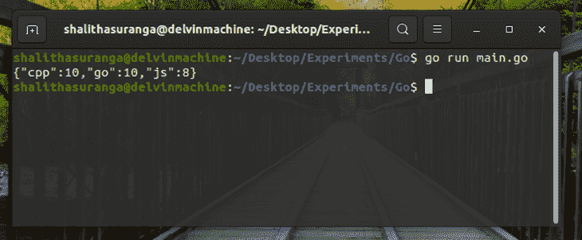
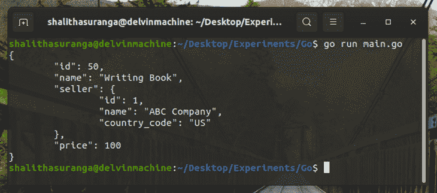
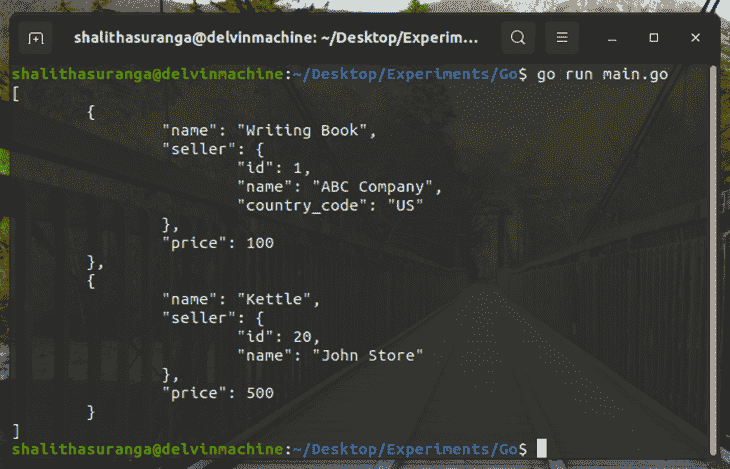
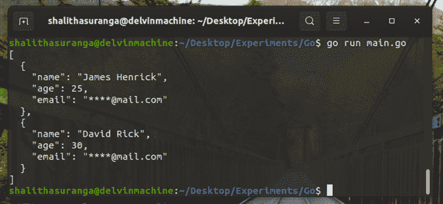

# 在 Go 中使用 JSON:示例指南

> 原文：<https://blog.logrocket.com/using-json-go-guide/>

Golang(也称为 Go)是一种静态类型的编译编程语言，具有类似 C 的语法。Go 为通用编程提供了一个最小的语法，只有 25 个关键字。

现在程序员用 Go 构建开发者工具、云计算工具、CLI 程序、桌面和 web 应用。Go 在构建高性能软件系统时非常流行，并发性在其中起着关键作用。

Go 开发者经常需要处理 JSON 内容。例如，我们经常需要读取 JSON 文件来填充 Go 对象，并从现有的 Go 对象中编写 JSON 文件。像任何其他现代编程语言一样，Go 提供了一个标准库模块来处理 JSON 结构。

在本教程中，我将通过实际例子解释如何在 Go 中使用 JSON。此外，我将解释一些高级概念，如定制 JSON 编码和解码。

## Go 编码/json 包

Go 提供了[编码/json 包](https://pkg.go.dev/encoding/json)来通过标准库的[编码](https://pkg.go.dev/encoding)名称空间处理 json 内容。encoding/json 包提供了 API 函数，用于从 Go 对象生成 json 文档，并从 JSON 文档中填充 Go 对象。此外，它还允许您定制 JSON-to-Go 和 Go-to-JSON 翻译过程。

JSON 规范支持格式化和内嵌(缩小)文档。因此，Go encoding/json 包允许开发人员生成格式化的和缩小的 json 文档。

## 封送处理:将 Go 对象转换为 JSON

### 围棋中的编组是什么？

将 Go 对象编码成 JSON 格式被称为封送处理。我们可以使用`Marshal`函数将 Go 对象转换成 JSON。`Marshal`函数带有以下语法。

```
func Marshal(v interface{}) ([]byte, error)

```

它接受一个空接口。换句话说，您可以向函数提供任何 Go 数据类型——整数、浮点、字符串、结构、映射等。—因为所有 Go 数据类型定义都可以用空接口表示。它返回两个值:编码的 JSON 的一个字节片和`error`。

### 封送简单对象

如上所述，我们可以用原始的 Go 数据类型生成 JSON。例如，您可以将 Go 字符串转换为 JSON 字符串。

但是因为转换原语在现实世界的软件开发项目中没有帮助，所以让我们从转换一些简单的对象开始。下面的代码片段将从地图数据结构中对 JSON 进行编码。

```
package main
import (
    "fmt"
    "encoding/json"
)
func main() {
    fileCount := map[string]int{
        "cpp": 10,
        "js": 8,
        "go": 10,
    }
    bytes, _ := json.Marshal(fileCount)
    fmt.Println(string(bytes))
}

```

这里我们使用`string()`将字节转换成字符串。Go 将 map 数据结构编码为 JSON 键值对象。一旦运行以上代码，您将得到如下所示的输出。



您还可以从结构中对 JSON 进行编码，如下面的示例代码所示。

```
package main
import (
    "fmt"
    "encoding/json"
)
type Book struct {
    Title string
    Author string
    Year int
}
func main() {
    myBook := Book{"Hello Golang", "John Mike", 2021}
    bytes, _ := json.Marshal(myBook)
    fmt.Println(string(bytes))
}

```

这里，我们必须以大写的英文字母开始 struct 字段名称，以使这些字段可以导出到其他包。如果您的结构包含一个以小写字母开头的字段，那么 encoding/json 包将不会包含编码过程的特定字段，而不会抛出任何错误。

上面的代码将输出下面的 JSON 结构。

```
{"Title":"Hello Golang","Author":"John Mike","Year":2021}

```

### 封送复杂对象

在前面的例子中，我们从简单的映射和结构等 Go 对象中编码 JSON。如果您尝试对整数数组、字符串数组和原始变量进行编码，Go 将为这些元素生成简单的 JSON 结构。

但是大多数时候，我们必须从我们的 Go 程序中的复杂对象生成 JSON 文件，比如产品列表、产品细节和各种嵌套的数据记录。

首先，让我们从一个产品列表编码 JSON。请看下面的示例代码。

```
package main
import (
    "fmt"
    "encoding/json"
)
type Seller struct {
    Id int
    Name string
    CountryCode string
}
type Product struct {
    Id int
    Name string
    Seller Seller
    Price int
}
func main() {
    products := []Product{
        Product {
            Id: 50,
            Name: "Writing Book",
            Seller: Seller {1, "ABC Company", "US"},
            Price: 100,
        },
        Product {
            Id: 51,
            Name: "Kettle",
            Seller: Seller {20, "John Store", "DE"},
            Price: 500,
        },
    }
    bytes, _ := json.Marshal(products)
    fmt.Println(string(bytes))
}

```

上面的代码用两个项目初始化一个产品列表。`Product`结构有一个`Seller`结构作为嵌套对象，所有产品都放在一个产品[切片](https://go.dev/blog/slices-intro)中。接下来，我们将最终的产品列表发送给`Marshal`函数，将其编码为 JSON 结构。

一旦您运行上面的代码片段，您将获得以下输出。

```
[{"Id":50,"Name":"Writing Book","Seller":{"Id":1,"Name":"ABC Company","CountryCode":"US"},"Price":100},{"Id":51,"Name":"Kettle","Seller":{"Id":20,"Name":"John Store","CountryCode":"DE"},"Price":500}]

```

如您所见，Go 从任何复杂的 Go 数据结构中编码 JSON。但是现在，当我们看上面的输出时，我们有两个问题:

*   输出 JSON 结构的键总是以大写英文字母开头——我们如何重命名 JSON 字段呢？
*   当我们对大型复杂结构进行编码时，输出变得不可读——我们如何美化 JSON 输出呢？

Go encoding/json 包用额外的库特性回答了上述问题。

## 封送功能

Go 提供了几个特性，通过额外的 API 函数和 struct 标记来改进和定制 JSON 输出。

### 重命名字段

您必须以大写英文字母开始 struct 字段声明，这样 JSON 包才能访问它们。因此，对于 JSON 键，您总是会得到大写的英文字母。Go encoding/json 包允许开发人员通过 json struct 标记随意重命名 JSON 字段。

* * *

### 更多来自 LogRocket 的精彩文章:

* * *

下面的代码片段使用 [snake case](https://en.wikipedia.org/wiki/Snake_case) JSON 键对 product 对象中的 JSON 进行编码。

```
package main
import (
    "fmt"
    "encoding/json"
)
type Seller struct {
    Id int `json:"id"`
    Name string `json:"name"`
    CountryCode string `json:"country_code"`
}
type Product struct {
    Id int `json:"id"`
    Name string `json:"name"`
    Seller Seller `json:"seller"`
    Price int `json:"price"`
}
func main() {
    book := Product{
        Id: 50,
        Name: "Writing Book",
        Seller: Seller {1, "ABC Company", "US"},
        Price: 100,
    }
    bytes, _ := json.Marshal(book)
    fmt.Println(string(bytes))
}

```

正如您所看到的，上面的代码使用 struct 标记来重命名每个导出的字段。struct 标记不是 JSON 编码过程的强制元素，而是在 JSON 编码过程中重命名特定 struct 字段的可选元素。

一旦执行上述代码，您将获得以下输出。

```
{"id":50,"name":"Writing Book","seller":{"id":1,"name":"ABC Company","country_code":"US"},"price":100}

```

### 生成带缩进的 JSON(漂亮打印)

`Marshal`函数生成最少的内联 JSON 内容，没有任何格式。您可以使用`MarshalIndent`函数对可读性良好的 JSON 进行缩进编码。下面的代码为前面的 struct 对象生成修饰的 JSON。

```
package main
import (
    "fmt"
    "encoding/json"
)
type Seller struct {
    Id int `json:"id"`
    Name string `json:"name"`
    CountryCode string `json:"country_code"`
}
type Product struct {
    Id int `json:"id"`
    Name string `json:"name"`
    Seller Seller `json:"seller"`
    Price int `json:"price"`
}
func main() {
    book := Product{
        Id: 50,
        Name: "Writing Book",
        Seller: Seller {1, "ABC Company", "US"},
        Price: 100,
    }
    bytes, _ := json.MarshalIndent(book, "", "\t")
    fmt.Println(string(bytes))
}

```

一旦运行上面的代码，它将打印一个格式化的 JSON 结构，如下所示。



这里我们使用制表符(`\t`)来缩进。你可以用四个空格，两个空格，八个空格等等。，用于根据您的要求进行格式化。

## 忽略 JSON 输出中的特定字段

之前，我们使用 struct 标签来重命名 JSON 键。我们也可以使用 struct 标签来省略特定的字段。如果我们使用`json:”-”`作为标签，相关的 struct 字段将不会用于编码。此外，如果我们在 struct 标记名称字符串中使用`,omitempty`，如果值为空，相关字段将不会用于编码。

下面的代码省略了编码的产品标识符。此外，它从输出中省略了空的国家代码值。

```
package main
import (
    "fmt"
    "encoding/json"
)
type Seller struct {
    Id int `json:"id"`
    Name string `json:"name"`
    CountryCode string `json:"country_code,omitempty"`
}
type Product struct {
    Id int `json:"-"`
    Name string `json:"name"`
    Seller Seller `json:"seller"`
    Price int `json:"price"`
}
func main() {
    products := []Product{
        Product {
            Id: 50,
            Name: "Writing Book",
            Seller: Seller {Id: 1, Name: "ABC Company", CountryCode: "US"},
            Price: 100,
        },
        Product {
            Id: 51,
            Name: "Kettle",
            Seller: Seller {Id: 20, Name: "John Store"},
            Price: 500,
        },
    }
    bytes, _ := json.MarshalIndent(products, "", "\t")
    fmt.Println(string(bytes))
}

```

上述代码产生以下输出。请注意，它不包含产品标识符和第二个项目的国家代码键。



## 解组:将 JSON 转换成 Go 对象

在 Go 环境中，JSON 文档解码过程被称为解组。我们可以使用`Unmarshal`函数将 JSON 转换成 Go 对象。`Unmarshal`函数带有以下语法。

```
func Unmarshal(data []byte, v interface{}) error

```

它接受两个参数:一个 JSON 内容的字节片和一个空的接口引用。如果在解码过程中出现错误，该函数可能会返回错误。`Unmarshal`函数不创建和返回 Go 对象，所以我们必须传递一个引用来存储解码后的内容。

### 解组简单的 JSON 结构

类似于 JSON 封送，我们可以解组 Go 原语数据类型，如整数、字符串、浮点和布尔。但是，由于原始解组在大多数软件开发项目中没有真正的用例，我们将从将下面的键值结构解码为 Go 结构开始。

```
{
    "width": 500,
    "height": 200,
    "title": "Hello Go!"
}

```

下面的代码将上面的 JSON 结构解码成一个 struct。

```
package main
import (
    "fmt"
    "encoding/json"
)
type Window struct {
    Width int `json:"width"`
    Height int `json:"height"`
    Title string `json:"title"`
}
func main() {
    jsonInput := `{
        "width": 500,
        "height": 200,
        "title": "Hello Go!"
    }`
    var window Window
    err := json.Unmarshal([]byte(jsonInput), &window)

    if err != nil {
        fmt.Println("JSON decode error!")
        return
    }

    fmt.Println(window) // {500 200 Hello Go!}
}

```

`jsonInput`变量将 JSON 内容保存为多行字符串。因此，在使用`byte[]()`类型转换语法将它传递给`Unmarshal`函数之前，我们必须将其转换为字节片。这里，我们检查了返回的 error 对象的值，以检测解析错误。

在这种情况下，上述 json 标记是可选的，因为 Go encoding/json 包通常使用不区分大小写的匹配将 JSON 字段映射到 struct 字段。

类似地，我们也可以将 JSON 结构解码成 Go 地图。请看下面的示例代码。

```
package main
import (
    "fmt"
    "encoding/json"
)
func main() {
    jsonInput := `{
        "apples": 10,
        "mangos": 20,
        "grapes": 20
    }`
    var fruitBasket map[string] int
    err := json.Unmarshal([]byte(jsonInput), &fruitBasket)

    if err != nil {
        fmt.Println("JSON decode error!")
        return
    }

    fmt.Println(fruitBasket) // map[apples:10 grapes:20 mangos:20]
}

```

### 解组复杂的数据结构

以前的解组示例向您展示了如何解码简单的 JSON 结构。在我们的软件开发项目中，我们经常需要解码复杂的嵌套 JSON 结构。下面的例子演示了如何从 JSON 格式的产品列表中填充 Go 对象。

```
package main
import (
    "fmt"
    "encoding/json"
)
type Product struct {
    Id int `json:"id"`
    Name string `json:"name"`
    Seller struct {
        Id int `json:"id"`
        Name string `json:"name"`
        CountryCode string `json:"country_code"`
    } `json:"seller"`
    Price int `json:"price"`
}
func main() {
    jsonInput := `[
    {
        "id":50,
        "name":"Writing Book",
        "seller":{
            "id":1,
            "name":"ABC Company",
            "country_code":"US"
        },
        "price":100
    },
    {
        "id":51,
        "name":"Kettle",
        "seller":{
            "id":20,
            "name":"John Store",
            "country_code":"DE"
        },
        "price":500
    }]
    `
    var products []Product
    err := json.Unmarshal([]byte(jsonInput), &products)

    if err != nil {
        fmt.Println("JSON decode error!")
        return
    }

    fmt.Println(products)
    // [{50 Writing Book {1 ABC Company US} 100} {51 Kettle {20 John Store DE} 500}]
}

```

如上面的代码所示，我们需要通过检查 JSON 输入首先定义一个 struct。当您处理大型复杂的 JSON 结构时，这个过程是一项耗时的任务。因此，您可以使用类似于 [JSON-to-Go](https://mholt.github.io/json-to-go/) 的在线工具来创建基于 JSON 输入的结构定义。

还有一种不用在 Go 中创建结构就能访问解析值的方法。您可以通过为 JSON 对象创建`map[string]interface{}`类型对象来动态访问任何值，但是这种方法会导致非常复杂、质量较低的源代码。

但是，您可以使用下面的示例代码来检查动态 JSON 值访问，以便进行实验。但是，在没有创建适当的 Go 结构的情况下，不要在生产软件系统中使用这种方法，因为它会创建复杂且难以测试的代码。

```
package main
import (
    "fmt"
    "encoding/json"
)
func main() {
    jsonInput := `[
    {
        "id":50,
        "name":"Writing Book",
        "seller":{
            "id":1,
            "name":"ABC Company",
            "country_code":"US"
        },
        "price":100
    },
    {
        "id":51,
        "name":"Kettle",
        "seller":{
            "id":20,
            "name":"John Store",
            "country_code":"DE"
        },
        "price":500
    }]
    `
    var objMap []map[string]interface{}
    err := json.Unmarshal([]byte(jsonInput), &objMap)

    if err != nil {
        fmt.Println("JSON decode error!")
        return
    }

    fmt.Println("Price of the second product:", objMap\[1\]["price"])
}

```

上面的代码在没有 Go 结构的情况下打印第二个产品项目的价格。

## 从文件系统中读取 JSON 文件

我们在前面的示例中使用了硬编码的 JSON 字符串进行演示。但是，在实践中，我们从各种来源加载 JSON 字符串:从文件系统、通过互联网、通过本地网络位置等等。大多数程序员通常使用 JSON 格式在文件系统上存储配置细节。

让我们编写一些 Go 代码来读取和解码文件中的 JSON 数据，并将其转换为 Go 对象。首先，创建一个名为`config.json`的文件，输入以下内容。

```
{
    "timeout": 50.30,
    "pluginsPath": "~/plugins/",
    "window": {
        "width": 500,
        "height": 200,
        "x": 500,
        "y": 500
    }
}

```

现在，运行下面的代码，将上面的 JSON 文档解码成合适的结构。

```
package main
import (
    "fmt"
    "io/ioutil"
    "encoding/json"
)
type Config struct {
    Timeout float32
    PluginsPath string
    Window struct {
        Width int
        Height int
        X int
        Y int
    }
}
func main() {

    bytes, err := ioutil.ReadFile("config.json")

    if err != nil {
        fmt.Println("Unable to load config file!")
        return
    }

    var config Config
    err = json.Unmarshal(bytes, &config)

    if err != nil {
        fmt.Println("JSON decode error!")
        return
    }

    fmt.Println(config) // {50.3 ~/plugins/ {500 200 500 500}}
}

```

上面的代码使用`ioutil.ReadFile`函数读取 JSON 文件的字节内容，并将数据记录解码到`Config`结构。

## 将 JSON 文件写入文件系统

在前面的例子中，我们通过`Println`函数将编码的 JSON 内容打印到控制台。现在我们可以用`ioutil.WriteFile`函数将这些 JSON 字符串保存为文件，如下所示。

```
package main
import (
    "io/ioutil"
    "encoding/json"
)
type Window struct {
    Width int `json:"width"`
    Height int `json:"height"`
    X int `json:"x"`
    Y int `json:"y"`
}
type Config struct {
    Timeout float32 `json:"timeout"`
    PluginsPath string `json:"pluginsPath"`
    Window Window `json:"window"`
}
func main() {
    config := Config {
        Timeout: 40.420,
        PluginsPath: "~/plugins/etc",
        Window: Window {500, 200, 20, 20},
    }
    bytes, _ := json.MarshalIndent(config, "", "  ")
    ioutil.WriteFile("config.json", bytes, 0644)
}

```

上面的代码通过将`config`对象编码为 JSON 对象来编写`config.json`。这里我们使用两个空格进行缩进，并通过使用 struct 标签将 struct 字段转换为 [camel case](https://en.wikipedia.org/wiki/Camel_case) JSON 键。

## 自定义封送和解封

Go json 包非常灵活，它提供了覆盖编码和解码过程的特性。当您需要在编码/解码过程中将 JSON 数据记录从一种格式转换为另一种格式时，这些特性非常有用。

### 自定义封送

假设您正在用 Go 编写一个联系人管理应用程序，并且您为所有用户提供了一个下载 JSON 格式的联系人列表的功能。假设由于安全策略，您不能让非管理员用户看到所有的电子邮件 id。在这个场景中，您可以通过 Go json 包中的定制封送处理特性定制 JSON 编码过程，如下所示。

```
package main
import (
    "fmt"
    "encoding/json"
    "strings"
)
type Person struct {
    Name string `json:"name"`
    Age int `json:"age"`
    Email string `json:"-"`
}
func main() {
    persons := []Person {
            Person {"James Henrick", 25, "[email protected]"},
            Person {"David Rick", 30, "[email protected]"},
    }
    bytes, _ := json.MarshalIndent(persons, "", "  ")
    fmt.Println(string(bytes))
}
func (p *Person) MarshalJSON() ([]byte, error) {
    type PersonAlias Person
    return json.Marshal(&struct{
        *PersonAlias
        Email string `json:"email"`
    }{
        PersonAlias: (*PersonAlias)(p),
        Email: strings.Repeat("*", 4) + "@mail.com", // alter email
    })
}

```

上面的代码输出了所有联系人的详细信息，但是由于安全策略的原因，它改变了原始的电子邮件地址。注意，这里我们需要从`Person`类型创建另一个类型(`alias`)，因为如果我们试图为原来的`Person`类型调用`Marshal`函数，由于编码过程的递归实现，程序将进入无限循环。一旦您运行上面的代码片段，您将会看到如下所示的输出。



### 自定义解组

Go json 包也允许您定制 json 解码过程。假设您需要处理一个 JSON 配置文件，并且需要在解码过程中转换一些值。假设一个配置字段以开尔文表示温度，但是您需要存储以摄氏度表示的具体值。

看看下面实现自定义解组的代码。

```
package main
import (
    "fmt"
    "encoding/json"
)
type Config struct {
    FunctionName string 
    Temperature float32
}
func main() {
    jsonInput := `{
        "functionName": "triggerModule",
        "temperature": 4560.32
    }`
    var config Config
    err := json.Unmarshal([]byte(jsonInput), &config)

    if err != nil {
        fmt.Println("JSON decode error!")
        return
    }

    fmt.Println(config) // {triggerModule 4287.17}
}
func (c *Config) UnmarshalJSON(data []byte) error {
    type ConfigAlias Config
    tmp := struct {
        Temperature float32
        *ConfigAlias
    }{
        ConfigAlias: (*ConfigAlias)(c),
    }
    if err := json.Unmarshal(data, &tmp); err != nil {
        return err
    }
    c.Temperature = tmp.Temperature - 273.15
    return nil
}

```

上面的代码通过将`temperature`字段的值从开尔文转换为摄氏度来解码 JSON。这里我们也需要创建另一个类型(`alias`)来避免无限循环，类似于自定义封送。

## 结论

在本教程中，我们用实际例子讨论了 Go 中的 JSON 编码(封送)和解码(解封)。JSON 是一种广泛使用的、独立于语言的编码格式。因此，几乎所有基于 Go 的 web 框架都在内部处理 JSON 编码和解码。例如， [Gin](https://github.com/gin-gonic/gin) HTTP 框架允许您使用 json 包直接向 API 函数发送一个结构，而无需手动封送。

但是，您可以在不使用第三方库的情况下将 Go json 包用于您的 Go 程序，因为 json 包是标准库的一部分。此外，Go json 包还有一些更快的替代方案(根据基准测试。但是，json 包是标准库的一部分，由 Go 开发团队维护。因此，Go 开发团队将在即将发布的版本中提高 encoding/json 包的性能。

## 使用 [LogRocket](https://lp.logrocket.com/blg/signup) 消除传统错误报告的干扰

[](https://lp.logrocket.com/blg/signup)

[LogRocket](https://lp.logrocket.com/blg/signup) 是一个数字体验分析解决方案，它可以保护您免受数百个假阳性错误警报的影响，只针对几个真正重要的项目。LogRocket 会告诉您应用程序中实际影响用户的最具影响力的 bug 和 UX 问题。

然后，使用具有深层技术遥测的会话重放来确切地查看用户看到了什么以及是什么导致了问题，就像你在他们身后看一样。

LogRocket 自动聚合客户端错误、JS 异常、前端性能指标和用户交互。然后 LogRocket 使用机器学习来告诉你哪些问题正在影响大多数用户，并提供你需要修复它的上下文。

关注重要的 bug—[今天就试试 LogRocket】。](https://lp.logrocket.com/blg/signup-issue-free)