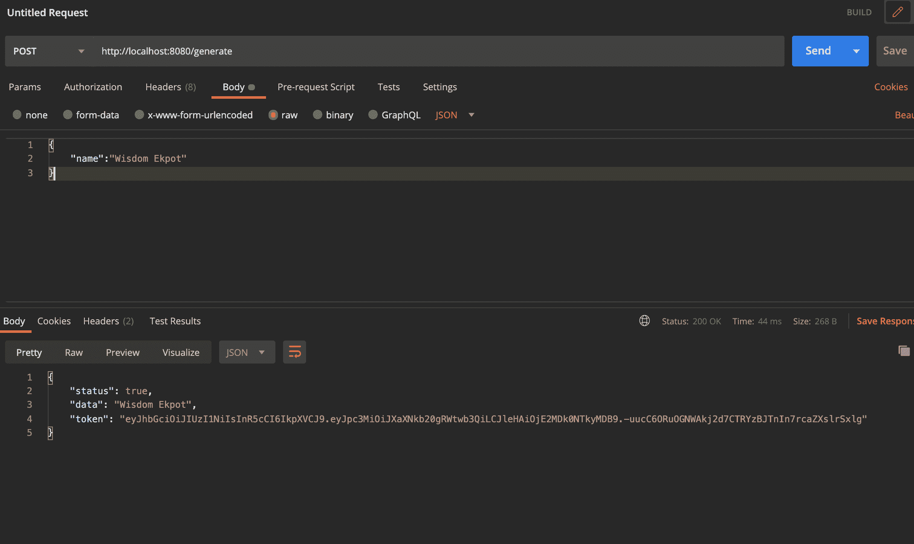
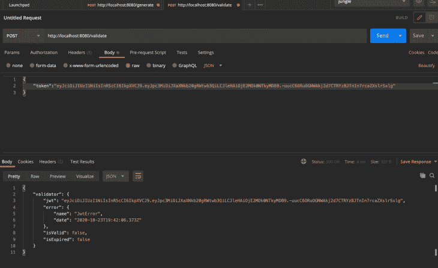
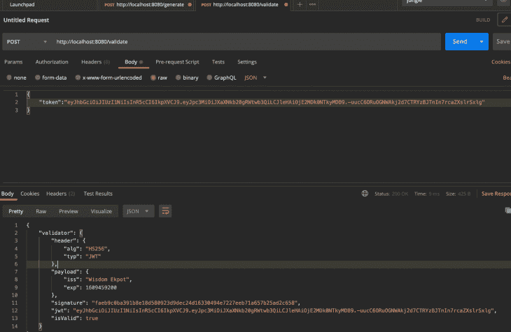

# 在 Deno 中使用 JSON web 令牌

> 原文：<https://blog.logrocket.com/using-json-web-tokens-in-deno/>

Deno 是一个简单、现代、安全的 JavaScript 和 TypeScript 运行时，使用 V8 并内置于 Rust 中。与 Node.js 不同，Deno 内置了对默认安全的 TypeScript 的支持。Deno 使用带有浏览器兼容 URL 的第三方包来管理模块，而不是导入并缓存在我们的本地机器中。

[JSON Web Token (JWT)](https://en.wikipedia.org/wiki/JSON_Web_Token) 是一种互联网标准，用于创建带有可选签名和/或可选加密的数据，其有效负载包含断言一些声明的 JSON。简而言之，它基本上用于认证。当用户登录到应用程序时，应用程序将创建一个 JWT 并发送给用户。

Deno 中 JWT 的大多数用例是当开发人员实现身份验证系统时，用户必须登录才能访问特定数据。

在本文中，我们将使用 Deno 的`[djwt](https://deno.land/x/djwt@v1.9)`集成包将 JWT 集成到我们的 Deno 应用程序中。

## 先决条件

*   扎实理解 [JavaScript](https://www.javascript.com/)
*   文本编辑器(在我们的例子中，我们将使用[和代码](https://code.visualstudio.com/)
*   安装在本地机器上的邮递员

## Deno 中的 JSON web 令牌入门

为了在我们的 Deno 应用程序中使用 JWT，我们必须为此使用`djwt` Deno 库。注意`djwt`不处理任何形式的认证或授权——它的作用是生成和验证有效的 JSON web 令牌。

首先，让我们在应用程序的主目录中创建一个新目录。在这个目录中，我们将创建一个`index.ts`文件，在这里我们将编写代码:

```
cd desktop && mkdir denojwt && cd denojwt
touch index.ts
code .

```

这将创建目录和`index.ts`文件。`code .`命令将用 VS 代码打开我们的应用程序。请随意使用您选择的任何文本编辑器。

要使用`djwt`库，我们必须将这个方法导入我们的应用程序:

```
import { validateJwt } from "https://deno.land/x/djwt/validate.ts";
import { makeJwt, setExpiration,Jose,Payload } from "https://deno.land/x/djwt/create.ts";

```

这里，`validateJwt`方法将检查令牌是否有效。`makeJwt`方法将生成一个有效的 JWT，`setExpiration`方法将为令牌设置一个到期时间。`Payload`是 JWT 有效载荷或数据的类型化接口。`Jose`表示令牌的算法和类型。

为了定义路线和设置我们的服务器，我们将使用`oak`库。让我们使用 [Oak](https://deno.land/x/oak@v6.3.2) 建立一个简单的服务器和路由:

```
import { Application, Router } from "https://deno.land/x/oak/mod.ts";
const app = new Application();
const PORT:number = 8080
//create a new instance of router
const router = new Router();
router
  .get("/test", (context) => {
    context.response.body = "Hello world!";
  })
  .get("/user", (context) => {
    context.response.body = "My name is Wisdom Ekpot";
  })
  app.use(router.routes());
app.use(router.allowedMethods());
await app.listen({ port: PORT });

```

## 生成 JSON web 令牌

当使用 JWT 时，我们必须设置一个密钥、一个有效载荷和一个报头。这是一个基本的 JWT 配置。最好将这些配置存储在一个变量中:

```
const key = "mynameisxyzekpot";

const header: Jose = {
    alg: "HS256",
    typ: "JWT",
}

let payloader = (name:string) => {
  let payload:Payload = {
    iss: name,
    exp: setExpiration(new Date("2021-01-01"))
  }
  return payload
}

```

`payloader`方法将获取有效负载作为参数，并将到期数据持续时间设置为`2021-01-01`。我们必须返回有效载荷对象，以便在`makeJwt`方法中使用它。

有了这个定义，我们现在可以编写一个简单的方法，使用定义的配置返回一个有效的令牌。为了生成令牌，我们将以这种方式使用`makeJwt`方法:

```
const generateJWT = (name:string) => {
  return makeJwt({ key:secret_key, header, payload:payloader(name) })
}

```

这里我们将把用户输入的名字作为参数传递，然后使用`payloader`函数作为有效载荷。

我们现在可以设置一个简单的路由来调用这个方法并发送有效的令牌作为响应。

因为我们使用 Oak 作为我们的服务器和路由，所以我们可以创建一个简单的 post 路由，用于为我们生成一个有效的令牌:

```
.post("/generate", async (context) => {
     let body: any = await context.request.body();
    const { name } = await body.value;
    let token = await generateJWT(name)
    context.response.body = { status: true, data: name,token:token };
  });

```

接下来，我们将添加一个新的`/generate` post 请求路由，它将使用`generateJWT`方法根据输入的名称为用户生成一个令牌。

获取请求的主体，我们可以从中获取用户输入的名字。现在让我们使用 POSTMAN 测试我们的端点。



向`/generate`路由发送一个 post 请求，并将一个名称作为主体传递，将为该用户生成一个令牌。

## 验证 JSON web 令牌

我们可以使用导入的`validateJwt`来检查令牌是否有效。这个方法将`token`、`key`和`algorithm`作为参数。我们将使用从`makeJwt`方法收到的令牌进行测试。

让我们首先创建一个验证方法:

```
const validateToken = (token:string) => {
    return validateJwt({jwt:token, key:secret_key,algorithm:header.alg});
}

```

注意，我们使用了在 header 对象中定义的算法，也使用了相同的`secret_key`。

我们现在可以为验证创建新的发布路径:

```
.post("/validate", async (context) => {
    let body: any = await context.request.body();
    const { token } = await body.value;
    let validator =  await validateToken(token)
   context.response.body = {validator};
  });

```

接下来，让我们使用 validator 方法来检查令牌是否有效。如果令牌有效，它将返回我们在创建时使用的相同负载。但是如果令牌无效，我们将得到如下响应:

```
"validator": {
        "jwt": "yJhbGciOiJIUzI1NiIsInR5cCI6IkpXVCJ9.eyJpc3MiOiJXaXNkb20gRWtwb3QiLCJleHAiOjE2MDk0NTkyMDB9.-uucC6ORuOGNWAkj2d7CTRYzBJTnIn7rcaZXslrSxlg",
        "error": {
            "name": "JwtError",
            "date": "2020-10-23T19:40:29.472Z"
        },
        "isValid": false,
        "isExpired": false
    }

```

这是无效令牌的响应示例:



这里，`isValid`参数作为 false 返回，并且还返回一个错误对象。

以下是有效的 JWT 的样子:



## 结论

在 Deno 应用程序中添加任何形式的身份验证对于应用程序的安全性都至关重要。JWT 广泛应用于不同的技术中，因此在我们的应用程序中实现授权和身份验证时，它是一个很好的选择。

对于这个项目的源代码，请查看我的 [GitHub repo](https://github.com/Wisdom132/deno/tree/master/djwt) 。

## 使用 [LogRocket](https://lp.logrocket.com/blg/signup) 消除传统错误报告的干扰

[](https://lp.logrocket.com/blg/signup)

[LogRocket](https://lp.logrocket.com/blg/signup) 是一个数字体验分析解决方案，它可以保护您免受数百个假阳性错误警报的影响，只针对几个真正重要的项目。LogRocket 会告诉您应用程序中实际影响用户的最具影响力的 bug 和 UX 问题。

然后，使用具有深层技术遥测的会话重放来确切地查看用户看到了什么以及是什么导致了问题，就像你在他们身后看一样。

LogRocket 自动聚合客户端错误、JS 异常、前端性能指标和用户交互。然后 LogRocket 使用机器学习来告诉你哪些问题正在影响大多数用户，并提供你需要修复它的上下文。

关注重要的 bug—[今天就试试 LogRocket】。](https://lp.logrocket.com/blg/signup-issue-free)