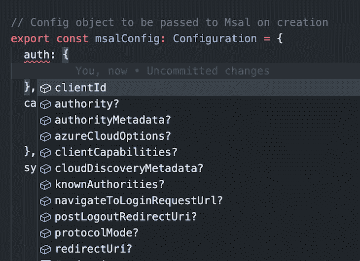
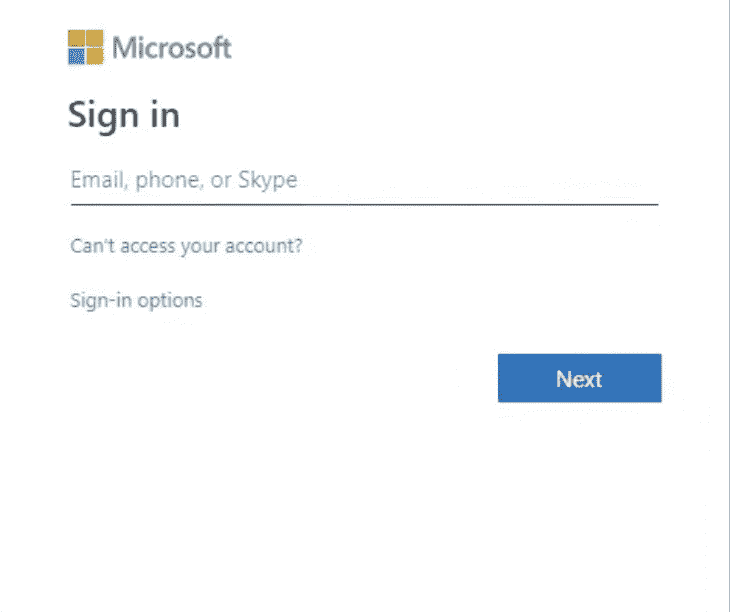
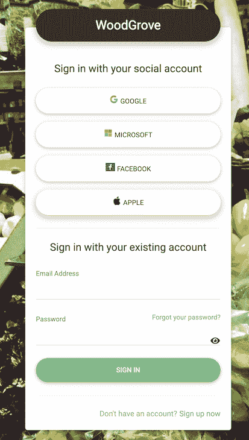

# 使用 msal-react 进行 react 应用程序验证

> 原文：<https://blog.logrocket.com/using-msal-react-authentication/>

在现代 web 开发中，我们经常需要一个身份验证解决方案来存储用户信息并限制对某些功能和资源的访问。从头开始开发这样的解决方案需要大量的时间和资源。还有许多与此任务相关的问题，包括安全性和数据存储。

幸运的是，有现成的解决方案可以帮助我们完成认证过程，如 Auth0、AWS Cognito、Firebase 或 Azure AD B2C。选择正确的解决方案取决于项目的需求和限制，例如开发人员的经验或可用的预算。

在本文中，我们将回顾前端开发人员将 React 应用与 Azure AD B2C 认证服务`msal-react`集成时必须执行的步骤。我们将涵盖:

所有代码片段都将使用 TypeScript 编写。

## 什么是 Azure AD B2C？

Azure AD 基于与 Azure Active Directory (Azure AD)相同的技术构建，但它是一种独立的企业对客户端(B2C)服务。它是由微软开发的，微软为应用程序的所有认证需求提供了一个易于扩展的安全解决方案。

该解决方案支持基于电子邮件的身份验证、工作场所、学校或任何其他组织的帐户，以及谷歌、脸书、Linkedin 等社交登录提供商。

选择 Azure AD B2C 有一些明显的优势。例如，您要确保用户数据被安全地存储，系统是安全的，不会受到威胁，并且在同一个生态系统中提供对系统的监控。

此外，[根据官方文件](https://learn.microsoft.com/en-us/azure/active-directory-b2c/overview)，AzureAD 每天支持数百万用户和数十亿次认证。这些可以说是令人印象深刻的数字，否则很难实现。

[微软提供了一个现场演示网站](https://woodgrovedemo.com/)，您可以在这里试用 AzureAD 身份验证，包括查看它所提供的身份验证类型:


在接下来的章节中，我们将会看到由 Azure 专门为在 React web 应用中启用 JWT 令牌检索而创建的官方 `[msal-react](https://www.npmjs.com/package/@azure/msal-react)` [库](https://www.npmjs.com/package/@azure/msal-react)[。我们将看到的所有代码片段都使用 TypeScript，但是您可以在 JavaScript 中轻松使用它们，不会有任何问题。](https://www.npmjs.com/package/@azure/msal-react)

## 将`msal-react`集成到您的项目中

Azure AD B2C 提供的`msal-react`库旨在用于用 React 开发的[单页面应用程序。](https://blog.logrocket.com/search-optimized-spas-react-helmet/)

集成这个库假设您已经有了使用 React 开发 web 应用程序的经验。您还必须已经设置了一个项目，并在后端成功集成了身份验证服务。

除此之外，前端应用程序必须在 AzureAD 门户中注册。微软提供了一个教程，涵盖了这个过程的步骤。这是在工作的后端部分的范围。

下面的截图是当你前往 portal.azure.com，进入 Azure Active Directory，然后转到应用注册，并选择“新注册”选项时，你会看到的。出于本教程的目的，您可以使用`[http://localhost:3000](http://localhost:3000)`作为重定向 URL:


完成这些步骤后，你就可以开始在你的前端 app 中集成`msal-react`了。

### 添加`msal-react`和`msal-browser`包

要使用这个包，我们首先需要向我们的项目添加两个包。

第一个包是库本身。第二个包——`@azure/msal-browser`——是一个[对等依赖，允许你的应用](https://github.com/AzureAD/microsoft-authentication-library-for-js/blob/dev/lib/msal-browser/README.md#implicit-flow-vs-authorization-code-flow-with-pkce)在不使用后端服务器的情况下进行认证。

运行以下命令:

```
npm install @azure/msal-react @azure/msal-browser
```

上面的命令会将相应的包安装到我们的项目中。

### 将应用程序包装在`MsalProvider`组件中

现在，我们将向项目中添加必要的代码。这个库利用了上下文 API 。因此，我们需要将我们的应用程序包装在`MsalProvider`组件中，如下所示:

```
<MsalProvider instance={pca}>
       <App />
</MsalProvider>
```

通过使用这个包装器，我们可以让应用程序中的所有东西都使用认证结果。例如，我们在构建路由器时需要这些信息，以便将应用程序的某些地方的访问权限限制在经过身份验证的用户。

### 初始化公共客户端应用程序

在上面的片段中，您可能已经注意到了`MsalProvider`所需的`instance`道具。这个道具需要一个类型为`PublicClientApplication`的对象。

库中的这个对象使我们能够获得 JWT 令牌，它告诉我们用户确实通过了身份验证。它为我们的 SPA 提供了获取和检索身份验证令牌的特定 API。

为了初始化公共客户端应用程序对象(`pca`)，我们需要传入一个配置文件。这个配置提供了一些我们的 Azure 应用程序特有的信息，从而让`pca`知道它将连接到 AzureAD 中的什么地方来验证我们的用户。让我们看看如何获得这个配置文件。

配置文件可以包含几个字段。请注意，为了访问这些字段，您必须完成我们在先决条件一节中提到的步骤。这些步骤在 Azure 门户中注册了我们的 web 应用程序。

在配置文件的字段中，我们将查看以下内容:

*   客户端 ID —必填
*   授权—可选
*   重定向 URI-可选

#### `clientId`字段

`clientId`字段唯一标识我们在平台上的特定应用。对于第一个字段，你需要进入 Azure 门户并导航到你的 Azure 应用的概述页面。

#### `authority`字段

通过连接身份提供者实例 URL 和应用程序的目标受众来获得`authority`字段。让我们在前进之前解开这个。

* * *

### 更多来自 LogRocket 的精彩文章:

* * *

身份实例指的是将用于用户登录的云实例。有两种类型的实例—公共云和国家云。

如果没有指定明确的实例，`msal-react`包将默认为 Azure 公共云实例，因为这涵盖了大多数用例。您应该使用的 URL 如下:

```
https://login.onmicrosoftonline.com
```

国家云实例是限于特定国家或地区的孤立 Azure 实例，以遵守某些数据法规或当地规则——例如，如果用户数据不应存储在所述国家或地区之外。您可以在 Microsoft docs 中获得适用于您的用例[的 URL。](https://learn.microsoft.com/en-us/azure/active-directory/develop/authentication-national-cloud)

为了[在 authority 字段](https://learn.microsoft.com/en-us/azure/active-directory/develop/msal-client-application-configuration#how-to-specify-the-audience-in-your-codeconfiguration)中指定受众，请使用与单租户应用程序的 Azure AD 实例相关联的域名。对于通用的全局实例，您只需使用`/common`。

在将受众附加到身份实例之后，结果字符串将为您提供`authority`字段的内容。例如，常见实例的权限是:

```
https://login.microsoftonline.com/common
```

对于具有自定义域的单租户应用程序，权限为:

```
https://login.microsoftonline.com/example.com
```

#### `redirectUri`字段

最后，`redirectUri`字段非常简单明了。由于身份验证过程发生在我们的 web 应用程序之外，我们需要告诉身份提供者，在成功的身份验证之后，用户将在我们的 web 应用程序中被带到哪里。

例如，假设用户在进入身份提供者并成功登录之前从`/signIn`页面开始。之后，我们可能想把他们重定向到`/home`页面，而不是把他们送回注册页面。

#### 处理配置对象时的其他注意事项

如上所述，`msal-react`默认假设`common`租户。在这种情况下，您只需要在您的配置对象中指定`clientId`。

另一方面，如果您正在处理一个单租户应用程序，您还需要提供`authority`字段，该字段将包含受众规范—也称为租户 ID。然后,`authority`字段将如下所示:

```
'https://login.microsoftonline.com/{your_tenant_id}'
```

如果您还选择了一个单独的授权或身份服务器，您将额外需要提供`knownAuthorities`数组。例如，假设您有以下`authority`字段:

```
'https://login.microsoftonline.com/{tenant_id}'
```

在这种情况下，`knownAuthorities`字段将是`["login.microsoftonline.com"]`。你也可以[查阅图书馆文档](https://github.com/AzureAD/microsoft-authentication-library-for-js/blob/dev/lib/msal-browser/docs/initialization.md#optional-configure-authority)以获得关于`authority`字段的更多信息。

#### 示例配置

下面是一个配置示例。此示例假设您正在使用公共云实例，并且您希望在成功认证后将用户重定向到我们定义的名为`root`的路由:

```
import { Configuration } from '@azure/msal-browser';

export const msalConfig: Configuration = {
  auth: {
    clientId:  "11111111-1111-1111-111111111111",
    authority: "https://login.microsoftonline.com/common"
    redirectUri: "/root",
  }
}
```

在上面的例子中，`root`对应于一个页面，它检查用户是否登录，然后相应地重定向用户。在本文的后面，我们将看到这种行为的一个例子。

如果您使用`login.live.com`作为权威，那么您的配置将如下所示:

```
export const msalConfig: Configuration = {
    auth: {
        clientId: "11111111-1111-1111-111111111111",
        authority: 'https://login.live.com',
        knownAuthorities: ["login.live.com"]
    }
};
```

这些示例假设您也在项目中使用 TypeScript。使用普通的 JavaScript 不成问题，但是使用 TypeScript 并为该对象指定`Configuration`类型将有助于您看到可添加到配置中的字段。你可以在下面的截图中看到这一点:



后端团队将帮助您决定哪些字段是配置所必需的，所以如果有些部分看起来不清楚，也不用担心。

作为前端开发人员，我们甚至可能无法访问 Azure 门户。然而，我们必须做的是尽最大努力理解每个字段的作用，并确保在我们的应用程序中正确处理身份验证流程。

这将我们带到下一步:确保我们的应用程序的某些部分只对经过认证的用户可用。

### 使用`AuthenticatedTemplate`和`UnauthenticatedTemplate`

`msal-react`库提供了两个组件，使得在 React 应用中控制对资源的访问变得非常容易。这些名称是不言自明的，但是现在让我们来看一下。

您将使用`AuthenticatedTemplate`来包装我们的应用程序的部分，这些部分只允许经过身份验证的用户访问。同样，您将使用`UnauthenticatedTemplate`来处理每个人都可以得到的任何东西。

在下面的例子中，我们希望只有经过身份验证的用户才能访问`Home`组件，而每个人都可以访问`Login`组件:

```
<AuthenticatedTemplate>
    <Home />
</AuthenticatedTemplate>
<UnauthenticatedTemplate>
    <Login />
</UnauthenticatedTemplate>
```

### 初始化身份验证流程

配置完`msal-react`后，我们需要初始化认证流程。为此，我们需要 MSAL 实例。我们可以使用`useMsal`钩子获得它。

我们可以用两种方式初始化身份验证——要么在弹出窗口中，要么使用重定向。如果你想让用户呆在应用程序中，你可以选择 popup 方法，这样可以保持当前状态。

但是，您的用户可能会遇到阻止他们顺利进入身份验证流程的弹出窗口拦截器。此外，已知 popup 方法在 Internet Explorer 中存在问题，因此最好使用重定向选项。

在下面的例子中，我们将看看重定向方法，因为它符合配置和前面的例子。参见代码:

```
import { useMsal } from '@azure/msal-react';

const LoginPage = () => {
  const { instance } = useMsal();

  const initializeSignIn = () => {
    instance.loginRedirect();
  };

  return (
    <>
      <div onClick={initializeSignIn}>Sign in</div>
    </>
  );
};
```

在上面的代码片段中，我们允许用户点击`Sign in`文本并初始化登录重定向。这将把用户带到 Microsoft 身份提供商，他们将在那里登录或注册。

默认身份提供者登录页面如下所示:



通过对默认模板进行一些调整，您还可以自定义身份提供者页面的外观，以便它可以捕捉您的品牌。以[wood grove 模板](https://woodgrovedemo.com/)为例:



微软有一个关于如何将作用域传递给用户在认证时必须同意的 API 的`loginRedirect`方法的教程。

### 处理用户注销

当用户注销时，我们在 MSAL 实例中有不同的方法来处理。只需调用`instance.logoutRedirect()`来清除浏览器缓存。用户将被导航到身份提供商，然后返回到应用程序。

默认的注销后重定向位置是用户初始化重定向的页面，因此您还应该在 config 对象中配置一个`postLogoutRedirectUri`。

基于上面的代码片段，只需添加下面的代码，在注销后重定向用户:

```
instance.logoutRedirect();
```

### 把所有东西放在一起

这是基于我们配置的完整示例的外观:

```
import React from "react";
import { MsalProvider } from "@azure/msal-react";
import { Configuration,  PublicClientApplication } from "@azure/msal-browser";

import App from "./App";

const msalConfiguration: Configuration = {
    auth: {
        clientId: "client_id" // the only mandatory field in this object, uniquely identifies your app
        // here you'll add the other fields that you might need based on the Azure portal settings
    }
};

const pca = new PublicClientApplication(configuration);

const AppWithAuthentication = () => (
    <MsalProvider instance={pca}>
        <App />
    </MsalProvider>
);

ReactDOM.render(<AppWithAuthentication />, document.getElementById("root"));
```

您的`App`文件将如下所示:

```
import React from "react";
import { AuthenticatedTemplate, UnauthenticatedTemplate } from '@azure/msal-react';
// ...imports for Home and Login components

const App = () => {
      return (
<AuthenticatedTemplate>
    <Home />
</AuthenticatedTemplate>
<UnauthenticatedTemplate>
    <Login />
</UnauthenticatedTemplate>
      );
}
```

该应用程序有两个主要部分:`Login`和`Home`。`Login`组件是公共的，而`Home`组件仅对登录的用户可见。

在`Home`组件中，您可能会使用`logoutRedirect`方法，而在`Login`组件中，您会使用`loginRedirect`方法。您可能还会在`Home`组件中与后端进行通信。

身份验证模板为后端 API 增加了一个额外的安全层，只有在请求附有 JWT 令牌的情况下才可以访问。未经身份验证的用户甚至无法访问受保护的页面，更不用说尝试与后端通信了。

以上步骤足以集成`msal-react`库，并使认证过程在您的应用中工作。然而，让我们来看一个更有趣的概念。

## 使用`msal-react`挂钩

`msal-react`库也[提供了一些钩子](https://github.com/AzureAD/microsoft-authentication-library-for-js/blob/dev/lib/msal-react/docs/hooks.md)，可以帮助你解决特定的任务。我们之前使用了`useMsal`钩子，但是让我们看看这个钩子和`useIsAuthenticated`钩子的更详细的用例。

### `useIsAuthenticated`钩子

让我们考虑这样一种情况，你有一个组件同时显示在你的应用程序的认证和未认证部分——例如，一个`Drawer`。抽屉的内容将取决于用户认证状态。

对于未认证的用户，抽屉可能包含较少的选项，例如到“关于我们”和“联系”页面的链接。相比之下，通过身份验证的用户会在这里找到一些额外的选项，比如注销按钮和到他们个人资料页面的链接。

我们应该如何解决这个问题？

对于这种特殊情况，我们可以使用`useIsAuthenticated`钩子。如果用户已登录，它将返回一个布尔值 true，如果用户未登录，则返回 false。

在我们假设的`Drawer`中，代码可能是这样的:

```
import React from 'react';
import { useIsAuthenticated } from '@azure/msal-react';

const Drawer = () => {
       const isAuthenticated = useIsAuthenticated();

       const renderAuthenticatedContent = () => {
          // ...return component
       }

       const renderUnauthenticatedContent = () => {
          // ...return component
       }

       return isAuthenticated ? renderAuthenticatedContent() : renderUnauthenticatedContent();
}
```

现在你可以安全地在`Login`组件和`Home`组件中使用这个`Drawer`。不需要复制任何代码，也不需要在您的本地应用程序状态中手动存储任何身份验证令牌— `msal-react`会为我们处理这些。

### `useMsal`钩子

让我们考虑一种新的情况，当库检查用户是否通过身份验证时，您希望在应用程序中显示进度指示器，并且可能试图以静默方式检索身份验证令牌。

对于这种情况，我们可以使用`useMsal`钩子。它返回三个对象:

*   `msal-react`公共客户端应用程序(`pca`)实例
*   当前已登录的帐户列表
*   是否正在进行身份验证或其他操作

看看下面的片段:

```
import { useMsal } from "@azure/msal-react";
// ...import for the custom LoadingIndicator and PageContent components

const LandingPage = () => {
      const { inProgress } = useMsal();

      return inProgress ? <LoadingIndicator /> : <PageContent />;
}
```

如您所见，我们使用`useMsal`钩子检索了`inProgress`状态。在认证过程中，我们还显示了一个加载指示器。

### 替代`AuthenticatedTemplate`和`UnauthenticatedTemplate`

如果你选择不使用`AuthenticatedTemplate`和`UnauthenticatedTemplate`组件，你可以使用`useIsAuthenticated`钩子和`[useEffect](https://blog.logrocket.com/using-react-useeffect-hook-lifecycle-methods/)`[React 钩子](https://blog.logrocket.com/using-react-useeffect-hook-lifecycle-methods/)根据用户的认证状态将用户重定向到应用程序中的特定位置。

参见下面的代码:

```
const isAuthenticated = useIsAuthenticated();

useEffect(() => {
   if (isAuthenticated) {
      // go to an authenticated-only place
   } else {
     // go back to the public landing page where the user can try to login again
   }
}, [isAuthenticated]);
```

例如，上面的代码片段可能在处理应用程序的主路由器交换机的组件中很有用，这是用户访问 web 应用程序时首先访问的地方。

在`msal-react`需要检查对用户做什么的短暂时刻，您将能够使用`useMsal`钩子上的前一部分的逻辑显示一个装载指示器。然后，您可以根据`msal-react`库的认证结果为用户处理重定向。

## 结论

在本文中，我们回顾了使用`msal-react`进行 Azure AD 身份验证、公共客户端应用程序、如何获取我们的前端应用程序的配置文件，以及如何将`msal-react`库集成到我们的 React 应用程序中，以便用户可以成功注册和身份验证。

我们还查看了一些代码，指定了每一行配置的作用，指出了模板和挂钩对于前端 web 应用程序中良好的身份验证实践是如何有用和必要的。

感谢您的阅读！我希望这篇文章对你有用，并且澄清了与`msal-react`和 Azure AD B2C 相关的最重要的概念。

## [LogRocket](https://lp.logrocket.com/blg/react-signup-general) :全面了解您的生产 React 应用

调试 React 应用程序可能很困难，尤其是当用户遇到难以重现的问题时。如果您对监视和跟踪 Redux 状态、自动显示 JavaScript 错误以及跟踪缓慢的网络请求和组件加载时间感兴趣，

[try LogRocket](https://lp.logrocket.com/blg/react-signup-general)

.

[ ](https://lp.logrocket.com/blg/react-signup-general) [](https://lp.logrocket.com/blg/react-signup-general) 

LogRocket 结合了会话回放、产品分析和错误跟踪，使软件团队能够创建理想的 web 和移动产品体验。这对你来说意味着什么？

LogRocket 不是猜测错误发生的原因，也不是要求用户提供截图和日志转储，而是让您回放问题，就像它们发生在您自己的浏览器中一样，以快速了解哪里出错了。

不再有嘈杂的警报。智能错误跟踪允许您对问题进行分类，然后从中学习。获得有影响的用户问题的通知，而不是误报。警报越少，有用的信号越多。

LogRocket Redux 中间件包为您的用户会话增加了一层额外的可见性。LogRocket 记录 Redux 存储中的所有操作和状态。

现代化您调试 React 应用的方式— [开始免费监控](https://lp.logrocket.com/blg/react-signup-general)。