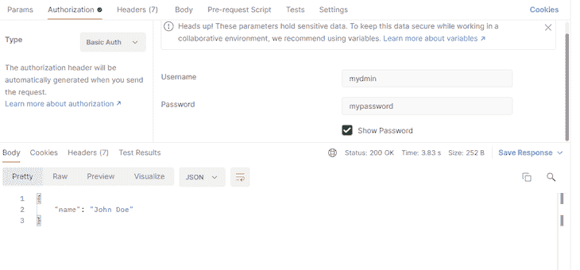
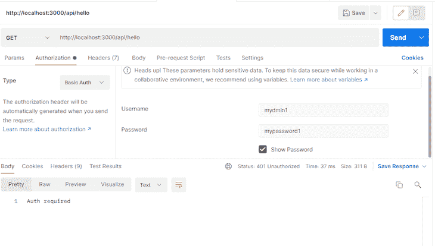

# 使用 Next.js 的中间件和边缘功能

> 原文：<https://blog.logrocket.com/using-next-js-middleware-edge-functions/>

中间件被认为是 Next.js 12 中发布的最酷的特性之一，因为它在现代应用程序中有很多用处，比如与 Vercel Edge 函数一起工作。

中间件这个术语并不新鲜。像 Express.js 这样的框架使用中间件来拦截 HTTP 请求，并在它到达路由处理器之前对其进行处理。

因此，在这篇文章中，我们将学习中间件如何与边缘功能一起工作，以及为什么知道它很重要。现在，让我们开始吧！

## Next.js 中间件

在 Next.js 中，中间件是一段简单的代码，它允许我们在请求完成之前改变对请求的响应。根据用户的请求，我们可以重写、重定向、添加标题，甚至流式传输 HTML。

使用中间件令人兴奋的一点是，它在 Next.js 上的每个请求之前运行。这意味着当用户请求任何页面或 API 路由时，中间件逻辑就在请求之前运行。

要在 Next.js 中创建一个中间件，在`pages`或`api`下创建一个名为`_middleware.js`或`_middleware.ts`的文件。在文件内，导出中间件函数，如下所示:

```
import type { NextFetchEvent, NextRequest } from 'next/server';

export default function middleware(
  request: NextRequest,
  event: NextFetchEvent,
) {
  // return your new response;
}

```

它的 API 建立在本地的`FetchEvent`、`Response`和`Request`对象上。这些本地 web API 对象已经过扩展，可以让您更好地控制如何基于传入的请求操作和配置响应。

通过中间件函数签名，`waitUntil()`方法被包含在`NextFetchEvent`对象中，它扩展了本机`FetchEvent`对象:

```
import type { NextFetchEvent } from 'next/server';
import type { NextRequest } from 'next/server';
export type Middleware = (
  request: NextRequest,
  event: NextFetchEvent,
) => Promise<Response | undefined> | Response | undefined;

```

发送响应后，您可以使用`waitUntil()`方法来扩展函数的执行。实际上，这意味着如果您有其他后台工作要做，您可以发送一个响应，然后继续函数执行。

与 Sentry 或 DataDog 等日志工具的集成是您可能需要`waitUntil()`的另一个因素。在发送响应后，您可以发送响应时间、错误、API 调用持续时间或总性能指标的日志。

本地`Request`对象由`NextRequest`对象扩展，而本地`Response`对象由`NextResponse`对象扩展。

中间件为我们在请求完成之前运行代码提供了完全的灵活性。您可以通过重写、重定向、添加头，甚至流式传输 HTML，根据用户的传入请求修改响应。

另一个优势是中间件提供了一种更有效的方式来共享页面之间的逻辑，允许您保持代码的干燥和高效。

然而，中间件仍然处于测试阶段，所以在使用它的时候你可能会遇到一些错误。

## Next.js 中间件是如何工作的？

[Vercel 的 Edge 函数](https://blog.logrocket.com/deploy-react-app-for-free-using-vercel/)，运行在 V8 引擎上，被 Next.js 的中间件使用。谷歌维护着 V8 引擎，这是一个用 C++编写的 JavaScript 引擎，它比在虚拟机或容器中运行 Node.js 要快得多，Vercel 声称这些边缘功能是瞬时的。

边缘功能放在用户请求和服务器之间，所以中间件在请求完成之前运行。

## 理解边缘函数

如果你曾经使用过无服务器函数，你就会理解边缘函数。为了更好地理解，我们将比较边缘函数和无服务器函数。

当您将无服务器功能部署到 Vercel 时，它会被部署到世界上某个地方的服务器上。然后，对该函数的请求将在服务器所在的位置执行。

如果向该位置附近的服务器发出请求，将会很快发生。但是，如果从很远的地方向服务器发出请求，那么响应将会慢得多。

这就是边缘函数的用处。简而言之，边缘功能是在地理上靠近用户的地方运行的无服务器功能，使得请求非常快，而不管用户可能在哪里。

将 Next.js 应用程序部署到 Vercel 时，中间件将作为边缘功能部署到世界各地。这意味着一个功能不是位于一个服务器上，而是位于多个服务器上。

* * *

### 更多来自 LogRocket 的精彩文章:

* * *

这里，边缘功能使用中间件。边缘函数的一个独特之处是，它们比我们典型的无服务器函数小得多。它们也运行在 V8 运行时上，这使得它比容器或虚拟机中的 Node.js 快 100 倍。

## 为什么边缘功能和中间件很重要？

了解如何使用具有 Edge 功能的中间件解决了跨多个应用程序共享公共登录的问题，这些应用程序包括身份验证、bot 保护、重定向、浏览器支持、功能标志、A/B 测试、服务器端分析、日志记录和地理定位。

在边缘功能的帮助下，中间件可以像静态 web 应用程序一样运行得更快，因为它们有助于减少延迟和消除冷启动。

有了 Edge 功能，我们可以在多个地理位置上运行我们的文件，允许离用户最近的区域响应用户的请求。这提供了更快的用户请求，而不管他们的地理位置。

传统上，网络内容是从 CDN 提供给最终用户以提高速度。然而，因为这些是静态页面，我们丢失了动态内容。此外，我们使用服务器端渲染从服务器获取动态内容，但我们会损失速度。

然而，通过像 CDN 一样将我们的中间件部署到边缘，我们使我们的服务器逻辑更接近访问者的来源。因此，我们为用户提供了速度和个性化。

作为一名开发者，你现在可以构建和部署你的网站，然后将结果缓存在世界各地的 cdn 中。

## 基本密码认证实现

让我们看看如何在 API 中使用中间件进行身份验证，方法是创建一个基本的密码身份验证，并用 Postman 测试它。

[Postman 是一个 API 平台](https://www.postman.com/downloads/)，通过简化协作和简化 API 生命周期，允许您更快地创建和使用 API。

首先，打开终端并创建一个我们希望安装项目的文件夹:

```
mkdir next_middleware

```

`cd`在最近创建的文件夹中，安装 Next.js，并为您的项目命名:

```
npx [email protected]

```

现在我们已经完成了，让我们创建我们的中间件。在我们的`pages/api`文件夹中，让我们创建一个名为`_middleware.js`的文件。接下来，让我们粘贴以下内容:

```
import { NextResponse } from 'next/server'
export function middleware(req) {
  const basicAuth = req.headers.get('authorization')
  if (basicAuth) {
    const auth = basicAuth.split(' ')[1]
    const [user, pwd] = Buffer.from(auth, 'base64').toString().split(':')
    if (user === 'mydmin' && pwd === 'mypassword') {
      return NextResponse.next()
    }
  }
  return new Response('Auth required', {
    status: 401,
    headers: {
      'WWW-Authenticate': 'Basic realm="Secure Area"',
    },
  })
}

```

在`middleware`函数内部，我们首先获取授权头；如果设置了授权头，我们从头中传递用户名和密码，并检查用户是否等于我们的参数(用户名和密码)。

如果是，返回`NextResponse`并调用下一个函数。下一个函数的作用是返回继续中间件链的`NextResponse`。如果用户名和密码不匹配，那么我们返回一个新的响应，说需要认证。

让我们使用 Postman 通过发出 API 请求来测试一下。但首先，我们需要启动我们的应用程序:

```
 npm run dev

```

然后，打开 Postman，进行新的请求；我们的请求应该发送到[http://localhost:3000/API/hello](http://localhost:3000/api/hello)。

点击授权选项卡，选择**基本授权**。输入正确的用户凭证，这应该是我们的结果:

[](https://blog.logrocket.com/?attachment_id=103564)

而且，当我们输入错误的用户名或密码时，我们会得到以下结果:

[](https://blog.logrocket.com/?attachment_id=103566)

我们可以看到向 API 路由添加基本身份验证是多么容易。通过添加中间件文件，我们获得了 API 中所有端点的身份验证。这就简单多了，也方便多了。

## 结论

凭借其解决认证和地理定位等基本问题的能力，中间件是一个突出的特性，在边缘功能的帮助下，中间件可以像静态 web 应用程序一样运行得更快。

## [LogRocket](https://lp.logrocket.com/blg/nextjs-signup) :全面了解生产 Next.js 应用

调试下一个应用程序可能会很困难，尤其是当用户遇到难以重现的问题时。如果您对监视和跟踪状态、自动显示 JavaScript 错误、跟踪缓慢的网络请求和组件加载时间感兴趣，

[try LogRocket](https://lp.logrocket.com/blg/nextjs-signup)

.

[](https://lp.logrocket.com/blg/nextjs-signup)[](https://lp.logrocket.com/blg/nextjs-signup)

LogRocket 就像是网络和移动应用的 DVR，记录下你的 Next.js 应用上发生的一切。您可以汇总并报告问题发生时应用程序的状态，而不是猜测问题发生的原因。LogRocket 还可以监控应用程序的性能，报告客户端 CPU 负载、客户端内存使用等指标。

LogRocket Redux 中间件包为您的用户会话增加了一层额外的可见性。LogRocket 记录 Redux 存储中的所有操作和状态。

让您调试 Next.js 应用的方式现代化— [开始免费监控](https://lp.logrocket.com/blg/nextjs-signup)。