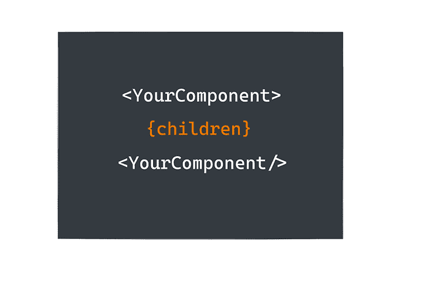
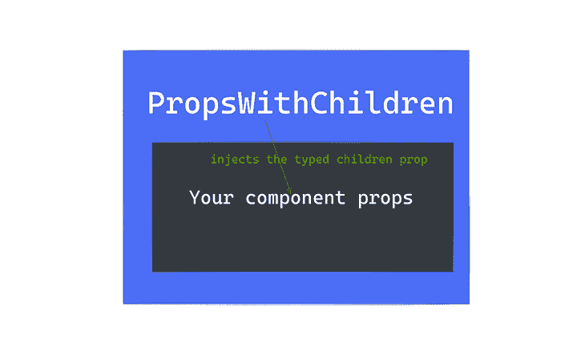
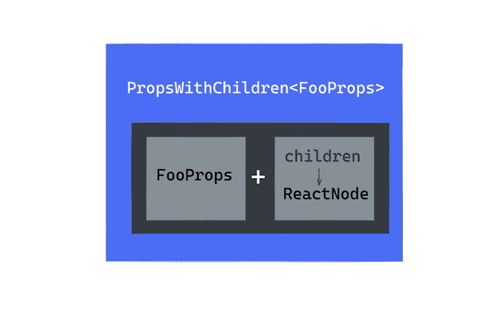

# 将 React 子属性与 TypeScript 一起使用

> 原文：<https://blog.logrocket.com/using-react-children-prop-with-typescript/>

最初，在 React 中正确键入`children`道具可能会带来一些困难。如果您尝试将它们键入为特定的 JSX 类型，可能会在呈现子组件时遇到问题。还有一个选择悖论的问题，因为有多个可用选项来键入儿童道具。这可能会导致决策疲劳。

在这篇文章中，我将分享我根据经验推荐的解决方案。为了完整起见，我还将分享一些其他的、有争议的相关方法。

*向前跳转:*

让我们开始吧。

## JSX 的儿童

当你用开始和结束标签写一个 JSX 表达式时，在它们之间传递的内容被称为它们的“子元素”。



Children passed between the opening and closing tag of your JSX expression

考虑下面这个虚构的例子:

```
<Border> Hey, I represent the JSX children! </Border>

```

在这个例子中，字符串`Hey, I represent the JSX children!`指的是在`Border`中呈现的子元素。

相反，为了访问在 JSX 结束和开始标记之间传递的内容，React 在一个特殊的属性中传递这些内容:`props.children`

例如，`Border`可以如下接收`children`道具:

```
const Border = ({children}) => {
   return <div style={{border: "1px solid red"}}>
      {children}
   </div>
}

```

`Border`接受`children`道具，然后用`1px solid red`的边框样式在`div`内渲染`children`。

这是`children` prop 的基本用法，即接收和操作在 JSX 表达式的开始和结束标签内传递的内容。

## 支持的子类型

严格地说，在 JSX 表达式的开始和结束标记中，有一些受支持的内容类型。以下是一些最常用的方法:

### 用线串

文字字符串是有效的子类型，如下所示:

```
<YourComponent> This is a valid child string </YourComponent />

```

注意在`YourComponent`中，`props.children`将仅仅是字符串`This is a valid child string`。

### JSX

您同样可以将其他 JSX 元素作为有效的子元素进行传递。当组合不同的嵌套组件时，这通常很有帮助。下面是一个例子:

```
<Wrapper>
  <YourFirstComponent />
  <YourSecondComponent />
</Wrapper>

```

混合子类型也是完全可以接受的，如下所示:

```
<Wrapper>
  I am a valid string child
  <YourFirstComponent />
  <YourSecondComponent />
</Wrapper>

```

### JavaScript 表达式

表达式同样是有效的子类型，如下所示:

```
<YourFirstComponent> {myScopedVariableReference} </YourFirstComponent>

```

记住`JSX`中的表达式是用花括号写的。

### 功能

函数是同等有效的子类型，如下所示:

```
<YourFirstComponent> 
  {() => <div>{myScopedVariableReference}</div>} 
</YourFirstComponent>

```

如您所见，`children`道具可以用相当多的数据类型来表示！您的第一反应可能是手动键入这些内容，就像这样:

```
type Props = {
  children: string | JSX.Element | JSX.Element[] | () => JSX.Element
}

const YourComponent = ({children} : Props) => {
  return children
}

```

这似乎是个好主意，但它并不能完全代表`children`道具。那么片段、门户、被忽略的渲染值，比如`undefined`、`null`、`true`或者`false`呢？

完整的表示可能如下所示:

```
type ReactText = string | number;
type ReactChild = ReactElement | ReactText;

interface ReactNodeArray extends Array<ReactNode> {}
type ReactFragment = {} | ReactNodeArray;
type ReactNode = ReactChild | ReactFragment | ReactPortal | boolean | null | undefined;

type Props = {
  children: ReactNode
}

// source: https://github.com/DefinitelyTyped/DefinitelyTyped/blob/d076add9f29db350a19bd94c37b197729cc02f87/types/react/index.d.ts

```

参见[反应入口](https://github.com/DefinitelyTyped/DefinitelyTyped/blob/d076add9f29db350a19bd94c37b197729cc02f87/types/react/index.d.ts#L190)和[反应出口](https://github.com/DefinitelyTyped/DefinitelyTyped/blob/d076add9f29db350a19bd94c37b197729cc02f87/types/react/index.d.ts#L146)的扩展类型。它们看起来复杂吗？他们很有可能知道。

我想说的是，在实践中，你不希望手动输入`children`道具。相反，我建议使用下面讨论的官方支持的类型。

## 使用`PropsWithChildren`类型

`React.PropsWithChildren`类型接受您的组件属性，并返回一个带有适当类型的`children`属性的联合类型。你不需要额外的工作。

实际上，下面是[对`PropsWithChildren`类型的定义](https://github.com/DefinitelyTyped/DefinitelyTyped/blob/d076add9f29db350a19bd94c37b197729cc02f87/types/react/index.d.ts#L822):

```
type PropsWithChildren<P> = P & { children?: ReactNode };

```



How the `propsWithChildren` type works

假设你有一个组件`Foo`和道具`FooProps`:

```
type FooProps = {
  name: 'foo'
}

export const Foo = (props: FooProps) => {
    return null
}

```

你可以继续介绍`children`道具如下:

```
import { PropsWithChildren } from 'react'

type FooProps = {
  name: 'foo'
}

export const Foo = (props: PropsWithChildren<FooProps>) => {
    return props.children
}

```

当你将`PropsWithChildren`传递给你的组件道具`FooProps`时，你得到了内部类型化的`children`道具。

在大多数情况下，这是推荐的键入`children`属性的方式，因为它需要较少的样板文件，并且`children`属性是隐式类型的。

## 显式使用`ReactNode`类型

在必须显式键入`children`属性的情况下，可以继续使用`ReactNode`类型。

记住`PropsWithChildren`类型的定义:

```
type PropsWithChildren<P> = P & { children?: ReactNode };

```



The propsWithChildren type leverages the reactNode type

不依赖`PropsWithChildren`，也可以直接键入`children`道具:

```
import { ReactNode } from 'react'

type FooProps = {
  name: 'foo'
  // look here 👇
  children: ReactNode
}

export const Foo = (props: FooProps) => {
    return props.children
}

```

## 使用`FunctionComponent`(或`FC`)类型

`FunctionComponent`通用接口也可以用来适当地输入`children`属性。在内部，这个接口依赖于`PropsWithChildren`。

你可以这样使用它:

```
import { FunctionComponent } from 'react'

type FooProps = {
  name: 'foo'
}

export const Foo: FunctionComponent<FooProps> = (props) => {
    return props.children
}

```

注意，为了方便起见，`FC`类型是`FunctionComponent`的别名。它们的用法相似，如下所示:

```
import { FC } from 'react'

type FooProps = {
  name: 'foo'
}

export const Foo: FC<FooProps> = (props) => {
    return props.children
}

```

## 将`Component`类型用于类组件

大多数现代的 React 代码库不再使用类组件，除非在特定的用例中。
如果你发现自己需要在一个类组件中键入`children`道具，利用`Component`道具，如下所示:

```
import { Component } from 'react'

type FooProps = {
  name: 'foo'
}

class Foo extends Component<FooProps> {
  render() {
    return this.props.children
  }
}

```

类似于`FunctionComponent`接口及其`FC`别名，`Component`类型自动包含`children`道具。

## 结论

在可能的情况下，使用`PropsWithChildren`类型，但是也不要害怕直接键入`children`属性，无论是在类中还是在功能组件中。

## [LogRocket](https://lp.logrocket.com/blg/react-signup-general) :全面了解您的生产 React 应用

调试 React 应用程序可能很困难，尤其是当用户遇到难以重现的问题时。如果您对监视和跟踪 Redux 状态、自动显示 JavaScript 错误以及跟踪缓慢的网络请求和组件加载时间感兴趣，

[try LogRocket](https://lp.logrocket.com/blg/react-signup-general)

.

[ ](https://lp.logrocket.com/blg/react-signup-general) [](https://lp.logrocket.com/blg/react-signup-general) 

LogRocket 结合了会话回放、产品分析和错误跟踪，使软件团队能够创建理想的 web 和移动产品体验。这对你来说意味着什么？

LogRocket 不是猜测错误发生的原因，也不是要求用户提供截图和日志转储，而是让您回放问题，就像它们发生在您自己的浏览器中一样，以快速了解哪里出错了。

不再有嘈杂的警报。智能错误跟踪允许您对问题进行分类，然后从中学习。获得有影响的用户问题的通知，而不是误报。警报越少，有用的信号越多。

LogRocket Redux 中间件包为您的用户会话增加了一层额外的可见性。LogRocket 记录 Redux 存储中的所有操作和状态。

现代化您调试 React 应用的方式— [开始免费监控](https://lp.logrocket.com/blg/react-signup-general)。