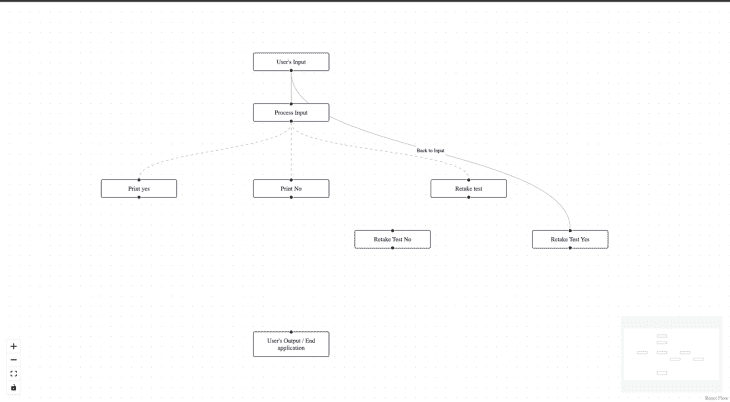
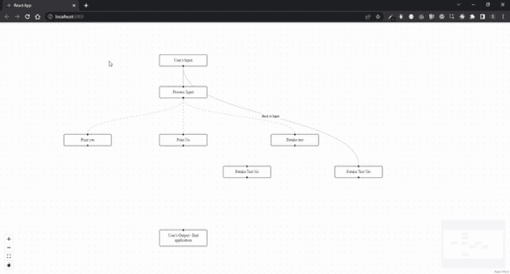

# 使用 React 流程规划 React 项目

> 原文：<https://blog.logrocket.com/using-react-flow-plan-react-project/>

成功的项目需要充分的规划和架构的结合。规划一个项目可能是一件痛苦的事，尤其是当你必须在纸上画出每个流程时。幸运的是，有各种各样的产品可以帮助你规划你的项目。在本文中，我们将看看如何使用 [React 流](https://reactflow.dev/)来规划您的下一个 React 项目。

向前跳:

## 什么是反应流？

React Flow 是一个 [React](https://blog.logrocket.com/tag/react/) 库，用于创建交互式图形和基于节点的编辑器。它可以创建决策工作流，也用于演示。使用 React Flow，您可以以编程方式创建整个 React 项目架构，并且可以灵活地以图形化方式定制每个节点:



React Flow 可以免费使用，具有简单的设置和集成，设置和使用时间不到五分钟。它包括缩放和平移、多重选择和几个现成的事件处理程序。

第二，React 流库具有高度的灵活性和可定制性。用户可以根据自己的喜好设计[节点和](https://reactflow.dev/docs/guides/custom-nodes/)元素。该库还提供了几个支持定制的插件:

*   小地图:这个插件在一个小的微型部分提供了整个流程的概览，从而赋予用户快速导航和概览的能力。当流量很大，无法在一个页面上查看时，这变得非常有用
*   [控件](https://reactflow.dev/docs/overview/plugin-components/#controls):这个可定制的控件条附带了 React 流库。它由一组有价值的按钮组成，这些按钮用于控制流的放大和缩小、适合屏幕以及交互特性
*   背景:这个插件有助于画布的图形化可视化。当添加到 React 流组件时，它会为其提供均匀的点状背景

为了了解我们的应用程序的可靠性，我们对它们进行测试以消除我们的疑虑。用[柏树](https://blog.logrocket.com/unit-testing-react-cypress/)测试反应流量。根据[文档](https://reactflow.dev/docs/guides/testing/)，还支持用[剧作家](https://blog.logrocket.com/getting-started-playwright-component-testing/)和[笑话](https://blog.logrocket.com/jest-testing-top-features/)进行测试。

而且，Github 上的 [12k stars 和平均每周 161k 的下载量，它在开发人员中很受欢迎。它有广泛的社区支持，允许它被维护，从而给用户一个长期的保证和可伸缩性。](https://github.com/wbkd/react-flow)

为了更好地理解如何使用 React 流，让我们构建我们的自定义流。

## 构建定制的 React 流

让我们从搭建 React 应用程序开始。运行以下命令，在您的首选目录中搭建 react:

```
yarn create react-app working-with-reactflow

```

一旦我们安装了必要的包和库，将目录更改为新创建的项目，并运行这个命令来安装 React Flow。

```
 yarn add reactflow

```

### 设计我们的 React 流应用程序

在我们构建 React 流应用程序之前，让我们为应用程序创建一个自定义样式。将以下代码复制并粘贴到`src/index.css`文件中:

```
html,
body,
#root {
  width: 100%;
  height: 100%;
  margin: 0;
  padding: 0;
  box-sizing: border-box;
}

```

### 创建反应流节点

节点是 React Flow 的一个基本功能，它允许您渲染任何您喜欢的内容。

根据 React Flow [docs](https://reactflow.dev/docs/overview/terms-and-definitions/#nodes) ，节点是单独的容器或组件，包含关于容器的简要信息，通过`type default`、`input`或`output`。使用`x`和`y`属性设置初始位置，可以将每个节点放置在画布上的精确位置。

现在，让我们从构建第一批节点开始。在`src`文件夹中创建一个`nodes.js`文件，并将下面的代码粘贴到其中:

```
export default [
  {
    id: "1",
    type: "input",
    data: { label: "User's Input" },
    position: { x: 500, y: 100 },
  },
  {
    id: "2",
    data: { label: "Process Input" },
    type: "default",
    position: { x: 500, y: 200 },
  },
  {
    id: "3",
    data: { label: "Print yes" },
    position: { x: 200, y: 350 },
  },
  { id: "4", data: { label: "Print No" }, position: { x: 500, y: 350 } },
  { id: "5", data: { label: "Retake test" }, position: { x: 850, y: 350 } },
  {
    id: "6",
    data: { label: "Retake Test Yes" },
    position: { x: 1050, y: 450 },
  },
  { id: "7", data: { label: "Retake Test No" }, position: { x: 700, y: 450 } },
  {
    id: "8",
    type: "output",
    data: { label: "User's Output / End application" },
    position: { x: 500, y: 650 },
  },
];

```

在上面的代码块中，我们创建了一个对象数组。每个对象都包含一个唯一的`id`、`type`(如果没有指定，则为默认值)和`data`，后者包含一个具有`label`属性的对象，最后还有一个用于指定节点的视口位置的`position`属性。

### 在反应流中设计边

反应流[边](https://reactflow.dev/docs/overview/terms-and-definitions/#edges)是连接节点的线。边可以连接多个节点，形成一个[流](https://reactflow.dev/docs/getting-started/building-a-flow/)，可以手动绘制和移除。

要为我们的节点创建一个边，在`src`文件夹中创建一个`edge.js`文件，并将下面的代码粘贴到其中:

```
export default [
  { id: "el1-2", source: "1", target: "2" },
  { id: "el2-3", source: "2", target: "3", animated: true },
  { id: "el2-4", source: "2", target: "4", animated: true },
  { id: "el2-5", source: "2", target: "5", animated: true },
  { id: "el6-1", source: "1", target: "6", label: "Back to Input" },
];

```

在上面的代码块中，我们创建了一个对象数组，其中每个对象都包含一个唯一的`id`、边缘开始的`source`、`target`位置、一个用于标识的`label`和一个动画`Boolean`值。

### 构建 React 流 UI

有了节点和边之后，让我们在 React Flow 应用程序中使用它们。将以下代码复制并粘贴到新创建的`Flow.jsx`文件中:

```
import { useCallback, useState } from "react";
import ReactFlow, {
  applyEdgeChanges,
  applyNodeChanges,
  addEdge,
  MiniMap,
  Controls,
  Background,
} from "reactflow";
import "reactflow/dist/style.css";
import initialNodes from "./nodes.js";
import initialEdges from "./edges.js";

function Flow() {
  const [nodes, setNodes] = useState(initialNodes);
  const [edges, setEdges] = useState(initialEdges);

  const onNodeChange = useCallback(
    (x) => setNodes((newNode) => applyNodeChanges(x, newNode)),
    [setNodes]
  );

  const onEdgeChange = useCallback(
    (x) => setEdges((eds) => applyEdgeChanges(x, eds)),
    [setEdges]
  );

  const onEdgeConnect = useCallback(
    (x) => setEdges((eds) => addEdge({ ...x, animated: true }, eds)),
    [setEdges]
  );

  return (
    <ReactFlow
      nodes={nodes}
      edges={edges}
      onNodesChange={onNodeChange}
      onEdgesChange={onEdgeChange}
      onConnect={onEdgeConnect}
    >
      <MiniMap />
      <Controls />
      <Background />
    </ReactFlow>
  );
}
export default Flow;

```

在上面的代码块中，我们为`initalNodes`和`initialEdges`创建了一个状态，稍后将在`ReactFlow`组件中使用。每当节点和边在画布上的位置改变时，我们也会观察到它们的变化。

我们通过使用`onConnect`属性监听和更新应用于状态的更改，使边从一个节点到另一个节点的任何位置都是可连接的。

我们还利用 React 流的插件来显示`MiniMap`，它为我们提供了整个流的概览，`Controls`用于控制面板，`Background`用于改进画布的图形表示。

以我们迄今为止的进展，我们应该能够得到以下结果:



## 为什么您应该在下一个 React 项目中使用 React Flow？

由于开发市场上有许多选择，选择一个适合您需求的库可能会很有压力。然而，使用 React Flow，可以简化项目的规划和架构，减轻您的压力。

React 流库因其简单性和灵活性而在项目规划中表现出色。React Flow 受到成千上万用户的信任，包括小型开源开发团队和组织，如 [Stripe](https://stripe.com/) 和 [Typeform](https://www.typeform.com/) 。该库已被用于创建聊天机器人构建器、音乐合成器、机器学习工具等。

尽管市场上有许多竞争对手，React Flow 仍然是项目规划和流程的最佳库之一，并在大型项目的整个开发阶段对用户有益。

## 结论

在本文中，我们研究了 React 流库，它的用途，以及如何规划下一个 React 项目。我们还构建了自己的定制流来展示 React 流的灵活性。React Flow 的其他特性可能对你的下一个项目有用，所以请前往[文档](https://reactflow.dev/docs/introduction/)了解更多信息。

你可以在这里看到完整的[源代码](https://github.com/IsaacThaJunior/Working-with-React-flow)。

## [LogRocket](https://lp.logrocket.com/blg/react-signup-general) :全面了解您的生产 React 应用

调试 React 应用程序可能很困难，尤其是当用户遇到难以重现的问题时。如果您对监视和跟踪 Redux 状态、自动显示 JavaScript 错误以及跟踪缓慢的网络请求和组件加载时间感兴趣，

[try LogRocket](https://lp.logrocket.com/blg/react-signup-general)

.

[ ](https://lp.logrocket.com/blg/react-signup-general) [](https://lp.logrocket.com/blg/react-signup-general) 

LogRocket 结合了会话回放、产品分析和错误跟踪，使软件团队能够创建理想的 web 和移动产品体验。这对你来说意味着什么？

LogRocket 不是猜测错误发生的原因，也不是要求用户提供截图和日志转储，而是让您回放问题，就像它们发生在您自己的浏览器中一样，以快速了解哪里出错了。

不再有嘈杂的警报。智能错误跟踪允许您对问题进行分类，然后从中学习。获得有影响的用户问题的通知，而不是误报。警报越少，有用的信号越多。

LogRocket Redux 中间件包为您的用户会话增加了一层额外的可见性。LogRocket 记录 Redux 存储中的所有操作和状态。

现代化您调试 React 应用的方式— [开始免费监控](https://lp.logrocket.com/blg/react-signup-general)。