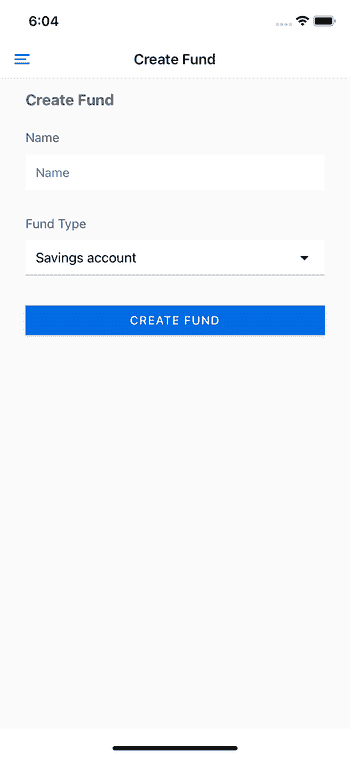
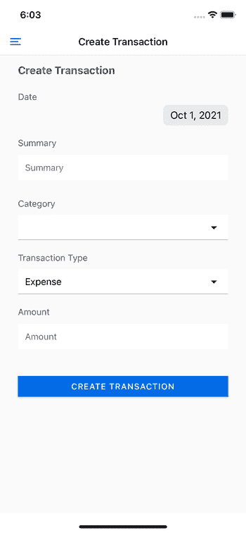
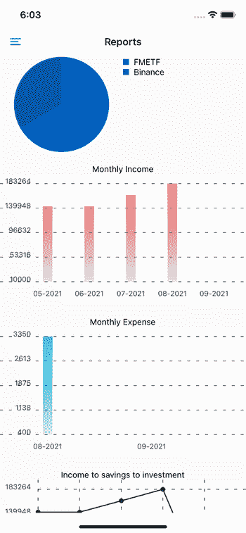
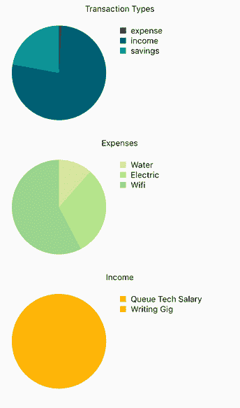
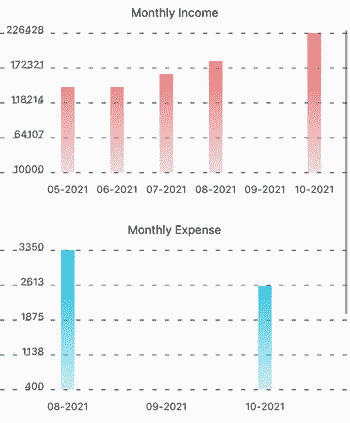
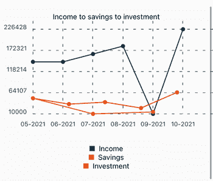

# 使用 React 本地图表工具包来可视化数据

> 原文：<https://blog.logrocket.com/using-react-native-chart-kit-visualize-data/>

当应用程序的力量在于数据时，以一种好的方式呈现给用户是很重要的。这就是图表库发挥作用的地方。它们允许你以一种吸引人的方式向用户展示数据，从而让他们更多地使用你的应用。

在本教程中，我们将了解 React Native Chart Kit，这是 React Native 的一个图表库。我们将构建一个使用它的应用程序，这样你就可以有一个实际的例子来使用。

## 应用概述:构建财务跟踪应用

我们将要学习的应用程序是一个财务跟踪应用程序。

这款应用有四个屏幕。其中三个用于用户输入，而最后一个用于图表。我们将主要关注有图表的屏幕，但我们也将简要介绍其他屏幕。

这是三个输入屏幕:

*   创建类别—每个事务的一般分类是一个类别。类别可以是收入，也可以是费用。例如，用户可以创建“互联网账单”作为费用类别，或者“主要工作薪金”作为收入类别


*   创建基金—允许用户输入他们不同的基金存储。例子包括:实体钱包、电子钱包、储蓄银行账户、股票和密码



*   创建交易—这是用户输入所有交易的地方，以便他们可以跟踪他们的财务状况。例如，当他们在月底拿到工资时，他们可以为它创建一个交易
    

最后一个屏幕是报告屏幕，向用户显示图表:



## 设置项目

设置项目最简单的方法是启动一个新的 React 本地项目:

```
npx react-native init RNChartKitFinanceApp

```

完成后，从 GitHub repo 中复制文件。我用的这个 app 的 React 原生版本是`0.65.1`。如果当你读到这篇文章的时候，有一个更新的版本，一定要用那个来代替。您可以通过替换您的`package.json`文件中的相应版本来做到这一点。

该应用程序使用以下软件包。如果您想跟随 React Native Chart Kit 开发一个财务跟踪应用程序，请务必遵循其网站上相应的安装步骤:

上面只提到了具有本地依赖性的包。查看 repo 中的`package.json`文件，获取依赖项的完整列表。

## 构建应用程序

这不是你通常的从头构建教程，所以我们可以专注于主题:React 原生图表工具包。

我们将不再浏览创建类别、基金和交易的屏幕。我们也不会经历 React 导航和 React 原生纸的设置。你可以简单地查看回购协议。

相反，我们将只关注报告屏幕和获取数据的查询。

### SQLite 数据库

让我们首先来看看我们是如何使用数据库的。如前所述，我们使用 React Native SQLite 存储库来本地管理我们自己的 SQLite 数据库。

我们只需要库中的三个方法:`enablePromise()`和`openDatabase()`:

```
// data/db-service.js
import {
  enablePromise,
  openDatabase,
} from 'react-native-sqlite-storage';

```

`enablePromise()`是为了在执行不同的方法时能够处理承诺:

```
enablePromise(true);

```

`openDatabase()`用于在操作系统分配给应用的本地存储上创建和打开数据库文件。如果文件已经存在，那么它将简单地打开文件:

```
export const getDBConnection = async () => {
  return openDatabase({name: 'finance-data.db', location: 'default'});
};

```

创建一个表只需要知道要执行的查询，然后调用`db`对象上的`executeSql()`方法，将查询作为参数提供。下面是创建`transactions`表的代码。

我们使用整数数据类型来存储`transactionDate`,因为它将被存储为 Unix 时间戳。

`category_id`是来自`categories`表的`rowId`。我们还可以向它添加一个外键，但为了简单起见，我们不会这样做:

```
export const createTransactionsTable = async db => {
  const query = `CREATE TABLE IF NOT EXISTS transactions (transactionDate INTEGER, summary TEXT, category_id INTEGER NOT NULL, transactionType TEXT, amount FLOAT)`;
  await db.executeSql(query);
};

```

下面是创建新事务记录的代码。除了`transactionDate`以外，所有的交易字段都可以直接保存。

datepicker 库返回一个`Date`对象，所以我们必须通过调用`getTime()`然后除以`1000`来获得 Unix 时间戳。这非常重要，因为如果没有以正确的格式保存，我们就不能在 SQLite 中调用日期操作方法:

```
export const createTransaction = async (db, transaction) => {
  const {transactionDate, summary, category, transactionType, amount} =
          transaction;
  const timestamp = parseInt((transactionDate.getTime() / 1000).toFixed(0));
  const insertQuery = `INSERT INTO transactions(transactionDate, summary, category_id, transactionType, amount) VALUES("${timestamp}", "${summary}", "${category}", "${transactionType}", "${amount}")`;
  return db.executeSql(insertQuery);
};

```

请务必[查看回购协议中用于处理类别和基金的代码](https://github.com/anchetaWern/RNChartKitFinanceApp/blob/master/data/db-service.js)，因为在本教程中我们将不再讨论这些代码。

## 使用 React 本地图表工具包创建财务图表

是时候继续本教程的主题了:使用 React 原生图表工具包创建图表。

从导入我们需要的模块开始:

```
// src/screens/ReportsScreen.js
import React, {useState, useEffect, useCallback} from 'react';
import {ScrollView, StyleSheet} from 'react-native';

import {withTheme} from 'react-native-paper';
import {SafeAreaView} from 'react-native-safe-area-context';

```

还要为每种类型的图表导入自定义组件。我们稍后将创建这些:

```
import FinancePieChart from '../components/FinancePieChart';
import FinanceLineChart from '../components/FinanceLineChart';
import FinanceBarChart from '../components/FinanceBarChart';

```

接下来，提取从数据库中获取我们需要的报告数据的方法。这些方法中的每一种(除了前两种)都对应于我们将向用户显示的报告类型。

如果你已经看过前面的截图，这些方法中的每一个都对应于每一个图表(除了最后一个图表依赖于下面的最后三个方法)。我们稍后还会添加这些内容:

```
import {
  getDBConnection,
  createTransactionsTable,

  // pie charts
  getTransactionsGroupedByTransactionType,
  getExpenseTransactionsGroupedByCategory,
  getIncomeTransactionsGroupedByCategory,
  getSavingsTransactionsGroupedByCategory,
  getInvestmentTransactionsGroupedByCategory,

  // bar charts
  getExpenseGroupedByMonth,

  // for bar chart and line chart
  getSavingsGroupedByMonth,
  getIncomeGroupedByMonth, 

  getInvestmentsGroupedByMonth, // for line chart
} from '../../data/db-service';

```

接下来，创建组件并初始化我们将用来存储来自数据库的数据的状态值:

```
const ReportsScreen = ({theme}) => {
  const {colors, fonts} = theme;

  const [byExpenseCategories, setByExpenseCategories] = useState([]);
  const [byIncomeCategories, setByIncomeCategories] = useState([]);
  const [bySavingsCategories, setBySavingsCategories] = useState([]);
  const [byInvestmentCategories, setByInvestmentCategories] = useState([]);
  const [byTransactionTypes, setByTransactionTypes] = useState([]);

  const [monthlyIncome, setMonthlyIncome] = useState([]);
  const [monthlyExpense, setMonthlyExpense] = useState([]);

  const [monthlySavings, setMonthlySavings] = useState([]);
  const [monthlyInvestments, setMonthlyInvestments] = useState([]);
}

```

接下来，我们现在调用这些方法并用它们返回的值更新状态:

```
const loadDataCallback = useCallback(async () => {
  try {
    const db = await getDBConnection();
    await createTransactionsTable(db);

    const groupedByTransactionTypes =
      await getTransactionsGroupedByTransactionType(db);
    if (groupedByTransactionTypes.length) {
      setByTransactionTypes(groupedByTransactionTypes);
    }

    const groupedByExpenseCategories =
      await getExpenseTransactionsGroupedByCategory(db);
    if (groupedByExpenseCategories.length) {
      setByExpenseCategories(groupedByExpenseCategories);
    }

    const groupedByIncomeCategories =
      await getIncomeTransactionsGroupedByCategory(db);
    if (groupedByIncomeCategories.length) {
      setByIncomeCategories(groupedByIncomeCategories);
    }

    const groupedBySavingsCategories =
      await getSavingsTransactionsGroupedByCategory(db);
    if (groupedBySavingsCategories.length) {
      setBySavingsCategories(groupedBySavingsCategories);
    }

    const groupedByInvestmentCategories =
      await getInvestmentTransactionsGroupedByCategory(db);
    if (groupedByInvestmentCategories.length) {
      setByInvestmentCategories(groupedByInvestmentCategories);
    }

    const incomeMonth = await getIncomeGroupedByMonth(db);
    if (incomeMonth) {
      setMonthlyIncome(incomeMonth);
    }

    const expenseMonth = await getExpenseGroupedByMonth(db);
    if (expenseMonth) {
      setMonthlyExpense(expenseMonth);
    }

    const savingsMonth = await getSavingsGroupedByMonth(db);
    if (savingsMonth) {
      setMonthlySavings(savingsMonth);
    }

    const investmentMonth = await getInvestmentsGroupedByMonth(db);
    if (investmentMonth) {
      setMonthlyInvestments(investmentMonth);
    }
  } catch (error) {
    console.error('transaction list err: ', error);
  }
}, []);

useEffect(() => {
  loadDataCallback();
}, [loadDataCallback]);

```

为了让我们在每种方法的作用上保持一致，这里有一个快速的分类:

*   `getTransactionsGroupedByTransactionType()` —按交易类型(例如，费用、收入、储蓄、投资)对当月的交易进行分组，并获取每个交易的总和
*   `getExpenseTransactionsGroupedByCategory()` —按费用项下的所有类别(例如，水费、电费、外出就餐)对当月的交易进行分组，并返回每项交易的总和
*   `getIncomeTransactionsGroupedByCategory()` —与上一个相似，但属于收入类别(如主要收入、附带收入)
*   `getSavingsTransactionsGroupedByCategory()` —与上一个类似，但交易类型仅限于储蓄(如 A 银行储蓄、B 银行储蓄)
*   `getInvestmentTransactionsGroupedByCategory()` —与上一个类似，但交易类型仅限于投资(如股票、密码、房地产)
*   `getIncomeGroupedByMonth()` —返回每个月的总收入
*   `getExpenseGroupedByMonth()` —返回每个月的总费用
*   `getSavingsGroupedByMonth()` —返回每个月的总节省额
*   `getInvestmentsGroupedByMonth()` —返回每个月的总投资

回到代码，我们现在添加显示每个图表的条件:

```
const hasByTransactionTypes = byTransactionTypes.length > 0;
const hasByExpenseCategories = byExpenseCategories.length > 0;
const hasByIncomeCategories = byIncomeCategories.length > 0;
const hasBySavingsCategories = bySavingsCategories.length > 0;
const hasByInvestmentCategories = byInvestmentCategories.length > 0;
const hasMonthlyIncome = monthlyIncome.length > 0;
const hasMonthlyExpense = monthlyExpense.length > 0;

const hasIncomeSavingsInvestment =
        monthlyIncome.length > 0 ||
        monthlySavings.length > 0 ||
        monthlyInvestments.length > 0;

```

接下来，我们需要声明最终图表的设置(在一个图表中显示收入、储蓄和投资的折线图)。

我们实际上不能在组件本身中构造数据；这就是为什么我们在这里建造它。这些主要由 React 本机图表工具包库使用:

```
const lineChartLegends = [
  {
    name: 'Income',
    color: '#003049',
  },
  {
    name: 'Savings',
    color: '#d62828',
  },
  {
    name: 'Investment',
    color: '#f77f00',
  },
];

// dataset for the line chart
const datasets = [];
if (monthlyIncome.length > 0) {
  datasets.push({
    data: monthlyIncome.map(item => item.value),
    color: (opacity = 1) => '#003049',
    strokeWidth: 2,
  });
}

if (monthlySavings.length > 0) {
  datasets.push({
    data: monthlySavings.map(item => item.value),
    color: (opacity = 1) => '#d62828',
    strokeWidth: 2,
  });
}

if (monthlyInvestments.length > 0) {
  datasets.push({
    data: monthlyInvestments.map(item => item.value),
    color: (opacity = 1) => '#f77f00',
    strokeWidth: 2,
  });
}

const chartData = {
  labels: monthlyIncome.map(item => item.label),
  datasets,
};

```

最后，返回用户界面:

```
return (
  <SafeAreaView
    style={[styles.container, {backgroundColor: colors.background}]}
  >
    <ScrollView
      style={{
        flex: 1,
      }}
    >
      {hasByTransactionTypes && (
        <FinancePieChart
          title="Transaction Types"
          data={byTransactionTypes}
        />
      )}

      {hasByExpenseCategories && (
        <FinancePieChart title="Expenses" data={byExpenseCategories} />
      )}

      {hasByIncomeCategories && (
        <FinancePieChart title="Income" data={byIncomeCategories} />
      )}

      {hasBySavingsCategories && (
        <FinancePieChart title="Savings" data={bySavingsCategories} />
      )}

      {hasByInvestmentCategories && (
        <FinancePieChart title="Investment" data={byInvestmentCategories} />
      )}

      {hasMonthlyIncome && (
        <FinanceBarChart
          title="Monthly Income"
          data={monthlyIncome}
          fillShadowGradient="#DF5353"
          color="#d62828"
        />
      )}

      {hasMonthlyExpense && (
        <FinanceBarChart
          title="Monthly Expense"
          data={monthlyExpense}
          fillShadowGradient="#00b4d8"
          color="#0077b6"
        />
      )}

      {hasIncomeSavingsInvestment && (
        <FinanceLineChart
          title="Income to savings to investment"
          chartData={chartData}
          fillShadowGradient="#ccc"
          legend={lineChartLegends}
        />
      )}
    </ScrollView>
  </SafeAreaView>
);

const styles = StyleSheet.create({
  container: {
    flex: 1,
    flexDirection: 'column',
  },
});

export default withTheme(ReportsScreen);

```

### 圆形分格统计图表



现在让我们来看看图表组件的代码。首先，我们来看看`FinancePieChart`组件。这使用了 React 本地图表工具包中的`PieChart`组件。我们用它来生成交易类型、费用类型、收入类型、储蓄类型和投资类型的饼图。

我们从导入我们需要的模块开始。我们还导入了一个`Legend`组件来显示每个数据点的图例。

注意，`PieChart`组件已经有了自己的图例，但是我们不会使用它。所以我们才把`hasLegend={false}`设定为道具。这是因为它不是非常可定制的。真的很难修改它的位置。使用定制的`Legend`组件允许更多的灵活性。

* * *

### 更多来自 LogRocket 的精彩文章:

* * *

我们使用`Dimensions`模块来获取当前设备的屏幕宽度。然后，我们将该宽度提供给组件，使其适应屏幕宽度。请注意，它实际上不会占用设备的整个可用宽度。相反，它只会使用其中的一半:

```
// src/components/FinancePieChart.js

import React from 'react';
import {View, Text, Dimensions, StyleSheet} from 'react-native';

import {PieChart} from 'react-native-chart-kit';

import Legend from './Legend';

const screenWidth = Dimensions.get('window').width;

```

接下来，初始化图表配置。这是图表的配置对象。主要用于配置一般的图表设置，如`strokeWidth`(图表的基本笔画宽度)和`color`(用于计算图表中标签和扇区的基本颜色的函数)。请注意，并非所有属性都适用于所有图表类型。

会有一些只适用于特定类型的。但好的一面是，所有这些属性都被赋予了默认值，因此您可以使用不适用于您正在使用的特定图表的属性:

```
const chartConfig = {
  backgroundGradientFrom: '#1E2923',
  backgroundGradientFromOpacity: 0,
  backgroundGradientTo: '#08130D',
  backgroundGradientToOpacity: 0.5,
  color: (opacity = 1) => `rgba(26, 255, 146, ${opacity})`,
  strokeWidth: 2,
  useShadowColorFromDataset: false,
};

```

接下来，渲染`PieChart`组件。这接受以下属性:

*   `data` —您想要呈现的数据。我们将在稍后查看`src/data/db-service.js`文件中返回的查询和数据时看到这一点。但是一般的经验法则是，您需要一个带有标签和值的对象数组。标签是图例，而值是数据点
*   `width`和`height` —图表的尺寸
*   `chartConfig` —图表的一般配置对象
*   `accessor`—`data`对象的属性，从中获取数值
*   `backgroundColor` —应用于图表的背景颜色。如果你不想应用任何背景色，这可以是`transparent`或`none`
*   `center` —定位图表的偏移 x 和 y 坐标。`[0, 0]`表示我们将它定位在分配位置的最开始。请注意，这不是一个固定的位置，而是一个相对位置，因此它将始终附着在它之前的元素上
*   `hasLegend` —是否显示图例

您可以[查看回购协议，了解更多关于您可以指定的道具的信息](https://github.com/indiespirit/react-native-chart-kit#modified-pie-chart-screenshot)。

在图表的正下方，我们呈现了图例:

```
function FinancePieChart({title, data}) {
  return (
    <View style={styles.container}>
      <View style={styles.titleContainer}>
        <Text>{title}</Text>
      </View>

      <View style={styles.bodyContainer}>
        <View style={styles.chartContainer}>
          <PieChart
            data={data}
            width={screenWidth}
            height={200}
            chartConfig={chartConfig}
            accessor={'total'}
            backgroundColor={'transparent'}
            center={[0, 0]}
            hasLegend={false}
          />
        </View>

        <View style={styles.legendContainer}>
          {data.map(({name, color}) => {
            return <Legend key={name} name={name} color={color} />;
          })}
        </View>
      </View>
    </View>
  );
}

const styles = StyleSheet.create({
  container: {
    marginTop: 10,
  },
  titleContainer: {
    flex: 1,
    alignItems: 'center',
  },
  bodyContainer: {
    flexDirection: 'row',
  },
  chartContainer: {
    flex: 1,
  },
  legendContainer: {
    flex: 1,
    marginTop: 20,
  },
});

export default FinancePieChart;

```

在我们进入下一个图表之前，让我们先来看看我们是如何获得提供给`FinancePieChart`组件的数据的。

下面是获取第一个饼图数据的代码。我们使用聚合函数`SUM()`对每行中的`amount`求和，然后根据`transactionType`对其分组。交易类型可以在`config/app.js`文件中找到。

为了获得我们需要的数据，我们循环几次结果:一次`forEach`和一次`for`循环。请注意，外部循环只执行一次，这是为了让我们可以访问包含实际结果的对象。

行数据不能作为普通对象使用，所以我们必须调用`result.rows`上的`item()`方法并提供当前的`index`来获得我们需要的数据。从那里，我们提取出`name`和`total`列。

我们还添加了一个额外的属性`color`来指定数据点的颜色。颜色都硬编码在`src/helpers/palette.js`文件中。漂亮的调色板归功于酷派:

```
export const getTransactionsGroupedByTransactionType = async db => {
  try {
    const transactions = [];
    const results = await db.executeSql(
      `SELECT SUM(amount) AS total, transactionType AS name FROM transactions 
      WHERE strftime("%m/%Y", datetime(transactionDate, 'unixepoch', 'localtime')) = ?
      GROUP BY transactionType`,
      [monthYear],
    );
    results.forEach(result => {
      for (let index = 0; index < result.rows.length; index++) {
        const {name, total} = result.rows.item(index);
        transactions.push({
          name,
          total,
          color: paletteOne[index],
        });
      }
    });
    return transactions;
  } catch (error) {
    console.error(error);
    throw Error('Failed to getTransactionsGroupedByTransactionType...');
  }
};

```

注意`monthYear`是在顶部附近声明的:

```
enablePromise(true);

const monthYear = new Date().toLocaleDateString(undefined, {
  year: 'numeric',
  month: '2-digit',
});

```

其他饼状图使用了几乎相同的代码。只有查询发生了变化，所以我在这里只包含查询。这一次，我们使用一个`INNER JOIN`来连接`categories`表。这是因为我们需要通过`categoryType`进行过滤:

```
const results = await db.executeSql(
  `SELECT SUM(amount) AS total, categories.name AS name FROM transactions 
  INNER JOIN categories ON categories.rowId = transactions.category_id 
  WHERE categoryType = 'expense' AND strftime("%m/%Y", datetime(transactionDate, 'unixepoch', 'localtime')) = ?
  GROUP BY transactions.category_id`,
  [monthYear],
);

```

### 条形图



现在让我们继续讨论`FinanceBarChart`组件。我们用它来生成用户月收入和月支出的图表。代码应该非常相似。对于`chartConfig`，我们添加了以下属性:

*   *   `barPercentage` —定义图表中每个条形将占据的可用宽度的百分比。这是一个介于 0 和 1 之间的值。在这种情况下，我们指定了`0.5`来表示它将只使用一半的可用宽度
    *   `fillShadowGradient` —定义每个条形的颜色。请注意，将使用该值作为基础来计算背景渐变，因此它实际上不是纯色
    *   `fillShadowGradientOpacity`—`fillShadowGradient`的不透明度

*   `labelColor` —每个栏下文本标签的颜色
*   `decimalPlaces` —要显示的小数位数。这默认为`2`，所以如果你不想显示任何小数，你必须指定`0`

我们提供给它的道具与饼状图非常相似。唯一不同的是`showBarTops`。这是一个布尔值，用于指定是否在每个条形的顶部显示线条。我们指定了`false`,因为我们并不想显示它。

至于您提供的数据，它允许您在`datasets`属性下添加多个对象，但是它实际上不会呈现多个条。因此，您不能将这种类型的图表用于数据比较:

```
// src/components/FinanceBarChart.js
import React from 'react';
import {View, Text, Dimensions, StyleSheet} from 'react-native';
import {BarChart} from 'react-native-chart-kit';

const screenWidth = Dimensions.get('window').width;

function FinanceBarChart({title, fillShadowGradient, data}) {
  const chartConfig = {
    backgroundGradientFrom: '#fff',
    backgroundGradientFromOpacity: 0,
    backgroundGradientTo: '#fff',
    backgroundGradientToOpacity: 0.5,

    fillShadowGradient,
    fillShadowGradientOpacity: 1,
    color: (opacity = 1) => `#023047`,
    labelColor: (opacity = 1) => `#333`,
    strokeWidth: 2,

    barPercentage: 0.5,
    useShadowColorFromDataset: false,
    decimalPlaces: 0,
  };

  const labels = data.map(item => {
    return item.label;
  });

  const values = data.map(item => {
    return item.value;
  });

  const chartData = {
    labels,
    datasets: [
      {
        data: values,
      },
    ],
  };

  return (
    <View style={styles.container}>
      <View style={styles.titleContainer}>
        <Text>{title}</Text>
      </View>
      <BarChart
        data={chartData}
        width={screenWidth}
        height={220}
        chartConfig={chartConfig}
        showBarTops={false}
      />
    </View>
  );
}

const styles = StyleSheet.create({
  container: {
    marginBottom: 20,
  },
  titleContainer: {
    flex: 1,
    alignItems: 'center',
  },
});

export default FinanceBarChart;

```

查看[文档](https://github.com/indiespirit/react-native-chart-kit#bar-chart) n，了解更多关于配置和你可以使用的道具的信息。

现在让我们来看看为该图表提供数据的查询。同样，我们使用 SQLite 中的`strftime`函数按月对交易进行分组，获得总和并仅过滤`income`交易:

```
export const getIncomeGroupedByMonth = async (db) => {
  try {
    const transactions = [];
    const results = await db.executeSql(
      `SELECT strftime("%m-%Y", datetime(transactionDate, 'unixepoch', 'localtime')) AS monthYear,
      SUM(amount) AS total 
      FROM transactions 
      WHERE transactionType = 'income'
      GROUP BY monthYear`
    );

    results.forEach((result) => {
      for (let index = 0; index < result.rows.length; index++) {
        const item = result.rows.item(index);

        transactions.push({
          value: item.total,
          label: item.monthYear,
        });
      }
    });

    return transactions;
  } catch (error) {
    console.error(error);
    throw Error("Failed to getIncomeGroupedByMonth...");
  }
};

```

获取每月费用的代码基本相同。你只需要把`transactionType`换成`expense`，这里就不再赘述了。

### 折线图



我们要看的最后一种图表是折线图。我们用它来显示几个月来收入、储蓄和投资之间的对比。

正如您在前面的 reports 屏幕代码中看到的，它接受多个对象作为`datasets`属性，因此它最适合用于比较目的。这使用了 React 本地图表工具包库中的`LineChart`组件。

就`chartConfig`号而言，我们提供给它的真的没有什么不同。

组件并没有自己的传说。这就是我们再次引入自制`Legend`组件的原因。这将作为我们比较的每个数据点的图例，包括收入、储蓄和投资:

```
// src/components/FinanceLineChart.js
import React from 'react';
import {View, Text, Dimensions, StyleSheet} from 'react-native';
import {LineChart} from 'react-native-chart-kit';

import Legend from './Legend';

const screenWidth = Dimensions.get('window').width;

function FinanceLineChart({title, chartData, legend, fillShadowGradient}) {
  const chartConfig = {
    backgroundGradientFrom: '#fff',
    backgroundGradientFromOpacity: 0,
    backgroundGradientTo: '#fff',
    backgroundGradientToOpacity: 0.5,

    fillShadowGradient,
    fillShadowGradientOpacity: 0,
    color: (opacity = 1) => `#023047`,
    labelColor: (opacity = 1) => `#333`,
    strokeWidth: 2,

    useShadowColorFromDataset: false,
    decimalPlaces: 0,
  };

  return (
    <View style={styles.container}>
      <View style={styles.titleContainer}>
        <Text>{title}</Text>
      </View>
      <LineChart
        data={chartData}
        width={screenWidth}
        height={220}
        chartConfig={chartConfig}
      />

      <View style={styles.legendContainer}>
        {legend.map(({name, color}) => {
          return <Legend key={name} name={name} color={color} />;
        })}
      </View>
    </View>
  );
}

const styles = StyleSheet.create({
  container: {
    marginBottom: 20,
  },
  titleContainer: {
    flex: 1,
    alignItems: 'center',
  },
  legendContainer: {
    flex: 1,
    marginTop: 20,
    alignItems: 'center',
  },
});

export default FinanceLineChart;

```

在 React Native Chart Kit 提供的图表组件中，`LineChart`是功能最强大的一个。我们在这里没有使用它，但是如果你看一下[文档](https://github.com/indiespirit/react-native-chart-kit#line-chart)，你会发现它比其他的有更多的可用道具。例如，它有一个`onDataPointClick`属性，允许您在图表上单击一个数据点时执行一个操作。

至于数据，我们是从三个独立的查询中挑选的。其中一个已经被前面的`FinanceBarChart`使用了。是那个`monthlyIncome`。所以，现在我们需要的是储蓄和投资。这是省钱的一招:

```
export const getSavingsGroupedByMonth = async (db) => {
  try {
    const transactions = [];
    const results = await db.executeSql(
      `SELECT strftime("%m-%Y", datetime(transactionDate, 'unixepoch', 'localtime')) AS monthYear,
      SUM(amount) AS total 
      FROM transactions 
      WHERE transactionType = 'savings'
      GROUP BY monthYear`
    );

    results.forEach((result) => {
      for (let index = 0; index < result.rows.length; index++) {
        const item = result.rows.item(index);

        transactions.push({
          value: item.total,
          label: item.monthYear,
        });
      }
    });

    return transactions;
  } catch (error) {
    console.error(error);
    throw Error("Failed to getSavingsGroupedByMonth...");
  }
};

```

我会把另一个留给你在回购中检查。

## 结论

就是这样！在本教程中，您学习了如何使用 React Native 图表工具包库在 React Native 中创建不同种类的图表。具体来说，我们在本教程中使用了饼图、条形图和折线图。你可以在其 [GitHub repo](https://github.com/anchetaWern/RNChartKitFinanceApp) 中找到该应用的完整源代码。

如果您想了解更多关于 React Native 可以使用的替代图表库的信息，请查看这篇关于 React Native 图表库的文章。

## [LogRocket](https://lp.logrocket.com/blg/react-native-signup) :即时重现 React 原生应用中的问题。

[](https://lp.logrocket.com/blg/react-native-signup)

[LogRocket](https://lp.logrocket.com/blg/react-native-signup) 是一款 React 原生监控解决方案，可帮助您即时重现问题、确定 bug 的优先级并了解 React 原生应用的性能。

LogRocket 还可以向你展示用户是如何与你的应用程序互动的，从而帮助你提高转化率和产品使用率。LogRocket 的产品分析功能揭示了用户不完成特定流程或不采用新功能的原因。

开始主动监控您的 React 原生应用— [免费试用 LogRocket】。](https://lp.logrocket.com/blg/react-native-signup)