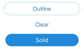
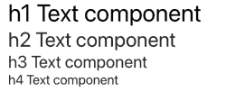
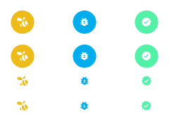

# 使用 React Native Elements，一个跨平台的 UI 工具包

> 原文：<https://blog.logrocket.com/using-react-native-elements-a-cross-platform-ui-toolkit/>

UI 工具包提供了漂亮的、随时可用的 UI 组件，加快了开发速度。React Native 有很多优秀的 UI 套件。其中最受欢迎的是 [React Native Elements](https://reactnativeelements.com/) ，在 GitHub 上有超过 [2 万颗星星。](https://github.com/react-native-elements/react-native-elements)

在本教程中，我们将回顾使用 React 原生元素的基础知识。我们将讨论以下内容:

您可以在我的 [GitHub](https://github.com/claysimps/RNElementsExample) 上找到本文中的所有组件示例。

## 什么是反应原生元素？

React Native Elements 中的组件就像预制建筑。例如，`Button`组件带有一个可定制的图标和标签 prop。所有这一切都要感谢 React Native Elements 的出色人员，他们结合了流行的开源 UI 组件库，如 [React Native Vector Icons](https://blog.logrocket.com/react-native-icons-and-fonts-a-comprehensive-guide/) 。

## 安装 React 本机元素

如果您使用 Expo，您只需安装 React 原生元素，就万事大吉了:

```
yarn add react-native-elements
```

或者，使用 npm:

```
npm install react-native-elements
```

裸机 React 原生应用程序:

```
yarn add react-native-elements
```

或者

```
npm i react-native-elements --save
```

如果您已经在项目中安装了 React 本机矢量图标和 [React 本机安全区域上下文](https://github.com/th3rdwave/react-native-safe-area-context)，您可以跳过下一步。否则，运行以下命令:

```
yarn add react-native-vector-icons react-native-safe-area-context
```

或者

```
npm i --save react-native-vector-icons react-native-safe-area-context
```

## 定制组件

所有部件都包裹在一个`<View />`内，可以用`containerStyle`道具控制。大多数组件都提供了其他可定制的样式道具，使您能够进一步对组件进行样式化(例如`titleStyle`)。

### 作文

让我们用一个自定义按钮来研究这个概念:

```
import React from 'react';
import { Button } from 'react-native-elements';

export const CustomButton = (...props) => (
  <Button
    title="Click me!"
    containerStyle={{
      margin: 5,
    }}
    buttonStyle={{ 
      width: "100%", 
      borderRadius: 35,
      backgroundColor: "green", 
    }}
    titleStyle={{color: "red" }}
    {...props}
  />
);

```

上面的代码产生了下面的按钮:


标题文本的颜色使用`titleStyle`属性，按钮颜色使用`buttonStyle`属性，容器(`View`)使用`containerStyle`属性。

## 主题

React Native Elements 中的主题旨在允许您在一个地方定义所有组件的属性，在 Android、iOS 和 web 上提供一致的外观和感觉。

为了利用这一点，您需要设置`ThemeProvider`并提供一个`theme`:

```
import React from "react";
import { ThemeProvider, Button } from 'react-native-elements';

const theme = {
  Button: {
   containerStyle: {
      margin: 5,
    },
    buttonStyle: {
      width: "100%",
      borderRadius: 35,
      backgroundColor: "green",
    },
    titleStyle: {
      color: "red",
    },
  },
};

export const App = () => {
  return (
    <ThemeProvider theme={theme}>
      <Button title="Click me!" />
    </ThemeProvider>
  );
};

```

上面的代码产生了同样的带有红色文本的绿色按钮。使用`theme`对象，我们现在可以在一个地方定义所有 React 本地元素组件的属性。

## 扩展你的主题

假设你想扩展或覆盖你在`theme`中定义的道具？这是你怎么做的。

### 造型顺序

React 本机元素中的组件遵循样式顺序:

1.  内部，这是应用于组件的默认设置，
2.  主题，由`theme`对象定义，然后应用，
3.  外部，使用提供的组件属性(如`<Button containerStyle={{ margin: 5 } />`)在本地设置

### 物体形状

外部样式是最后应用的，并取代您用主题对象定义的样式。您本地定义的样式的形状必须与您在`theme`中定义的相匹配:

```
// containerStyle shape: [{}]
const theme = {
  Button: {
    buttonStyle: [
      {
        backgroundColor: "green",
      }
    ]
  }
}
// This works: [{}]
<Button buttonStyle={[{ backgroundColor: "blue" }]} />
// This doesn't work - {}
<Button buttonStyle={{ backgroundColor: "blue" }} />

```

### 主题怪癖

由于样式的顺序，有一些奇怪的地方需要注意。例如，`Button`组件有一个接受三个字符串值的`type`属性:`outline`、`clear`和`solid`:



当您将`type`道具设置为`"outline"`或`"clear"`时，它会将`buttonStyle`道具的背景设置为`"transparent"`。

如果你用你的主题对象改变`buttonStyle`的背景颜色，`type`道具会断裂。这是因为内部(默认)样式被主题(`theme`)对象中设置的新颜色所取代。既然我们知道它为什么会坏掉，我们就可以重构我们的预制组件。

```
const theme = {
  Button: {
    buttonStyle: {
      backgroundColor: "orange",
    },
  },
};
// this doesn't work
<Button type="outline" title="Outline?" />
// This does work
<Button
  type="outline"
  title="Outline!"
// Here we remove the colour defined in our theme object
  buttonStyle={{ backgroundColor: "transparent" }}
/>

```


## React 本机元素中的组件

从简单的`<Divider />`到动画的`<Rating />`组件，React Native Elements 旨在为最常见的用例提供组件。

厌倦了按钮组件？让我们看看 React 原生元素还能提供什么。

### `Text`

`Text`组件有五个造型道具。用`style`道具配置`Text`组件的基本样式。每个其他样式属性都有相应的布尔属性，允许您为渲染的文本选择所需的样式:

1.  `h1Style` — `h1`
2.  `h2Style` — `h2`
3.  `h3Style` — `h3`
4.  `h4Style` — `h4` h1 文本组件
    h2 文本组件
    h3 文本组件
    h4 文本组件
    

每个`h[X]Style`道具都有自己的`fontSize`，并且继承了`style`道具的其他风格。

在下面的例子中，`h3Style`没有颜色设置，所以它从`style`属性继承了绿色:

```
const theme = {
  Text: {
    style: {
      fontSize: 14,
      color: "green",
    },
    h1Style: {
      color: "black",
    },
    h2Style: {
      color: "blue",
    },
    h3Style: {
      fontSize: 15,
    },
  },
};
        <Text>Base Style</Text>
        <Text h1>h1 Text component</Text>
        <Text h2>h2 Text component</Text>
        <Text h3>h3 Text component</Text>

```


### `Icon`

[React Native Vector Icons](https://blog.logrocket.com/react-native-icons-and-fonts-a-comprehensive-guide/) 已经为你配置好了，随时可以使用，免去了设置图标的所有麻烦。它使用默认设置的材质图标，所以唯一需要的道具是`name`。像 React Native Elements 中的所有组件一样，它是完全可定制的。

如果你想使用其他图标集，你可以用`type`道具来设置它，就像我下面的大黄蜂图标(`type="entypo"` `name="swarm"`):

```
<Icon type="entypo" name="swarm" color="#ecba16" />
<Icon name="bug-report" color="#00aced" />
<Icon name="verified" color="#51f0a4" />

```


它还有一些方便的道具，包括:

*   `raised`，在组件容器周围设置一个方框边框，以及
*   `reverse`，反转 logo 颜色和组件容器背景颜色。
*   `onPress`，使得图标组件可按按钮//第一行//第二行//第三行//第四行// OnPress 示例
    console . log(" clicked ")}
    />
    

### `Card`

`<Card />`组件是一个复合组件，包含您需要在几分钟内创建一个时尚卡片的所有子组件:

*   `Card.Divider`接收所有 [`Divider`](https://reactnativeelements.com/docs/props/divider/#props) 道具，
*   `Card.Title`接收所有 [`Text`](https://reactnativeelements.com/docs/props/text#props) 道具，
*   `Card.Image`接收所有`[Image](https://reactnativeelements.com/docs/props/image/#props)`道具，
*   `Card.FeaturedTitle`接收所有 [`Text`](https://reactnativeelements.com/docs/props/text#props) 道具，并
*   `Card.FeaturedSubtitle`接收所有 [`Text`](https://reactnativeelements.com/docs/props/text#props) 道具

下面是如何在 React 本地元素中使用`Card`组件的示例:

```
import React from "react";
import { Button, Card, Icon, Text } from "react-native-elements";
const urlImage =
  "https://images.unsplash.com/photo-1595526114035-0d45ed16cfbf?ixid=MXwxMjA3fDB8MHxwaG90by1wYWdlfHx8fGVufDB8fHw%3D&ixlib=rb-1.2.1&auto=format&fit=crop&w=750&q=80";
export const CustomCard = () => (
  <Card>
    <Card.Title>Not my bedroom</Card.Title>
    <Card.Divider />
    <Card.Image source={{ uri: urlImage }} />
    <Text style={{ marginBottom: 10 }}>
      But it is a lovely room, worthy of a short description... in the
      description space! 😎
    </Text>
    <Button icon={<Icon name="code" />} title="MORE INFO" />
  </Card>
);

```

看到这有多简单了吗？我花了比写代码更长的时间来选择图像。

`<Button />`组件可用的`icon`道具已经为我们设置好了。我们需要做的就是添加`<Icon />`组件。

另外，请注意,`<Button />`组件使用了我们之前在主题对象中定义的边界半径。你会情不自禁地爱上 React Native Elements 的简单易用！🥰


### `Rating`

`Rating`组件从`[react-native-ratings](https://github.com/Monte9/react-native-ratings)`导入，并包装在 React Native Elements 的`withTheme` HOC 中。这允许您使用您的`theme`对象来设置组件的样式，就像您使用任何其他 React Native Elements 组件一样。

您有两个可用的评级组件:

1.  带有点击手势的 Airbnb 风格评分(前两位)
2.  花式刷卡版(底部两个)


```
import React from "react";
import { Alert, View, StyleSheet } from "react-native";
import { AirbnbRating, Rating } from "react-native-elements";
export default function RatingsExample() {
  function setRating(rating: number) {
    Alert.alert("Rating is: " + rating);
  }
  return (
    <View style={styles.container}>
      <AirbnbRating
        count={5}
        reviews={["Terrible", "Meh", "Good", "Very Good", "Amazing"]}
        defaultRating={5}
        size={20}
        onFinishRating={setRating}
      />
      <AirbnbRating
        selectedColor="green"
        reviewColor="green"
        count={5}
        reviews={["Terrible", "Meh", "Good", "Very Good", "Amazing"]}
        defaultRating={5}
        size={20}
        onFinishRating={setRating}
      />
      <Rating
        startingValue={1}
        ratingCount={5}
        imageSize={60}
        onFinishRating={setRating}
        fractions={1}
        showRating
      />
      <Rating
        type="rocket"
        startingValue={1}
        ratingCount={5}
        imageSize={60}
        onFinishRating={setRating}
        fractions={1}
        showRating
      />
    </View>
  );
}
const styles = StyleSheet.create({
  container: {
    flex: 1,
    alignItems: "center",
    justifyContent: "center",
  },
});

```

如果您正在使用 TypeScript，您将得到一个关于`reviewColor=""`的错误；道具可用，但尚未申报。您可以放心地忽略此错误，但是如果您希望 TypeScript 不再对您大喊大叫，以下是关闭它的方法:

1.  在项目文件夹中创建一个名为`react-native-elements.d.ts`的文件
2.  添加以下代码:

```
declare module "react-native-elements" {export interface AirbnbRatingProps {
reviewColor?: string;
}
}
```

### `Input`

组件的工作方式就像标准的 React 本地输入组件一样，除了它提供了创建吸引人的输入所需的所有功能。如你所想，它是完全可定制的。


```
import React from "react";
import { View, StyleSheet } from "react-native";
import { Input, Icon } from "react-native-elements";
export const InputExample = () => (
  <View style={styles.container}>
    <Input
      label="What's your email address?"
      placeholder="Email"
      leftIcon={<Icon size={24} name="email" />}
      errorMessage="I pop up when something goes wrong"
    />
    <Input
      secureTextEntry
      label="Type it, don't tell me"
      placeholder="Password"
      leftIcon={{ name: "lock", size: 24, color: "purple" }}
      labelStyle={{ color: "orange" }}
      placeholderTextColor="blue"
      inputContainerStyle={{ borderBottomColor: "red" }}
      errorMessage="I pop up when something goes wrong"
    />
  </View>
);
const styles = StyleSheet.create({
  container: {
    flex: 1,
    alignItems: "center",
    justifyContent: "center",
  },
});

```

## 结论

React Native Elements 有许多其他常见用例的组件，它们遵循我们在本文中探索的相同模式。如果你想更详细地回顾其他组件和不同的造型道具，请查看[React Native Elements Playground](https://react-native-elements.js.org/#/)。您可以探索和调整组件，甚至生成生产就绪代码。

如果您想为自己的组件添加主题，您可以使用它们的`withTheme` HOC:

```
import React from "react";
import { Text } from "react-native";
import { withTheme } from "react-native-elements";
const CustomComponent = (props) => (
  <Text style={{ color: props.theme.colors.primary }}>This is a themed custom component! 😃</Text>
);
export default withTheme(CustomComponent);

```

React Native Elements 是一个很棒的 UI 工具包。如果你想让你的项目快速启动并运行，你就不会出错。

## [LogRocket](https://lp.logrocket.com/blg/react-native-signup) :即时重现 React 原生应用中的问题。

[](https://lp.logrocket.com/blg/react-native-signup)

[LogRocket](https://lp.logrocket.com/blg/react-native-signup) 是一款 React 原生监控解决方案，可帮助您即时重现问题、确定 bug 的优先级并了解 React 原生应用的性能。

LogRocket 还可以向你展示用户是如何与你的应用程序互动的，从而帮助你提高转化率和产品使用率。LogRocket 的产品分析功能揭示了用户不完成特定流程或不采用新功能的原因。

开始主动监控您的 React 原生应用— [免费试用 LogRocket】。](https://lp.logrocket.com/blg/react-native-signup)