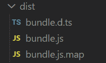
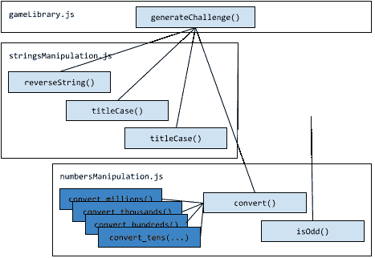
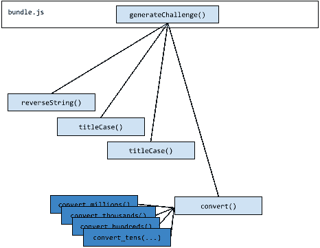

# 使用 Rollup 为 TypeScript 和 JavaScript 打包一个库

> 原文：<https://blog.logrocket.com/using-rollup-package-library-typescript-javascript/>

清理代码库是编写可靠代码的基本步骤。当必须为不同的技术平台编译相同的代码时，这个过程可能特别复杂。现代 web 开发就是一个很好的例子。

如今，即使只有一台服务器提供简单的 API，您仍然可能处理数十种不同的较小功能。这很快就会变得令人困惑，但幸运的是，有一些过程和工具可以让我们的生活变得更容易。

在本文中，我们将讨论 Rollup 的使用。Rollup 是一个模块捆绑器，旨在帮助您将全新库的所有功能收集到一个捆绑包中。

Rollup 背后的想法是通过让您专注于功能来简化开发，而 Rollup 准备包并以最有效的方式包装它——无论是后端应用程序的库还是浏览器的模块。

## 什么是 Rollup？

根据 [Rollup 的官方文档](https://rollupjs.org/guide/en/#overview)，“Rollup 是 JavaScript 的一个模块捆绑器，它将小段代码编译成更大更复杂的东西，比如一个库或应用程序。”

这是设计新图书馆的一个有趣的姿态，与 21 世纪初常见的长时间设计相比，这是一个进步。那时，你需要设计你的函数和对象，然后将它们捆绑到一个模块中。这将使界面同质化，并让它们容易地集成到运行的地方或平台中。

Rollup 的特别之处在于它能够保持文件较小。它通过两种方式实现这一点:首先是因为 Rollup 基于 es 模块(比 CommonJS 模块更有效)；其次，因为它从生成的包中删除了未使用的代码。

## 使用演示库的示例

为了证明 Rollup 的效率，我们将使用一个演示库。挑战(我们当然会赢)是拥有完全相同的代码库，然后通过 TypeScript 和 JavaScript 编译和使用它。

### 设置演示库

我们将在这个演示中使用的小演示库是两组函数的并置，一组用于字符串，另一组用于数字。我在 GitHub 上组装了一个库，为您节省了一些设置，[在这里找到](https://github.com/rosdec/rollingup)。

总的想法是在名为`numbersManipulation.js`和`stringsManipulation.js`的文件中收集完全相同的基本函数(你可以在`/src`目录中找到它们)。

我们打算使用的函数收集在另一个文件`gameLibrary.js`中。这个文件正是我们打算在应用程序中使用的文件。

其想法是模仿 Rollup 的方式，将来自不同库的功能捆绑在一起。

在继续之前，让我们设置并运行项目，以检查一切都工作正常。首先，运行`npm i` (如果您愿意，也可以使用`yarn`)下载所有的包。

现在，您已经准备好使用`npm run test`来执行测试脚本，它将编译这个包并运行应用程序的两个版本:JavaScript ( `appJS.js`)版本和 TypeScript 版本(`appTS.ts`)。

执行的输出，如下所示，将简单地执行两个脚本，`appJS.js`和`appTS.ts`。两个脚本使用相同的代码库，库`/src/gameLibrary.js`，它将为 Rollup 生成的`bundle.js`文件做出贡献。


### 在汇总中使用两种语言

让我们看看`/src`目录包含的存储库。如前所述，我们打算在应用程序中使用的库和在`package.json`中包含的脚本`build`中执行的命令`rollup -c`，将读取`rollup.configuration.js`并在`/dist`目录中组装包。

让我们考虑这样一个目录的内容:



第一个文件是`d.ts`声明文件，它描述了 TypeScript 的现有 JavaScript 代码库的形状。

第二个文件`bundle.js`，是最有趣的一个。这是我们使用 Rollup 创建的包。

第三个文件是`.map`，用于跟踪原始源代码，以防我们想要缩小包。

现在，我们将简要讨论摇树过程是如何工作的。

### 摇树过程

树抖动是 Rollup 中的一个重要特性。[树抖动允许创建一个包含最少功能的包](https://blog.logrocket.com/tree-shaking-and-code-splitting-in-webpack/),保持代码更轻更快。



上图中可以看到通过对代码的静态分析推导出来的函数调用树。函数被枚举，它们与我们将要使用的代码的相关性被追踪。

在这个分析之后，通过收集和并列相关的函数来组装这个包。你可以在下面的照片中看到包含除了`isOdd()`以外的所有函数的`bundle.js`文件的结果。`isOdd()`被丢弃，因为它没有链接到任何代码。



打个比方，函数`isOdd()`因为没有连接到任何分支，所以通过摇动依赖关系树而倒下。

另一个有趣的细节显示在深蓝色块中。这些函数没有在包中显式导出，而是由`convert()`函数使用。不出所料，你会在`bundle.js`中找到它们，浅蓝色块在它们自己的文件中被显式导出。

一般来说，当您的项目需要许多第三方库和框架，每个都有几十个可用的函数和方法时，树抖动是有效的。

### 装饰图书馆

通过执行`rollup.config.js`创建包。这描述了根据输入文件和插件创建包所要执行的操作。

```
import dts from 'rollup-plugin-dts'
import esbuild from 'rollup-plugin-esbuild'

export default [
  {
    input: `src/gameLibrary.js`,
    plugins: [esbuild()],
    output: [
      {
        file: `dist/bundle.js`,
        format: 'cjs',
        sourcemap: true,
        exports: 'default',
      },
    ]
  },
  {
    input: `src/gameLibrary.js`,
    plugins: [dts()],
    output: {
      file: `dist/bundle.d.ts`,
      format: 'es',
    },
  }
]

```

在上面的代码中，你可以看到我的 GitHub 资源库 中的 [配置文件。我们来讨论一下这个，了解一下神奇发生在哪里。](https://github.com/rosdec/rollingup/blob/main/rollup.config.js)

该文件指示 Rollup 执行两个操作:使用第 7 行的`[esbuild plugin](https://www.npmjs.com/package/rollup-plugin-esbuild)`组装包，并使用第 19 行的`dts`插件生成`d.ts`文件。这两个步骤都将在同一个输入文件`/src/gameLibrary.js`上执行，如第 6 行和第 18 行所示。

文件`/src/gameLibrary.js`是依赖关系树的根，它将在包创建过程中被“动摇”。

`esbuild`插件将生成一个 CommonJS 包，如第 11 行所示，以及第 12 行的值所请求的一个源映射(我们在上一节看到的`.map`文件)。值得注意的是，汇总配置文件的一般结构导出一组插件，每个插件都有自己的配置。

你可以查看[这个库](https://github.com/rollup/plugins)以获得可用插件的完整列表。

## Rollup 与其他捆扎机相比如何？

就在我发表了关于 Rollup 以及它在我缺乏经验的眼中看起来有多酷的帖子后，我偶然发现了[这篇有趣的文章](https://web.dev/reduce-javascript-payloads-with-tree-shaking/),这篇文章稍微深入了一下使 Rollup 如此独特的树摇动的整个概念。

树抖动是在向执行环境交付代码的过程中移除未使用的代码的方法。在 web 应用程序的上下文中，这意味着在浏览器中交付实际计算中涉及的确切数量的代码。

相对于其他捆绑器(例如 Webpack ),树抖动算法在 Rollups 中的有效性相当有效，正如这篇 [LogRocket 博客文章](https://blog.logrocket.com/does-my-bundle-look-big-in-this/)中所描述的，秘密在于它在处理代码时采用的方法。支持 Rollup 的另一点是允许扩展基本功能的插件生态系统。

在这一点上，我以前对基准测试的热情被激起了，所以我继续寻找更多的比较，并找到了[这篇严谨的博客文章](https://x-team.com/blog/rollup-webpack-parcel-comparison/)，它验证了准备捆绑代码的过程对于交付给客户是多么有效。

将 Rollup 与 Parcel 和 Webpack 4(在配置方面很大程度上与 Webpack 3 兼容)进行比较:结果是，在构建时间方面，Rollup 是构建过程中最快的，但它真正的优势在于配置的简便性以及通过它生成的源映射对调试的支持。

除了基准测试之外，还有一篇来自 LogRocket 的同事的文章[(但请考虑这是 2020 年的文章)，它将 Rollup 与其他竞争对手进行了比较，这次更深入地考虑了捆绑包生产过程的效率。讨论了各种比较，但在我看来，值得注意的是，在产生更轻的包时，汇总是多么有效:](https://blog.logrocket.com/benchmarking-bundlers-2020-rollup-parcel-webpack/)


对这些比较的总体感觉是，Rollup 似乎更高效(就构建时间而言)和有效(就包的大小而言)；它还有一个蓬勃发展的插件生态系统，似乎受到了社区的良好支持。

## 结论

在这篇文章中，我们展示了如何使用 Rollup 框架来统一来自不同函数库的代码，以及如何生成一个在两种不同语言中使用的有效包。

在我看来，Rollup 可以用于任何可能在不同的上下文、语言或平台中使用的项目。它为您可能需要的调整提供了一个界面，无论是大的还是小的，允许您关注您实际生成的代码的大小。

## 您是否添加了新的 JS 库来提高性能或构建新特性？如果他们反其道而行之呢？

毫无疑问，前端变得越来越复杂。当您向应用程序添加新的 JavaScript 库和其他依赖项时，您将需要更多的可见性，以确保您的用户不会遇到未知的问题。

LogRocket 是一个前端应用程序监控解决方案，可以让您回放 JavaScript 错误，就像它们发生在您自己的浏览器中一样，这样您就可以更有效地对错误做出反应。

[](https://lp.logrocket.com/blg/javascript-signup)[https://logrocket.com/signup/](https://lp.logrocket.com/blg/javascript-signup)

[LogRocket](https://lp.logrocket.com/blg/javascript-signup) 可以与任何应用程序完美配合，不管是什么框架，并且有插件可以记录来自 Redux、Vuex 和@ngrx/store 的额外上下文。您可以汇总并报告问题发生时应用程序的状态，而不是猜测问题发生的原因。LogRocket 还可以监控应用的性能，报告客户端 CPU 负载、客户端内存使用等指标。

自信地构建— [开始免费监控](https://lp.logrocket.com/blg/javascript-signup)。