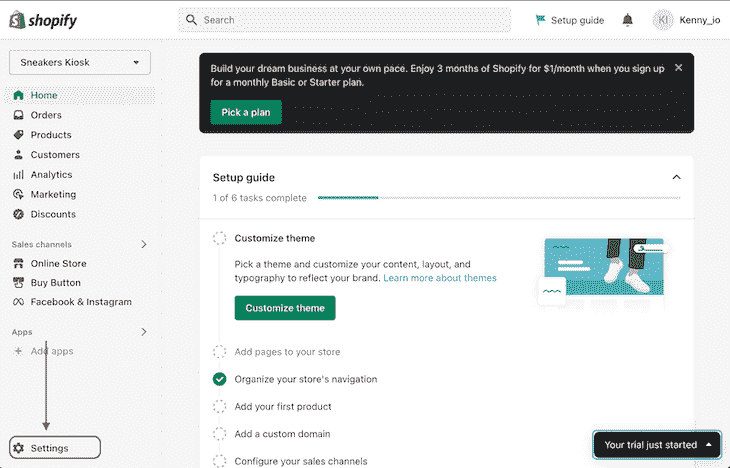
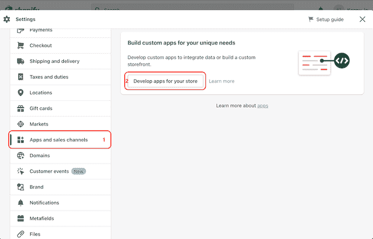
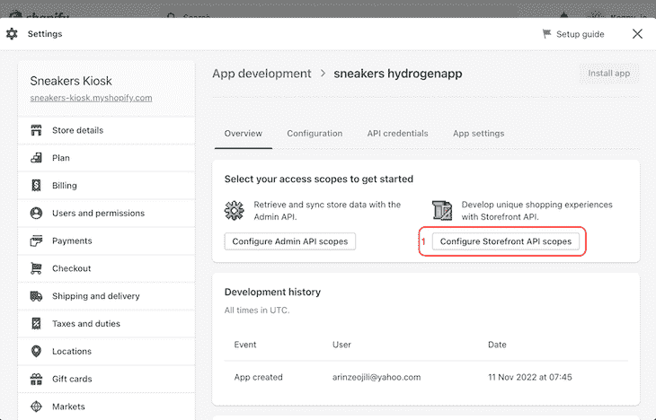
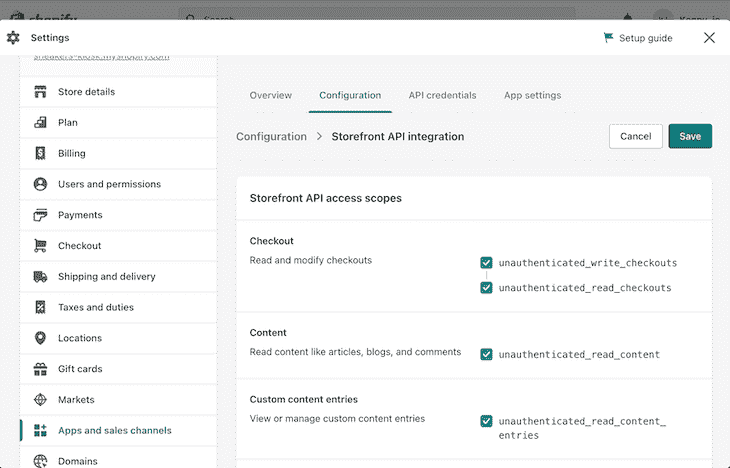
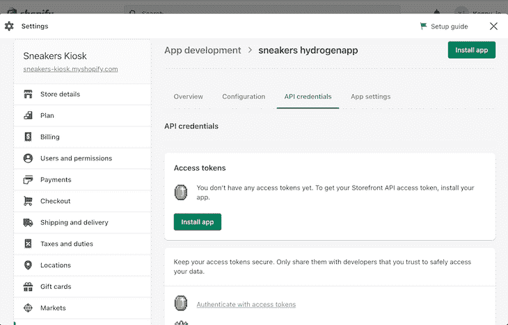
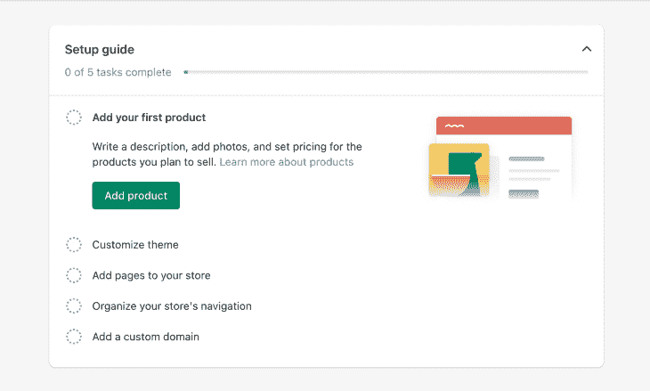
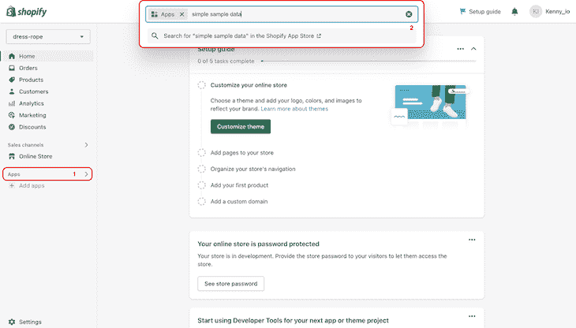
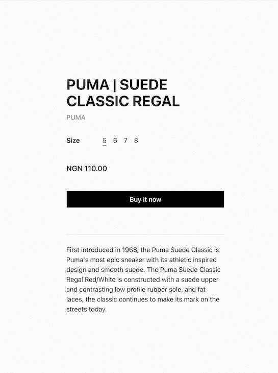

# 使用 Shopify Hydrogen 构建现代电子商务店面

> 原文：<https://blog.logrocket.com/using-shopify-hydrogen-build-modern-ecommerce-storefronts/>

2022 年，Shopify 发布了一个名为 Hydrogen 的无头商务电子商务堆栈。Hydrogen 的创新技术在保持高性能的同时，让购物体验变得格外动感。

这个新框架有一个快速启动的构建环境、智能缓存、开箱即用的组件和内置的缓存默认值，所以电子商务开发人员对此感到兴奋也就不足为奇了。

在这篇文章中，我们将讨论如何用 Shopify Hydrogen 和 Shopify 的 Storefront API 建立一个现代的电子商务商店。

向前跳:

作为本教程的先决条件，你应该对 [React](https://reactjs.org/) 、 [Vite](https://vitejs.dev/) 和 [Tailwind CSS](https://tailwindcss.com/) 有一个基本的了解，以及一个活跃的 Shopify 商店。

## Shopify Hydrogen 入门

[Hydrogen 是一个使用](https://shopify.dev/custom-storefronts/hydrogen) [Vite 进行服务器端渲染的 React 框架](https://blog.logrocket.com/fastify-vite-serving-vite-ssr-hydration/)和一个构建在 Shopify storefront API 之上的水合中间件。这意味着它使用来自 Shopify 的数据来创建一个交互式前端应用程序。

要开始使用 Shopify Hydrogen，[登录 Shopify](https://accounts.shopify.com/store-login) 并创建一个 Shopify 商店(如果您还没有)。我把我的运动鞋叫做售货亭。

接下来，单击页面左下方的“设置”图标:



导航至“应用和销售渠道”选项卡，点击“为你的商店开发应用”按钮，创建自定义应用:



创建自定义应用程序后，单击“配置 Storefront API 范围”按钮来配置应用程序的 storefront API 令牌:



在商店配置页面上，我们将保存我们的配置，如下所示:



成功保存配置后，我们将导航至“API 凭据”选项卡。在那里，我们将看到一个在我们的商店上安装应用程序的选项:



在下一个屏幕上，我们将看到我们的访问令牌。复制并保存这些代币，我们稍后将使用它们与我们的 Shopify 商店互动。

## 向我们的商店添加产品

随着商店的建立，我们现在可以上传我们的产品。有两种方法可以做到这一点。

首先，我们可以手动将单个产品上传到我们的商店，如下所示:



其次，我们可以安装来自 Shopify 商店的简单样本数据,为店面生成虚拟数据。导航到菜单栏的“应用程序”选项卡，搜索“简单示例数据”:



选择应用程序，然后点按按钮进行安装。然后，选择一个产品类别和我们想要生成的集合。最后，单击“生成”按钮，用所选产品填充商店。这样，我们的商店就准备好了。

## 在我们的开发环境中安装氢气

运行以下命令，安装带有一些`hello-world`文本的 Hydrogen starter 应用程序:

```
yarn create @shopify/hydrogen --template hello-world

```

接下来，让我们用以下代码片段将我们的 Shopify 商店连接到`hydrogen.config.js`文件中的 Hydrogen 应用程序:

```
// hydrogen.config.js
import { defineConfig } from "@shopify/hydrogen/config";
export default defineConfig({
  shopify: {
    storeDomain: "<your store url>", //without the "https://" part
    storefrontToken: "<your generated access token>",
    storefrontApiVersion: "2022-07",
  },
});

```

有了上面的代码片段，我们现在可以在本地访问我们的商店数据了。

## 获取和展示产品

现在，让我们将虚拟产品引入氢气应用。创建一个`components`文件夹，并在其中创建一个`FeaturedProducts.server.jsx`文件。用以下代码片段更新文件:

```
// src/components/FeaturedProducts.server.jsx
import { Image, Link, gql, useShopQuery, CacheLong } from "@shopify/hydrogen";

const QUERY = gql`
  query Home {
    products(first: 3) {
      nodes {
        id
        title
        handle
        featuredImage {
          height
          width
          altText
          URL
        }
      }
    }
  }
`;

export default function FeaturedProducts() {
  const {
    data: { products },
  } = useShopQuery({
    query: QUERY,
    cache: CacheLong(),
  });
  // return() function here
}

```

在上面的代码片段中，我们从`@shopify/hydrogen`导入了`useQuery`和`gql`。我们还构造了一个`QUERY`常量，它将获取前三个产品及其属性。最后，我们通过将`QUERY`常量传递到`useShopQuery`来从商店中获取产品，并析构响应。

在`FeaturedProducts.server.jsx`文件中，让我们通过用以下代码片段更新`return()`函数来显示提取的产品:

```
// src/components/FeaturedProducts.server.jsx

export default function FeaturedProducts() {
  // Define data and QUERY constants
  return (
    <>
      <h1>Featured Products</h1>
      <div>
        {products &&
          products.nodes.map((prod, index) => (
            <div key={index}>
              <div className="p-2">
                <Link to={`/product/${prod.handle}`} className="">
                  <Image
                    width={prod.featuredImage.width}
                    height={prod.featuredImage.height}
                    src={prod.featuredImage.url}
                    alt={`Image of ${prod.featuredImage.alttext}`}
                  />
                </Link>
              </div>
              <div>
                <Link to={`/product/${prod.handle}`}>
                  <h3 className="font-medium">{prod.title}</h3>
                </Link>
              </div>
            </div>
          ))}
      </div>
    </>
  );
}

```

在这里，我们循环遍历产品，[有条件地呈现它们](https://blog.logrocket.com/react-conditional-rendering-9-methods/)。

接下来，让我们导入并渲染`src/routes/index.server.jsx`文件中的`FeaturedProducts.server.jsx`组件:

```
// src/routes/index.server.jsx

import { Suspense } from "react";
import Hero from "../components/Hero.server";
import { Layout } from "../components/Layout.server";
import FeaturedProducts from "../components/FeaturedProducts.server";

export default function Home() {
  return (
    <Layout>
      <Suspense>
        <Hero />
        <FeaturedProducts />
      </Suspense>
    </Layout>
  );
}

```

在浏览器中，该应用程序将类似于下图:


根据您在设置简单示例数据时选择的产品类别和集合，您可能会看到不同的特色产品。

接下来，创建一个产品展示页面。在 components 文件夹中，让我们用下面的代码片段创建一个`ProductDetails.client.jsx`文件:

```
// src/components/ProductDetails.jsx
import { ProductOptionsProvider } from "@shopify/hydrogen";
export default function ProductDetails({ product }) {
  return (
    <ProductOptionsProvider data={product}>
      <section>
        <div>
          <div>
            <div>{/* product gallery here */}</div>
          </div>
          <div>
            <div>
              <h1>{product.title}</h1>
              <span>{product.vendor}</span>
            </div>
            {/* Product form here */}
            <div>
              <div
                dangerouslySetInnerHTML={{ __html: product.descriptionHtml }}
              ></div>
            </div>
          </div>
        </div>
      </section>
    </ProductOptionsProvider>
  );
}

```

在上面的代码片段中，我们从`@shopify/hydrogen`导入了`ProductOptionsProvider`，创建了`ProductDetails()`函数，并将`product`作为道具传递给它。我们还用`ProductOptionsProvider`包装了我们的标记。

接下来，让我们更新`ProductDetails.jsx`文件，用以下代码片段显示产品图像:

```
// src/components/ProductDetails.jsx
import { MediaFile } from "@shopify/hydrogen";

export default function ProductDetails({ product }) {
  return <div>product gallery</div>;
}

function ProductGallery({ media }) {
  if (!media.length) {
    return null;
  }
  return (
    <div>
      {media.map((med, i) => {
        let extraProps = {};
        if (med.mediaContentType === "MODEL_3D") {
          extraProps = {
            interactionPromptThreshold: "0",
            ar: true,
            loading: "eager",
            disableZoom: true,
          };
        }
        const data = {
          ...med,
          image: {
            ...med.image,
            altText: med.alt || "Product image",
          },
        };
        return (
          <div>
            <MediaFile
              tabIndex="0"
              data={data}
              options={{
                crop: "center",
              }}
              {...extraProps}
            />
          </div>
        );
      })}
    </div>
  );
}

```

在上面的代码片段中，我们从`@shopify/hydrogen`导入了`MediaFile`并创建了`ProductGallery()`函数，该函数接收媒体文件并使用 Shopify 的内置媒体处理程序`MediaFile`根据它们的媒体类型呈现它们。

接下来，在`ProductDetails`组件中呈现`ProductGallery`,以显示不同的产品图像变量:

```
// src/components/ProductDetails.jsx

export default function ProductDetails({ product }) {
  return (
    <ProductGallery />
  )
}

```

在浏览器中，这应该类似于以下内容:


接下来，用下面的代码片段创建一个`form`来处理用户的产品选择:

```
// src/components/ProductDetails.jsx

import { ProductPrice, BuyNowButton } from "@shopify/hydrogen";
function ProductForm({ product }) {
  const { options, selectedVariant } = useProductOptions();
  const isOutOfStock = !selectedVariant?.availableForSale || false;
  return (
    <form>
      {
        <div>
          {options.map(({ name, values }) => {
            if (values.length === 1) {
              return null;
            }
            return (
              <div key={name}>
                <legend>{name}</legend>
                <div>{/* OptionRadio goes below this line */}</div>
              </div>
            );
          })}
        </div>
      }
      <div>
        <ProductPrice
          priceType="compareAt"
          variantId={selectedVariant.id}
          data={product}
        />
        <ProductPrice variantId={selectedVariant.id} data={product} />
      </div>
      <div>
        {isOutOfStock ? (
          <span>Available in 2-3 weeks</span>
        ) : (
          <BuyNowButton variantId={selectedVariant.id}>
            <span>Buy it now</span>
          </BuyNowButton>
        )}
      </div>
    </form>
  );
}

```

上面的代码片段在产品图库旁边显示了一个带有产品价格和“立即购买”按钮的表单。该表单将如下所示:



正如您在表格中看到的，产品可以有多种不同的尺寸。因此，我们需要添加一个组件来处理产品变量。为此，在`components/ProductDetails.jsx`文件中定义一个新的`OptionRadio()`函数，如下所示:

```
// src/components/ProductDetails.jsx

import { useProductOptions } from "@shopify/hydrogen";
function OptionRadio({ values, name }) {
  const { selectedOptions, setSelectedOption } = useProductOptions();
  return (
    <>
      {values.map((value) => {
        const checked = selectedOptions[name] === value;
        const id = `option-${name}-${value}`;
        return (
          <label key={id} htmlFor={id}>
            <input
              type="radio"
              id={id}
              name={`option[${name}]`}
              value={value}
              checked={checked}
              onChange={() => setSelectedOption(name, value)}
            />
            <div>{value}</div>
          </label>
        );
      })}
    </>
  );
}

```

在上面的代码片段中，我们从`@shopify/hydrogen`导入了`useProductOptions`钩子。然后我们创建一个名为`OptionRadio`的函数，它有两个属性`name`和`values`。

此外，我们从`useProductOptions`钩子中析构了`selectedOptions`和`setSelectedOption`。最后，我们返回了一个显示`values`数组中每个`value`的标记，并将`OptionsRadio`导入到我们的`ProductForm`组件中。

## 处理单个产品的动态路由

最后，让我们在`/src/routes`目录中创建一个`product`文件夹。然后，我们将创建一个名为`/[handle].server.jsx`的文件来处理单个产品的动态路线。将以下代码片段添加到文件中:

```
// src/routes/[handle].server.jsx
import { Layout } from "../../components/Layout.server";
import { gql } from "@shopify/hydrogen";

export default function Product({ params }) {
  return <Layout>/* Product Display component goes here */</Layout>;
}

const PRODUCT_QUERY = gql`
  fragment MediaFields on Media {
    mediaContentType
    alt
    previewImage {
      url
    }
    ... on MediaImage {
      id
      image {
        url
        width
        height
      }
    }
    ... on Video {
      id
      sources {
        mimeType
        url
      }
    }
    ... on Model3d {
      id
      sources {
        mimeType
        url
      }
    }
    ... on ExternalVideo {
      id
      embedUrl
      host
    }
  }
  /* Products fetch by handle query goes here */
`;

```

上面的代码片段[包含一个 GraphQL 查询](https://blog.logrocket.com/graphql-queries-in-simple-terms/)，它根据媒体的类型从`MediaFields`中检索媒体。接下来，让我们添加一个新的查询，通过句柄动态获取产品，如下所示:

```
// src/routes/product/[handle].server.jsx

query Product($handle: String!) {
    product(handle: $handle) {
      id
      title
      vendor
      descriptionHtml
      media(first: 7) {
        nodes {
          ...MediaFields
        }
      }
      variants(first: 100) {
        nodes {
          id
          availableForSale
          compareAtPriceV2 {
            amount
            currencyCode
          }
          selectedOptions {
            name
            value
          }
          image {
            id
            url
            altText
            width
            height
          }
          priceV2 {
            amount
            currencyCode
          }
          sku
          title
          unitPrice {
            amount
            currencyCode
          }
        }
      }
    }
  }

```

上面的代码片段使用作为参数传递的`handle`动态获取用户选择的产品及其价格和变体。

最后，我们现在可以使用 Shopify 的`useShopQuery`钩子获取这个查询，并通过添加以下代码片段来呈现页面:

```
// src/routes/[handle].server.jsx

import { useShopQuery, useRouteParams } from "@shopify/hydrogen";
import { Layout } from "../../components/Layout.server";
import ProductDetails from "../../components/ProductDetails.client";
export default function Product({ params }) {
  const { handle } = useRouteParams();
  const {
    data: { product },
  } = useShopQuery({
    query: PRODUCT_QUERY,
    variables: {
      handle,
    },
  });
  return (
    <Layout>
      <ProductDetails product={product} />
    </Layout>
  );
}

```

在上面的代码片段中，我们从`@shopify/hydrogen`导入了`useShopQuery`和`useRouteParams`，以及从`/components`目录导入了`ProductDetails`。我们还从`useRouteParams`钩子中析构了我们的句柄变量。

此外，我们将 GraphQL 产品查询传递到`useShopQuery`钩子中，并从数据对象中析构产品。最后，我们通过`products`作为我们的`ProductDetails`组件的道具。

现在，我们可以成功地动态导航到我们产品的各个页面，如下所示:


## 使用 Netlify 部署我们的店面

最后，让我们将氢气店面部署到 [Netlify](https://app.netlify.com) 。为了实现这一点，我们将首先安装以下软件包作为`devDependency`:

```
yarn add @netlify/hydrogen-platform -D

```

接下来，我们将更新我们的 Vite 配置。将下面的代码片段添加到我们的`vite.config.js`文件中:

```
// vite.config,js
import netlifyPlugin from '@netlify/hydrogen-platform/plugin'
export default defineConfig({
  plugins: [hydrogen(), netlifyPlugin()],
});

```

接下来，我们将提交我们的代码库，并将其推送到 GitHub。从那里，我们可以利用 Netlify 的 CI/CD 工作流来部署站点。你可以在 Netlify 上[访问已部署的站点，在 GitHub](https://kicks-store.netlify.app) 上[查看源代码。](https://github.com/yhuakim/kicks-stores)

## 结论

本教程探讨了如何使用 Hydrogen——Shopify 最近发布的无头商务框架——来构建现代店面。要了解更多关于氢的工作原理，请查看 Shopify 开发文档。

Hydrogen 的创新技术在保持高性能的同时，让购物体验变得格外动感。如果你是众多使用 Shopify 构建店面的开发者之一，我希望这篇教程对你有用。

## [LogRocket](https://lp.logrocket.com/blg/ecommerce-signup) :看看用户为什么不完成你的电子商务流程中的一个步骤的技术和 UX 原因。

[](https://lp.logrocket.com/blg/ecommerce-signup)

LogRocket 就像是一个网络和移动应用程序和网站的 DVR，记录你的电子商务应用程序上发生的一切。LogRocket 没有猜测用户不转化的原因，而是主动揭示了阻止你转化的根本原因，比如 JavaScript 错误或死点击。LogRocket 还可以监控应用的性能，报告客户端 CPU 负载、客户端内存使用等指标。

开始主动监控您的电子商务应用程序— [免费试用](https://lp.logrocket.com/blg/ecommerce-signup)。