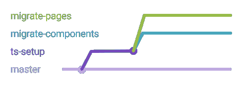
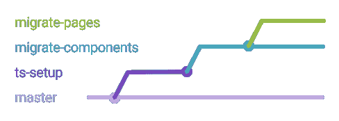
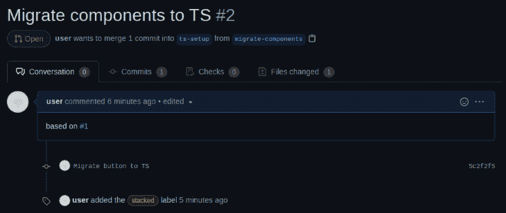

# 在 GitHub 中使用堆叠拉取请求

> 原文：<https://blog.logrocket.com/using-stacked-pull-requests-in-github/>

当在团队中工作时，代码评审是最困难和最复杂的过程之一。要回顾一个大的拉式请求(PR)，你需要时间和背景，以及精力来分析和保持你的精神界限。

然而，对于小的 PRs 来说就不一样了，在那里考虑改变和建议我们自己的改变要容易得多。那么，我们如何在避免让我们的队友认知超载的同时引入大的变化呢？这就是堆叠拉取请求发挥作用的地方。

在本文中，我们将介绍什么是堆叠拉请求，何时以及如何使用它们，以及如何将单片 PR 转换为堆叠 PR。

## 什么是堆叠拉取请求？

堆叠 PRs 也称为从属、增量或链式 PRs，是从其他拉请求分支的拉请求。用`git`的术语来说，它们是从其他特征分支中检查出来的特征分支，以构建小而连贯的单元来表示变化。

当使用堆叠的 PRs 时，将您的分支视为类似于 git 提交的代码更改组织层是很有帮助的。您可以选择将所有的更改作为一个大的提交，或者将代码组织成单独的提交。多次提交是更好的做法。那么，对你的树枝做同样的事情有什么好处呢？

## 何时以及为什么应该使用堆叠式钻杆排放系统？

**TL；博士:**

*   要分割大尺寸 PRs
*   在多个特性分支之间共享一段代码
*   为了便于两个人使用同一个功能

如前所述，当想要分割大的拉取请求时，堆叠的 PRs 是有用的。堆叠 PRs 真正出色的另一种情况是当您想要在两个或更多分支中使用特定的变更时。

例如，想象一下，想要将一个代码库迁移到 TypeScript，您在 TS 中重写页面，而您的团队成员重写组件。TypeScript 设置(依赖安装，`tsconfig.json`等)。)必须在你们两个之间共享，要么通过急切地将设置提交给`master`(或`develop`)分支，要么通过将你们的 PRs 堆叠在`ts-setup`特征分支的顶部。



这将允许两个分支`migrate-pages`和`migrate-components`以类似于`master`的关系与`ts-setup`分支共享类型脚本配置。这意味着如果`ts-setup`发生变化，`migrate-pages`将不得不合并或重定`ts-setup`的基础。

如果页面迁移依赖于组件迁移，您可以进一步堆叠分支。



当两个人试图在同一个特性上合作时，这尤其方便。堆叠两个分支比在同一个分支上工作更容易处理。

## 如何堆叠拉取请求

要堆叠两个 PRs，请从您的基础`master`(或`develop`)检查第一个分支，并推送您的更改。

```
$ git status # we are on master
On branch master

$ git checkout -b ts-setup # checkout from master
$ npm i -D typescript && npx tsc --init
$ git add . && git commit -m 'Setup TypeScript'
$ git push -u origin ts-setup

```

在您的 GitHub 存储库中，会提示您从`ts-setup`创建一个拉请求:


创建基础为`master`的 PR。


然后，从第一个分支中取出第二个分支。

```
$ git status
On branch ts-setup

$ git checkout -b migrate-components # checkout from ts-setup
$ mv components/Button.jsx components/Button.tsx
$ git add . && git commit -m 'Migrate button to TS'
$ git push -u origin migrate-components

```

这有效地将`ts-setup`和`migrate-components`转变为准备成为堆叠 PRs 的堆叠分支。


请注意，虽然`master`被设置为 PR 的基础，但是来自`ts-setup`(“Setup TypeScript”提交)的更改仍然存在，并且我们的提交计数为 2。


将基本分支更改为`ts-setup`会删除重叠的提交，使我们的提交计数仅为 1。


确保清楚地说明一份公关是堆叠在另一份之上的。一个标签可能也有帮助。



最糟糕的情况是有人合并了一个 PR，拉动`master`，没有发现变化，并感到困惑，这就引出了一个问题，你如何合并堆叠的 PR？

## 如何合并堆叠拉式请求

### 挤压、合并还是重设基础？

使用堆叠的 PRs 时，对合并的唯一限制是不能“挤压并合并”或“重设基础并合并”你必须直接合并。此限制不适用于给定 PR 链上的最后一个 PR。

这是由于 git 的历史是如何工作的。Git 通过提交散列跟踪提交的变化。如果您还记得的话，将基数从`master`改为`ts-setup`去掉了`ts-setup`和`migrate-components`之间的共同提交。

Git 知道这样做，因为它在两个分支上看到了具有相同元数据的提交。挤压和重置都覆盖了 Git 的历史(尽管方式不同)，消除了认为两个分支连续的重叠部分。

### 我应该按什么顺序合并？

**TL；医生:**所有的命令都有效。这取决于您希望合并提交在`master`上是什么样子。

我们应该合并或堆叠 PRs 的顺序完全是主观的。如果我们将`ts-setup`与“Setup TypeScript”的 commit 消息合并，并删除 PR 分支，GitHub 将自动选择这个分支，并将我们的`migrate-components` PR 的 base 更改为`master`。


这将使我们有机会通过单独的合并提交消息“将组件迁移到 ts”与 master 合并

或者，我们可以先将`migrate-components`合并到`ts-setup`，然后将`ts-setup`和`master`合并，并向“设置和迁移组件到 ts”的`master`发送一条合并提交消息

## 将现有的大型 PR 拆分为一堆 PR

假设我们试图将一个大的`migrate-to-firebase`分支与`develop`合并。PR 影响了数十个文件，并被证明是难以审查的。为了在本地将它分成多个 pr，我们执行以下操作:

```
$ git checkout migrate-to-firebase
$ git reset --soft develop
$ git restore --staged .

```

首先，我们签出分支，然后取消对所有不存在于`develop`上的变更的提交，而不删除变更本身。这导致所有的变更都按照`git status`所指示的那样被登台，所以我们通过运行`git restore --staged`来取消它们的登台。

您可以通过运行以下命令来重命名分支，以准确描述它实际执行的操作:

```
$ git branch -M setup-firebase

```

然后，您可以开始添加、提交和检查新的分支，形成一个链。

## 在 Gitflow 中使用堆叠 PRs

您在使用 [Gitflow 工作流](https://blog.logrocket.com/the-git-workflow-you-need-how-to-deal-with-multiple-teams-in-a-single-repository-faf5bb17a6e4/)时遇到的一个问题是无法在给定版本中有选择地从`develop`推送特性分支。例如，如果您有一个重新设计，您希望继续工作，但是还没有发布，您可以在父特性分支中确定重新设计的范围，较小的特性分支可以堆叠在父特性分支之上，然后在完成后将父特性分支与`develop`合并。

## 结论

在本文中，我们学习了堆叠的 PRs，为什么以及何时使用它们，以及如何创建和合并它们。我们还讨论了他们如何增强 Gitflow 工作流。感谢阅读！

## 使用 [LogRocket](https://lp.logrocket.com/blg/signup) 消除传统错误报告的干扰

[](https://lp.logrocket.com/blg/signup)

[LogRocket](https://lp.logrocket.com/blg/signup) 是一个数字体验分析解决方案，它可以保护您免受数百个假阳性错误警报的影响，只针对几个真正重要的项目。LogRocket 会告诉您应用程序中实际影响用户的最具影响力的 bug 和 UX 问题。

然后，使用具有深层技术遥测的会话重放来确切地查看用户看到了什么以及是什么导致了问题，就像你在他们身后看一样。

LogRocket 自动聚合客户端错误、JS 异常、前端性能指标和用户交互。然后 LogRocket 使用机器学习来告诉你哪些问题正在影响大多数用户，并提供你需要修复它的上下文。

关注重要的 bug—[今天就试试 LogRocket】。](https://lp.logrocket.com/blg/signup-issue-free)