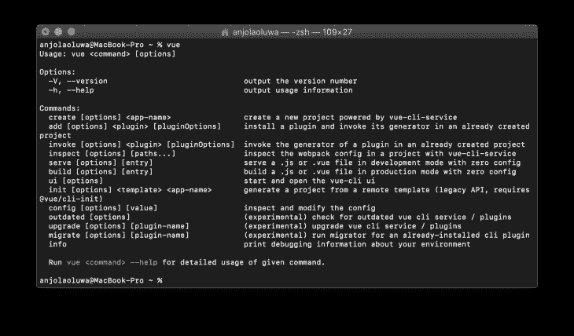
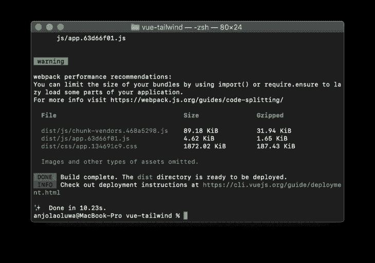
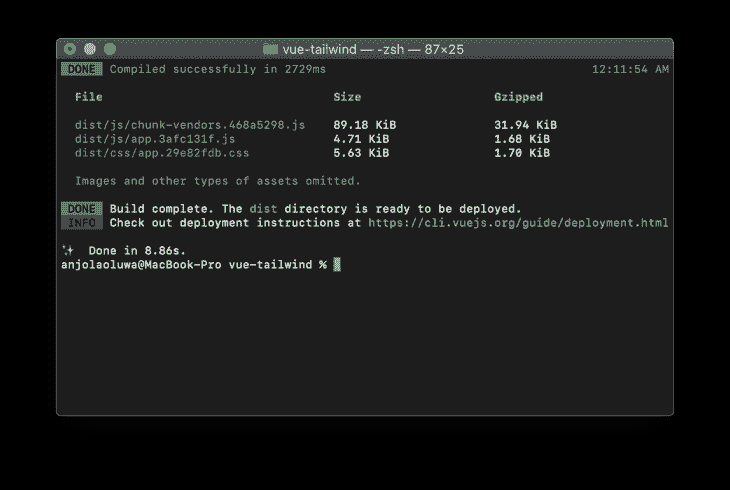
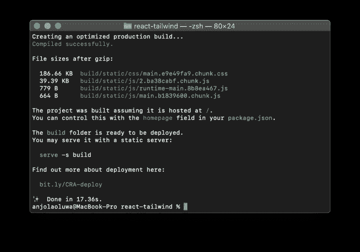
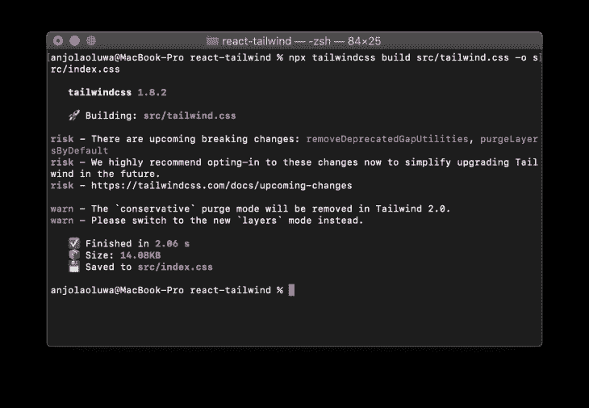

# 在 production 中使用 Tailwind CSS

> 原文：<https://blog.logrocket.com/using-tailwind-css-in-production/>

如今，网络性能是一件非常重要的事情，因为它可以成就或损害你的产品。它已经从一个产品发布后要做的事情变成了任何开发过程中要考虑的一个非常重要的部分，因为网页性能是用户体验的一个重要部分(UX)。

*   根据这项研究，普通在线用户希望你的页面在 4 秒或更短时间内加载，40%的人更有可能在三秒后放弃你的网站
*   这篇[博文](https://medium.com/pinterest-engineering/driving-user-growth-with-performance-improvements-cfc50dafadd7#.wwimdmkpp)展示了如何优化 Pinterest 网站的性能，使搜索引擎优化流量增加了 15%,注册转化率增加了 15%

## 什么是捆绑大小？

为了理解包大小的含义，我们必须理解什么是捆绑。

捆绑是捆绑器(如 webpack、parcel 或 snowpack)将不同组的资源(如 HTML、CSS、JavaScript 和图像)组合在一起以生成一个称为捆绑包的较小文件的过程。为了减少浏览器向用户提供内容所需的 HTTP 请求数量，捆绑是必要的。

捆绑包大小是任何生成的捆绑包的大小，它影响我们的网站和网络应用程序的加载时间。

在本文中，我们将探索如何通过树摇动 Tailwind CSS 来减少我们的 Tailwind CSS 支持的应用程序包的大小，我们还将学习如何在生产中使用 Tailwind 的 [PurgeCSS](https://purgecss.com/) ，我们将探索如何在 Vue 和 React 等 JavaScript 框架中做到这一点。

## 什么是顺风 CSS？

这是一个实用程序优先的 CSS 库，用于构建定制设计，它不提供预配置的样式和组件来构建，而是为您提供一组称为实用程序/助手类的非个性化构建块来帮助您设计组件的样式。

根据其[官方文件](https://tailwindcss.com/docs/what-is-tailwind):

> Tailwind CSS 是一个高度可定制的低级 CSS 框架，它为您提供了构建定制设计所需的所有构件，而没有您必须努力克服的任何恼人的固执己见的风格。

## 什么是 PurgeCSS？

PurgeCSS 是一个开发工作流工具，用于删除项目中未使用的 CSS，它是控制 Tailwind CSS 包大小的默认库。它对未使用的样式进行树抖动，并优化 CSS 构建大小。

根据其官方[文档](https://purgecss.com/):

> PurgeCSS 分析你的内容和你的 CSS 文件。然后，它将文件中使用的选择器与内容文件中的选择器进行匹配。它从你的 CSS 中移除未使用的选择器，产生更小的 CSS 文件。

## 先决条件

本教程假设读者具备以下条件:

您可以使用 Yarn 通过以下命令安装 Vue CLI:

```
yarn global add @vue/cli
```

通过在终端中运行`vue`来验证安装是否成功。您应该会看到可用命令的列表。

## 在 Vue 安装和建造生产顺风装置

全局安装 CLI 包使我们能够在终端中访问`vue`命令，`vue create`命令帮助我们创建一个新项目:



首先，使用命令创建一个新的 Vue 项目:

```
vue create vue-tailwind
```

项目名称“vue-tailwind”可以替换为您认为合适的任何名称。

运行这个命令会给你一个交互式搭建的体验，在这里你可以选择你的应用程序需要的包，你也可以决定将配置保存为你未来项目的预置。

接下来，将目录更改为项目文件夹:

```
cd vue-tailwind
```

接下来，通过运行以下命令之一，在浏览器中启动新创建的应用程序的开发服务器:

```
yarn serve
or
npm run serve

```

运行以下命令后，默认情况下，您的应用程序应该在 [http://localhost:8080](http://localhost:8080/) 上运行:


接下来，我们来安装 Tailwind CSS 库。要使用纱线卷装管理器安装 Tailwind，请键入以下内容:

```
yarn add tailwindcss
```

然后，使用包含在`tailwindcss`包中的 Tailwind CLI 实用程序为您的项目创建一个默认配置文件，这有助于定制您的 Tailwind 安装:

```
npx tailwindcss init
```

这个命令在你的项目的基本目录中创建一个`tailwind.config.js`文件，这个文件包含了 Tailwind 的所有默认配置。

接下来，在`src/assets`文件夹中创建一个`styles`文件夹，然后在文件夹中创建一个`tailwind.css`文件，这是我们将要导入顺风的`base`、`components`和`utilities`样式配置的地方。

使用`@tailwind`指令将 Tailwind 的`base`、`components`和`utility`样式注入你的 CSS 中，将以下内容放入你的`tailwind.css`文件中:

```
@tailwind base;

@tailwind components;

@tailwind utilities;
```

接下来，在项目的根目录下创建一个`postcss.config.js`,包括以下内容:

```
module.exports = {
    plugins: [
        require('tailwindcss'),
        require('autoprefixer')
    ]
}
```

使用 Tailwind CLI 实用工具编译并构建从`tailwind.css`文件生成的样式，运行以下命令:

```
npx tailwindcss build src/assets/styles/tailwind.css -o src/assets/styles/index.css
```

这个命令应该会产生类似这样的结果:


We can see the output size for the development build is 2.26MB uncompressed, now that’s huge.

继续将您的`index.css`文件导入到您的应用程序中，将以下代码行放入您的`App.vue`文件中，如下所示:

```
<style src="./assets/styles/index.css">
```

打开你的`App.vue`，从 tailwind 提供的默认样式中添加一些随机样式到模板中。

我们构建风格的构建步骤可以抽象成一个 npm 脚本，打开你的`package.json`文件，在`scripts`对象中包含一个`style`脚本。

将下面几行代码放在`package.json`文件中:

```
"scripts": {
  "style": "tailwindcss build src/assets/styles/index.css -o src/assets/styles/tailwind.css",
// other scripts
}
```

接下来，让我们构建生产应用程序，我们将使用以下命令:

```
yarn build
```

该命令启动`vue-cli-service build`进程，该进程在`dist/`目录中生成一个生产就绪的超级优化包。

在您的 CLI 中，您应该会看到以下内容:



我们可以看到，对于一个只包含默认样式的应用程序来说，CSS 的构建非常庞大，想象一下我们添加新样式来扩展现有样式的场景。

## 使用 PurgeCSS 减小文件大小

接下来，让我们包括 PurgeCSS 的配置。打开您的`tailwind.config.js`文件，用以下内容替换`module.exports`之间的`purge`数组:

```
purge: {
  enabled: true,
  content: [
     './src/**/*.vue',
    './public/**/*.html',
  ]
},
```

我们所做的是，我们提供了一个路径数组供 PurgeCSS 检查，它遍历指定路径中的文件，然后`purges`数组中提供的所有文件中没有定义的所有类。

运行 Tailwind 实用程序命令来再次构建样式并进行捆绑以用于生产，将会看到 CSS 块大小的显著下降。

运行以下命令:

```
yarn style && yarn build
```



当我们运行生产版本时，我们可以看到 CSS 文件的大小大幅减小，随着大小的减小，我们的应用程序加载速度也有所提高。

## React 中生产的安装和构建顺风

首先，使用 create-react-app 创建一个新项目，在终端中键入以下命令:

```
npx create-react-app react-tailwind
```

create-react-app 是 react 官方构建工具，用于引导和搭建 React 项目。它建立在 [webpack](https://webpack.js.org/) 之上，是一个解决配置和设置项目构建过程的麻烦的工具，让您专注于编写支持您的应用程序的代码。

接下来，将工作目录更改为项目文件夹:

```
cd react-tailwind
```

接下来，在项目中安装 Tailwind CSS:

```
yarn add tailwindcss
```

然后继续使用包含在`tailwindcss`包中的 Tailwind CLI 实用工具初始化项目中的 Tailwind CSS，该帮助工具在项目的基本目录中创建一个`tailwind.config.js`文件，该文件包含所有的 Tailwind 默认配置。若要自定您的顺风装置:

```
npx tailwindcss init
```

接下来，在`/src`文件夹中创建一个`tailwind.css`文件，这是我们导入顺风的`base`、`components`和`utility`风格配置的地方。

使用`@tailwind`指令将 Tailwind 的`base`、`components`和`utility`样式注入你的 CSS 中，将以下内容放入你的`tailwind.css`文件中:

```
@tailwind base;

@tailwind components;

@tailwind utilities;
```

接下来，在项目的根目录下创建一个`postcss.config.js`,包括以下内容:

```
module.exports = {
    plugins: [
        require('tailwindcss'),
        require('autoprefixer')
    ]
}
```

接下来，打开您的`App.js`，从 Tailwind 提供的默认样式中添加一些随机样式到模板中。

然后继续删除您的`index.css`文件的内容，然后使用 Tailwind CLI 实用工具编译并构建从您的`tailwind.css`文件生成的样式到`index.css`文件中，运行以下命令:

```
npx tailwindcss build src/tailwind.css -o src/index.css
```


这个命令应该产生 2.44 MB 的开发版本，这是非常大的。

运行命令:

```
yarn build
```



Bundling our project for production also yields a CSS chunk size of 186.66 KB which is a very big size for an app of this size.

## 使用 PurgeCSS 减小文件大小

接下来，让我们包含 PurgeCSS 的配置，打开您的`tailwind.config.js`文件并在`module.exports`之间包含以下内容:

```
purge: {
    content: [
      'src/**/*.js',
      'src/**/*.jsx',
      'public/**/*.html',
    ]
},
```

我们所做的是，我们提供了一个路径数组供 PurgeCSS 检查，它遍历指定路径中的文件，然后`purges`数组中提供的所有文件中没有定义的所有类。

运行 Tailwind 实用程序命令来再次构建样式并进行捆绑以用于生产，将会看到 CSS 块大小的显著下降。

运行以下命令:

```
npx tailwindcss build src/tailwind.css -o src/index.css && yarn build
```



您应该得到大约 14KB 的开发版本和小于 2KB 的生产版本。


*警告:*你应该只在生产环境中使用 PurgeCSS，在开发过程中清除样式意味着你必须经常重新编译 Tailwind，尤其是在你需要以前的构建中没有用到的实用程序类的情况下。通过在 PurgeCSS 配置中包含`enabled`选项，并将其设置为基于环境进行构建，可以设置启用仅生产清除，在`purge`对象中包含以下内容:

```
enabled: process.env.NODE_ENV === 'production'
```

虽然使用 PurgeCSS 解决了你的大部分大小控制需求，但是另一种减小你的 Tailwind CSS 文件大小的方法是从你的`tailwind.config,.js`文件中移除未使用的样式配置值，例如:

*   从默认调色板中移除未使用的颜色，以仅包含项目中使用的颜色
*   删除未使用的媒体查询断点
*   禁用未使用的实用程序和变体

这些其他的策略极大地改进了我们的 CSS 构建，但是不如使用 purgeCSS 来彻底改变我们未使用的样式有效。

## 结论

在本文中，我们已经看到了如何在 Vue 和 React 中使用 Tailwind CSS，我们还看到了如何根据我们构建的环境来条件化我们的 CSS 样式。您可以在[文档](https://tailwindcss.com/docs/controlling-file-size)中了解更多信息。

## 使用 LogRocket 消除传统反应错误报告的噪音

[LogRocket](https://lp.logrocket.com/blg/react-signup-issue-free)

是一款 React analytics 解决方案，可保护您免受数百个误报错误警报的影响，只针对少数真正重要的项目。LogRocket 告诉您 React 应用程序中实际影响用户的最具影响力的 bug 和 UX 问题。

[ ](https://lp.logrocket.com/blg/react-signup-general) [  ](https://lp.logrocket.com/blg/react-signup-general) [LogRocket](https://lp.logrocket.com/blg/react-signup-issue-free)

自动聚合客户端错误、反应错误边界、还原状态、缓慢的组件加载时间、JS 异常、前端性能指标和用户交互。然后，LogRocket 使用机器学习来通知您影响大多数用户的最具影响力的问题，并提供您修复它所需的上下文。

关注重要的 React bug—[今天就试试 LogRocket】。](https://lp.logrocket.com/blg/react-signup-issue-free)