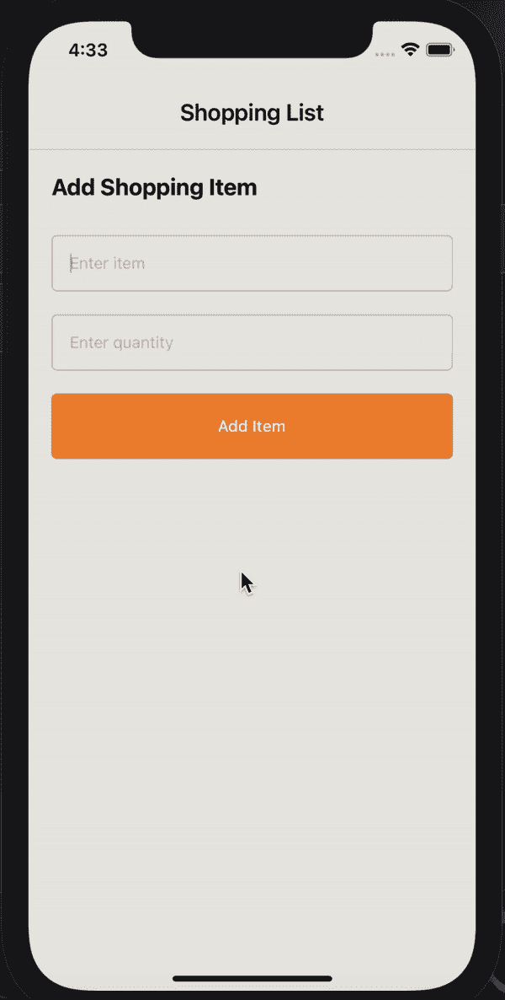

# 将 TypeScript 与 React Native - LogRocket Blog 一起使用

> 原文：<https://blog.logrocket.com/using-typescript-with-react-native/>

毫无疑问，Typescript 已经成为许多开发人员的最爱，随着[在`npm`的每周超过 1900 万次下载](https://www.npmjs.com/package/typescript)，你有可能在三分之二的 JavaScript 相关工作描述中看到 TypeScript。

在本文中，我们将了解如何在 React 本机应用程序中使用 TypeScript。到本文结束时，您将能够充分利用 TypeScript 的优势来最小化错误并为您的应用程序添加类型检查。

## 什么是 TypeScript？

TypeScript 是微软基于 JavaScript 开发的开源语言。您可以将 TypeScript 视为 JavaScript，但是使用静态类型定义。

## 为什么你应该考虑打字稿

如果本文的前两段不足以让您尝试使用 TypeScript，这里还有几个原因:

*   更好的文档:有了明确定义的类型，您可以很容易地知道如何引用代码的其他部分
*   减少错误:TypeScript 可以在执行前验证您的代码，因此节省了您调试“第 23 行未定义的不是函数”的时间💀
*   编译成 JavaScript:因为 TypeScript 是 JavaScript 的超集，所以它编译成 JavaScript，所有有效的 JavaScript 都是有效的 TypeScript
*   易于采用:如果您曾经想要将 TypeScript 添加到您现有的 JavaScript 应用程序中，您可以很容易地从一个文件开始，看看它是如何进行的

## 使用 React Native 和 TypeScript 构建应用程序

现在我们知道了什么是 TypeScript，我们可以开始研究如何在 React 本机应用程序中使用它。

在本教程中，我们将构建一个购物清单应用程序。这是了解 TypeScript 如何在不使事情变得太复杂的情况下改善您的开发人员体验的好方法。

### 要求

*   运行 CLI 命令的基本知识
*   Node.js 和 npm 安装在您的计算机上
*   您机器上安装的 XCode 或 Android Studio
*   JavaScript 的基础知识
*   React 的基础知识
*   React Native 的一些经验(建议，非必需)

### 入门指南

我们开始吧，好吗？在您的终端中运行以下命令:

```
npx react-native init ShoppingList --template react-native-template-typescript

```

上面的命令将使用一个 TypeScript 模板在一个名为`ShoppingList`的文件夹中建立一个新的 React 本地项目，该模板包含所需的依赖项和配置。

要了解如何在现有的应用程序中使用 TypeScript，[请看一下文档](https://reactnative.dev/docs/typescript#adding-typescript-to-an-existing-project)。

### 构建基本用户界面

在代码编辑器中打开文件夹，并运行下面的命令(取决于您的计算机)来启动项目:

```
# MacOS
npm run ios

# Windows/Linux
npm run android

```

`App.tsx`组件是我们应用程序中的根组件。这个组件将包含我们在应用程序中使用的其他组件，我们稍后将回到它。现在，让我们创建我们的第一个组件。

在根目录中创建一个类似于`src/components`的文件夹结构，并在`components`文件夹中创建一个`Header.tsx`组件。

你注意到我们正在创建的文件有一个`.tsx`扩展名吗？这是因为我们现在用 TypeScript 构建，我们需要使用正确的文件扩展名，否则我们将在常规的`.js`文件中得到错误。

将以下代码粘贴到文件中:

```
import React from 'react';
import {View, Text, StyleSheet} from 'react-native';
interface Props {
  title: string;
}
const Header: React.FC<Props> = ({title}) => {
  return (
    <View style={styles.header}>
      <Text style={styles.headerText}>{title}</Text>
    </View>
  );
};
const styles = StyleSheet.create({
  header: {
    paddingVertical: 20,
    borderBottomWidth: 1,
    borderBottomColor: '#cfcfcf',
    alignItems: 'center',
  },
  headerText: {
    fontSize: 20,
    fontWeight: '600',
  },
});
export default Header;

```

如果你已经熟悉 React Native，忽略上面的大部分代码；你会知道我们在这里想做什么。但是，我想提醒您注意第 3-6 行:

```
interface Props {
  title: string;
}
const Header: React.FC<Props> = ({title}) => { /* content here*/}

```

因为我们使用的是 TypeScript，所以我们现在能够定义组件应该接收什么，如何接收，以及接收多少。

在前三行中，我们声明了一个[接口](https://www.typescriptlang.org/docs/handbook/2/objects.html)，它作为我们通常在组件中访问的`props`对象的结构。然而，这一次我们使用 TypeScript 来指定道具及其类型。

这样做的好处是，当我们使用组件时，我们可以获得更好的智能感知和一些验证(例如，当`title`没有传递给组件时，将会有一个即时错误)。

回到`App.tsx`组件，用下面的代码替换内容:

```
import React from 'react';
import {SafeAreaView, StyleSheet, Text, View} from 'react-native';
import Header from './src/components/Header';
const App = () => {
  return (
    <SafeAreaView style={styles.container}>
      <Header />
    </SafeAreaView>
  );
};
const styles = StyleSheet.create({
  container: {
    flex: 1,
    backgroundColor: '#e8e7e3',
  },
});
export default App;

```

您应该注意到在`<Header/>`组件下面有一条红线。如果您将鼠标悬停在它上面，您应该会看到一条消息，提示该组件需要一个没有提供的`title` prop。让我们现在做那件事。

用下面的代码片段替换这一行，您应该会看到错误消失了:

```
<Header title="Shopping List" />

```

如果您试图分配一个数字(或任何其他非字符串数据类型)，您将得到一个不同的错误。这是 TypeScript 试图帮助您在错误发生之前捕捉它们。

### 向列表中添加项目

在您的`/src/components`文件夹中创建一个新组件`AddItem.tsx`，并粘贴以下代码:

```
import React, {useState} from 'react';
import {
  View,
  Text,
  TextInput,
  TouchableOpacity,
  StyleSheet,
} from 'react-native';
export interface IItem {
  item: string;
  quantity: string;
}
const AddItem = () => {
  const [item, setItem] = useState('');
  const [quantity, setQuantity] = useState('');
  return (
    <View>
      <Text style={styles.heading}>Add Shopping Item</Text>
      <View style={styles.form}>
        <TextInput
          style={styles.input}
          placeholder="Enter item"
          value={item}
          onChangeText={text => setItem(text)}
        />
        <TextInput
          style={styles.input}
          placeholder="Enter quantity"
          keyboardType="numeric"
          value={quantity}
          onChangeText={q => {
            setQuantity(q);
          }}
        />
        <TouchableOpacity style={styles.addItemButton} onPress={() => {}}>
          <Text style={styles.buttonText}>Add Item</Text>
        </TouchableOpacity>
      </View>
    </View>
  );
};
const styles = StyleSheet.create({
  heading: {
    fontSize: 20,
    fontWeight: '700',
  },
  form: {
    marginTop: 30,
  },
  input: {
    padding: 15,
    borderColor: 'rgba(0, 0, 0, 0.2)',
    borderWidth: 1,
    borderRadius: 5,
    marginBottom: 20,
  },
  addItemButton: {
    backgroundColor: '#eb8634',
    paddingVertical: 20,
    borderRadius: 5,
    alignItems: 'center',
  },
  buttonText: {color: '#fff', fontWeight: '500'},
});
export default AddItem;

```

注意第 9 行中命名的导出`IItem`？这是我们购物清单中一个项目的结构，我们导出它是因为我们将在其他组件中需要它。

回到`App.tsx`，用下面的代码更新组件:

```
import React, {useState} from 'react';
import {SafeAreaView, StyleSheet, Text, View} from 'react-native';
import Header from './src/components/Header';
import AddItem, {IItem} from './src/components/AddItem'; /* import AddItem and interface*/
const App = () => {
  const [shoppingList, setShoppingList] = useState<IItem[]>([]); // set the type of what the hook expects to be an array of IItems.
  return (
    <SafeAreaView style={styles.container}>
      <Header title="Shopping List" />
      <View style={styles.contentWrapper}>
        <AddItem
          setShoppingList={setShoppingList}
          shoppingList={shoppingList}
        />
      </View>
    </SafeAreaView>
  );
};
const styles = StyleSheet.create({
  container: {
    flex: 1,
    backgroundColor: '#e8e7e3',
  },
  contentWrapper: {
    padding: 20,
  },
});
export default App;

```

现在在`App.tsx`中，我们导入了新的`AddItem`组件和`IItem`接口，这样我们就可以使用(第 6 行上的)`useState`钩子来创建`shoppingList`状态。

我们指定钩子在使用`setShoppingList`函数时应该接受一个`IItem`数组。如果你悬停在`setShoppingList`功能上，你会看到类型。记下它，当我们在`AddItem.tsx`中向购物清单添加商品时，我们很快就会用到它。

返回到`AddItem.tsx`组件，用下面的代码更新它:

```
import React, {useState} from 'react';
import {
  View,
  Text,
  TextInput,
  TouchableOpacity,
  StyleSheet,
  Alert,
} from 'react-native';
export interface IItem {
  item: string;
  quantity: string;
}
interface Props {
  setShoppingList: React.Dispatch<React.SetStateAction<IItem[]>>;
  shoppingList: IItem[];
}
const AddItem: React.FC<Props> = ({shoppingList, setShoppingList}) => {
  const [item, setItem] = useState('');
  const [quantity, setQuantity] = useState('');
  const addItem = () => {
    if (!item) {
      Alert.alert('No Item!', 'You need to enter an item');
    } else {
      setShoppingList([
        ...shoppingList,
        {
          item,
          quantity: quantity || '1',
        },
      ]);
      setItem('');
      setQuantity('');
    }
  };
  return (
    <View>
      <Text style={styles.heading}>Add Shopping Item</Text>
      <View style={styles.form}>
        <TextInput
          style={styles.input}
          placeholder="Enter item"
          value={item}
          onChangeText={text => setItem(text)}
        />
        <TextInput
          style={styles.input}
          placeholder="Enter quantity"
          keyboardType="numeric"
          value={quantity}
          onChangeText={q => {
            setQuantity(q);
          }}
        />
        <TouchableOpacity style={styles.addItemButton} onPress={addItem}>
          <Text style={styles.buttonText}>Add Item</Text>
        </TouchableOpacity>
      </View>
    </View>
  );
};
const styles = StyleSheet.create({
  heading: {
    fontSize: 20,
    fontWeight: '700',
  },
  form: {
    marginTop: 30,
  },
  input: {
    padding: 15,
    borderColor: 'rgba(0, 0, 0, 0.2)',
    borderWidth: 1,
    borderRadius: 5,
    marginBottom: 20,
  },
  addItemButton: {
    backgroundColor: '#eb8634',
    paddingVertical: 20,
    borderRadius: 5,
    alignItems: 'center',
  },
  buttonText: {color: '#fff', fontWeight: '500'},
});
export default AddItem;

```

现在组件有了重大的变化，所以我将带您了解一下。

在第 14 行，我们定义了`Props`接口并设置了每个属性的类型，然后在第 18 行将其设置为我们的功能组件中`props`的类型。

我们还在第 21 行创建了一个处理函数，当单击“Add Item”按钮时，该函数检查字段中是否输入了一个项目，然后调用`setShoppingList()`函数向列表中添加一个新项目。

* * *

### 更多来自 LogRocket 的精彩文章:

* * *

### 列出项目

既然我们能够添加新的条目，那么让我们创建一个组件来列出它们。

在`/src/components`中创建另一个名为`Item.tsx`的文件，并将下面的代码粘贴进去:

```
import React from 'react';
import {View, Text, StyleSheet} from 'react-native';
import {IItem} from './AddItem';
const Item: React.FC<IItem> = ({item, quantity}) => {
  return (
    <View style={styles.item}>
      <Text style={styles.itemName}>{item}</Text>
      <Text style={styles.quantity}>x{quantity}</Text>
    </View>
  );
};
const styles = StyleSheet.create({
  item: {
    padding: 20,
    flexDirection: 'row',
    justifyContent: 'space-between',
    alignItems: 'center',
    borderBottomWidth: 1,
    borderBottomColor: 'rgba(0, 0, 0, 0.2)',
  },
  itemName: {
    fontWeight: '500',
  },
  quantity: {
    padding: 6,
    borderWidth: 1,
    borderColor: 'rgba(0, 0, 0, 0.2)',
    borderRadius: 10,
    overflow: 'hidden',
    backgroundColor: 'rgba(0, 0, 0, 0.05)',
  },
});
export default Item;

```

你可能已经找到窍门了！`Item.tsx`组件接受来自`IItem`的属性作为道具，然后我们用一些样式呈现它们。

现在我们需要通过将组件导入到`App.tsx`中并使用内置的`[FlatList]([https://reactnative.dev/docs/flatlist](https://reactnative.dev/docs/flatlist))`组件列出项目来完成应用程序。

用下面的代码替换`App.tsx`的内容:

```
import React, {useState} from 'react';
import {SafeAreaView, StyleSheet, View, FlatList} from 'react-native';
import Header from './src/components/Header';
import AddItem, {IItem} from './src/components/AddItem';
import Item from './src/components/Item';
const App = () => {
  const [shoppingList, setShoppingList] = useState<IItem[]>([]);
  return (
    <SafeAreaView style={styles.container}>
      <Header title="Shopping List" />
      <View style={styles.contentWrapper}>
        <AddItem
          setShoppingList={setShoppingList}
          shoppingList={shoppingList}
        />
        <FlatList
          data={shoppingList}
          keyExtractor={(item, index) => `${item.item}-${index}`}
          renderItem={({item}) => (
            <Item item={item.item} quantity={item.quantity} />
          )}
        />
      </View>
    </SafeAreaView>
  );
};
const styles = StyleSheet.create({
  container: {
    flex: 1,
    backgroundColor: '#e8e7e3',
  },
  contentWrapper: {
    padding: 20,
  },
});
export default App;

```

我们的应用程序现在已经完成。在第 16 行，我们使用`FlatList`组件来呈现列表中的项目，您可以看到我们如何在`FlatList`的`renderItem`道具中使用`Item`组件。

这是我们新应用的演示:



## 结论

本文旨在简要介绍如何在 React 本机应用程序中受益于 TypeScript 的特性。购物清单应用程序简单到足以向您展示如何使用 TypeScript，而不会使事情变得复杂。

通过实现一个从列表中删除项目的特性，您可以更进一步。

通过[官方文档](https://www.typescriptlang.org/)了解更多关于 TypeScript 的信息，并在这里找到这个[项目的源代码。](https://github.com/edmund1645-demos/react-native-typescript)

## [LogRocket](https://lp.logrocket.com/blg/react-native-signup) :即时重现 React 原生应用中的问题。

[](https://lp.logrocket.com/blg/react-native-signup)

[LogRocket](https://lp.logrocket.com/blg/react-native-signup) 是一款 React 原生监控解决方案，可帮助您即时重现问题、确定 bug 的优先级并了解 React 原生应用的性能。

LogRocket 还可以向你展示用户是如何与你的应用程序互动的，从而帮助你提高转化率和产品使用率。LogRocket 的产品分析功能揭示了用户不完成特定流程或不采用新功能的原因。

开始主动监控您的 React 原生应用— [免费试用 LogRocket】。](https://lp.logrocket.com/blg/react-native-signup)

## [LogRocket](https://lp.logrocket.com/blg/typescript-signup) :全面了解您的网络和移动应用

[](https://lp.logrocket.com/blg/typescript-signup)

LogRocket 是一个前端应用程序监控解决方案，可以让您回放问题，就像问题发生在您自己的浏览器中一样。LogRocket 不需要猜测错误发生的原因，也不需要向用户询问截图和日志转储，而是让您重放会话以快速了解哪里出错了。它可以与任何应用程序完美配合，不管是什么框架，并且有插件可以记录来自 Redux、Vuex 和@ngrx/store 的额外上下文。

除了记录 Redux 操作和状态，LogRocket 还记录控制台日志、JavaScript 错误、堆栈跟踪、带有头+正文的网络请求/响应、浏览器元数据和自定义日志。它还使用 DOM 来记录页面上的 HTML 和 CSS，甚至为最复杂的单页面和移动应用程序重新创建像素级完美视频。

[Try it for free](https://lp.logrocket.com/blg/typescript-signup)

.