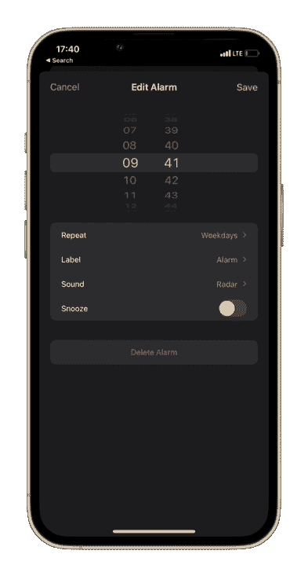
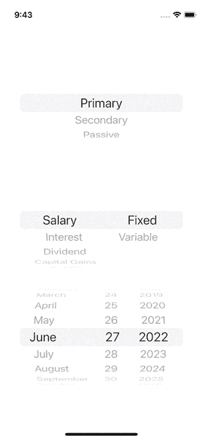

# 在 Swift 表单中使用 UIPickerView-log rocket 博客

> 原文：<https://blog.logrocket.com/using-uipickerview-swift-forms-tutorial/>

向用户提供表单域选项供其选择，而不是要求他们手动输入信息，这可以极大地提高应用程序的可用性。例如注册表单，用户可能需要输入他们的州、国家或出生日期。

在本文中，我们将探索如何使用苹果的`[UIPickerView](https://developer.apple.com/documentation/uikit/uipickerview)`为用户提供一系列以滚轮形式呈现的数据选择。

我们将演示如何将`UIPickerView`添加到 Swift 表单中，以便为用户提供每个字段的选项。

我们开始吧！

*向前跳转:*

## 什么是`UIPickerView`？

`UIPickerView`是`UIView`的子类。这对于使用转轮的 iOS 应用程序很有用，它为用户提供了许多选择。

```
@MainActor class UIPickerView: UIView

```

这种类型的应用程序的一个例子是老虎机，用户旋转轮子来玩游戏。另一个经典的例子是 iOS Clock 应用程序，它使用滚轮来设置闹钟。这个应用使用`UIPickerView`的自定义子类`UIDatePicker`来设置闹钟时间。



Edit screen on an iOS Alarm app.

## 什么是`UIPickerViewDataSource`协议？

`UIPickerViewDataSource`协议有助于为 picker 视图提供组件和行数。我们遵循这个协议来为 picker 视图提供数据源，比如组件的数量和每个组件中的行数，以显示 picker 视图数据。

该协议有两种方法来提供 picker 视图的计数。任何符合`UIPickerViewDataSource`协议的对象都需要实现这两种方法。

第一种方法设置选取器视图应该显示的组件或列的数量:

```
func numberOfComponents(in pickerView: UIPickerView) -> Int

```

在警报屏幕的情况下，我们有两个组件。

第二种方法设置选取器视图应在每个组件中显示的行数:

```
func pickerView(_ pickerView: UIPickerView, 
     numberOfRowsInComponent component: Int) -> Int

```

让我们再次考虑报警屏幕的例子。第一部分(小时)有 24 行，第二部分(分钟)有 60 行。指定的组件是一个零索引号，标识`UIPickerView`的一个组件。组件从左到右编号。所以，第一部分是 0，第二部分是 1。

现在，让我们看看 UIPickerView 的一些主要方法:

## 什么是`UIPickerViewDelegate`协议？

`UIPickerViewDelegate`协议用于为 picker 视图提供要显示的计数。然而，`UIPickerViewDelegate`协议用于为 picker 视图提供构建自身所需的数据。

```
@MainActor protocol UIPickerViewDelegate

```

`UIPickerViewDataSource`协议的方法返回:

*   行尺寸:每个组件的行高和行宽
*   行内容:每行的标题、属性标题或视图
*   行选择:用户在特定组件中选择的行

### 设置行维度

`rowHeightForComponent`方法用于返回 picker 视图在屏幕上绘制内容所需的每个组件的行高:

```
optional func pickerView(_ pickerView: UIPickerView, 
              rowHeightForComponent component: Int) -> CGFloat

```

我们返回一个浮点值，以磅为单位表示行的高度。

类似地，我们有另一个方法，`widthForComponent`来设置每个组件的行宽度:

```
optional func pickerView(_ pickerView: UIPickerView, 
              widthForComponent component: Int) -> CGFloat

```

### 设置行内容

为了给组件的行提供内容，我们必须为每一行实现一个标题、一个属性化的标题或一个视图。

最简单的方法是`titleForRow`，将标题作为字符串提供给每一行，如下所示:

```
optional func pickerView(_ pickerView: UIPickerView, 
              titleForRow row: Int, 
              forComponent component: Int) -> String?

```

这里，我们有一个新的参数行，它是一个零索引数字，标识一个组件的一行。请记住，这些行是从上到下编号的。

为了定制一个基本用例以外的字符串，我们可以创建一个属性化的字符串并使用下面的`attributedTitleForRow`方法:

```
optional func pickerView(_ pickerView: UIPickerView, 
              attributedTitleForRow row: Int, 
              forComponent component: Int) -> NSAttributedString?

```

这将为 picker 视图的各行返回一个样式化的标题。

***N.B.*** *如果我们同时实现这两种方法，picker 视图会优先考虑属性化标题方法；如果它返回一个空值，那么 picker 视图将使用普通的标题来代替*

对于高级定制，我们可以为每一行创建并返回一个完整的`UIView`:

```
optional func pickerView(_ pickerView: UIPickerView, 
              viewForRow row: Int, 
              forComponent component: Int, 
              reusing view: UIView?) -> UIView

```

当 UIView 需要视图用于给定组件中的一行时，它由 picker 视图调用。我们还可以访问以前用于行的视图对象，但是现在被 picker 视图隐藏和缓存了。

我们可以在 picker 视图中使用`UILabel`、`UIImageView`，甚至自定义视图！

* * *

### 更多来自 LogRocket 的精彩文章:

* * *

### 响应行选择

当用户通过点击给定组件中的给定行进行选择时，`UIPickerViewDelegate`调用以下方法:

```
optional func pickerView(_ pickerView: UIPickerView, 
              didSelectRow row: Int, 
              inComponent component: Int)

```

基于为给定组件选择的行，我们可以将它的值存储在应用程序中。

接下来，让我们看一下`UIPickerView`的一个定制子类，用于处理日期和时间的选择器。

## 什么是`UIDatePicker`子类？

`UIDatePicker`是`UIPickerView`的子类，用于显示日期和时间。如前所述，这个子类可以在 iPhone 的 Alarm 应用程序中看到。

这个子类有一个实例属性`datePickerMode`，我们可以将它设置为日期、时间、时间间隔或者日期和时间。我们还可以提供最小和最大日期。与`UIPickerView`的委托模式不同，`UIDatePicker`使用一种目标动作模式来获取日期或时间。iOS14 提供了一个新的日期选择器样式，通过设置`preferredDatePickerStyle`属性，除了轮子选择器之外，还提供了一个内嵌选择器。

最后，我们在选择器上为`valueChanged`事件添加一个目标:

```
datePicker.addTarget(self, action: #selector(onDateValueChanged), for: .valueChanged)

@objc func onDateValueChanged(_ datePicker: UIDatePicker) { 
/// Use the latest date to update the view.
}

```

我们已经介绍了`UIPickerView`的基础知识，代理将帮助我们设置行数和组件数、维度、视图以及行选择操作。现在，我们可以继续前进，创建一个使用选择器视图的示例表单，设置委托，然后实现相应的方法！

## 演示:用`UIPickerView`创建一个样本 Swift 表单

为了理解一个实际的例子，我们将创建一个包含多个 picker 视图的 Swift 表单，该表单包含单个和双个组件，每个组件都有不同的行数。然后，我们将有几个标签，当用户操纵拾取轮来选择特定行时显示结果。

这个演示将让你彻底了解如何在你自己的项目中使用`UIPickerView`。

视图控制器将有三个 picker 视图:一个用于选择收入的类型，第二个用于来源，第三个用于收到收入的日期。第二个选择器将有两个组件:一个用于来源，另一个指示所得税是固定的还是可变的。

***n . b .****本 app 演示仅为演示之用，展示我们能用拣选者做的一切；还有其他方式来表示这种数据*

### 设置数据源

我们有不同的枚举来表示用户可以从中选择的各种选项列表:

```
enum Income: Int, CaseIterable {
  case source
  case type
}

enum IncomeTax: String {
  case fixed
  case variable
}

extension IncomeTax: CustomStringConvertible, CaseIterable {
  var description: String {
    rawValue.capitalized
  }
}

enum IncomeSource: String {
  case salary
  case interest
  case dividend
  case capitalGains = "Capital Gains"
  case royalty
  case rental
}

extension IncomeSource: CustomStringConvertible, CaseIterable {
  var description: String {
    rawValue.capitalized
  }
}

enum IncomeType: String {
  case primary
  case secondary
  case passive
}

extension IncomeType: CustomStringConvertible, CaseIterable {
  var description: String {
    rawValue.capitalized
  }
}

```

由于枚举符合`CaseIterable`协议，我们可以从中获取所有案例，并以 picker 形式显示。

### 创建选取器视图

我们有三个选取器视图(`incomeSourcePickerView`、`incomeTypePickerView`和`incomeMonthPickerView`)和三个标签(`incomeSourceLabel`、`incomeTypeLabel`和`incomeDateLabel`)，显示特定选取器的选定数据:

```
class IncomeViewController: UIViewController {
  private let incomeSourcePickerView: UIPickerView = {
    let pickerView = UIPickerView()
    pickerView.translatesAutoresizingMaskIntoConstraints = false
    return pickerView
  }()

  private let incomeTypePickerView: UIPickerView = {
    let pickerView = UIPickerView()
    pickerView.translatesAutoresizingMaskIntoConstraints = false
    return pickerView
  }()

  private let incomeMonthPickerView: UIDatePicker = {
    let datePicker = UIDatePicker()
    datePicker.datePickerMode = .date
    datePicker.preferredDatePickerStyle = .wheels
    datePicker.translatesAutoresizingMaskIntoConstraints = false
    return datePicker
  }()

  private let incomeSourceLabel: UILabel = {
    let label = UILabel()
    label.translatesAutoresizingMaskIntoConstraints = false
    return label
  }()

  private let incomeTypeLabel: UILabel = {
    let label = UILabel()
    label.translatesAutoresizingMaskIntoConstraints = false
    return label
  }()

  private let incomeDateLabel: UILabel = {
    let label = UILabel()
    label.translatesAutoresizingMaskIntoConstraints = false
    return label
  }()
}

```

然后，我们有三种类型来定义选取器视图的数据:

```
private let sources = IncomeSource.allCases
private let types = IncomeType.allCases
private let taxes = IncomeTax.allCases

```

### 设置约束

因为我们是以编程方式创建 picker 视图，所以我们将手动为它添加约束。源代码选择器视图位于顶部，其次是类型选择器，最后是日期选择器。我们将在堆栈视图中添加这些视图，如下所示:

```
private func setupStackView() {
  stackView.addArrangedSubview(incomeTypePickerView)
  stackView.addArrangedSubview(incomeTypeLabel)

  stackView.addArrangedSubview(incomeSourcePickerView)
  stackView.addArrangedSubview(incomeSourceLabel)

  stackView.addArrangedSubview(incomeDatePicker)
  stackView.addArrangedSubview(incomeDateLabel)

  view.addSubview(stackView)

  stackView.centerXAnchor.constraint(equalTo: view.centerXAnchor).isActive = true
  stackView.centerYAnchor.constraint(equalTo: view.centerYAnchor).isActive = true
}

```

设置好约束后，让我们为 picker 视图添加委托和数据源。`UIPickerView`使用代理进行交流，但是`UIDatePicker`使用目标动作模式，如前所述。

```
override func viewDidLoad() {
  super.viewDidLoad()

  view.backgroundColor = .white

  incomeTypePickerView.delegate = self
  incomeTypePickerView.dataSource = self

  incomeSourcePickerView.delegate = self
  incomeSourcePickerView.dataSource = self

  setupStackView()

  incomeDatePicker.addTarget(self, action: #selector(onIncomeDateValueChanged), for: .valueChanged)
}

@objc private func onIncomeDateValueChanged(_ datePicker: UIDatePicker) {
  incomeDateLabel.text = datePicker.date.formatted(date: .long, time: .omitted)
}

```

当日期值改变时，我们从日期选择器中获取日期，将其格式化以显示长日期，省略时间，并在`incomeDateLabel`中显示。

在将两个 picker 视图的`delegate`和`dataSource`设置为`self`之后，我们必须提供两个协议的相应方法。

### 提供`UIPickerViewDataSource`方法

首先，我们将提供`UIPickerViewDataSource`方法。我们必须为每个选择器视图提供组件的数量和每个组件中的行数:

```
// MARK: - UIPickerViewDataSource
extension IncomeViewController: UIPickerViewDataSource {
  func numberOfComponents(in pickerView: UIPickerView) -> Int {
    // 1
    let incomePicker = Income(rawValue: pickerView.tag)

    // 2
    switch incomePicker {
      case .type:
        return 1
      case .source:
        return 2
      default:
        return 0
    }
  }

  func pickerView(_ pickerView: UIPickerView, numberOfRowsInComponent component: Int) -> Int {
    let incomePicker = Income(rawValue: pickerView.tag)

    // 3
    switch incomePicker {
      case .type:
        return types.count
      case .source:
        // 4
        let sourceComponent = IncomeSourcePicker(rawValue: component)

        // 5
        switch sourceComponent {
          case .sourceName:
            return sources.count
          case .taxType:
            return taxes.count
          default:
            return 0
        }
      default:
        return 0
    }
  }
}

```

让我们回顾一下这段代码。

1.  首先，我们从 picker 视图的 tag 属性创建一个类型为`Income`的枚举。我们之前为每个选取器视图设置了标记；这有助于我们唯一地识别视图
2.  然后，根据 picker 视图的类型，我们返回组件的数量。这里，收入`.type:`选取器视图具有`1`组件(列)，而收入`.source:`选取器视图具有`2`组件(列)
3.  类似地，对于每个组件中的行数，我们获得 picker 视图的类型并切换这些值。对于收入选取器视图，我们返回所有类型的计数
4.  对于收入选取器视图，我们有一个有趣的案例，因为它有两个不同的组成部分。我们从组件的整数值中创建一个枚举`IncomeSourcePicker`
5.  最后，对于给定的`IncomeSourcePicker`案例，我们返回所有的`sources`和`taxes`

## 提供`UIPickerViewDelegate`方法

接下来，我们将提供`UIPickerViewDelegate`方法。这包括显示每一行的标题，并响应用户对某一行的选择。

```
// MARK: - UIPickerViewDelegate
extension IncomeViewController: UIPickerViewDelegate {
  func pickerView(_ pickerView: UIPickerView, titleForRow row: Int, forComponent component: Int) -> String? {
    // 1
    let incomePicker = Income(rawValue: pickerView.tag)

    switch incomePicker {
      case .type:
        return types[row].description
      case .source:
        let sourceComponent = IncomeSourcePicker(rawValue: component)

        switch sourceComponent {
          case .sourceName:
            return sources[row].description
          case .taxType:
            return taxes[row].description
          default:
            return nil
        }
      default:
        return nil
    }
  }

  func pickerView(_ pickerView: UIPickerView, didSelectRow row: Int, inComponent component: Int) {
    let incomePicker = Income(rawValue: pickerView.tag)

    switch incomePicker {
      case .type:
        incomeTypeLabel.text = "Income type is \(types[row].description)."
      case .source:
        let sourceComponent = IncomeSourcePicker(rawValue: component)

        // 2
        switch sourceComponent {
          case .sourceName:
            incomeSourceLabel.text = "Income source is \(sources[row].description)."
          case .taxType:
            incomeSourceLabel.text = "\(taxes[row].description) taxes."
          default: ()
        }
      default: ()
    }
  }
}

```

让我们再次回顾一下上面的代码:

1.  与前面的过程类似，我们根据标签获取 picker 视图。接下来，我们切换它的值，然后为每个组件的行提供相应的描述作为标题
2.  当用户选择一行时，调用`didSelectRow`方法。我们使用这个方法来更新特定行和组件的标签

我们已经设置了两个选择器视图和一个日期选择器！现在，让我们构建并运行应用程序，看看当用户操作不同的拣选器时，它是什么样子:



## 结论

对于需要从多个选项中选择的视图，可以考虑在 iOS 应用中使用`UIPickerView`。为了给用户提供选择日期和时间的选项，`UIDatePicker`是定位视图。使用`UIPickerView`中的委托模式，您可以在应用程序中提供和处理数据，并为`UIDatePicker`使用目标-动作模式。

在本文中，我们探索了如何使用`UIPickerView`和 h `UIDatePicker`。以及可供您使用的各种方法。我们还探索了一个实际的例子，以快捷的形式使用`UIPickerView`,为您提供使用选择器视图的坚实理解。

我希望这篇文章对你有所帮助，并尝试在你的 iOS 应用中使用`UIPickerView`！

## 使用 [LogRocket](https://lp.logrocket.com/blg/signup) 消除传统错误报告的干扰

[](https://lp.logrocket.com/blg/signup)

[LogRocket](https://lp.logrocket.com/blg/signup) 是一个数字体验分析解决方案，它可以保护您免受数百个假阳性错误警报的影响，只针对几个真正重要的项目。LogRocket 会告诉您应用程序中实际影响用户的最具影响力的 bug 和 UX 问题。

然后，使用具有深层技术遥测的会话重放来确切地查看用户看到了什么以及是什么导致了问题，就像你在他们身后看一样。

LogRocket 自动聚合客户端错误、JS 异常、前端性能指标和用户交互。然后 LogRocket 使用机器学习来告诉你哪些问题正在影响大多数用户，并提供你需要修复它的上下文。

关注重要的 bug—[今天就试试 LogRocket】。](https://lp.logrocket.com/blg/signup-issue-free)