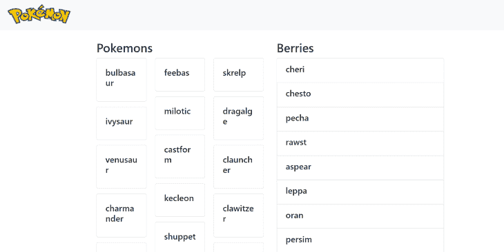
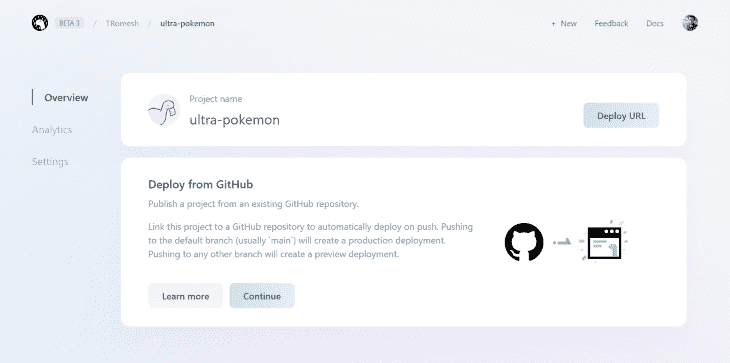
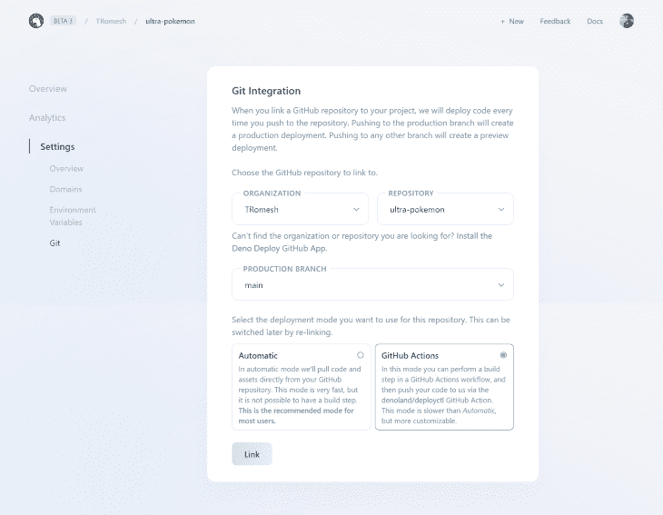
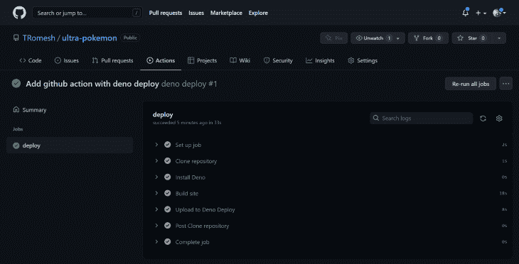

# 使用 Ultra，新的 React web 框架- LogRocket Blog

> 原文：<https://blog.logrocket.com/using-ultra-new-react-web-framework/>

### 目录

在前端开发领域，React 是为 web 应用程序开发组件的最流行的库之一。React v18 包括一些新特性，比如并发渲染，并且它支持带有 React 服务器组件的 SSR，所有这些都使 web 开发人员能够创建更具交互性的 UI。

在本文中，您将了解一个名为 [Ultra](https://ultrajs.dev/) 的新 React 框架，它使用 Deno 和 React，并专注于在浏览器中使用 web 流和原生功能。

## 什么是超？

Ultra 是 Deno 中的一个现代流 React 框架，它倾向于浏览器的本机功能，并使用 [ES 模块](https://blog.logrocket.com/es-modules-in-node-today/)，导入地图和 web 流。Ultra 旨在通过降低工具的复杂性来简化您的工作流程，让开发人员专注于开发。

## Ultra 的特性

### 与 TypeScript 和 JSX 兼容

TypeScript 是 web 开发人员社区中的一种流行语言，主要是因为它提供了可选的静态类型和类，以及它为 JavaScript 提供的接口。Ultra 是:

*   易于阅读和理解
*   为 JSX 提供更好的支持
*   包括静态类型检查和更好的智能感知
*   易于维护

### 包括许可模块

因为 Ultra 是一个 Deno 项目，所以它具有 Deno 的所有酷功能，包括它的[基于权限的安全](https://deno.land/manual/getting_started/permissions)模块。Ultra 使用以下权限:

*   允许开发者为他们的项目使用环境变量
*   `Allow-read`:告诉 Ultra 项目读取指定的路径
*   `Allow-write`:该命令告诉 Ultra 项目写入指定的路径
*   这个命令将 Ultra 添加到开发者在他们的项目中使用的 URL 列表中

### 使用 Ultra 获取数据

Ultra 使用了 React 的最新版本，通过 React 悬念带来了更多的 SSR 和数据获取能力。

### React 18 中的流 HTML

当您用 React 悬念包装组件时，React 不需要等待组件开始流 HTML，因此 React 将发送一个占位符，如微调器，而不是呈现组件。

### 选择性水合

将反应悬浊液包裹在组分周围将使选择性水合成为可能。选择性水合将在 JavaScript 代码加载到浏览器之前开始水合 HTML，因此`<Suspense>`标签内的内容不会阻止页面的其余部分水合。如果你和它互动，React 会优先给那个部位补水。

### Ultra 中的惰性路由

Ultra 为 React 使用了一个成熟的、轻量级的、基于钩子的路由解决方案。它还带有服务器端集成。

### 动态 MDX

使用 Ultra，您可以动态地使用 MDX([MDX on demand](https://mdxjs.com/guides/mdx-on-demand/#mdx-on-demand))，因为它附带了一个插件，使您能够在服务器上编译 MDX，并在客户端或前端运行结果。

## 将 Ultra 与 Aleph.js 进行比较

Aleph.js 是 Deno 中的一个全栈框架，作为 Next.js 的替代方案。Aleph.js 提供了 es 模块导入、文件系统路由、SSR & SSG 和快速刷新的 HMR 等功能。

然而，Ultra 主要关注 React 18 的新 SSR 功能，并将每个 SSR 响应视为可读流，以便所有数据通过 React suspension 加载。

在开发或产品中没有捆绑或构建步骤，但我们可以认为 Ultra 是用 Deno 和 React 构建应用程序的一种固执而直接的方式。

## 使用 Ultra 的缺点

虽然 Ultra 看起来是一个使用 Deno 和 React 的优秀框架，但它也有一些缺点。以下是开始使用 Ultra 之前需要考虑的一些因素。

*   Ultra 仍处于早期阶段。Ultra 最近发布了 1.0 版本，它不像大多数框架那样有一个花哨的 CLI。
*   Ultra 还不支持原生 CSS 模块或 CSS 模块脚本，也没有类似 Tailwind CSS 的样式库或工具。
*   Ultra 没有一流的 Deno Deploy 支持，尽管他们更倾向于 Deno Deploy 部署。
*   Ultra 还不支持[本地导入映射](https://caniuse.com/import-maps)，所以 Ultra 将您的导入直接内联到服务的 es 模块中。

## Ultra 入门

在开始使用 Ultra 进行开发之前，请确保您的计算机上安装了 Deno 版本 1.20.6+和 IDE。

让我们用 [create-ultra-app](https://github.com/exhibitionist-digital/create-ultra-app) 创建一个 Ultra 应用程序。Create-ultra-app 仍处于早期阶段，所以它还不是一个完整的解决方案。您可以克隆该项目，这为开始使用 Ultra 提供了最少的设置。

您可以在项目的根目录下找到一个名为 `importMap.json`的文件。

```
{
  "imports": {
    "react": "https://esm.sh/[email protected]",
    "react-dom": "https://esm.sh/[email protected]",
    "react-dom/server": "https://esm.sh/[email protected]/server",
    "react-helmet": "https://esm.sh/[email protected]",
    "wouter": "https://esm.sh/[email protected]",
    "swr": "https://esm.sh/[email protected]",
    "ultra/cache": "https://deno.land/x/[email protected]/cache.js",
    "app": "./src/app.tsx"
  }
}

```

属性`"app"`是指应用程序的入口点。其余的属性是运行 Ultra 所需的导入。另一个重要的文件是`deno.json`，这是 Deno 使用的默认配置文件:

```
{
  "tasks": {
    "dev": "mode=dev deno run -A --location=http://localhost:8000 --unstable --no-check server.ts",
    "start": "deno run -A --location=http://localhost:8000 --unstable --no-check server.ts",
    "cache": "deno cache --reload server.ts",
    "vendor": "importMap=importMap.json deno run -A --unstable https://deno.land/x/[email protected]/vendor.ts"
  },
  "importMap": "importMap.json"
}

```

`tasks`部分定义了您可以做什么来构建、缓存甚至启动开发服务器。这个文件最重要的部分是`"importMap"`属性，它指定了保存应用程序入口点和依赖项的`importMap`路径。让我们分解剩下的代码。

`"Dev"`:该命令有助于启动开发服务器，它将始终强制重新导入 ESM 文件，使其能够在保存时重新加载

`"Start"`:该命令在生产阶段很有用。它使用缓存的 ESM 导入，而不是 WebSocket 重新加载器。它还使用您定义的任何导入映射

`"Cache"`:该命令刷新`server.js`的 Deno 缓存。如果您在供应商和 CDN 导入映射之间交换时遇到任何问题，这可能会有所帮助

`"Vendor"`:这在部署应用程序时很有用，因为它会将依赖项下载到`".ultra/x"`目录中，并创建一个`vendorMap.json`导入映射文件

## Ultra 中的构建组件

让我们创建一个小口袋妖怪应用程序，使用悬念的流 SSR。对于这个演示应用程序，我们将使用免费的口袋妖怪 API 。首先，让我们使用命令`deno task dev,` 启动我们的项目，该命令将启动 [http://localhost:8000](http://localhost:8000) 上的 Ultra development 服务器。如果你打开你的浏览器，你会看到类似下图的东西。


现在，让我们创建构建这个应用程序所需的组件和页面。在`src`目录下创建名为`components`和`pages`的目录，这些目录将保存一些常见的 React 和容器组件。

让我们也给项目添加一些 CSS。Ultra 仍然没有自己的[原生 CSS 模块](https://css-tricks.com/css-modules-the-native-ones/)，所以我们必须使用 src 目录下 style.css 文件中的[传统 CSS。现在，让我们从在`src/components`下创建几个组件开始。让我们创建两个组件，从显示 Pokemon 列表的`List.jsx`组件开始。](https://github.com/fyockm/bootstrap-css-only/blob/master/css/bootstrap.css)

```
import React from "react";
import useSWR from "swr";
import { useLocation } from "wouter";

const fetcher = (url: string) => fetch(url).then((res) => res.json());

type Pokemon = {
  name: string;
  url: string;
};

type SetLocationType = {
  (
    to: string,
    options?:
      | {
          replace?: boolean | undefined;
        }
      | undefined
  ): void;
};

const getId = (url: string): string => {
  return url.substring(url.lastIndexOf("/") - 1, url.lastIndexOf("/"));
};

const renderItems = (pokemons: Pokemon[], setLocation: SetLocationType) => {
  return pokemons?.map(({ name, url }: Pokemon) => {
    return (
      <div
        className="card"
        onClick={() => {
          setLocation(`/pokemon/${getId(url)}`);
        }}
      >
        <div className="card-body">
          <h5 className="card-title">{name}</h5>
        </div>
      </div>
    );
  });
};

const list = () => {
  const [location, setLocation] = useLocation();
  const { data, error } = useSWR(
    `https://pokeapi.co/api/v2/pokemon?limit=1000&offset=0`,
    fetcher
  );

  if (error) {
    return (
      <div className="alert alert-danger" role="alert">
        Unable to fetch data from pokemon API
      </div>
    );
  }

  return (
    <div className="card-columns">
      {renderItems(data?.results, setLocation)}
    </div>
  );
};

export default list;

```

注意，我们使用来自`[swr](https://swr.vercel.app/)` API 的`useSWR` 钩子从 Pokemon REST API 获取数据。

接下来，我们必须创建`Pokemon.jsx` 组件，它显示了一个选中的口袋妖怪的详细信息。

```
import React from "react";

type MovesType = {
  move: { name: string; url: string };
  version_group_details: [];
};

type PokemonPropType = {
  name: string;
  height: number;
  weight: number;
  xp: number;
  image: string;
  moves: Array<MovesType>;
};

const renderMoves = (moves: Array<MovesType>) => {
  return moves.slice(0, 5).map(({ move }: MovesType) => {
    return <li>{move?.name}</li>;
  });
};

const Pokemon = ({ name, height, weight, image, moves }: PokemonPropType) => {
  return (
    <div className="card" style={{ width: "40rem" }}>
      
      <div className="card-body">
        <h5 className="card-title">{name}</h5>
        <h6 className="card-subtitle mb-2 text-muted">
          Height :{height} Weight: {weight}
        </h6>
        <p className="card-text">
          <ul>{renderMoves(moves)}</ul>
        </p>
      </div>
    </div>
  );
};

export default Pokemon;

```

我们还必须通过在`component`目录下创建一个名为`Berries.tsx.`的组件来创建一个浆果列表

```
import React from "react";
import useSWR from "swr";

type BerriesType = {
  name: string;
  url: string;
};

const fetcher = (url: string) => fetch(url).then((res) => res.json());

const getId = (url: string): string => {
  return url.substring(url.lastIndexOf("/") - 1, url.lastIndexOf("/"));
};

const renderItems = (berries: BerriesType[]) => {
  return berries?.map(({ name, url }: BerriesType) => {
    return (
      <div key={getId(url)} className="list-group-item">
        <h5 className="clickable">{name}</h5>
      </div>
    );
  });
};

const Berries = () => {
  const { data, error } = useSWR(`https://pokeapi.co/api/v2/berry`, fetcher);

  if (error) {
    return (
      <div className="alert alert-danger" role="alert">
        Unable to fetch data from pokemon API
      </div>
    );
  }

  return <div className="list-group">{renderItems(data?.results)}</div>;
};

export default Berries;

```

现在，让我们在主页上的`src/pages`下的文件`Home.tsx`中显示所有这些组件。

```
import React, { Suspense } from "react";
import List from "../components/List.tsx";
import Berries from "../components/Berries.tsx";

const Home = () => {
  return (
    <div className="container-fluid">
      <div className="row">
        <div className="col-md-2"></div>
        <div className="col-md-4">
          <h3>Pokemons</h3>
        </div>
        <div className="col-md-4">
          <h3>Berries</h3>
        </div>
        <div className="col-md-2"></div>
      </div>
      <div className="row">
        <div className="col-md-2"></div>
        <div className="col-md-4">
          <Suspense fallback={<div>Loading</div>}>
            <List />
          </Suspense>
        </div>
        <div className="col-md-4">
          <Suspense fallback={<div>Loading</div>}>
            <Berries />
          </Suspense>
        </div>
        <div className="col-md-2"></div>
      </div>
    </div>
  );
};

export default Home;

```

最后，让我们定义应用程序的路径，以及主页、Pokemon 和错误页面。

```
import React from "react";
import { SWRConfig } from "swr";
import { Helmet } from "react-helmet";
import { Route, Switch } from "wouter";
import ultraCache from "ultra/cache";
import { Cache } from "https://deno.land/x/ultra/src/types.ts";

import Navigation from "./components/Navigation.tsx";
import Home from "./pages/Home.tsx";
import Selected from "./pages/Selected.tsx";

const options = (cache: Cache) => ({
  provider: () => ultraCache(cache),
  suspense: true,
});

const Ultra = ({ cache }: { cache: Cache }) => {
  return (
    <SWRConfig value={options(cache)}>
      <Helmet>
        <title>Ultra Pokemon</title>
        <link rel="stylesheet" href="/style.css" />
      </Helmet>
      <main>
        <Switch>
          <Navigation>
            <Route path="/" component={Home} />
            <Route path="/pokemon/:id" component={Selected} />
          </Navigation>
          <Route>
            <strong>404</strong>
          </Route>
        </Switch>
      </main>
    </SWRConfig>
  );
};

export default Ultra;

```

打开您的浏览器可以看到类似这样的内容:



这将显示两个列表:一个是口袋妖怪，另一个是浆果。现在我们已经构建了一个基本的应用程序，让我们来部署它。

## 部署 Ultra 应用程序

您可以使用 Docker 或 Deno Deploy 部署 Ultra 应用程序。使用 Docker，创建一个支持 vendored 依赖项的 Docker 文件，以`deno:1.20.6+`为基础映像。

Deno Deploy 是一个分布式无服务器执行系统，允许您运行 JavaScript 和 TypeScript。它配有 V8 运行时和最小延迟，像 [Cloudflare Workers](https://workers.cloudflare.com/) 一样，使您能够在边缘运行代码。Ultra 支持官方 [Deno Deploy GitHub 动作](https://github.com/apps/deno-deploy)，这将允许你[在 Deno Deploy](https://deno.com/blog/deploy-static-files) 上提供静态文件。

为此，在 [Deno Deploy 仪表板](https://dash.deno.com/new)中创建一个项目，并提供创建 Deno Deploy 项目所需的:



接下来，选择 **GitHub 动作集成**。在 GitHub repo 中创建项目链接后，点击**继续**按钮并从资源库列表中选择您的项目，将其部署到 Deno。然后，选择 **GitHub Actions** 作为部署方式。



最后，将以下内容添加到您的项目中的`.github/workflow/main.yml:`下

```
name: deno deploy
on:
  push:
    branches: [main]
  pull_request:
    branches: [main]

jobs:
  deploy:
    name: deploy
    runs-on: ubuntu-latest
    permissions:
      id-token: write
      contents: read
    steps:
      - name: Clone repository
        uses: actions/[email protected]

      - name: Install Deno
        uses: denoland/[email protected]
        with:
          deno-version: 1.20.3

      - name: Build site
        run: root=https://example.com deno run -A https://deno.land/x/ultra/build.ts

      - name: Upload to Deno Deploy
        uses: denoland/[email protected]
        with:
          project: ultra-pokemon
          entrypoint: ULTRA.js
          root: .ultra

```

现在，提交所有更改，并将您的代码推送到 GitHub，这将触发 GitHub 操作。如果一切按计划进行，您将在 GitHub repo 中的 **Actions** 选项卡下看到类似这样的内容。



您可以在**上传到 Deno Deploy** 部分或您的 Deno Deploy 仪表板中找到已部署的链接。

**注意**:对于 Ultra 的当前版本(1.0 版)，您必须从 Deno Deploy 端进行配置，才能让您的应用程序正常工作。登录 Deno Deploy 仪表板，添加一个名为“root”的环境变量，并将部署的 URL 作为其值进行传递。此问题是 Ultra 当前版本中的一个已知错误。


你可以通过这个 [GitHub repo](https://github.com/TRomesh/ultra-pokemon) 找到上面例子的完整代码。此外，通过这个[链接](https://ultra-pokemon.deno.dev/)查看实时应用程序。

## 结论

Ultra 是一种与 Deno 和 React 合作的好方法，其最近发布的 1.0 版本包括许多新功能和改进，如 ESbuild 移除、与 [Markdown](https://mdxjs.com/) 的集成，以及引入 [create-ultra-app](https://github.com/exhibitionist-digital/create-ultra-app) 。但是，它仍然有缺陷，所以请监控 GitHub repo 的更新。

Ultra 似乎是用 Deno 和 React 构建应用程序的更好的方式，你可以在 [Discord](https://discord.gg/9BMpE96CZt) 上找到一个很好的社区。感谢阅读。

## 使用 LogRocket 消除传统反应错误报告的噪音

[LogRocket](https://lp.logrocket.com/blg/react-signup-issue-free)

是一款 React analytics 解决方案，可保护您免受数百个误报错误警报的影响，只针对少数真正重要的项目。LogRocket 告诉您 React 应用程序中实际影响用户的最具影响力的 bug 和 UX 问题。

[ ](https://lp.logrocket.com/blg/react-signup-general) [  ](https://lp.logrocket.com/blg/react-signup-general) [LogRocket](https://lp.logrocket.com/blg/react-signup-issue-free)

自动聚合客户端错误、反应错误边界、还原状态、缓慢的组件加载时间、JS 异常、前端性能指标和用户交互。然后，LogRocket 使用机器学习来通知您影响大多数用户的最具影响力的问题，并提供您修复它所需的上下文。

关注重要的 React bug—[今天就试试 LogRocket】。](https://lp.logrocket.com/blg/react-signup-issue-free)