# 使用 v-switch 虚拟化组件

> 原文：<https://blog.logrocket.com/using-v-switch-vuetify-switch-component/>

[Vuetify](https://vuetifyjs.com/en/) 是 [Vue.js](https://vuejs.org/) 最广为人知的用户界面框架之一。它提供了一组可重用和可定制的组件，使我们能够快速有效地构建现代和用户友好的界面。

在 Vuetify 库提供给我们的众多组件中，Vuetify 提供了 [`v-switch`](https://next.vuetifyjs.com/en/api/v-switch/) 组件(即`switch`组件)——一个允许用户打开或关闭选项的拨动开关:


`v-switch`通常用于启用或禁用应用程序中的功能，更改主题，以及在表单中的值之间切换。在本文中，除了理解它提供的一些现成的定制之外，我们还将研究如何使用`v-switch`组件。

*向前跳转:*

## Vuetify 入门

本文分享的所有代码样本都涉及到 Vue 3 提供的[单文件组件](https://vuejs.org/guide/scaling-up/sfc.html#single-file-components)和[组合 API](https://vuejs.org/api/composition-api-setup.html#composition-api-setup) 的使用。特别是，我们将遵循推荐的`[<script setup>](https://vuejs.org/api/sfc-script-setup.html#script-setup)`语法。

我们通过 Codepen 分享的所有运行代码示例都将遵循更传统的[O](https://vuejs.org/api/options-state.html#data)[options API。](https://vuejs.org/api/options-state.html#data)

如果您想在您的本地开发环境中遵循本文，请遵循下面的步骤，在 [create](https://github.com/vuetifyjs/create-vuetify) [-vuetify](https://github.com/vuetifyjs/create-vuetify) 工具的帮助下创建一个 Vue/Vuetify 3 项目(如 Vuetify 文档的[安装](https://next.vuetifyjs.com/en/getting-started/installation/#installation)部分所示)。

## 使用 create-vuetify 创建我们的项目

首先，我们将在终端中运行以下命令:

```
yarn create vuetify

```

然后，我们将提供以下选项来创建名为`vue-switch-project`的 Vue/Vuetify 3 项目:

```
✔ Project name: vue-switch-project
✔ Which preset would you like to install? › Default (Vuetify)
✔ Use TypeScript? No
✔ Would you like to install dependencies with yarn, npm, or pnpm? › yarn

```

接下来，我们将导航到新创建的`vue-switch-project/`目录并运行`yarn dev`命令。这将运行我们在`[http://localhost:3000/](http://localhost:3000/)`新搭建的 Vue 应用程序:


接下来，我们将从项目中移除自动生成的`src/assets/`和`src/components/`目录，因为我们将只在`src/App.vue`文件中工作。作为起点，我们将让`App.vue`文件简单地呈现一个“Hello World！”文本:

```
<template>
  <v-app>
    <v-main>
      <v-container fluid> Hello World! </v-container>
    </v-main>
  </v-app>
</template>

<script setup></script>

```

在上面的模板中，我们使用了一些基本的 Vuetify 组件。它们包括:

*   `[v-app](https://next.vuetifyjs.com/en/components/application/)`:虚拟化应用的基础。它应该位于应用程序的顶层，负责将应用程序的主题和布局应用到整个应用程序中
*   [`v-main`](https://next.vuetifyjs.com/en/components/application/) :用于指定页面的主要内容。它通常应该用作应用程序主要内容的容器，也可以用于对该内容应用某些样式或布局设置
*   [`v-container`](https://next.vuetifyjs.com/en/components/grids/) :一个灵活的容器，可以用来封装和集中应用程序的内容。它有一个响应式的设计，可用于对其内容应用不同的样式或布局选项

我们的应用程序目前看起来像这样:

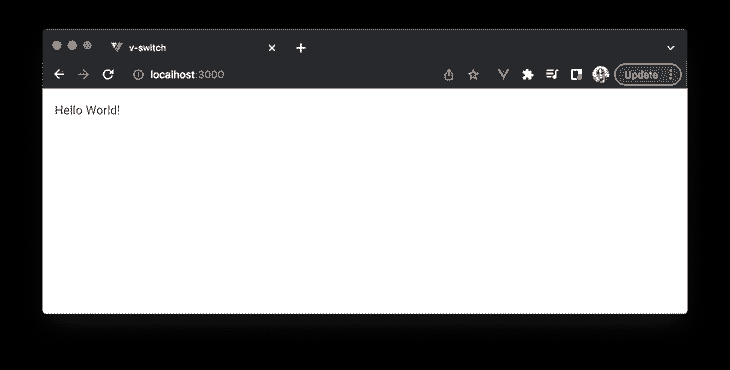

## `v-switch`组件

### 数据绑定

在其最基本的形式中，`v-switch`在两个值之间切换。为了看到这一点，我们将在`<template>`中呈现`v-switch`组件:

```
<template>
  <v-app>
    <v-main>
      <v-container fluid>
        <v-switch />
      </v-container>
    </v-main>
  </v-app>
</template>

<script setup></script>

```

保存上述更改时，我们将看到应用程序中的切换开关:

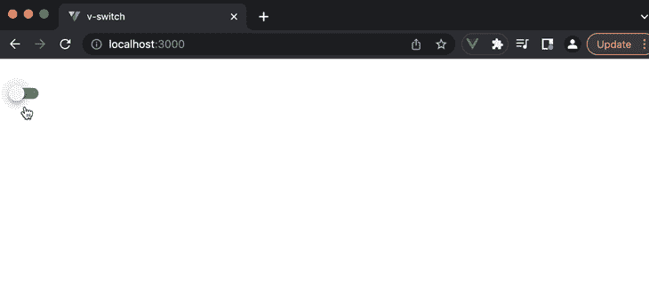

> 参见本 [Codepen](https://codepen.io/itslit/pen/dyjOqpz) 中的上例。

使用 [`v-model`](https://vuejs.org/guide/essentials/forms.html) 指令，我们将在组件中的开关值和数据属性之间创建双向数据绑定。然后，我们将 switch toggle 绑定到一个标记为`isEnabled`的数据属性:

```
<template>
  <v-app>
    <v-main>
      <v-container fluid>
        <v-switch v-model="isEnabled" />
      </v-container>
    </v-main>
  </v-app>
</template>

```

现在，让我们在组件的`<script>`中定义`isEnabled`。我们将使用 [`ref()`](https://vuejs.org/api/reactivity-core.html#ref) 函数创建一个对该值的无功引用，并用`false`初始化该值:

```
<template>
  <v-app>
    <v-main>
      <v-container fluid>
        <v-switch v-model="isEnabled" />
      </v-container>
    </v-main>
  </v-app>
</template>

<script setup>
import { ref } from "vue";
const isEnabled = ref(false);
</script>

```

`v-switch`组件包含一个接受字符串值的`label`属性，用于在开关输入旁边显示一个标签。我们将使用这个道具来可视化开关切换时`isEnabled`属性的变化。我们将把`label`属性与`[v-bind](https://vuejs.org/api/built-in-directives.html#v-bind)`指令(即`:`简写)绑定到值`isEnabled: ${isEnabled.toString()}"`:

```
<template>
  <v-app>
    <v-main>
      <v-container fluid>
        <v-switch
          v-model="isEnabled"
         :label="`isEnabled: ${isEnabled.toString()}`"
        />
      </v-container>
    </v-main>
  </v-app>
</template>

<script setup>
import { ref } from "vue";
const isEnabled = ref(false);
</script>

```

当切换开关时，我们会注意到在`isEnabled: false`和`isEnabled: true`之间切换的开关输入标签的值:

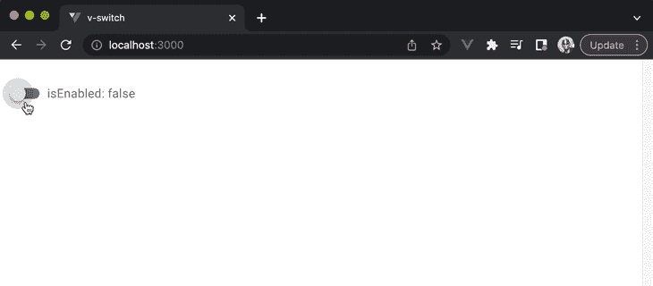

> 参见本 [Codepen](https://codepen.io/itslit/pen/yLqVxbL) 中的上例。

上面的例子代表了`v-switch`的基本能力。也就是说，`v-switch`还提供了许多不同的定制，我们可以开箱即用。我们将在下一节深入研究一些定制。

## `v-switch`定制

### 颜色

`v-switch`提供了一个`color`属性，允许我们在开关处于“打开”状态时改变开关的颜色。

例如，如果我们将值`purple`添加到`color`属性，如下所示:

```
<template>
  <v-app>
    <v-main>
      <v-container fluid>
        <v-switch
          v-model="isEnabled"
          :label="`isEnabled: ${isEnabled.toString()}`"
          color="purple"
        />
      </v-container>
    </v-main>
  </v-app>
</template>

```

请注意，当打开时，我们的开关颜色将变为紫色:

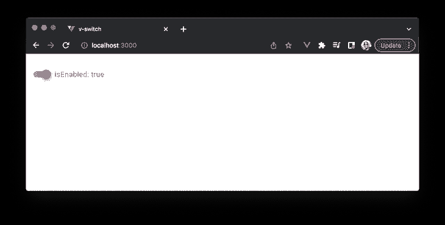

> 参见本 [Codepen](https://codepen.io/itslit/pen/yLqVxpy) 中的上例。

我们可以使用 Vuetify 库中的任何内置颜色。 [Vuetify 文档](https://vuetifyjs.com/en/styles/colors/#material-colors)向我们展示了该库支持的整个材料设计调色板。

下面是一个使用图书馆中各种可用颜色的示例:

```
<template>
  <v-app>
    <v-main>
      <v-container fluid>
        <v-switch v-model="isEnabled" label="Purple" color="purple" />
        <v-switch v-model="isEnabled" label="Light Blue" color="light-blue" />
        <v-switch v-model="isEnabled" label="Teal" color="teal" />
        <v-switch v-model="isEnabled" label="Amber" color="amber" />
        <v-switch v-model="isEnabled" label="Deep Orange" color="deep-orange" />
      </v-container>
    </v-main>
  </v-app>
</template>

<script setup>
import { ref } from "vue";
const isEnabled = ref(false);
</script>

```

这将使我们的应用程序呈现不同颜色的开关输入列表:

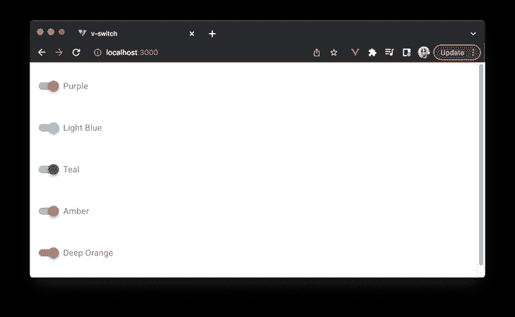

> 参见本 [Codepen](https://codepen.io/itslit/pen/KKBNxQK) 中的上例。

### 加载和禁用状态

`v-switch`支持一个`loading`道具，当给定一个`true`值时，该道具显示一个圆形加载条:

```
<template>
  <v-app>
    <v-main>
      <v-container fluid>
        <v-switch
          v-model="isEnabled"
          :label="`isEnabled: ${isEnabled.toString()}`"
          loading
        />
      </v-container>
    </v-main>
  </v-app>
</template>

```

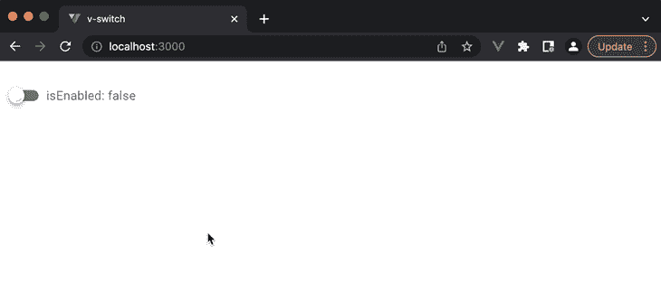

> 参见本 [Codepen](https://codepen.io/itslit/pen/NWBbLyV) 中的上例。

也可以给`loading`属性一个字符串值来表示圆形加载条的颜色。这里有一个用颜色`pink`显示`loading`状态的例子:

```
<template>
  <v-app>
    <v-main>
      <v-container fluid>
        <v-switch
          v-model="isEnabled"
          :label="`isEnabled: ${isEnabled.toString()}`"
          loading="pink"
        />
      </v-container>
    </v-main>
  </v-app>
</template>

```

在我们的应用程序中，它看起来像这样:

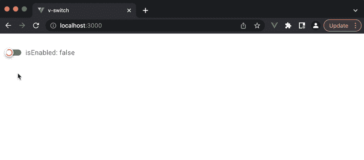

> 参见本 [Codepen](https://codepen.io/itslit/pen/BaPQOVb) 中的上例。

`v-switch`组件还支持一个`disabled`属性，当给定`true`的值时，该属性使组件显示为禁用状态:

```
<template>
  <v-app>
    <v-main>
      <v-container fluid>
        <v-switch
          v-model="isEnabled"
          :label="`isEnabled: ${isEnabled.toString()}`"
          disabled
        />
      </v-container>
    </v-main>
  </v-app>
</template>

```

当开关处于禁用状态时，我们无法切换开关:

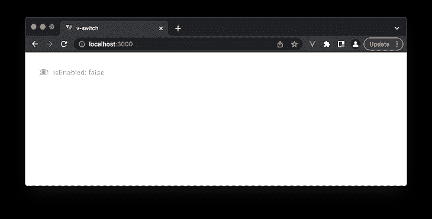

> 参见本 [Codepen](https://codepen.io/itslit/pen/gOjLdjQ) 中的上例。

### 自定义开关值

`v-switch`组件允许我们使用`false-value`和`true-value`属性指定不同的自定义值。

例如，我们可以将`false-value`和`true-value`道具的值应用为`"Nay!"`和`"Yay!"`。我们还将用值`"Nay!"`初始化我们的`isEnabled`反应属性:

```
<template>
  <v-app>
    <v-main>
      <v-container fluid>
        <v-switch
          v-model="isEnabled"
          :label="`isEnabled: ${isEnabled.toString()}`"
          color="purple"
          false-value="Nay!"
          true-value="Yay!"
        />
      </v-container>
    </v-main>
  </v-app>
</template>

<script setup>
import { ref } from "vue";
const isEnabled = ref("Nay!");
</script>

```

我们的`v-switch`组件将表现如下:

*   当组件第一次呈现时，开关绑定到的`isEnabled`数据属性将具有值`"Nay!"`。这是因为我们用值`"Nay!"`初始化了`isEnabled`反应属性
*   当开关打开时，`isEnabled`数据属性将被赋予一个值`"Yay!"`。这是因为`true-value`道具被赋予了一个值`"Yay!"`
*   当开关切换回 off 时，`isEnabled`数据属性将被赋予值`"Nay!"`。这是因为`false-value`道具被赋予了`"Nay!"`的值:


> 参见本 [Codepen](https://codepen.io/itslit/pen/PoBbddV) 中的上例。

### 自定义开关标签

根据我们提供给`label`属性的字符串值，`v-switch`组件显示一个标签。但是，我们可能希望通过使用更复杂的标记来呈现标签，从而定制这个标签，以更好地适应应用程序的上下文。我们可以通过 Vue 为我们提供的称为[插槽](https://vuejs.org/guide/components/slots.html)的功能来实现这一点。

在我们的 Vue 组件的模板中，我们将添加一个带有 [v-slot](https://vuejs.org/api/built-in-directives.html#v-slot) 属性的`<template>`元素来指定我们想要插入自定义内容的位置:

```
<template>
  <v-app>
    <v-main>
      <v-container fluid>
        <v-switch v-model="isEnabled">
          <template v-slot:label>
            <!-- custom label markup goes here -->
          </template>
        </v-switch>
      </v-container>
    </v-main>
  </v-app>
</template>

```

我们希望显示一个加载栏作为交换机的定制标签标记，所以我们将把`v-progress-linear`组件放在我们的插槽模板中。

接下来，我们将为`v-progress-linear`的`color`属性提供一个值`pink`，并将`isEnabled`反应数据属性绑定为`indeterminate`属性的值:

```
<template>
  <v-app>
    <v-main>
      <v-container fluid>
        <v-switch v-model="isEnabled">
          <template v-slot:label>
            <v-progress-linear :indeterminate="isEnabled" color="pink" />
          </template>
        </v-switch>
      </v-container>
    </v-main>
  </v-app>
</template>

<script setup>
import { ref } from "vue";
const isEnabled = ref(false);
</script>

```

当`true`时，`indeterminate`道具连续动画显示进度条。在上面的代码示例中:

*   当开关关闭时，加载栏可见，但不显示动画
*   当开关切换到 on 时，装载栏会显示连续的动画

保存我们的更改时，我们的应用程序如下所示:

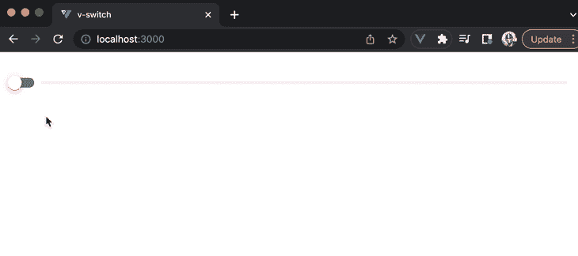

> 参见本 [Codepen](https://codepen.io/itslit/pen/QWBGZEN) 中的上例。

### 嵌入效果

我们可以使用`inset`道具定制开关的外观，以创建嵌入效果:

```
<template>
  <v-app>
    <v-main>
      <v-container fluid>
        <v-switch
          v-model="isEnabled"
          :label="`isEnabled: ${isEnabled.toString()}`"
          color="purple"
          inset
        />
      </v-container>
    </v-main>
  </v-app>
</template>

```

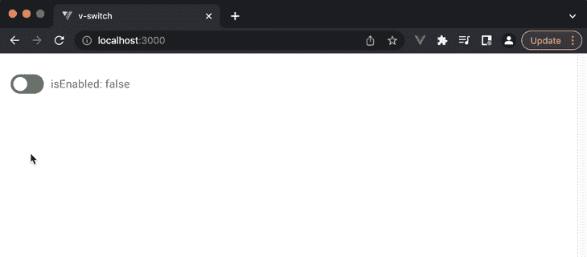

> 参见本 [Codepen](https://codepen.io/itslit/pen/wvxoExZ) 中的上例。

### 错误和错误消息

`v-switch`组件包含一个接受布尔值的`error`属性，当给定一个值`true`时，用红色错误颜色呈现开关元素。

还有一个`error-messages`属性，它将错误消息放在开关切换下方，允许我们提供关于为什么开关输入处于错误状态的附加信息:

```
<template>
  <v-app>
    <v-main>
      <v-container fluid>
        <v-switch
          v-model="isEnabled"
          :label="`isEnabled: ${isEnabled.toString()}`"
          color="purple"
          error
          error-messages="Uh oh! Something went wrong."
        />
      </v-container>
    </v-main>
  </v-app>
</template>

```

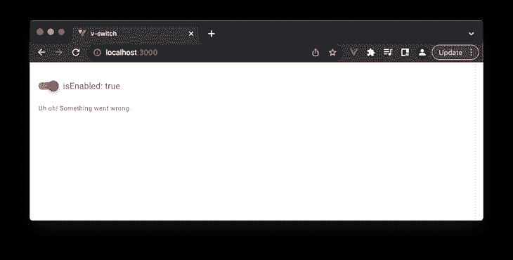

> 参见本 [Codepen](https://codepen.io/itslit/pen/BaPQOqE) 中的上例。

### 收听事件

当切换开关组件时，它会发出各种事件，我们可以在应用程序中监听和响应这些事件。这些事件包括由 HTML `<input>`元素触发的所有事件，如:

*   `onchange`
*   `oninput`
*   `onmousedown`
*   `onmouseup`
*   等等。

让我们看一个关于`onchange`(即`change` ) HTML 事件的可视化例子。当开关被拨动时，当开关值成功改变时，它发出一个`change`事件。

我们可以使用 [`v-on`](https://vuejs.org/api/built-in-directives.html#v-on) 指令(即`@`简写)来监听`change`事件并触发组件中的`onChange()`功能。该`onChange()`功能将发出一条`console.log`消息，该消息根据`isEnabled`无功属性的值说明开关是开还是关:

```
<template>
  <v-app>
    <v-main>
      <v-container fluid>
        <v-switch
          v-model="isEnabled"
          :label="`isEnabled: ${isEnabled.toString()}`"
          color="purple"
          @change="onChange"
          inset
        />
      </v-container>
    </v-main>
  </v-app>
</template>

<script setup>
import { ref } from "vue";

const isEnabled = ref(false);

const onChange = () => {
  console.log(`Switch is now ${isEnabled.value ? "on" : "off"}`);
};
</script>

```

每次开关打开或关闭时都会发出`console.log`消息:

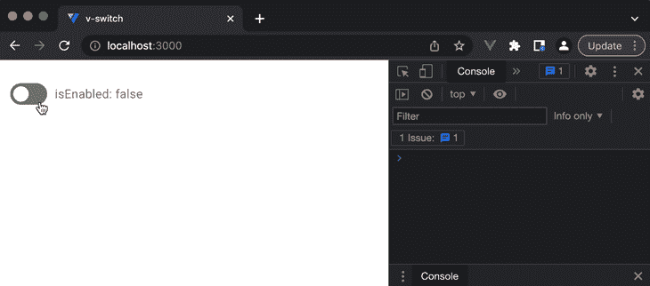

> 参见本 [Codepen](https://codepen.io/itslit/pen/rNrWZoj) 中的上例。

### 在数组中绑定多个值

`v-switch`还支持在一个数组中绑定多个值。为此，我们可以让多个`v-switch`组件使用`v-model`指令绑定到同一个数组属性。

这里有一个渲染三个不同的`v-switch`组件的例子，其中每个`v-switch`组件都有一个唯一的`value`与之相关联:

```
<template>
  <v-app>
    <v-main>
      <v-container fluid>
        <v-switch
          label="Option 1"
          value="option_1"
        />
        <v-switch
          label="Option 2"
          value="option_2"
        />
        <v-switch
          label="Option 3"
          value="option_3"
        />
      </v-container>
    </v-main>
  </v-app>
</template>

```

`value`属性用于指定开关打开时应代表的值。这在一个数组中存储多个值的上下文中很有帮助，因为我们最有可能希望存储多个唯一值，而不是存储多个`true` / `false`值。

我们将使用 [`reactive()`](https://vuejs.org/api/reactivity-core.html#reactive) 函数为具有`values`数组的对象建立反应性。我们将用第二次切换的值初始化这个`values`数组:`option_2`:

```
<template>
  <v-app>
    <v-main>
      <v-container fluid>
        <v-switch
          label="Option 1"
          value="option_1"
        />
        <v-switch
          label="Option 2"
          value="option_2"
        />
        <v-switch
          label="Option 3"
          value="option_3"
        />
      </v-container>
    </v-main>
  </v-app>
</template>

<script setup>
import { reactive } from "vue";

const selectedOptions = reactive({ values: ["option_2"] });
</script>

```

最后，我们将把`selectedOptions.values`数组绑定到每个`v-switch`组件。我们还将在呈现的`v-switch`组件列表上方显示该数组的值:

```
<template>
  <v-app>
    <v-main>
      <v-container fluid>
        {{ selectedOptions.values }}
        <v-switch
          v-model="selectedOptions.values"
          label="Option 1"
          value="option_1"
        />
        <v-switch
          v-model="selectedOptions.values"
          label="Option 2"
          value="option_2"
        />
        <v-switch
          v-model="selectedOptions.values"
          label="Option 3"
          value="option_3"
        />
      </v-container>
    </v-main>
  </v-app>
</template>

<script setup>
import { reactive } from "vue";
const selectedOptions = reactive({ values: ["option_2"] });
</script>

```

因为我们已经用值`["option_2"]`初始化了数组，所以当页面第一次呈现时，呈现列表中的第二个开关将处于 toggled-on 状态。如果我们打开或关闭任何一个开关，我们的`selectedOptions.values`阵列就会改变:

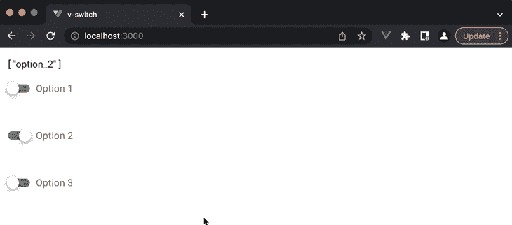

> 参见本 [Codepen](https://codepen.io/itslit/pen/RwBoYEe) 中的上例。

## 结论

Vuetify 的`v-switch`组件是一个非常有用的工具，可以为 Vue.js 应用添加切换功能。它可以很容易地绑定到组件数据属性，也可以用于绑定数组中的多个值。我们还看到了组件如何提供一系列定制选项，比如颜色、加载和禁用状态、定制值和标签、嵌入样式和错误处理。

你可以参考 [Vuetify API 文档](https://next.vuetifyjs.com/en/api/v-switch/)，作为识别`v-switch`接受的所有不同道具的有用资源。

## 像用户一样体验您的 Vue 应用

调试 Vue.js 应用程序可能会很困难，尤其是当用户会话期间有几十个(如果不是几百个)突变时。如果您对监视和跟踪生产中所有用户的 Vue 突变感兴趣，

[try LogRocket](https://lp.logrocket.com/blg/vue-signup)

.

[](https://lp.logrocket.com/blg/vue-signup)[https://logrocket.com/signup/](https://lp.logrocket.com/blg/vue-signup)

LogRocket 就像是网络和移动应用程序的 DVR，记录你的 Vue 应用程序中发生的一切，包括网络请求、JavaScript 错误、性能问题等等。您可以汇总并报告问题发生时应用程序的状态，而不是猜测问题发生的原因。

LogRocket Vuex 插件将 Vuex 突变记录到 LogRocket 控制台，为您提供导致错误的环境，以及出现问题时应用程序的状态。

现代化您调试 Vue 应用的方式- [开始免费监控](https://lp.logrocket.com/blg/vue-signup)。