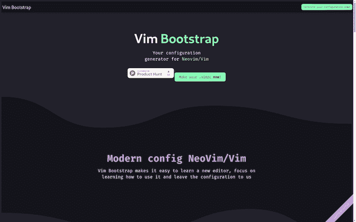
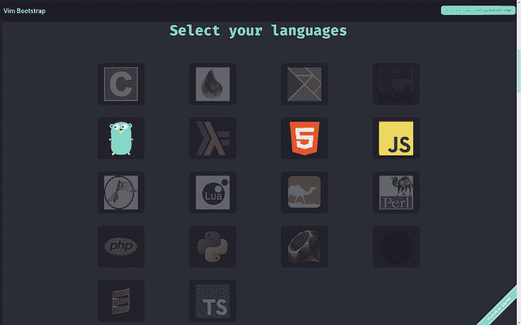
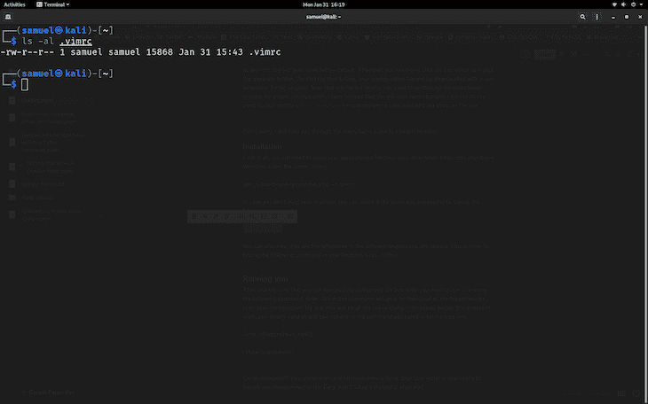
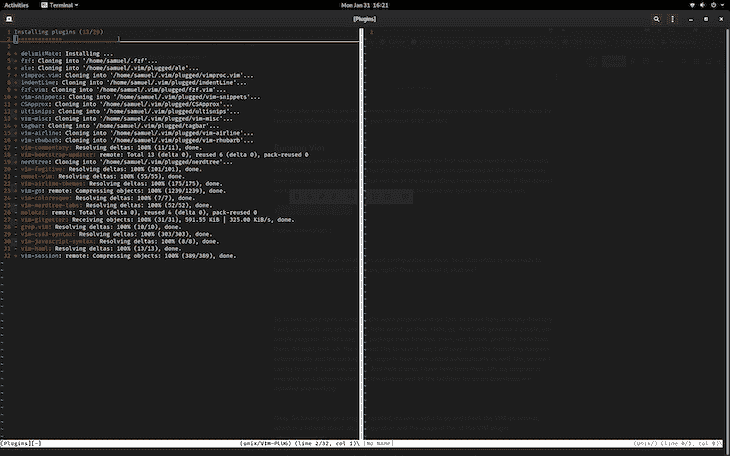
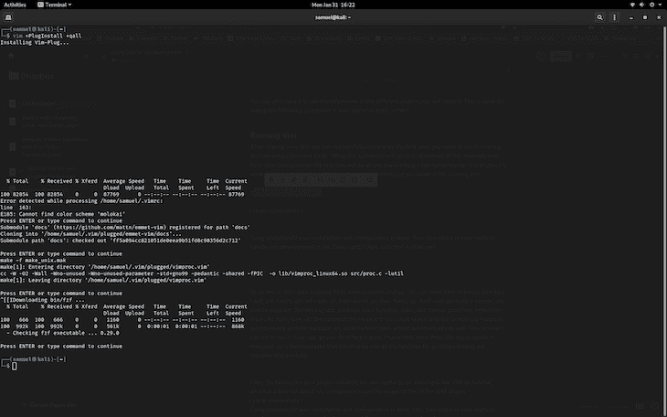

# 使用 Vim 进行 Go 开发

> 原文：<https://blog.logrocket.com/using-vim-go-development/>

如果您已经找到了这篇文章，那么您可能对使用 Go 作为您的编程语言和 Vim 作为您的编辑器感兴趣。Vim 是一个简单的命令行文本编辑器，在服务器中使用最为关键。在服务器环境中，你不会真正享受到使用 ide 的乐趣，相反，你只有一个命令行。

在本教程中，我将向您展示如何使用[vim-bootstrap.com](https://vim-bootstrap.com/)将您的 Vim 编辑器配置为 Go 编程的 IDE。Vim Bootstrap 是一个很棒的在线工具，可以为 Vim 生成配置文件，帮助您避免添加任何繁重的定制工作。Vim Bootstrap 基本上是 Vim 的一个插件组件，它生成一个`.vimrc`配置文件，其中包含使用 Vim 进行任何类型的编程所需的所有基本设置。

注意，在进行 Go 开发时，Vim Bootstrap 并不是启动和运行的唯一选择。还有其他选项，如 [vim-go](https://github.com/fatih/vim-go) 和 [NERDTree](https://github.com/preservim/nerdtree) ，它们也是插件，可以帮助你为 go 开发设置 vim 编辑器。



vim-bootstrap.com website

## 为什么使用 Vim？

与任何工具一样，正确的 IDE 将取决于您的特定用例。然而，Vim 提供了一些好处，使它在其他编辑器中脱颖而出。在我看来，主要的两个是键盘导航和它对编辑代码而不是编写代码的关注。

大多数编辑器专注于让你写新的代码行更容易，而 Vim 的方法专注于让编辑文本更容易。

这种方法背后的主要驱动因素是，与编写新的代码行相比，开发人员花更多的时间编辑代码。从程序员的角度考虑这个问题。我们花了大部分时间在现有的代码库上，修复错误，重构旧的代码库，并添加新的功能。Vim 使得编辑文本更加有效，成为开发人员的普遍选择。

使用 Vim 的主要好处在于键绑定。一旦你学会了基本的键绑定，你就会开始意识到你的常规快捷键是多么的有限。

## 入门指南

首先，在网络浏览器中导航至 vim-bootstrap.com，点击**生成您的。马上去维姆克。**按钮。您将被引导到一个部分，在那里您可以选择您的语言支持。在撰写本文时，Vim 提供了对 18 种语言和两种框架的支持:



Vim language support

对于我的用例，我选择了 HTML、JavaScript 和 TypeScript 进行 web 开发。如果默认情况下尚未选择 Go，也可以选择 Go。之后，你应该点击 **Vim 编辑器**，然后点击**生成**按钮。

点击该按钮，您的配置文件将以`.vim`扩展名下载。到目前为止，一切顺利！现在本地已经有了配置文件，您需要完成安装过程以进行正确的配置。

我们将在下一节介绍这些步骤，但是您也可以在这个 [GitHub 库](https://github.com/editor-bootstrap/vim-bootstrap)访问它们。

## 装置

首先，您需要将您的`generate.vim`文件从您的`downloads`文件夹移动到您的主目录中，命名为`.vimrc`:

```
$mv ~/Downloads/generate.vim ~/.vimrc

```

您可以使用以下命令检查移动是否成功:

```
ls -al .vimrc
```



Vim file moved

您还可以通过在终端中键入以下命令来查看您需要的不同插件的引用:

```
$cat .vimrc

```

## 运行 Vim

接下来，用下面的命令运行 Vim，从您的配置文件中下载所有的依赖项:

```
$vim

```

如果这不起作用，您只需要在您输入的命令中添加两个选项来运行 Vim:



Vim plugins installation



Vim plugins installation complete

```
$vim +PlugInstall +qall

```

现在，安装和配置完成后，您的 Vim 编辑器就可以处理 Go 中的任何开发了。很简单，对吧？要测试它，您可以尝试运行这个简单的程序，并确认它正在运行:

```
package main

func main() {
  fmt.Println("Hi there Sam")
}

```

输出为`Hi there Sam`。现在我们的插件已经安装好了，你一定要查看一下 [Vim Go 文档](https://github.com/fatih/vim-go/blob/master/doc/vim-go.txt)。

## Vim 替代品:vim-go 和 NERDTree

就像我之前提到的，使用 Vim Bootstrap 网站并不是设置 Vim 进行开发的唯一方式。另一种方法是同时使用 vim-go 和 NERDTree 插件。

vim-go 提供了在 go 中开发时可能需要的大多数特性，比如语法高亮和折叠、通过 [gopls](https://pkg.go.dev/golang.org/x/tools/gopls) 的自动完成支持、代码林挺、使用`:GoRun`的快速执行等等。

安装 vim-go 非常简单。只需运行以下命令:

```
git clone https://github.com/fatih/vim-go.git ~/.vim/pack/plugins/start/vim-go
```

接下来，您需要使用`:GoInstallBinaries`命令安装所有必要的二进制文件。从这里，您需要保存`.vimrc`文件并通过运行`vim +PlugInstall`安装插件。

在用上面的任何一种方法设置了 Vim 之后，您可能会遗漏一个重要的东西。NERDTree 提供了一个方便的侧窗口，您可以在其中轻松浏览您的项目，而不必转到计算机的本机文件管理器。

NERDTree 是一个文件系统资源管理器，帮助你在一个树状风格的侧面板中可视化地浏览你的文件，允许你方便地打开文件进行阅读或编辑。

要安装 NERDTree，只需将`Plug` `preservim/nerdtree'`添加到`.vimrc`文件中，然后运行`:PlugInstall`来获取它。

## 结论

在本教程中，我们学习了为 Go 开发设置和配置 Vim 编辑器。总的来说，Vim Bootstrap 方法相当简单，在我看来，这是使用 Vim 和 Go 最简单的方法。然而，我们也考虑了使用 NERDTree 和 vim-go 的替代方案。

我希望你喜欢这个教程，如果你有任何问题，请务必留下评论。编码快乐！

## 使用 [LogRocket](https://lp.logrocket.com/blg/signup) 消除传统错误报告的干扰

[](https://lp.logrocket.com/blg/signup)

[LogRocket](https://lp.logrocket.com/blg/signup) 是一个数字体验分析解决方案，它可以保护您免受数百个假阳性错误警报的影响，只针对几个真正重要的项目。LogRocket 会告诉您应用程序中实际影响用户的最具影响力的 bug 和 UX 问题。

然后，使用具有深层技术遥测的会话重放来确切地查看用户看到了什么以及是什么导致了问题，就像你在他们身后看一样。

LogRocket 自动聚合客户端错误、JS 异常、前端性能指标和用户交互。然后 LogRocket 使用机器学习来告诉你哪些问题正在影响大多数用户，并提供你需要修复它的上下文。

关注重要的 bug—[今天就试试 LogRocket】。](https://lp.logrocket.com/blg/signup-issue-free)