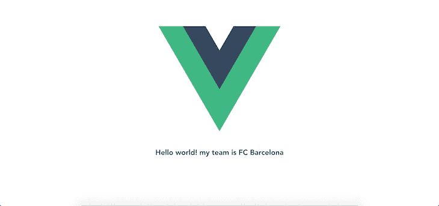

# 使用 Vue.js 插槽将 HTML 内容传递给组件

> 原文：<https://blog.logrocket.com/using-vue-js-slots-pass-html-content-components/>

***编者按*** :这篇文章最后一次更新是在 2021 年 9 月 9 日，以改进代码、图像和任何过时的信息。

这篇文章将向你展示如何使用 Vue 插槽传递 Vue.js 中父组件和子组件的数据。

## 开始之前

这篇文章适合所有阶段的开发人员——包括初学者——尽管在阅读本教程之前需要了解一些先决条件。

您需要在机器上安装以下设备:

*   已安装 Node.js 版本 14.x 及更高版本
*   代码编辑器；我强烈推荐 Visual Studio 代码
*   Vue 的最新版本，全球安装在您的机器上
*   安装在您机器上的 Vue CLI 4.x 如果需要，首先卸载旧的 CLI 版本
*   在这里下载并安装一个 [Vue starter 项目](https://github.com/viclotana/vue-canvas)

## Vue.js 中有哪些槽点？

Vue slots 是 Vue 团队创建的 Vue 模板元素，为模板内容分发提供平台。它是一个内容分发 API 的实现，其灵感来自于 [Web 组件规范草案](https://github.com/w3c/webcomponents/blob/gh-pages/proposals/Slots-Proposal.md)。

使用 Vue 插槽，您可以在项目的各个组件之间传递或分发 HTML 代码。

### Vue.js 中插槽的用途是什么？

内容分发很重要，原因有很多，其中一些与结构有关。使用 Vue slots，您可以[构造一个 HTML 接口(就像使用 TypeScript)](https://blog.logrocket.com/writing-idiomatic-typescript/) ，然后您可以使用它作为指导，通过模板注入来构建您的组件。

对于将模板代码从一个组件传递到另一个组件，这是一个非常可伸缩和高效的解决方案。

定位内容是 Vue 插槽的另一个很好的用例。您可以只创建一个模板，然后使用另一个组件或父组件来排列该模板，就像您希望它出现在用户界面中一样。

## 老虎机与道具

如果你知道 Vue 老虎机，你可能想知道道具和老虎机是否做同样的事情。这些工具或平台的中心思想是鼓励资源的可重用性和效率。考虑到这一点，老虎机和道具是相似的。

Props 处理在组件之间传递数据对象，而 slots 处理在组件之间传递模板(HTML)内容。然而，作用域插槽的行为就像道具一样；这将在本教程中清楚地说明。

## vue . js slot 语法

对于 slots，您的子组件充当您希望内容如何排列的接口或结构。它可能看起来像这样:

```
<template>
  <div>
    <slot></slot>
  </div>
</template>

```

父组件(要注入到子组件中的 HTML 内容所在的位置)可能如下所示:

```
<Test>
   <h2>Hello World!</h2>
 </Test>

```

这种组合返回的用户界面如下所示:

```
<template>
  <div>
    <h2>Hello World!</h2>
  </div>
</template>

```

请注意，插槽本身如何作为内容注入位置和方式的指南——这是中心思想。

## 使用 Vue.js 插槽传递带有组件的 HTML 内容

如果你从一开始就关注了这篇文章，你将会在 Visual Studio 代码中打开 [Vue starter 项目](https://blog.logrocket.com/tag/vue/)。为了说明语法部分中的简单示例，我们的父组件将是`app.vue`文件。打开您的`app.vue`文件并复制以下代码块:

```
<template>
  <div id="app">
    
    <Test>
      <h2>Hello World!</h2>
    </Test>
  </div>
</template>
<script>
import Test from './components/Test.vue'
export default {
  name: 'app',
  components: {
    Test
  }
}
</script>

```

子组件是测试组件，所以将下面的代码块复制到`test.vue`文件中:

```
<template>
  <div>
    <slot></slot>
  </div>
</template>
<script>
export default {
  name: 'Test'
}
</script>

```

使用以下命令在开发环境中运行应用程序:

```
npm run serve

```

然后，它呈现以下内容:


### 如何使用 Vue.js 命名槽？

Vue 允许一个组件有多个插槽，这意味着您可以拥有任意数量的插槽。为了测试这一点，将这个新代码块复制到您的`test.vue`文件中:

```
<template>
  <div>
    <slot></slot>
    <slot></slot>
    <slot></slot>
  </div>
</template>
<script>
export default {
  name: 'Test'
}
</script>

```

如果您运行应用程序，您可以看到`hello world`被打印了三次。所以如果你想添加更多的内容——比如一个标题、一段文字，然后是一个无序列表——Vue 让我们命名范围，这样它就可以识别要显示的特定范围。

在`test.vue`文件中命名插槽如下所示:

```
<template>
  <div>
    <slot name="header"></slot>
    <slot name="paragraph"></slot>
    <slot name="links"></slot>
  </div>
</template>
<script>
export default {
  name: 'Test'
}
</script>

```

现在，您还必须根据插槽名称来标记 HTML 元素，以便在中显示它们。将此复制到您的`app.vue`文件的模板部分:

```
<template>
  <div id="app">
    
    <Test>
      <h2 slot="header">Hello world!</h2>
      <p slot="paragraph">Hello, I am a paragraph text</p>
      <ul slot="links">
        <li>Hello, I am a list item</li>
        <li>Hello, I am a list item</li>
      </ul>
    </Test>
  </div>
</template>

```

### 怎么用`V-slots`？

当 Vue 版本 2.6 发布时，它提供了一个更好的语法来引用来自名为`v-slot`的子组件的插槽名称，这意味着要取代最初的插槽语法。因此，与带有如下槽的父组件模板不同:

```
<Test>
   <h1 slot="header">Hello world!</h1>
</Test>

```

从版本 3.0 开始，它现在看起来像这样:

```
<Test v-slot:header>
   <h1>Hello world!</h1>
</Test>

```

注意，除了字符串从`slot`到`v-slot`的微小变化外，还有一个重大变化:`v-slot`只能在模板上定义，而不能在任何 HTML 元素上定义。这是一个很大的变化，因为它质疑了命名插槽的可用性，但是在撰写本文时，插槽仍然是文档的一部分。

### 什么是作用域槽？

想象一个场景，其中 Vue 插槽也可以从父组件访问子组件中的数据对象——一种具有 props 功能的插槽。

为了说明这一点，通过将下面的代码块复制到`test.vue`文件中，在子组件中创建一个数据对象:

```
<template>
  <div>
    <slot v-bind:team="team"></slot>
    <slot name="paragraph"></slot>
    <slot name="links"></slot>
  </div>
</template>
<script>
export default {
  name: 'Test',
  data(){
    return{
      team:"FC Barcelona"
    }
  }
}
</script>

```

就像普通的道具一样，`v-bind`指令将数据中的团队与父组件中的道具引用绑定在一起。打开您的`app.vue`文件，将下面的代码块复制到模板部分:

```
<template>
  <div id="app">
    
    <Test v-slot="{team}">
      <h2>Hello world! my team is {{team}}</h2>
    </Test>
  </div>
</template>

```

如果您运行您的应用程序，您会看到数据对象被成功地传递到父组件。你可以在这里找到本教程的完整代码。



## 结论

这篇文章向您介绍了 Vue.js 中的 slots，以及它们对内容注入的重要性。您看到了如何设置它，甚至如何为一个组件设置多个插槽。您还看到了插槽如何通过作用域充当道具。继续并享受在您的工作流中实现插槽。

## 像用户一样体验您的 Vue 应用

调试 Vue.js 应用程序可能会很困难，尤其是当用户会话期间有几十个(如果不是几百个)突变时。如果您对监视和跟踪生产中所有用户的 Vue 突变感兴趣，

[try LogRocket](https://lp.logrocket.com/blg/vue-signup)

.

[](https://lp.logrocket.com/blg/vue-signup)[https://logrocket.com/signup/](https://lp.logrocket.com/blg/vue-signup)

LogRocket 就像是网络和移动应用程序的 DVR，记录你的 Vue 应用程序中发生的一切，包括网络请求、JavaScript 错误、性能问题等等。您可以汇总并报告问题发生时应用程序的状态，而不是猜测问题发生的原因。

LogRocket Vuex 插件将 Vuex 突变记录到 LogRocket 控制台，为您提供导致错误的环境，以及出现问题时应用程序的状态。

现代化您调试 Vue 应用的方式- [开始免费监控](https://lp.logrocket.com/blg/vue-signup)。