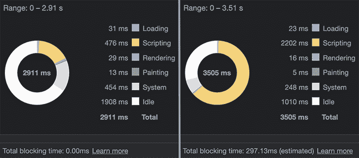

# 使用 web workers 提升第三方脚本性能

> 原文：<https://blog.logrocket.com/using-web-workers-boost-third-party-script-performance/>

***编者按:*** *本文更新于 2022 年 5 月 12 日，包含更多关于 Partytown 库的最新信息。*

网络工作者在 2010 年被引入后被寄予了很高的期望。然而，随着时间的推移，即使开发人员将 web workers 用于高级库和用例(如 TensorFlow 中的 ML 培训或 Monaco Editor 中的语言支持)，它们也成为日常项目的最后一招优化技术。随着 Web Assembly ( [Wasm](https://blog.logrocket.com/how-to-debug-wasm-and-achieve-a-reliable-stack-trace/) )及其后来对多线程的[支持的引入，这种现状变得更加明显。](https://developers.google.com/web/updates/2018/10/wasm-threads)

也就是说，有一个名为 [Partytown](https://github.com/BuilderIO/partytown) 的新库，旨在使用 web workers 来解决一个常见问题:将密集的第三方脚本执行从主线程中移走。让我们仔细看看。

## 内容

## 什么是第三方脚本？

在说 Partytown 之前，我们要先了解它的目标。

第三方脚本在绝大多数网站上都很常见。他们负责注入分析(Google Analytics)、广告(Google Adsense)、处理支付(Stripe)、显示嵌入(Disqus)等等。一般来说，如果代码中不包含至少一个第三方脚本，创建一个现代的 web 应用程序几乎是不可能的。

尽管第三方脚本非常有用，但它们有一个巨大的缺点:它们会损害网站的性能。每个脚本通常都是几千字节甚至几兆字节大小的代码“黑匣子”，难怪只要有几个脚本，你的网站就会混乱不堪。这就是 Partytown 发挥作用的地方。

## 介绍 Partytown

Partytown 是一个新的库，其目标是通过将主线程从第三方脚本的负担中分离出来来加速您的网站。它旨在通过使用网络工作者来实现这一目标。

从表面上看，这似乎是一个简单的想法。只需将一个脚本放入 web worker 中，对吗？不尽然——当我们考虑到网络工作者的局限性时，问题就开始出现了。

网络工作者不能:

*   访问 DOM
*   完全访问`window`对象的方法和属性
*   从不同的来源直接装载

可以想象，这些限制使得大多数第三方脚本无法在 web worker 上单独运行——也就是说，不进行额外的调整。

为了让你的第三方脚本在网络工作者内部运行，Partytown 使用了一些技巧:

1.  它禁止在主线程上执行带有`type="text/partytown"`属性的脚本，获取它们的内容，并通过`Blob` s 在 web worker 内部运行它们
2.  在 web worker 内部，它创建专用的`Proxy`对象来访问 DOM 和主线程中可用的其他全局对象。这些对象处理与主线程的通信，并执行不能从 web worker 内部完成的操作
3.  为了使通信同步(正如第三方脚本所期望的那样)，Partytown 使用同步 HTTP 请求和服务工作者的组合来拦截并在给定的时间内响应传入的请求
4.  为了更快更有效的交流，Partytown 最近增加了对[原子](https://developer.mozilla.org/en-US/docs/Web/JavaScript/Reference/Global_Objects/Atomics)的支持。通过这一改进，Partytown 可以在现代浏览器上提供更好的体验和性能

如你所见，有许多变通方法可以让 Partytown 成为可能。再加上包装 web worker 的沙箱`iframe`，您可以看到 Partytown 项目实际上是多么复杂。这也是为什么这个库仍然处于测试阶段，在某些情况下还不能“开箱即用”。

也就是说，Partytown 开发团队已经测试了几个集成，我们将看看其中的一个，看看这个库是如何工作的。

## Partytown 测试用例入门

Partytown 为测试服务提供[配置，如 HubSpot 表单、对讲机和谷歌标签管理器(GTM)。](https://partytown.builder.io/common-services)

### 准备环境

在开始编写代码之前，首先需要设置您的环境。创建新的 npm 项目并安装 Partytown 模块:

```
npm init -y
npm install @builder.io/partytown

```

现在，这对于任何现代 JavaScript 库来说都很正常。然而，下一步，更非传统的步骤是通过您网站的`/~partytown/`路径从`@builder.io/partytown` [npm 模块](https://www.npmjs.com/package/@builder.io/partytown)获取`lib`目录的内容。

例如，如果您的设置为此使用了一个`public`目录，您可以使用 Partytown CLI 提供的一个简单命令来完成:

```
partytown copylib ./public/~partytown/

```

对于像 Vite、Rollup 或 webpack 这样的流行模块捆绑器，Partytown [带有专用插件](https://partytown.builder.io/copy-library-files)。

### 初始化 Partytown

有了模块和`lib`的内容，现在可以初始化 Partytown 了。为此，您必须将 Partytown 片段内联到页面中:

```
import { partytownSnippet } from '@builder.io/partytown/integration';

const snippetContent = partytownSnippet();
const script = document.createElement("script");

script.textContent=snippetContent;
document.body.append(script)

```

你可以用上面的代码在任何 JavaScript app 中初始化 Partytown。Partytown 还为流行的 UI 框架提供专用的[集成。](https://partytown.builder.io/integrations)

如果你想配置 Partytown 打开调试模式或者定制`lib`的内容位置，你应该用必要的选项声明一个全局`partytown`对象:

```
window.partytown = {
  debug: true,
};

```

## 将 HubSpot 表单与 Partytown 整合

正确设置 Partytown 后，我们现在将集成 HubSpot 表单。

首先，准备好 HubSpot 帐户、示例表单及其嵌入代码。现在，只需将 HubSpot 片段放到 HTML 文件中，并将`type="text/partytown"`属性添加到所有的`<script>`标签中

```
<!-- ... -->
<script
  charset="utf-8"
  type="text/partytown"
  src="//js-eu1.hsforms.net/forms/shell.js"
></script>
<script type="text/partytown">
  hbspt.forms.create({
    region: "eu1",
    portalId: "25225394",
    formId: "cd2ac1fe-aad5-4959-a6ad-5409ba10bc44",
  });
</script>
<!-- ... -->
```

在理想的场景中，您会期望集成已经完成，并且一切都运行良好。遗憾的是，由于 Partytown 的实验性和前沿性，情况并非如此。

即使表单看起来很好，打开开发控制台，迎接您的将是一堵红色的错误墙。有些可能是 CORS，其他渲染相关。

## 围绕 CORS 和其他问题开展工作

当 Partytown 试图获取跨源资源时，会引发 CORS 错误。由于请求现在是通过一个网络工作者发出的，而这个网络工作者本身又来自于一个`iframe`，难怪会出现 CORS 问题。这就是为什么 Partytown 在请求失败后会使用代理服务。但是错误信息仍然存在。

为了使 CORS 问题消失，你可以预先下载文件，并从你的原点提供它。您也应该对预下载脚本的所有子请求进行同样的操作。但是，请记住，并不是所有的资源都可以预下载，有时由于内容安全策略(CSP)的限制，这种变通办法可能会破坏第三方脚本。

其他不太明显的错误不会影响嵌入的功能。随着 CORS 修复的实现，嵌入应该渲染和发送提交就好了。

## 结果

通过这种集成，我们现在可以测试 Partytown 是否工作。

对肉眼来说，它实际上可能感觉更慢。这是因为 Partytown 的 DOM 操作被有意地抑制了。这可能并不总是需要的，但是它有助于限制第三方脚本持续阻塞主线程。

当我们看看 Chrome DevTools 中的**性能**选项卡时，我们会看到 Partytown 大放异彩。



虽然差异最初可以忽略不计，但随着 CPU 速度降低六倍，Partytown 的优势变得真正可见。与标准方法相比，Partytown 花费在脚本编写上的时间减少了四倍以上，阻塞时间为 0 毫秒，而阻塞时间为 297 毫秒，因此 party town 已经成功地将第三方脚本的影响从主线程上移开。

## 缺点

因此，正如你从我们的演练中看到的，尽管它正在工作，但 Partytown 现在还没有准备好投入生产。虽然 HubSpot 表单可能只能处理某些问题，但还有许多其他未经测试的第三方脚本根本无法运行。

其他明显的缺点包括:

*   `event.preventDefault()`不起作用
*   由于用于同步线程间通信的所有请求，膨胀的**网络开发工具**选项卡(如果支持原子，则不适用)

## 结果

派对镇工厂。背后的想法很棒，也达到了目的。然而，考虑到它是一个非常复杂的库，使用许多变通方法让第三方脚本在 web workers 中正常工作，它的 beta 状态实际上意味着 beta。Partytown 虽然走上了正轨，但目前还没有做好生产准备。

总的来说，这样一个库的必要性有点令人担忧。随着我们越来越依赖第三方脚本，它们对性能的影响只会越来越大，许多现代网站的速度和效率开始令人担忧。当然，最好的——但也是要求最高的——解决方案是让所有脚本供应商更好地优化他们的代码。

如果没有这一点，Partytown 和其他类似的网站似乎是大幅提高许多网站性能的唯一选择。这样做不需要单独优化每个第三方脚本。祈求好运🤞

## 您是否添加了新的 JS 库来提高性能或构建新特性？如果他们反其道而行之呢？

毫无疑问，前端变得越来越复杂。当您向应用程序添加新的 JavaScript 库和其他依赖项时，您将需要更多的可见性，以确保您的用户不会遇到未知的问题。

LogRocket 是一个前端应用程序监控解决方案，可以让您回放 JavaScript 错误，就像它们发生在您自己的浏览器中一样，这样您就可以更有效地对错误做出反应。

[](https://lp.logrocket.com/blg/javascript-signup)[https://logrocket.com/signup/](https://lp.logrocket.com/blg/javascript-signup)

[LogRocket](https://lp.logrocket.com/blg/javascript-signup) 可以与任何应用程序完美配合，不管是什么框架，并且有插件可以记录来自 Redux、Vuex 和@ngrx/store 的额外上下文。您可以汇总并报告问题发生时应用程序的状态，而不是猜测问题发生的原因。LogRocket 还可以监控应用的性能，报告客户端 CPU 负载、客户端内存使用等指标。

自信地构建— [开始免费监控](https://lp.logrocket.com/blg/javascript-signup)。