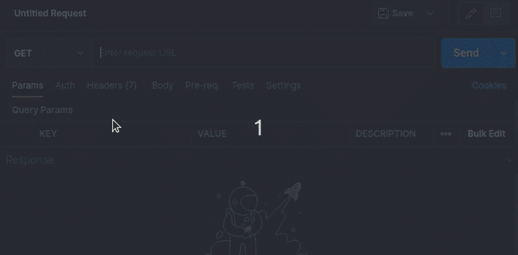
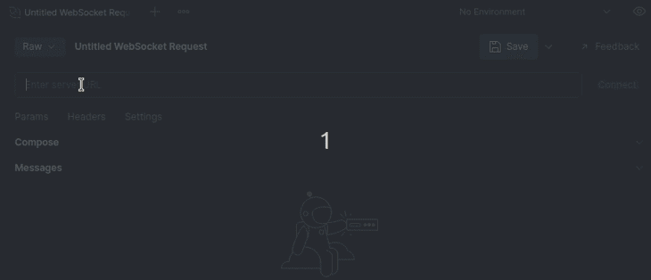
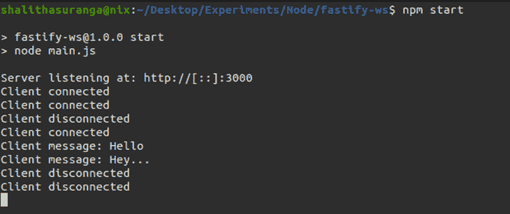
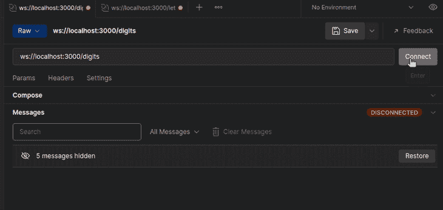
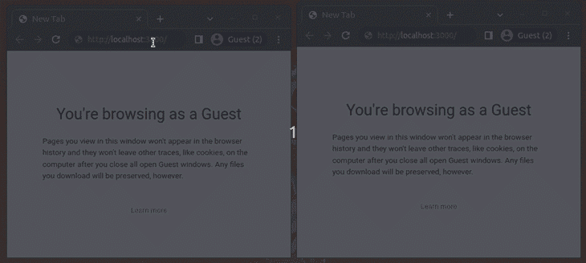

# 在 Fastify 中使用 WebSockets

> 原文：<https://blog.logrocket.com/using-websockets-with-fastify/>

Web 开发人员经常选择 Node.js 来编写 web 后端，因为它具有简单的开发环境、丰富的库生态系统、异步单线程特性以及支持性的开发人员社区。

我们还可以根据我们的开发需求，使用各种通信机制来实现 Node.js web 后端。大多数开发团队选择基于 HTTP 的 RESTful 模式，但是一些开发团队在同一个 Node.js 服务器上使用带有 RESTful 端点的 WebSockets 来实现实时的双向通信通道。Express.js、Fastify 和 NestJS 等流行的 Node.js web 框架通过官方或第三方插件提供了 WebSockets 集成，这很有帮助。

在本教程中，我将解释如何使用 [`fastify-websocket`插件](https://github.com/fastify/fastify-websocket)在基于 Fastify 的 RESTful web APIs 中启用实时通信通道。我们将涵盖:

## Fastify-WebSocket 特性

Fastify-WebSocket 插件允许开发人员使用 WebSocket 协议特性扩展 Fastify RESTful 后端。这个插件使用 Node.js [ws 库](https://github.com/websockets/ws)作为底层 WebSocket 服务器实现，并附带了四个优秀的特性，我将在下面详细介绍。

### 在 RESTful 处理程序中处理 WebSocket 消息

Fastify-WebSocket 插件不会启动另一个 HTTP 服务器实例来启动 WebSocket 连接。相反，默认情况下，它使用相同的 Fastify 服务器实例。因此，您可以在任何 Fastify `GET`端点处理程序中处理 WebSocket 事件。

### 订阅端点内的 WebSocket 客户端事件处理程序

WebSocket 客户端事件——如连接初始化、接收消息和连接终止——在实时 web 应用程序开发中总是很有帮助。Fastify-WebSocket 插件允许开发人员通过公开底层 Node.js ws 库对象来订阅这些客户端事件。

### 通过钩子控制 WebSocket 连接

Fastify Hooks API 有助于监听 Fastify HTTP 路由生命周期中的特定事件。我们可以使用这个特性在 [WebSocket 握手](https://en.wikipedia.org/wiki/WebSocket#Protocol_handshake)发生之前验证 WebSocket 连接。

### 打字稿**s**support

Fastify-WebSocket 库带有内置的 TypeScript 定义文件，因此您不需要为基于 TypeScript 的 Fastify-WebSocket 项目提供第三方 TypeScript 定义。

## Fastify-WebSocket 教程:创建基本的 WebSocket 端点

我们将使用 Fastify-WebSocket 插件构建几个示例项目。在本教程中，我们将探索构建基于 Fastify 的实时应用程序所需的所有特性。

首先，让我们创建一个新的 Fastify 项目来开始。

### 创建新的 Fastify 项目

在安装 Fastify 框架之前，我们需要为示例项目创建一个新的 Node.js 模块。输入以下命令创建新的 Node.js 模块:

```
mkdir fastify-ws
cd fastify-ws

npm init -y  
# or 
yarn init -y

```

上面的命令将为我们的新项目创建一个带有一些默认值的`package.json`文件。然而，你也可以使用`npm init fastify`来搭建一个基于[预定义模板](https://github.com/fastify/fastify-cli/tree/master/templates/app)和 [create-fastify](https://github.com/fastify/create-fastify) 启动脚本的新项目；为了简单起见，我们将创建一个空白项目。

接下来，使用以下命令安装 Fastify 框架:

```
npm install fastify
# or
yarn add fastify

```

现在，让我们用 JSON 响应创建一个`GET`端点。创建一个名为`main.js`的新文件，并添加以下代码:

```
const fastify = require('fastify')();

fastify.get('/hello', (request, reply) => {
    reply.send({
        message: 'Hello Fastify'
    });
});

fastify.listen({ port: 3000 }, (err, address) => {
    if(err) {
        console.error(err);
        process.exit(1);
    }
    console.log(`Server listening at: ${address}`);
});

```

将以下脚本部分添加到`package.json`文件中，以定义 Node.js 模块的`start`脚本:

```
"scripts": {
    "start": "node main.js"
}

```

使用`npm start`运行上面的示例代码，并使用 Postman 调用`GET /hello`端点，如下所示:



### **向端点添加 WebSocket 支持**

让我们创建一个支持 WebSocket 的端点来接受 WebSocket 客户端连接。输入以下命令安装 Fastify-WebSocket 插件:

```
npm install fastify-websocket
# or 
yarn add fastify-websocket

```

现在，我们需要在定义支持 WebSocket 的端点之前激活插件。在我们初始化`fastify`常量后，立即添加以下代码:

```
fastify.register(require('fastify-websocket'));

```

上面的代码为 Fastify RESTful 路由器添加了 WebSocket 支持。接下来，使用 WebSocket 支持创建一个名为`/hello-ws`的新的`GET`端点，如下所示。

```
fastify.get('/hello-ws', { websocket: true }, (connection, req) => {
    connection.socket.on('message', message => {
        connection.socket.send('Hello Fastify WebSockets');
    });
});

```

上面的端点定义看起来像一个典型的 Fastify 端点，但是它使用了一个额外的`{ websocket: true }`配置对象来允许 WebSocket 握手。

下面是添加 WebSocket 端点后的完整源代码:

```
const fastify = require('fastify')();
fastify.register(require('fastify-websocket'));

fastify.get('/hello', (request, reply) => {
    reply.send({
        message: 'Hello Fastify'
    });
});

fastify.get('/hello-ws', { websocket: true }, (connection, req) => {
    connection.socket.on('message', message => {
        connection.socket.send('Hello Fastify WebSockets');
    });
});

fastify.listen({ port: 3000 }, (err, address) => {
    if(err) {
        console.error(err);
        process.exit(1);
    }
    console.log(`Server listening at: ${address}`);
});

```

上面的代码实现了两个端点:返回 JSON 有效负载的`GET /hello`和通过 HTTP 协议接受 WebSocket 握手的`GET /hello-ws`。此外，当服务器收到新的 WebSocket 消息时，它会向特定的 WebSocket 客户端返回一条问候消息。

让我们测试一下上面的 WebSocket 端点。

### **测试** **我们的** **基本 WebSocket 端点与邮递员**

通常，开发人员编写客户端应用程序来测试他们的 WebSocket 服务器实现，但是 Postman 让您无需编写代码就可以检查任何 WebSocket 连接。

从**新**主菜单中选择 **WebSocket 请求**菜单项，在 Postman 中打开一个新的 WebSocket 测试选项卡。连接到 WebSocket 端点并发送消息，如下所示。



如图所示，对于您发送的每条消息，您将从 WebSocket 服务器获得一条问候消息。这里，我们需要使用 WebSocket 协议 URL 连接到服务器；也就是说，我们可以使用以下 URL 格式通过`GET /hello-ws`端点建立 WebSocket 连接:

```
ws://localhost:3000/hello-ws

```

如果您通过 [TLS 连接](https://en.wikipedia.org/wiki/Transport_Layer_Security)连接到您的生产服务器，您需要使用`wss`而不是`ws`，因为我们将使用`https`而不是`http`。

### 使用 WebSocket 客户端事件处理程序

WebSocket 概念是一种用于管理 web 服务器和客户端之间实时双向连接的解决方案。如果您使用 WebSockets 构建一个群聊应用程序，您通常需要知道新客户端何时连接和断开。Fastify-WebSocket 库允许您通过底层的 [ws 库](https://github.com/websockets/ws)实现订阅这些事件。

使用以下代码片段更新当前的`GET /hello-ws`端点实现，以试验客户端事件处理程序:

```
fastify.get('/hello-ws', { websocket: true }, (connection, req) => {
    // Client connect
    console.log('Client connected');
    // Client message
    connection.socket.on('message', message => {
        console.log(`Client message: ${message}`);
    });
    // Client disconnect
    connection.socket.on('close', () => {
        console.log('Client disconnected');
    });
});

```

当 WebSocket 握手成功时，插件调用 WebSocket 端点处理程序，我们可以用它来检测客户端连接事件。

如上所示，我们可以使用`close`事件处理程序来识别 WebSocket 客户端的断开。对于每个传入的客户端消息，都会调用`message`事件处理程序。

尝试打开几个 Postman WebSocket 测试选项卡，发送一些消息——你会在终端上看到客户端事件，如下图所示。



我们还没有编写任何代码来存储客户端连接细节，但是我们将在本教程稍后构建实时聊天应用程序示例时讨论它。

## Fastify-WebSocket 教程:使用同一个服务器创建多个 WebSocket 端点

Fastify-WebSocket 插件非常灵活。它允许您通过路由定义创建多个 WebSocket 端点。

通过将`{ websocket: true }`配置对象添加到路由定义中，可以创建任意数量的支持 WebSocket 的 RESTful 端点。请看下面的例子:

```
const fastify = require('fastify')();
fastify.register(require('fastify-websocket'));

fastify.get('/digits', { websocket: true }, (connection, req) => {
    let timer = setInterval(() => {
        connection.socket.send(randomDigit(1, 10).toString());
    }, 1000);
    connection.socket.on('close', () => {
        clearInterval(timer);
    });
});

fastify.get('/letters', { websocket: true }, (connection, req) => {
    let timer = setInterval(() => {
        connection.socket.send(randomLetter());
    }, 1000);
    connection.socket.on('close', () => {
        clearInterval(timer);
    });
});

fastify.listen({ port: 3000 }, (err, address) => {
    if(err) {
        console.error(err);
        process.exit(1);
    }
    console.log(`Server listening at: ${address}`);
});

function randomDigit(min, max) {
    return Math.floor(Math.random() * (max - min) + min);
}

function randomLetter() {
    return 'abcdefghijklmnopqrstuvwxyz'[randomDigit(1, 26)];
}

```

上面的代码片段实现了两个 WebSocket 端点:

*   `GET /digits`:此 WebSocket 端点在连接后会发送随机数字
*   `GET /letters`:这个 WebSocket 端点一旦连接上就发送随机的英文字母

您可以通过连接到 Postman 来同时测试上述 WebSocket 端点，如下所示。



类似地，您可以在同一个 Fastify 服务器上实现更多的 WebSocket 端点，并且通过将一个支持 WebSocket 的`GET`端点注册到`/*`路由，您可以通过任何`GET`端点接受 WebSocket 连接。

### 配置 WebSocket 服务器

ws Node.js 库在这里再次发挥作用，处理 WebSocket 数据传输。它的 WebSocket 实现接受一个带有几个属性的配置对象，所以 fastify-websocket 插件也接受这些配置属性。

例如，我们可以通过`maxPayload`属性改变允许的最大消息大小，如下所示。

```
fastify.register(require('fastify-websocket'), {
    options: {
        maxPayload: 10 // in bytes
    }
});

```

您可以从 [ws 模块文档](https://github.com/websockets/ws/blob/master/doc/ws.md#new-websocketserveroptions-callback)中浏览所有支持的数据传输配置选项。

### **用** **钩子**验证 WebSocket 连接初始化

在某些场景中，我们可能需要根据一组验证规则只接受特定的 WebSocket 连接请求。例如，我们可以通过检查 URL 查询参数或 HTTP 头来允许 WebSocket 连接。

我们可以用`prevValidation`钩子有条件地接受或拒绝传入的 WebSocket 连接。以下服务器端代码允许 WebSocket 客户端使用 URL 中的`username`查询参数连接到服务器:

```
const fastify = require('fastify')();
fastify.register(require('fastify-websocket'));

fastify.addHook('preValidation', async (request, reply) => {
    if(!request.query.username) {
        reply.code(403).send('Connection rejected');
    }
});

fastify.get('/*', { websocket: true }, (connection, req) => {
    connection.socket.send(`Hello ${req.query.username}!`);
});

fastify.listen({ port: 3000 }, (err, address) => {
    if(err) {
        console.error(err);
        process.exit(1);
    }
    console.log(`Server listening at: ${address}`);
});

```

上面的代码片段使用通配符路由语法(`/*`)从任何`GET`端点寻找 WebSocket 连接，但是如果存在`username`查询参数，它将有条件地接受连接。例如，您不能使用以下 URL 建立 WebSocket 连接:

```
ws://localhost:3000
ws://localhost:3000/ws
ws://localhost:3000/hello-ws

```

但是您可以建立一个 WebSocket 连接，并接收带有以下 URL 的问候消息:

```
ws://localhost:3000?username=Fastify
ws://localhost:3000/ws?username=Developer
ws://localhost:3000/hello-ws?username=Nodejs
ws://localhost:3000/hello-ws?username=Nodejs&anotherparam=10

```

此外，您还可以通过检查 WebSocket 握手头来验证 WebSocket 连接初始化，方法是通过`request.headers`属性。

### 在同一路由中处理 HTTP 响应和 WebSockets

 **假设有人从 web 浏览器访问 WebSocket 端点，您需要用 HTTP 响应进行回复。然后，如果端点接收到正常的 HTTP 请求，我们需要返回特定的 HTTP 响应，但是我们仍然需要执行 WebSocket 握手来接受传入的 WebSocket 连接。

我们可以通过使用 Fastify 的[完整声明语法](https://www.fastify.io/docs/latest/Reference/Routes/#full-declaration)在同一个端点中处理这两种协议，如下所示。

```
fastify.route({
    method: 'GET',
    url: '/hello',
    handler: (req, reply) => {
        // HTTP response
        reply.send({ message: 'Hello Fastify' });
    },
    wsHandler: (conn, req) => {
        // WebSocket message
        conn.socket.send('Hello Fastify WebSockets');
    }
});

```

这里，我们通过`handler`回调进行 HTTP 响应，并通过`wsHandler`回调与 WebSocket 客户端通信。这两个操作都发生在`GET /hello`端点内。

## Fastify-WebSocket 教程:用 fastify-websocket 构建一个简单的聊天应用

我们已经讨论了 fastify-websocket 插件提供的几乎所有功能，所以是时候使用这些功能构建一个简单的群聊应用程序了。

这个聊天应用程序可以让任何人通过输入用户名进入群组对话。一旦用户输入用户名，聊天应用程序就会让特定用户为所有用户发布消息。

让我们保持简单，用普通的 JavaScript 和普通的 HTML 构建这个应用程序。

### 设置 fastify-static 插件

首先，我们需要安装 [fastify-static](https://github.com/fastify/fastify-static) 插件，使静态文件服务特性能够服务于聊天应用程序前端。使用以下命令安装插件:

```
npm install fastify-static
# or 
yarn add fastify-static

```

接下来，将以下代码添加到您的`main.js`文件中:

```
const fastify = require('fastify')();
const path = require('path');

fastify.register(require('fastify-websocket'));
fastify.register(require('fastify-static'), {
    root: path.join(__dirname, 'www')
});

fastify.addHook('preValidation', async (request, reply) => {
    if(request.routerPath == '/chat' && !request.query.username) {
        reply.code(403).send('Connection rejected');
    }
});

fastify.get('/chat', { websocket: true }, (connection, req) => {
    // New user
    broadcast({
        sender: '__server',
        message: `${req.query.username} joined`
    });
    // Leaving user
    connection.socket.on('close', () => {
        broadcast({
            sender: '__server',
            message: `${req.query.username} left`
        });
    });
   // Broadcast incoming message
    connection.socket.on('message', (message) => {
        message = JSON.parse(message.toString());
        broadcast({
            sender: req.query.username,
            ...message
        });
    });
});

fastify.listen({ port: 3000 }, (err, address) => {
    if(err) {
        console.error(err);
        process.exit(1);
    }
    console.log(`Server listening at: ${address}`);
});

function broadcast(message) {
    for(let client of fastify.websocketServer.clients) {
        client.send(JSON.stringify(message));
    }
}

```

上面的服务器端实现包含一个静态文件服务器来服务前端应用程序资源。它还处理聊天应用程序的 WebSocket 服务器端事件，即当一个新的聊天客户端试图建立连接时，它通过检查`username`查询参数的存在有条件地接受连接。此外，它还会在以下情况下通知所有聊天客户端:

*   一个新用户加入了对话
*   用户从应用前端发送消息
*   现有用户离开对话

所有唯一的 WebSocket 客户端连接引用都存储在`fastify.websocketServer.clients` [Set_](https://developer.mozilla.org/en-US/docs/Web/JavaScript/Reference/Global_Objects/Set) 中，因此我们可以循环访问它并向所有连接的聊天用户发送消息。这个动作在基于 WebSocket 的应用程序中被称为广播；我们已经在`broadcast`函数中实现了它。

在开发前端之前，还可以用 Postman 测试 WebSocket 端点。尝试打开几个 WebSocket 测试选项卡，通过提供不同的用户名来连接 WebSocket 端点。

### 构建聊天应用前端

让我们构建聊天应用程序前端。创建一个名为`www`的目录，并在项目目录中创建`index.html`，您将在其中添加以下代码:

```
<!DOCTYPE html>
<html lang="en">
<head>
    <title>Chat</title>
    <meta charset="UTF-8" />
    <meta name="viewport" content="width=device-width,initial-scale=1" />
    <meta name="description" content="" />
    <style>
        html, body {
            margin: 0;
            padding: 0;
        }

        * {
            box-sizing: border-box;
            font-family: Arial;
        }
#chat {
            width: 100vw;
            height: 100vh;
            padding: 12px;
        }
#chat div {
            padding: 4px 0px;
        }
#chat div b {
            color: #555;
        }
input[type=text] {
            position: fixed;
            bottom: 10px;
            left: 12px;
            outline: none;
            width: 400px;
            border: #555 solid 1px;
            font-size: 14px;
            padding: 4px;
        }
    </style>
</head>
<body>
    <div id="chat"></div>
    <input id="message" type="text" autofocus/>
<script>
        let _ws = null;
init();
function init() {
            let username = getUsername();
if(!username) {
                sessionStorage.setItem('username', prompt('Enter username'))
                username = getUsername();
            }
if(!username) {
                init();
            }
_ws = new WebSocket(`ws://${window.location.host}/chat?username=${username}`);
_ws.onmessage = (message) => {
                message = JSON.parse(message.data);
                appendMessage(message);
            };
document.getElementById('message')
                .onkeypress = (evt) => {
                    if(evt.key == 'Enter') {
                        _ws.send(JSON.stringify({
                            message: evt.target.value
                        }));
                        evt.target.value = '';
                    }
                };
        }
function getUsername() {
            return sessionStorage.username;
        }
function appendMessage(message) {
            document.getElementById('chat').innerHTML +=
            `
            <div>
                <b>${message.sender}:&nbsp;</b>
                ${message.message}
            </div>
`
        }
    </script>
</body>
</html>

```

上面的代码实现了我们刚刚用 Fastify-WebSocket 插件构建的聊天应用程序后端的最小前端。使用`npm start`(或`yarn start`)命令启动 Fastify 服务器，并转到以下 URL 访问聊天应用程序:

```
http://localhost:3000

```

尝试打开多个浏览器窗口并测试应用程序，如下所示。



你可以从[我的 GitHub 库](https://github.com/codezri/fastify-websocket-chat)下载完整的源代码。

## Fastify-web socket vs . ws vs . Fastify-ws

Fastify-WebSocket 插件是向现有的基于 Fastify 的 RESTful web 服务添加 WebSocket 端点的一个很好的解决方案。此外，如果您计划构建一个像我们的演示聊天应用程序这样的实时 web 应用程序，使用 fastify、fastify-websocket 和 fastify-static Node.js 模块可以让您的项目快速启动。

然而，如果您需要对 WebSocket 服务器的生命周期、事件和配置进行更多的控制，那么直接使用 ws 库是一个好主意。Fastify-WebSocket 插件包装了 ws 库的功能，为您提供一个抽象的 Fastify 插件。然而，该插件对于任何通用的实时应用程序来说都足够灵活，因为它提供了一种直接的方式来订阅每一个必要的 WebSocket 客户端事件。

还有用于为基于 fastify 的 web 服务添加 WebSocket 插件的 [fastify-ws](https://github.com/gj/fastify-ws) 第三方插件，但遗憾的是，它没有被积极开发，也不支持 fastify-websocket 插件提供的功能(尤其是为特定路线添加 websocket 支持)。

## 组织 Fastify-WebSocket 代码的快速指南

在这篇文章中，我们讨论了两种不同的协议:RESTful HTTP 和 WebSockets。RESTful 模式遵循无状态、单向和基于请求-响应的通信策略，而 WebSocket 概念是异步的，是典型的有状态通信机制。因此，我们需要仔细组织代码，以降低其复杂性并实现更好的可维护性。

考虑使用以下要点来组织基于 Fastify-WebSocket 的代码库:

*   使用类似 MVC 的项目结构，通过分离路由、处理程序、控制器和助手模块来增强可维护性
*   如果您的 WebSocket 事件处理逻辑增长，编写单独的消息处理函数而不是匿名函数(如果需要，将它们移动到单独的模块中)
*   尽量不要将典型的 RESTful 端点与支持 WebSocket 的端点混合使用——如果可能的话，将 WebSocket 端点隔离到一个模块中
    *   例如，您可以创建一个名为`chat.js`的文件，并放置实时聊天模块的 WebSocket 端点和事件处理程序
*   尝试应用 [DRY](https://en.wikipedia.org/wiki/Don%27t_repeat_yourself) 编程原则，为事件处理程序中的重复代码创建共享函数
    *   比如我们一起搭建的聊天 app 里的`broadcast`功能！

## 结论

在本教程中，我们通过几个实例学习了如何使用 Fastify-WebSocket 插件。

Fastify 开发团队开发了这个插件作为 ws 库的包装器，但是它最有用，因为它让我们可以进行经常需要的定制。该插件的目标是支持 Fastify 开发人员使用相同的 Fastify 路由语法将支持 WebSocket 的端点添加到 RESTful web 服务中。

因此，开发人员可以使用实时 web 应用模块轻松扩展他们的 RESTful 应用后端，例如内置聊天系统、监控仪表板等等。它的最大优点是所有 WebSocket 和 HTTP 连接只使用一个网络端口——使您的身份验证策略变得简单。

Fastify-WebSocket 插件项目正在积极开发中，提供了良好的开发人员支持，并提供了内置的 TypeScript 支持——因此我们可以毫无疑问地在我们的 Fastify 项目中使用它。

## 使用 [LogRocket](https://lp.logrocket.com/blg/signup) 消除传统错误报告的干扰

[](https://lp.logrocket.com/blg/signup)

[LogRocket](https://lp.logrocket.com/blg/signup) 是一个数字体验分析解决方案，它可以保护您免受数百个假阳性错误警报的影响，只针对几个真正重要的项目。LogRocket 会告诉您应用程序中实际影响用户的最具影响力的 bug 和 UX 问题。

然后，使用具有深层技术遥测的会话重放来确切地查看用户看到了什么以及是什么导致了问题，就像你在他们身后看一样。

LogRocket 自动聚合客户端错误、JS 异常、前端性能指标和用户交互。然后 LogRocket 使用机器学习来告诉你哪些问题正在影响大多数用户，并提供你需要修复它的上下文。

关注重要的 bug—[今天就试试 LogRocket】。](https://lp.logrocket.com/blg/signup-issue-free)**