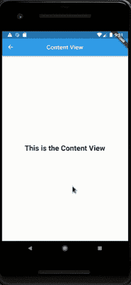

# 在 Android 导航的 Flutter 中使用 WillPopScope

> 原文：<https://blog.logrocket.com/using-willpopscope-flutter-android-navigation/>

## 介绍

你在你最喜欢的应用程序上，滚动浏览内容，你已经花了几分钟享受内容，我可以补充说，这是迷人的。突然，在阅读某一特定内容时，页面会弹回。令人惊讶的是，你发现你的手指碰到了后退按钮。

如果你可以前进到页面并从停止的地方继续，这可能不是什么大问题，但如果应用程序已经刷新了屏幕或设置为在你进入页面时随时显示更新的内容，那么，你已经失去了在屏幕上的位置或滚动特定内容时的位置。

这些和许多更重要的事情(嗯…那条特别的推特*wa*T2 对我来说很重要)对整体用户体验有影响。在构建应用程序时，采取措施来防止这些情况的发生绝对应该是您要做的事情之一。

在本文中，我们将研究本文中的一种度量:WillPopScope 小部件。具体来说，我们将涵盖:

我们走吧。

```
  WillPopScope WillPopScope({
    required Widget child,
    required Future<bool> Function()? onWillPop,
  })

```

小部件附带了 Flutter 框架。它让我们可以控制后退按钮的动作，如果当前页面满足某些要求，就可以返回到上一个页面。这是使用回调实现的，小部件将回调作为其参数之一。

如 [Flutter 官方文档](https://api.flutter.dev/flutter/widgets/WillPopScope-class.html)中所述，该小部件:

> 注册一个回调来阻止用户试图关闭包围的 [`ModalRoute`](https://api.flutter.dev/flutter/widgets/ModalRoute-class.html)

有了`WillPopScope`小部件，你可以有效地防止类似介绍中描述的情况:通过提供额外的验证手段，用户可以选择取消/防止他们当前的页面弹出，即返回。

`WillPopScope`小部件需要两个参数:

*   `onWillPop`回调:处理动作并使用布尔值确定页面是否应该弹出；如果为真，页面会弹回，如果为假，页面会保持不变
*   `child`小部件:视图的小部件

在下一节中，我们将在实际应用程序中使用它们。我们开始吧。

## 如何在 Flutter app 中使用`WillPopScope`

我们将构建一个示例应用程序来演示运行中的`WillPopScope`小部件。示例应用程序包含两个页面，分别是`homeView`和`contentView`。

`homeView`有一些文本和一个按钮。我们将使用按钮导航到下一页，这是`contentView`并包含`WillPopScope`小部件。

`WillPopScope`将捕捉后退按钮，并在此视图中单击后退按钮时执行操作。我们将展示两种不同的处理后退按钮的方法，你可能在你用过的其他应用程序中见过。它们是:

*   `AlertDialog`方法:AlertDialog 方法向用户显示一个弹出窗口，要求他们确认是否要转到上一个屏幕。然后用户可以选择**是**或**否**(可以使用任何其他表示真或假的词)。
*   `SnackBar`方法:snackbar 方法要求用户“再次按 back 按钮返回”

如前所述，`WillPopScope`小部件有一个回调函数，在这个回调函数中，我们将显示一个警告对话框，其中有一个问题(“您想返回吗？”)和两个动作选项(一个**是**按钮和一个**否**按钮)或一个 snackbar，要求用户再次按下后退按钮返回。

弄清楚这一点后，让我们开始编码。

### 创建和设置 Flutter 应用

首先创建一个新项目，并使用下面的命令生成必要的文件和文件夹:

```
flutter create willpopscope_tutorial

```

一旦完成，进入`lib`文件夹中的`main.dart`文件。这是应用程序的入口点。删除`home`小工具，返回`HomeView`。

我们将在下一步创建`HomeView`小部件。您也可以调整`MaterialApp`的标题来显示您想要的内容。

```
import 'package:flutter/material.dart';

void main() => runApp(const MyApp());

class MyApp extends StatelessWidget {
  const MyApp({Key? key}) : super(key: key);
  @override
  Widget build(BuildContext context) {
    return const MaterialApp(
     title: "WillPopScope Article",
     home: HomeView(),
   );
  }
}

```

### 创建`HomeView`

接下来，创建一个名为`HomeView`的`Stateless`小部件。这是我们示例应用程序的初始视图。它应该包含一个`Text`和一个`TextButton`。`TextButton`将用于导航到下一个视图，即`ContentView`。

```
class HomeView extends StatelessWidget {
  const HomeView({Key? key}) : super(key: key);
  @override
  Widget build(BuildContext context) {
    return Scaffold(
      appBar: AppBar(
        centerTitle: true,
        title: const Text('HomeView'),
      ),
      body: Center(
        child: Column(
          mainAxisAlignment: MainAxisAlignment.center,
          crossAxisAlignment: CrossAxisAlignment.center,
          children: [
            const Text(
              'HomeView',
              style: TextStyle(
                fontSize: 24,
                fontWeight: FontWeight.bold,
              ),
            ),
            const SizedBox(
              height: 24,
            ),
            TextButton(
              style: ButtonStyle(
                backgroundColor: MaterialStateProperty.all<Color>(Colors.blue),
              ),
              onPressed: () {
                Navigator.push(
                  context,
                  MaterialPageRoute(
                    builder: (context) {
                      return const ContentView();
                    },
                  ),
                );
              },
              child: const Text(
                'Go To ContentView',
                style: TextStyle(
                  color: Colors.white,
                ),
              ),
            ),
          ],
        ),
      ),
    );
  }
}

```

### 创建`ContentView`小部件

接下来，创建另一个`Stateless`小部件，并将其命名为`ContentView`。这是我们将使用`WillPopScope`的小部件。

```
class ContentView extends StatelessWidget {
  const ContentView({Key? key}) : super(key: key);
  @override
  Widget build(BuildContext context) {
    return Scaffold(
      body: Column(
        children: [],
      ),
    );
  }
}

```

这里我们将展示如何利用一个警告对话框来决定一个用户是否应该被返回。

用`WillPopScope`小部件包装`Scaffold`小部件。它接收`onWillPop`回调，捕获后退按钮动作，并在用户单击后退按钮时执行一个动作。

```
return WillPopScope(
  onWillPop: (){},
  child: Scaffold(
    body: Column(
      children: [],
    ),
  ),
);

```

在`onWillPop`回调中，我们将做两件事:

1.  向用户显示一个带有问题的警告对话框，要求他们点击一个动作按钮(或者**是**或者**否**
2.  使用对话框的响应弹出`ContentView`

为了获得用户的选择，我们将对话框的结果赋给一个布尔变量。在`ActionButtons`中，我们将数据(true 表示是，false 表示否)传入`Navigator.pop(context, true/false)`。该值随后被传递给`shouldPop`变量。

* * *

### 更多来自 LogRocket 的精彩文章:

* * *

接下来，我们返回`shouldPop`变量，该变量应该为真或假，并将用于确定`ContentView`是否应该弹出(当`shouldPop`为`true`时)或不弹出(当`shouldPop`为`false`时)。

```
  onWillPop: () async {
        final shouldPop = await showDialog<bool>(
          context: context,
          builder: (context) {
            return AlertDialog(
              title: const Text('Do you want to go back?'),
              actionsAlignment: MainAxisAlignment.spaceBetween,
              actions: [
                TextButton(
                  onPressed: () {
                    Navigator.pop(context, true);
                  },
                  child: const Text('Yes'),
                ),
                TextButton(
                  onPressed: () {
                    Navigator.pop(context, false);
                  },
                  child: const Text('No'),
                ),
              ],
            );
          },
        );
        return shouldPop!;
      },

```

这样，我们就完成了`ContentView`小部件。完整小部件的代码应该如下所示:

```
class ContentView extends StatelessWidget {
  const ContentView({Key? key}) : super(key: key);
  @override
  Widget build(BuildContext context) {
    return WillPopScope(
      onWillPop: () async {
        final shouldPop = await showDialog<bool>(
          context: context,
          builder: (context) {
            return AlertDialog(
              title: const Text('Do you want to go back?'),
              actionsAlignment: MainAxisAlignment.spaceBetween,
              actions: [
                TextButton(
                  onPressed: () {
                    Navigator.pop(context, true);
                  },
                  child: const Text('Yes'),
                ),
                TextButton(
                  onPressed: () {
                    Navigator.pop(context, false);
                  },
                  child: const Text('No'),
                ),
              ],
            );
          },
        );
        return shouldPop!;
      },
      child: Scaffold(
        appBar: AppBar(
          centerTitle: true,
          title: const Text('Content View'),
        ),
        body: Center(
          child: Column(
            mainAxisAlignment: MainAxisAlignment.center,
            crossAxisAlignment: CrossAxisAlignment.center,
            children: const [
              Text(
                'This is the Content View',
                style: TextStyle(
                  fontSize: 24,
                  fontWeight: FontWeight.bold,
                ),
              ),
            ],
          ),
        ),
      ),
    );
  }
}

```

完成这些后，我们已经完全设置好了`WillPopScope`小部件，并且可以使用一个警告对话框来防止无意中弹出一个特定的视图！

#### 测试它

让我们测试一下我们的示例应用程序。运行下面的命令来运行应用程序。

```
flutter run

```



这里我们将展示如何使用一个`SnackBar`来显示页面是否应该返回。我们将使用与前面的警报对话框方法相同的示例应用程序。我们将只对`onWillPop`回调中的逻辑进行调整，以显示一个`SnackBar`，并确定用户是否会被路由。

在`onWillPop`回调中，当用户点击后退按钮时，我们将做两件事:

1.  如果上一次点击后退按钮和这次点击之间的时间差等于或大于两秒，我们将向用户显示一个`SnackBar`，要求他们“再次按下后退按钮返回”
2.  如果时间差小于 2 秒(这是我们的用户再次按下后退按钮所需的理想时间；你可以调整这个来适应你的需要)，我们弹出`ContentView`。

让我们开始吧:

```
  DateTime lastTimeBackbuttonWasClicked = DateTime.now();
  onWillPop: () async {
        if (DateTime.now().difference(lastTimeBackbuttonWasClicked) >= Duration(seconds: 2)) {
          ScaffoldMessenger.of(context).showSnackBar(
            const SnackBar(
              content: Text("Press the back button again to go back"),
              duration: Duration(seconds: 2),
            ),
          );
          lastTimeBackbuttonWasClicked = DateTime.now();
          return false;
        } else {
          return true; 
        }
      },

```

这样，我们就完成了`ContentView`小部件。使用`SnackBar`方法的完整小部件的代码应该如下所示:

```
class ContentView extends StatelessWidget {
  const ContentView({Key? key}) : super(key: key);
  @override
  Widget build(BuildContext context) {
    DateTime lastTimeBackbuttonWasClicked = DateTime.now();
    return WillPopScope(
      onWillPop: () async {
        if (DateTime.now().difference(lastTimeBackbuttonWasClicked) >= Duration(seconds: 2)) {
          ScaffoldMessenger.of(context).showSnackBar(
            const SnackBar(
              content: Text("Press the back button again to go back"),
              duration: Duration(seconds: 2),
            ),
          );

          lastTimeBackbuttonWasClicked = DateTime.now();
          return false;
        } else {
          return true; 
        }
      },
      child: Scaffold(
        appBar: AppBar(
          centerTitle: true,
          title: const Text('Content View'),
        ),
        body: Center(
          child: Column(
            mainAxisAlignment: MainAxisAlignment.center,
            crossAxisAlignment: CrossAxisAlignment.center,
            children: const [
              Text(
                'This is the Content View',
                style: TextStyle(
                  fontSize: 24,
                  fontWeight: FontWeight.bold,
                ),
              ),
            ],
          ),
        ),
      ),
    );
  }
}

```

通过使用 snackbar，我们确保了更高的准确性，并防止我们的视图在无意中返回。

#### 测试它

让我们测试一下我们的示例应用程序。运行以下命令来运行应用程序:

```
flutter run

```


## 结论

耶！您现在已经看到了我们如何使用`WillPopScope`小部件实际解决导航问题并微调用户的浏览体验。从显示对话框确认到执行自定义操作到处理流等等，您可以使用这个小部件做很多事情，比如显示 snackbar 或 toast 消息。尽可能多地探索你的选择，并在构建你的下一个 Flutter 应用时使用它们。

查看示例应用程序的[完整源代码](https://github.com/Blazebrain/willpopscope_article.git)。如果您有任何问题或咨询，请随时在 Twitter: [@Blazebrain01](https://twitter.com/Blazebrain01) 或 LinkedIn: [Blazebrain](https://www.linkedin.com/in/david-adegoke) 联系我。

## 使用 [LogRocket](https://lp.logrocket.com/blg/signup) 消除传统错误报告的干扰

[](https://lp.logrocket.com/blg/signup)

[LogRocket](https://lp.logrocket.com/blg/signup) 是一个数字体验分析解决方案，它可以保护您免受数百个假阳性错误警报的影响，只针对几个真正重要的项目。LogRocket 会告诉您应用程序中实际影响用户的最具影响力的 bug 和 UX 问题。

然后，使用具有深层技术遥测的会话重放来确切地查看用户看到了什么以及是什么导致了问题，就像你在他们身后看一样。

LogRocket 自动聚合客户端错误、JS 异常、前端性能指标和用户交互。然后 LogRocket 使用机器学习来告诉你哪些问题正在影响大多数用户，并提供你需要修复它的上下文。

关注重要的 bug—[今天就试试 LogRocket】。](https://lp.logrocket.com/blg/signup-issue-free)