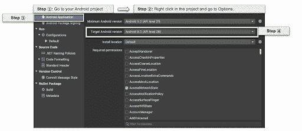
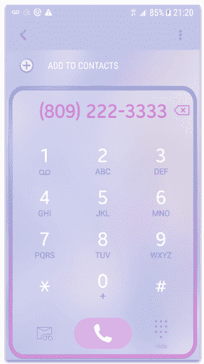
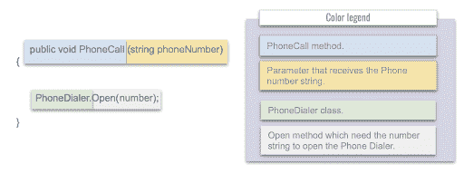
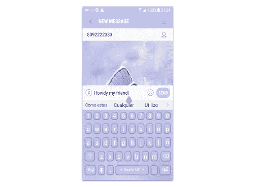

# 使用 Xamarin。管理电话和短信的基本要素

> 原文：<https://blog.logrocket.com/using-xamarin-essentials-to-manage-phone-calls-and-sms/>

我很高兴在这里见到你！在本教程中，我们将探索 Xamarin 中两个非常重要的功能:如何管理电话拨号器和如何发送短信。我们将通过 Xamarin 的 API 来学习如何使用它们。必需品为我们提供了。💚

如今，在我们的应用程序中集成电话和 SMS 交互是很有用的，这样就可以制作一个至少覆盖用户基本功能的产品。这样，用户可以留在应用程序中，而无需退出应用程序来发送信息或打电话。

过去，我们不得不添加两个 [NuGet](https://www.nuget.org/packages) 包——一个用于通话，一个用于短信——这既复杂又耗时。现在，我们可以用更简单的方法创建一个电话拨号器。让我们从解释如何使用电话拨号器开始，然后是短信。

## 什么是 Xamarin？必备品？

[Xamarin。Essentials](https://docs.microsoft.com/en-us/xamarin/essentials/) 为您的移动应用提供了一个跨平台的开发者 API，并允许我们在整个 Xamarin Forms 环境、Android、iOS 或 UWP 中进行开发。

太好了！那么 Xamarin 有哪些功能/API 呢？必需品优惠？有几个，如短信，加速度计，电话拨号器，偏好设置，等等。如果你想了解所有这些功能以及如何实现每一个功能，我推荐[这篇文章](https://docs.microsoft.com/en-us/xamarin/essentials/)，其中有每个功能的特性指南。

### 设置 Xamarin。特定平台上的基本要素

重要的是要知道 Xamarin。Essentials 支持最低版本的 Android 4.4，对应 API 19 级，但 build 的目标 Android 版本必须是 9.0 或 10.0，对应 API 28 级和 29 级。

如果你是最新的，Xamarin。Essentials 已经添加到您的项目中，因此此时您不需要额外的配置。

如果你有旧版本和 Xamarin。Essentials 运行得不好，您可以[在文档](https://docs.microsoft.com/en-us/xamarin/essentials/get-started?tabs=windows%2Cios)中查看您的实现是否一切正常。

## Xamarin 入门。必需品；要素

### **🔧平台设置**

在某些情况下，每个平台都需要额外的设置来使实现有效。这种情况下，配置只需要 Android。让我们设置使用电话拨号器和 SMS 所需的所有配置。

首先，从您的 Android 项目中打开 **MainActivity.xml** 文件，并在 manifest 节点中添加以下代码:

📞**电话拨号器:**

```
<queries>
  <intent>
    <action android:name="android.intent.action.DIAL" />
    <data android:scheme="tel"/>
  </intent>
</queries>
```

**短信:**

```
<queries>
  <intent>
    <action android:name="android.intent.action.VIEW" />
    <data android:scheme="smsto"/>
  </intent>
</queries>
```

验证你的目标 Android 版本很重要。为此，只需遵循以下步骤:

如上图所示，请执行以下步骤:

1.  转到您的 **Android 项目**
2.  在项目中右键单击并转到**选项**
3.  转到**安卓应用**
4.  转到**目标 Android 版本**并将“Android 9.0”(API 级别 28)设置为默认版本

如果您的目标 Android 版本设置为 Android 11，您必须使用新的[包可见性需求](https://developer.android.com/preview/privacy/package-visibility)使用的查询来更新您的 Android 清单。

iOS 和 UWP 都不需要额外的设置。

## **用 Xamarin 打电话。要领**

为了打电话，我们有一个`PhoneDialer`类，它允许我们打开电话号码拨号器。

在内部，当我们使用这个 API 时，当电话号码出现在电话键盘上时，它根据电话号码的来源国家对其进行格式化。


我们来看看要实现的结构:


首先，我们为可以接收电话号码参数并且名为`PlacePhoneCall`的调用创建方法。接下来我们添加这个解释最重要的类，就是`PhoneDialer`。这个类允许我们打开手机的数字键盘。

最后，使用`Open`方法，我们添加了我们希望在数字键盘打开时显示的电话号码。(我们已经在名为`PlacePhoneCall`的父方法中要求了这些信息。)

下面是代码示例:

```
public void PlacePhoneCall(string number)
 {
            PhoneDialer.Open(number);
 }

```

搞定了。我们的电话拨号器准备好了！🌟

## **使用 Xamarin 发送手机短信。要领**

`SMS`类允许我们通过`ComposeAsync`方法打开留言板，该方法接收一个`SmsMessage`值作为参数。

SMS 消息以值的形式接收正文和接收者，如下:

现在我们来看看图形结构:


在这个例子中，我们创建了`SendSms`方法，在其中我们可以添加类来发送 SMS。我们将收到短信文本和收件人的参数。

在之前创建的方法中，我们添加了`Sms`类，它负责打开带有所需文本的留言板。

最后，我们添加了`ComposeAsync`方法，它将接收您想要呈现的消息。请注意，我们使用的是异步方法。如果你想了解更多关于这个话题的信息，[看看这篇文章](https://channel9.msdn.com/Shows/XamarinShow/Best-Practices-Async--Await--The-Xamarin-Show)。

> ⚠注意到消息变量是类型`SmsMessage`，它负责接收消息的文本。稍后，收件人将通过`ComposeAsync`方法发送。您将在下面添加的代码实现中看到这个示例。

下面是一个代码示例:

```
public async Task SendSms(string messageText, string recipient)
    {
            var message = new SmsMessage(messageText, new []{ recipient });
            await Sms.ComposeAsync(message);
     }
```

如果你想发送短信给多个用户，你可以！为此，必须通过字符串数组来更改参数类型:

```
public async Task SendSms(string messageText, string[] recipients)
    {
            var message = new SmsMessage(messageText, recipient );
            await Sms.ComposeAsync(message);
        }

```

搞定了。我们的短信准备好了！🌟感谢阅读！

## 使用 [LogRocket](https://lp.logrocket.com/blg/signup) 消除传统错误报告的干扰

[](https://lp.logrocket.com/blg/signup)

[LogRocket](https://lp.logrocket.com/blg/signup) 是一个数字体验分析解决方案，它可以保护您免受数百个假阳性错误警报的影响，只针对几个真正重要的项目。LogRocket 会告诉您应用程序中实际影响用户的最具影响力的 bug 和 UX 问题。

然后，使用具有深层技术遥测的会话重放来确切地查看用户看到了什么以及是什么导致了问题，就像你在他们身后看一样。

LogRocket 自动聚合客户端错误、JS 异常、前端性能指标和用户交互。然后 LogRocket 使用机器学习来告诉你哪些问题正在影响大多数用户，并提供你需要修复它的上下文。

关注重要的 bug—[今天就试试 LogRocket】。](https://lp.logrocket.com/blg/signup-issue-free)