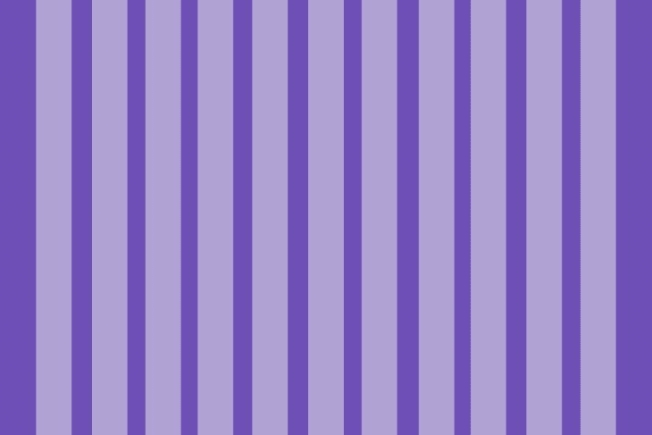
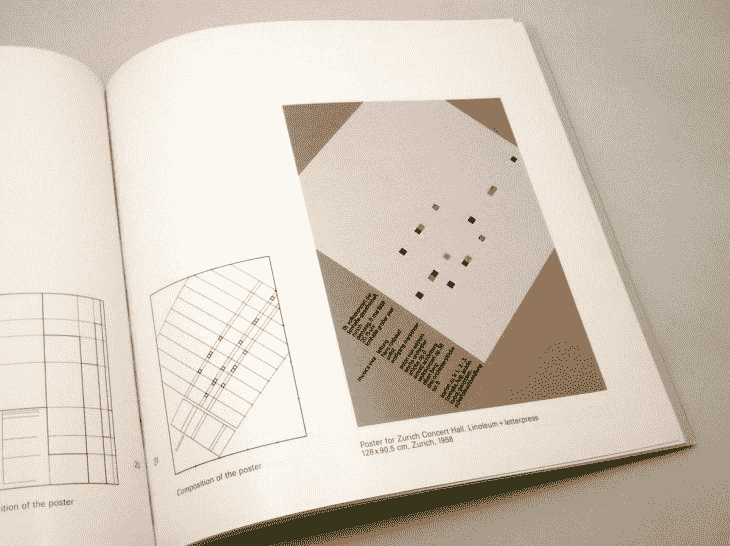
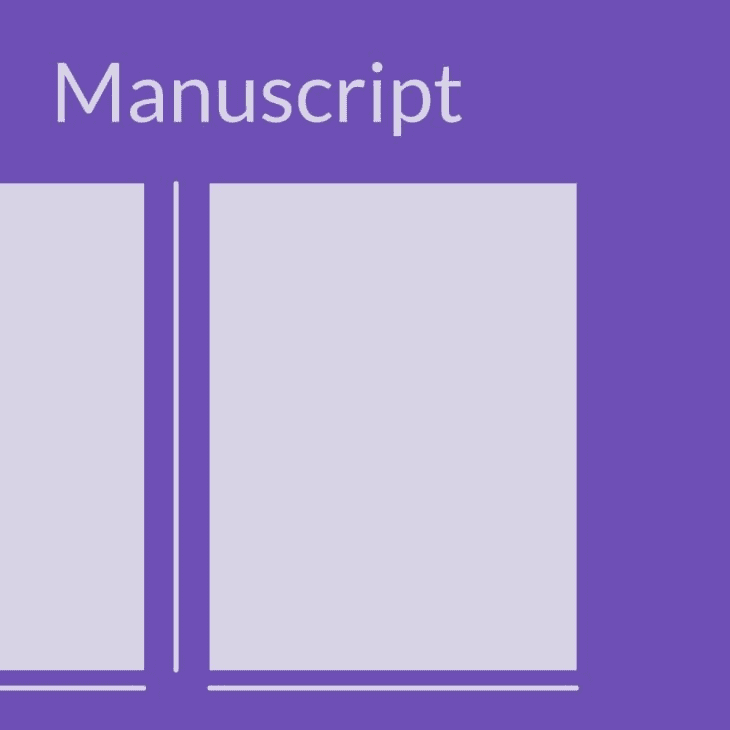
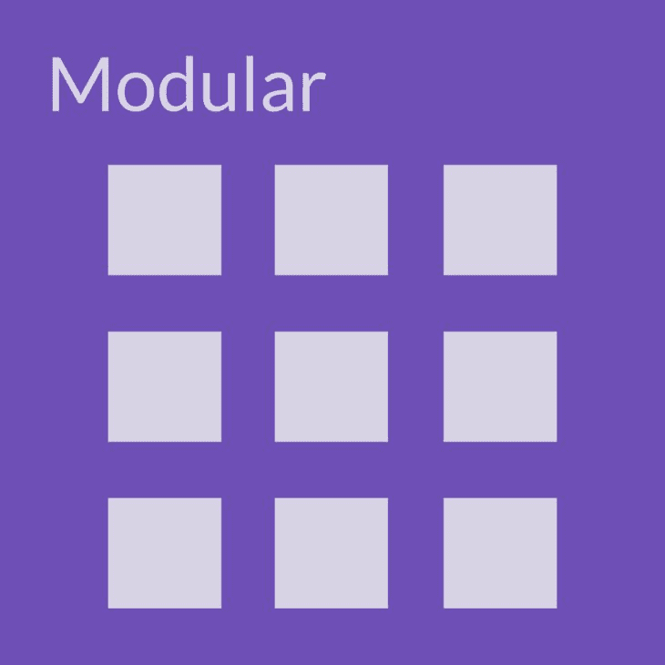
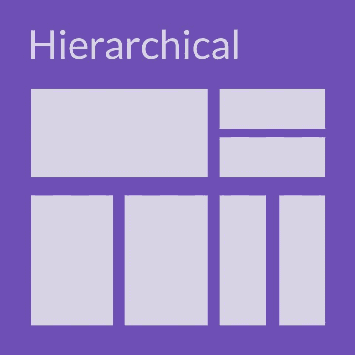
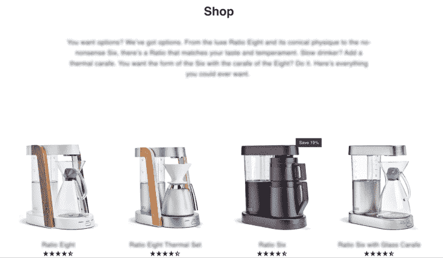
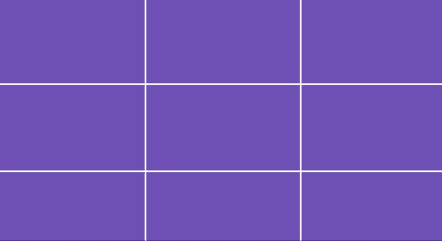
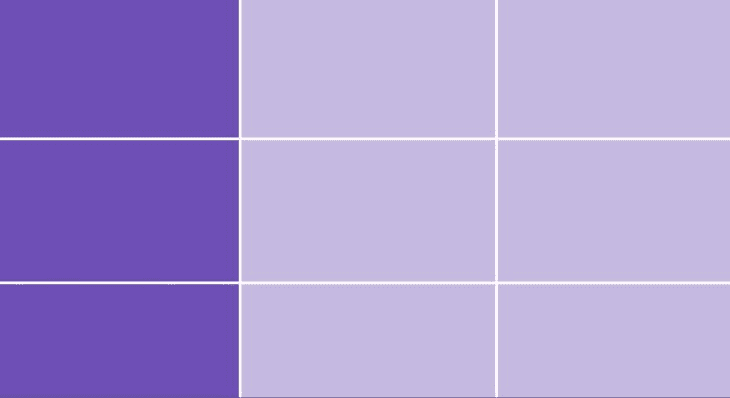
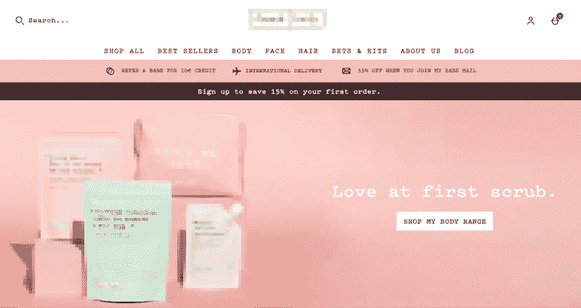
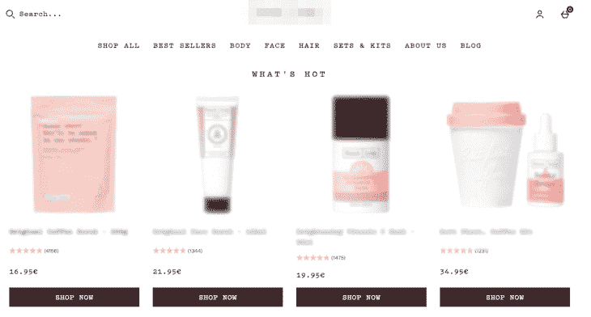

# 现代 UX 电网系统:原则和最佳实践

> 原文：<https://blog.logrocket.com/ux-design/ux-grid-system-principles-best-practices/>

几个世纪以来，网格一直作为一种创造秩序和稳定的方式被用于设计中，对于现代网页设计师来说，网格仍然是必不可少的工具。

网格系统有助于在页面上创建秩序和稳定性，它们可以适应不同的屏幕尺寸和设备。有几种不同类型的网格系统可以用在现代网页设计中，我们稍后会讲到。

在本文中，我们将讨论:

## 什么是网格系统？

网格是用于组织设计布局的系统。我们几乎在任何地方都能看到网格系统的例子:在印刷品上，在网站上，在移动应用程序上。设计中的网格系统服务于视觉组织、增强可读性和改善用户体验的目的。

设计者使用网格系统来控制页面上元素的位置。网格为设计者提供了一个工作框架，为在页面上放置元素提供了指导。这有助于创建视觉稳定性和秩序，使用户更容易理解布局和导航设计。

## 为什么我们需要网格？

当一个项目或工作被很好地定义时，意味着所有的标准和需求在开始之前已经被建立，它更有可能成功。对于一个艺术家来说，最糟糕的事情莫过于努力创作一件作品却被一个创作障碍所困扰。网格通过提供一个有意的起点来帮助解决这个问题。

网格设计可以追溯到文字的起源。当我们开始理解网格和它们的用途时，我们很容易意识到它们与印刷术有多么紧密的联系。正如约瑟夫·穆勒-布罗克曼(Josef Müller-Brockmann)在他的《平面设计中的网格系统 》一书中所说，“网格和文本密不可分。”网格系统非正式地从纸上文本的可读性发展而来。

## UX 电网系统的历史和原理

当你想到一本书及其页面上的文字时，无疑会想到列网格。文本以直线书写，间距均匀，易于阅读——我们看到一个死海古卷的例子，可以追溯到公元前 150 年到公元 70 年。

所有网格系统中最基本的，圆柱网格，已经持续了几个世纪。西方印刷机发明了可移动的金属活字块，使用柱状网格在纸上印刷文字。

印刷机发明几百年后，我们开始看到报纸广泛发行。时至今日，报纸采用多种不冲突的栏目尺寸。这种网格布局将读者的注意力引导到需要的地方，而不会让读者不知所措。

近年来，瑞士风格的先驱们明白了有意义的排版设计始于数学网格。瑞士风格是一种备受赞誉的设计过程，包括不对称布局和无衬线字体。

Example of a Swiss style grid system. [Photo source: I Love Typography](https://ilovetypography.com/2013/01/12/a-firm-turn-toward-the-objective-josef-muller-brockmann-1948-1981/).

穆勒-布罗克曼可能是瑞士运动中最著名的设计师之一，他在松散的印刷布局中大量尝试网格。他说:“一个人必须学会如何使用网格——这是一门需要实践的艺术。”

因此，几个世纪以来，网格系统已经在世界范围内以各种格式被采用，它们的历史可以追溯到文字的根源。

## 4 种常见的网格类型

### 手稿网格

手稿网格是最简单的网格形式，有时也称为块网格。这种类型主要用于媒体印刷，可以由一个单独的矩形网格或多个垂直排列的网格组成。

### 列网格

列网格系统包括放置在格式上的设定数量的垂直矩形字段。

### 模块化网格

由列和行组成的模块化网格系统由列和行相交的模块组成。

### 分级网格

等级网格系统用不规则放置的网格推进了信封(re:瑞士风格)。我们没有看到模块之间有相等的空间，也没有按照列和行进行排列。这种设计允许更多的灵活性和多样性。

## 在现代世界中，我们在哪里可以看到网格系统？

提示:无处不在。

从网站到手机应用、杂志、餐厅菜单、室内设计……不胜枚举。

UX 设计师明白，每个人每天都在使用手机或电脑屏幕。用户如何从屏幕上接收和处理信息是我们今天设计的。

电子商务网站是一个很好的例子，说明用户友好的设计是多么重要。潜在客户与网站的交互方式可能会产生新订单或废弃的购物车。作为一个数字化的店面，用户从 A 点到 B 点的体验必须是不言自明的，易于遵循的。

A crisp and clear four-column design.

当然，还有社交媒体应用。以 Instagram 为例，我们可以看到分层、分栏和模块化布局的使用。当在你的主页面上滚动浏览文章时，图片占据了你手机屏幕的宽度。

另一方面，个人资料视图提供了某人最近在做什么的简明快照。使用模块化网格，文章被分成列和行，允许浏览者一次获取大量信息。

调查表是使用网格系统确定 UX 流量的主要例子。通常，我们会回答使用矩阵网格的调查。与模块化网格类似，矩阵网格向调查参与者呈现分为列和行的问题和答案。通过一次展示大量信息，参与者所需的工作量在视觉上有所减少。

## 为现代用户设计

当为现代用户设计时，有很多要考虑的。你如何调整你的网站以适应多种屏幕和分辨率？是否具有功能性和美观性？你的设计有明确的目的吗？

### 协作设计

当最初设计网格布局和产品设计时，考虑使用允许团队协作的工具。团队可以同时处理一个项目，实时评估变化。

有了元素放置位置的基础，团队成员就可以协作创建一个有凝聚力的最终设计。积极合作并遵循成熟流程的团队往往会避免返工，从而节省时间和金钱。

### 绘制线框草图

数字设计还包括知道如何以及在哪里放置网格，以提供一致的框架和用户体验。从网格本身开始，在构建网站或应用程序时需要考虑多个方面，包括:

*   应该有多少列？
*   网格、装订线和页边距之间的间距和线条是否相等？
*   网格和格式有什么关系？
*   我的设计会产生影响或噪音吗？

如果你正在努力确定使用什么样的网格系统，或者你的设计要基于多少根柱子，先把它画出来。把你对最终产品的想法写在纸上。这将帮助你更好地理解下一步该做什么。

当把内容放在你的页面上时，考虑给更重要的内容增加更多的视觉权重。要做到这一点，可以将设计组件扩展到多个模块，让它有更大的存在感。

永远不要把一个设计元素结束在阴沟里。

### 整合可用性测试

作为人类，我们明白我们制造的机器和流程的可用性。

在 20 世纪 40 年代，丰田将提升人力投入的价值作为自己的使命。工人们被鼓励拉一根绳子来停止装配线，如果他们有一个可以改进现有流程的想法。这是可用性测试最纯粹的形式。

可用性测试是在浏览产品或流程时，收集关于用户行为的关键反馈的过程。现在有许多[用户测试工具](https://renaissancerachel.com/best-user-research-tools/)可以开始使用。在可用性测试中，你的主要目标是理解以下几点:

*   这个过程有多简单？
*   用户能够成功地浏览流程吗？
*   用户在流程中的表现如何？
*   有问题吗？如果是，问题的严重性如何？
*   用户对流程感觉良好吗？
*   有办法做得更好吗？

虽然网格提供了良好可用性的基本框架，但是如果没有用户研究，你就不能确定你的设计是否会成功。

## UX 电网系统最佳实践

### 网站

第一印象很重要。你的公司网站是潜在客户对你的第一印象。

用模块化网格系统设计你的网站减少了随机设计选择的机会，有助于对齐元素，并获得美观的结果。

以下是设计网站时需要记住的一些最佳实践:

#### 遵循三分法

这种策略将设计区域垂直和水平分成三部分，在格式上创建九个相等的部分。通过将你的设计组件放在第三个位置，潜在客户的注意力会自动转移到感兴趣的物体上。

在你的登陆页面上建立流畅和连贯的设计对于留下良好的第一印象和客户转化是至关重要的。

#### 遵循黄金比例

被认为是黄金的一个原因，这个精确的公式优化了规模，平衡和布局。确定色谱柱的尺寸和长度时，请考虑以下微设计公式:

黄金矩形的长度是元素宽度的 1.6180 倍。

#### 不要害怕空白

留白可以让你的设计有喘息的空间和可扩展性。它有助于优先考虑和组织你想要传达的信息。材料设计方法(被视为行业标准)使用 8x8pt 网格，计算空白。

#### 动态设计

网站内容必须根据不同的屏幕尺寸和分辨率进行缩放。您可以通过使用响应式网格来实现这一点。

听从华特·迪士尼的建议:跟上最新技术。有很多工具可以帮助你在网站上实现响应式设计。

### 移动应用

当设计一个移动应用程序的布局时，不要忘记你门口的头脑风暴帽。响应式设计是满足消费者需求的关键因素。UX 的设计师通常会实践设计移情，这是一种理解客户需求并为其设计的实践。

考虑一下你的应用在各种屏幕尺寸下会是什么样子。一定要包括横向和纵向模式。下面是为应用程序设计网格的内幕:

#### 了解你的屏幕尺寸

为了满足用户的需求，请将这些屏幕分辨率作为基线进行设计:

1.  桌面:1440×1024
2.  平板电脑:768×1024
3.  手机:320×640

#### 选择正确的列数

虽然十二列网格是一种行业标准，但并非所有用户体验都是一样的。根据需要增加或减少列。保持装订线宽度一致。

#### 可用性测试

不要在应用发布后就停止设计。一个开发良好的应用程序是一个不断发展的应用程序。

确保接受并执行客户的反馈。这可能看起来像是移除一个没有人使用的按钮，或者添加一个非常需要的功能。像丰田一样，不要漠视人类投入的价值。

### 电子商务应用

This landing page immediately presents the user with a CTA or the option to scroll down and browse products. Utilizing a four-column modular design and **What’s Hot** header, the business value is immediately communicated.

你有没有在手机上浏览一家公司的网站，导航到他们的店铺，发现自己对糟糕的网站性能感到失望和恼火？

当设计电子商务时，实现一个移动友好的、响应迅速的设计对转化是至关重要的。在这个过程中，一个模块化的网格将会是你最好的朋友，帮助你管理访问者的体验。设计电子商务网站时，请记住以下几点:

#### 扔掉幻灯片

研究显示[消费者很快会忽略幻灯片横幅](https://www.nngroup.com/articles/auto-forwarding/)，转而向下滚动到下面的内容。将你的特色产品分成三或四栏。

#### 使用高质量图像

高质量的照片增加了一个值得信赖的品牌的感觉。

#### 使用更大的图像

一个潜在客户可能会浏览你的网站，寻找吸引他们眼球的产品。在这个扫描期间，你所能传达的质量信息的数量将会增加或减少你的转化率。

#### 移动响应设计

可访问性是关键。为不同的屏幕分辨率设计你的电子商务网站。

## 最后的想法

正如您所看到的，网格系统提供了一种以易于理解的格式对内容进行排序的方法。无论你设计的是什么类型的网站，网格系统都是实现美观和响应性设计的绝佳工具。在设计网格系统时，记得考虑内容、受众和用例。记住这些事情，您将踏上网格成功之路！

在你的下一个设计中，你将实现什么样的网格系统？

## [LogRocket](https://lp.logrocket.com/blg/signup) :无需采访即可获得 UX 洞察的分析

[LogRocket](https://lp.logrocket.com/blg/signup) 让您可以回放用户的产品体验，以可视化竞争，了解影响采用的问题，并结合定性和定量数据，以便您可以创建令人惊叹的数字体验。

查看设计选择、交互和问题如何影响您的用户— [立即尝试 LogRocket】。](hhttps://lp.logrocket.com/blg/signup)