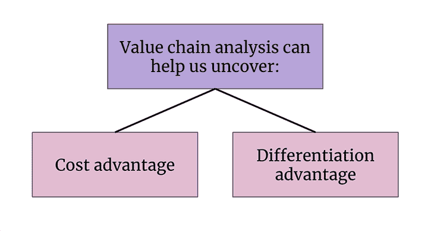
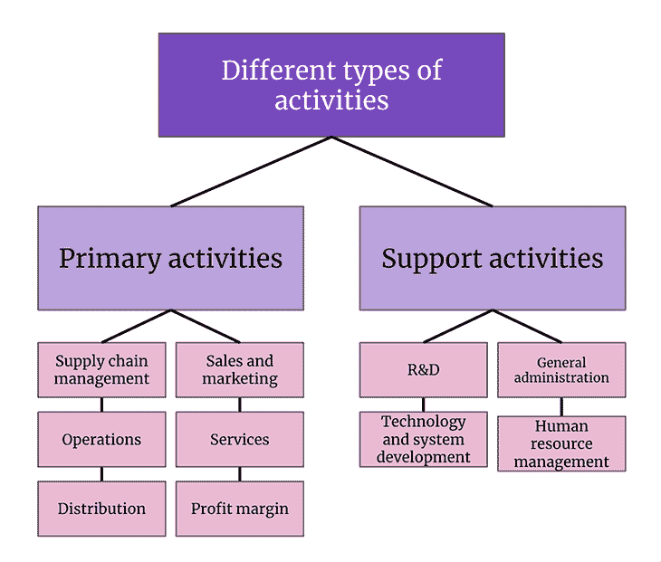

# 价值链分析:为什么重要以及如何做

> 原文：<https://blog.logrocket.com/product-management/value-chain-analysis-why-its-important-how-to-do-it/>

价值链分析有助于公司看到价值创造活动与其能力之间的关系。资源和能力固然重要，但创造价值的活动才是关键。了解这些活动的力量的公司可以开始创造一种策略来击败他们的竞争对手。

在本文中，我们将讨论价值链分析以及我们如何使用它来创造更多的产品价值。我们将讨论如何通过价值链分析来削减不必要的流程和降低成本，我将分享关于能够创造核心或独特竞争力的活动的细节。我们通过苹果和苹果的对比就明白这一点了！🍎

没有全面的分析，我们做出的决定可能会产生糟糕的结果。所以，我们会用现实生活中的例子来理解分析的细节。结果可以显示我们如何通过差异化优势击败竞争对手，或者通过成本优势战略击败竞争对手。

* * *

## 目录

* * *

## 什么是价值链？

价值链是贵公司为向客户提供服务或产品而进行的一系列连续活动。迈克尔·波特在他的著作《竞争优势:创造和保持卓越绩效 中创造了第一个价值链模型。正如书名所示，这一概念是公司竞争战略的一种分析方法。为此，我们再次开始确定一个公司的资源和能力的竞争力。

价值链是我们创造产品的每一步——从原材料和集思广益阶段到产品的仓储和运输。迈克尔·波特将其分为主要活动和支持活动。

主要活动是供应链管理、运营、分销、销售和营销、服务和利润率。

支持活动包括产品 R&D、技术和系统开发、人力资源管理和一般管理。

## 什么是价值链分析？

价值链分析是公司用来寻找竞争优势和获得更高利润的一种方法。他们可以通过识别产品的每个步骤来做到这一点。从始至终，一切对产品路线都很重要。

产品的早期阶段，如设计向用户交付产品的流程，属于价值链分析的范围。我们应该观察每项活动[如何为客户创造价值](https://blog.logrocket.com/product-management/what-is-product-market-fit-measure-examples/)，看看是否可以在考虑竞争对手的同时更有效地完成。

我更习惯在软件公司做产品价值链分析，但这个分析是所有行业都有名的。单通道或多通道行业可以充分利用这种分析。为了涵盖行业分析，我们应该准备内部、供应商和前向渠道流程。

例如，我们为生产产品而购买的材料对我们来说是一种成本。如果我们知道其他供应商的价值链，我们可以看到供应商为每种材料增加的利润。我们可以在开始分析流程之前创造利润。

同样，如果我们知道供应商有多少个合作伙伴，我们就可以排除提高价格的经纪公司。通过这种分析，我们可以了解最终用户承担的成本，并决定为他们解决问题，从而提高客户满意度。

总之，价值链分析在这里向我们展示了不必要的步骤，增值的步骤，和高成本。

## 如何进行价值链分析

价值链分析从将公司的流程分为主要和次要活动开始。不要忘记，我们正在努力寻找产生成本的主要流程，尤其是我们在做这件事时需要注意的流程。

我们应该检查相关过程的成本因素，以了解每个过程产生的成本。我们可以将此分析视为对 [SWOT](https://blog.logrocket.com/product-management/swot-analysis-template-how-to-examples/) 、标杆管理、[竞争力分析](https://blog.logrocket.com/product-management/what-is-competitive-analysis-template-examples-tutorial/)和最佳实践方法的支持性分析。至少对我们的前三名竞争对手采取同样的步骤是很重要的。

我们的分析不仅限于我们的公司结构。为了能够涵盖所有成本，我们应该在分析中加入与供应商和客户相关的价值链。

## 价值链分析如何帮助企业？

价值链分析的好处可以总结如下:

*   **产品价值**帮助我们找到公司的主要活动，以便我们能够区分能够创造产品价值的活动
*   **可视化结构**有助于我们从更广阔的视角看到增值活动
*   **成本优势**帮助我们找到产生额外成本的活动，以便我们能够消除它们
*   外包帮助我们决定哪些活动可以外包
*   **差异化** [帮助我们了解我们产品的独特活动](https://blog.logrocket.com/product-management/what-is-product-differentiation-definition-strategies-examples/)，这样我们就可以在差异化点上投入更多

价值链分析可以帮助我们找到我们的产品战略和独特的竞争力。例如，我们的[独特活动可以成为我们的独特能力](https://blog.logrocket.com/product-management/how-to-understand-and-identify-distinctive-competencies/)。相反，我们可能已经有了一个战略，并希望通过过程来实施它。价值链分析将帮助我们找到正确的开始步骤。

每个企业都承担着在旧项目中不写文档而完成的过程的负担。老产品尤其有不必要的工序和成本。两年后，我们的一款产品在行业中站稳了位置。我们有活跃的用户，但速度正在放缓。服务器和存储成本不断增加，而我们的利润却日益减少。我们决定降低成本，我们的价值链分析冒险开始了。

首先，我们列出了成本流程，并根据其价值分析了各个步骤。一段时间后，我们没有得到任何结果。我们无法理解应该关闭哪个(哪些)步骤。

然后我们做得很恰当。我们从列出流程开始，并再次检查分析。但是我们还是没有结果！我们决定分析产品的第一个版本，并列出旧的、封闭的组件。结果并不令人惊讶——我们随身携带旧组件，它们消耗了我们大量的资源。

吸取了教训，我们变得更加意识到关闭每一个功能，并小心它们可能造成的负担。我们的成本立即降低了，而且我们在新项目中免费使用了这些资源！💰

* * *

订阅我们的产品管理简讯
将此类文章发送到您的收件箱

* * *

## 评估企业的两大优势

价值链分析不是我们产品战略的决策方法。这是一个很好的方法来形象化我们的优势和劣势。

我们可以看到分析中的问题，并改变流程，但它没有承诺创造一个差异化点。通过价值链分析，我们将了解如何为我们的产品创造优势:

### 成本优势

让我们开始将我们的价值链分析结果落实到我们的战略中。假设我们的目标是获得相对于竞争对手的成本优势。列出我们所有的成本流程将是第一步。

降价不是可持续的策略——它不会持续吸引顾客。但是，降低成本会使我们在短期内获得更多的利润。了解竞争对手的成本结构让我们在价格竞争中更有优势。

我们应该为我们的产品和竞争对手创造一个整体价值链。然后，我们将开始在我们的价值链流程中寻找具有成本效益的方法，甚至可能不通过减少或完全绕过产生成本的流程。

对于旁路，[我们使用 MVP(最小可行产品)](https://blog.logrocket.com/product-management/what-is-minimum-viable-product-mvp-how-to-define/)或原型方法，即只构建必备的产品特性。这可能意味着削减交付成本和产品线，并关闭一些服务。

与消除低附加值或不必要的流程不同，MVP 或原型方法可以在没有价值链分析的情况下应用。所以，在分析中要注重成本-价值的比较。成功的成本优势战略要求我们通过成本效率来执行价值链活动，更快、更准确地向用户提供产品。

### 差异化优势

与成本优势相反，差异化优势需要找到一种人们愿意支付更高价格的产品。我们必须支持创造差异化的成本，即使成本很高。我们必须分析竞争对手的价值链以及客户的需求和行为。

价值链分析将列出产品特性和我们从每个过程中获得的利润。我们需要继续投资 R&D 的活动，继续提供高质量的服务，以保持客户忠诚度。根据分析结果，我们可以选择高价值的特征并对其进行改进。

为了保持差异化优势，我们应该有高转换成本、基于关系的服务、专利保护等。该分析将有助于将资源重新分配给重要的活动。

研究竞争对手的价值链将有助于发现卓越的差异化能力，并将其转化为核心竞争力。如果我们不断地获得核心能力，我们就能把核心能力发展成独特的能力。这是永久的解决方案——从长远来看，我们如何击败竞争对手。

## 了解不同类型的活动

### 主要活动

概括地说，主要活动是供应链管理、运营、分销、销售和营销、服务和利润率。

现在，让我们假设我们是一家电子商务公司来解释这些:

供应链管理包括从供应商处接收产品、储存物品以及将产品运送给用户等活动。供应商管理、库存管理、承运商管理活动、成本和二手资产是主要流程。

操作包括将产品转移到仓库内的位置，并对其进行拣选、分拣和包装等活动。如果我们有像输送机或自动化存储系统这样的设备，它们的维护和质量保证属于运营活动的一部分。将为操作计算仓库内的成本。仓储是最大的成本流程之一，所以电商都在尝试使用第三方仓库或者市场的方法来规避仓储成本。

分销包括向客户运送(装运)和交付产品的车辆操作。从仓库到用户，所有的成本都可以计算为分配。这些成本真的很高，这就是为什么几乎所有的电商都在用自己的运营商公司将成本转化为利润。

销售和营销是我们应用程序营销的成本。促销、销售团队的努力、选择产品的分类团队、广告和市场研究成本都可以加入到这个过程中。

服务是我们用来帮助供应商和用户的所有活动，如呼叫中心、销售门户和取消订单的退货流程。

### 支持活动

我们可以将主要活动视为独特的能力，将支持活动视为核心能力。他们对创造差异化没有直接影响，但他们正在创造一个支持差异化的环境。

支持活动包括产品 R&D、技术和系统开发、人力资源管理和一般管理。

在我们的例子中，产品 R&D、技术和系统开发是工程团队创建的成本过程。资产、产品研究、数据库需求、服务器需求、支持团队工作、软件开发等。属于这一类。

人力资源管理成本不仅仅是雇佣、培训、招聘和激励活动。通过培训、知识转移和技能创造活动创造核心竞争力也包括这些成本。

一般管理是关于法律、会计、财务、安全和战略伙伴关系的管理。这里还可以添加高层决策和整体安全及协作活动。

我们正在进行价值链分析，以评估我们产品的成本和有效性。我们如何列出真实的结果取决于我们的方法。有不同的方法，例如基准测试、最佳实践等等。

标杆管理是一种工具，用于了解我们竞争对手的主要和支持活动以及他们的价值成本方法。它帮助我们了解我们的产品是否具有成本竞争力。我们应该仔细选择要分析的公司，可以从其他行业中选择，但这种比较可能会得出错误的结论。我们还可以检查内部活动或所有价值链流程。这些可以根据我们的需要改变。例如，如果我们是一家电子商务公司的产品经理，为了降低我们的货运成本，我们可以检查运输公司及其价值链活动。

最佳实践帮助我们创造最佳结果并比较其他方法。这是一种不断降低成本和寻找更有效的方法来改进活动的方法。例如，最佳实践方法可以表明，开设我们自己的运输公司将会产生非常积极的结果。

## 结论

价值链分析或标杆管理并不是这个过程中最难的部分。找到创造成本优势或差异化优势的方法。

有时，我们创建了很多页的报告，却没有找到任何解决方案。在这种情况下，我们应该咨询客户、供应商、分析师以及任何了解该行业的人。开始分析是不够的——我们应该以一个结果结束。

## [LogRocket](https://lp.logrocket.com/blg/pm-signup) 产生产品见解，从而导致有意义的行动

[LogRocket](https://lp.logrocket.com/blg/pm-signup) 确定用户体验中的摩擦点，以便您能够做出明智的产品和设计变更决策，从而实现您的目标。

使用 LogRocket，您可以[了解影响您产品的问题的范围](https://logrocket.com/for/analytics-for-web-applications)，并优先考虑需要做出的更改。LogRocket 简化了工作流程，允许工程和设计团队使用与您相同的[数据进行工作](https://logrocket.com/for/web-analytics-solutions)，消除了对需要做什么的困惑。

让你的团队步调一致——今天就试试 [LogRocket](https://lp.logrocket.com/blg/pm-signup) 。

[Zeynep Cansu Yildirim Follow](https://blog.logrocket.com/author/zeynepcansuyildirim/) I am an experienced PM of 5+ years with 9+ years of analyst and leadership experience in software companies, currently working as a PM in an e-commerce company. I am an Electric and Electronic Engineer with a Masters in Engineering Management. In my social life, I like skiing, kitesurfing, boxing, and am a professional horse rider in show jumping competitions.