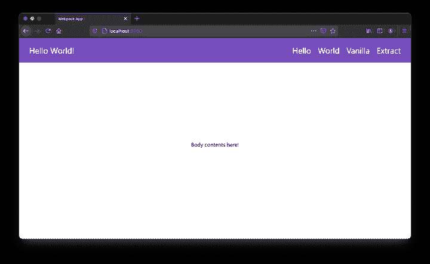

# 精华教程:在 TypeScript 中创建零运行时样式表

> 原文：<https://blog.logrocket.com/vanilla-extract-tutorial-create-zero-runtime-stylesheets-in-typescript/>

在本教程中，我们将深入研究 vanilla-extract 的主要特性，并演示如何通过使用 React 和 webpack 构建一个示例应用程序来创建零运行时样式表。

vanilla-extract 是关于 TypeScript(或 JavaScript)中的零运行时样式表。如果你过去使用过 Sass 或更少，你应该已经知道它们在应用程序风格的主题化、组织和预处理方面有多强大。

就像这些 CSS 预处理程序一样， [vanilla-extract](https://github.com/seek-oss/vanilla-extract) 在构建过程中生成所有的样式。在它的好处中，您会发现局部作用域的类名、CSS 变量、CSS 规则、对同步主题的支持(没有全局变量)、calc 实用程序表达式等等。

为了演示如何使用 vanilla-extract，我创建了一个已经添加了 React 和 webpack 的简单项目。您可以在本地克隆/派生它，并将其作为我们接下来在香草精上尝试的事情的起点。

一旦完成，确保运行`npm install`命令来下载所有需要的节点包。

然后，运行下一个命令来添加 vanilla-extract 的主要依赖项( [webpack integration](https://vanilla-extract.style/documentation/setup/#webpack) ):

```
npm install @vanilla-extract/css @vanilla-extract/babel-plugin @vanilla-extract/webpack-plugin

```

当命令完成时，您将在您的`package.json`文件中看到新添加的依赖项:

```
"dependencies": {
    "@vanilla-extract/babel-plugin": "^1.0.1",
    "@vanilla-extract/css": "^1.2.1",
    "@vanilla-extract/webpack-plugin": "^1.1.0",
    ...
}

```

至于 vanilla-extract webpack/Babel 配置，您还需要升级`webpack.config.js`文件，做如下三处修改:

```
const { VanillaExtractPlugin } = require("@vanilla-extract/webpack-plugin");

```

上述第一个更改必须添加到文件开头的 imports 部分。这一行表示处理香草提取物相关操作的 webpack 插件。

它将与文件中的`plugins`部分一起使用，并有一个简单的实例，如下所示:

```
plugins: [
    new HtmlWebpackPlugin(),
    new MiniCssExtractPlugin(),
    new VanillaExtractPlugin(),
],

```

最后，您需要将 vanilla-extract Babel 插件添加到`babel-loader`加载器的“`js|ts|tsx`”测试规则中，如下所示:

```
{
  test: /\.(js|ts|tsx)$/,
  ...
  use: [
    {
      loader: "babel-loader",
      options: {
        ...
        plugins: ["@vanilla-extract/babel-plugin"],
      },
    },
  ],
},

```

官方文件中的[警告之一提到了 webpack 配置对 CSS 处理的需求。这个不用担心；我们已经在搭建的默认项目设置中处理 CSS 文件。](https://vanilla-extract.style/documentation/setup/#webpack)

如果您希望验证一切设置是否正确，只需运行`npm run start`命令并在浏览器中检查结果。

## 创建风格化的主题

vanilla-extract 作为预处理器工作，但是，代替通常的 Less 或 Sass，您得到的是 TypeScript。

让我们通过创建一个非常简单的风格化主题来帮助构建下面的页面，看看香草提取物的作用:



让我们从款式开始。要编写它们，首先在`src`文件夹下创建一个名为`styles.css.ts`的新文件。这种类型的文件是在构建时评估的，当您向它添加以下代码时，您会看到它是 TypeScript:

```
import { createTheme, style } from "@vanilla-extract/css";

export const [themeClass, vars] = createTheme({
  color: {
    primary: "#764abc",
    secondary: "white",
  },
  font: {
    menu: "1.5em",
  },
});

export const menuStyle = style({
  backgroundColor: vars.color.primary,
  fontSize: vars.font.menu,
  display: "block",
  width: "100%",
  color: "white",
  padding: 20,
});

export const menuItemsStyle = style({
  float: "right",
});

export const menuItemStyle = style({
  backgroundColor: vars.color.primary,
  color: vars.color.secondary,
  margin: 10,
  ":hover": {
    cursor: "pointer",
    color: "orange",
  },
});

export const sectionStyle = style({
  display: "inline-block",
  width: "100%",
  textAlign: "center",
  marginTop: "20%",
});

```

样式总是被`style`函数引用，该函数接收带有特定样式对象所需的所有 CSS 属性的对象。它们必须总是被输出，因为它们在被注入最终输出之前会被香草精预处理。

`createTheme`函数是一个非常有用的资源，当你需要更通用、更集中的风格管理时，你可以使用它。例如，您可能需要切换主题，因此这是主题如何发挥作用的完美场景。

每种风格都使用了主题化的变量，但是也可以从外部的 TypeScript 文件中访问它们，因为我们也在导出它们。

看看给样式添加`hover`效果有多简单。随意增加你想要的主题。

现在是时候利用我们的风格了。为此，在名为`App.tsx`(主要 React 应用程序组件)的`src`文件夹下创建另一个文件，并向其中添加以下内容:

```
import {
  themeClass,
  menuStyle,
  menuItemsStyle,
  menuItemStyle,
  sectionStyle,
} from "./styles.css";

export const App = () => (
  <div className={themeClass}>
    <header className={menuStyle}>
      <h1 className={menuItemStyle}>Hello World!</h1>
      <ul className={menuItemsStyle}>
        <li>
          <a className={menuItemStyle} href="#">
            Hello
          </a>
        </li>
        <li>
          <a className={menuItemStyle} href="#">
            World
          </a>
        </li>
        <li>
          <a className={menuItemStyle} href="#">
            Vanilla
          </a>
        </li>
        <li>
          <a className={menuItemStyle} href="#">
            Extract
          </a>
        </li>
      </ul>
    </header>

    <section className={sectionStyle}>
      <p>Body contents here!</p>
    </section>
  </div>
);

```

同样，如果您愿意，可以随意将它分解成更多的组件。不过，为了简单起见，我们将把它集中起来。

有趣的是，导入的样式是作为 CSS 类而不是内联样式添加的。发生这种情况是因为整个过程是静态完成的，如果你内联东西，这是不可能的。

然而，如果你好奇的话，vanilla-extract 支持一个动态 API 用于动态运行时主题化。

您还可以使用`css`包中的`globalStyle`函数来决定您的应用程序是否必须遵循通用元素的全局样式，例如页面`body`。为此，创建另一个名为`global.css.ts`的文件，并将以下内容放入其中:

```
import { globalStyle } from "@vanilla-extract/css";

globalStyle("body, body *", {
  all: "unset",
  boxSizing: "border-box",
  fontFamily: "Segoe UI",
  color: "black",
  padding: 0,
  margin: 0,
});

```

在您将所有东西都收集到`index.tsx`文件中之前，还不能测试这个例子，如下所示:

```
import { render } from "react-dom";
import { App } from "./App";
import "./global.css";

const root = document.createElement("div");
document.body.appendChild(root);

render(<App />, root);

```

要测试它，只需重新执行 npm `run start`命令并刷新您的浏览器。您应该会看到如上图所示的页面。

但是这种到类的样式映射最终是如何在浏览器中表现出来的呢？

如果您使用浏览器检查页面上的 HTML/CSS 元素，您可能会看到我们注入了`themeClass`类的第一个`div`具有以下属性:


在检查完其余的元素后，可以找到它们的进一步用法，例如在`menuItemStyle:`中的一个


在这一点上，你应该明白香草提取物是什么，以及如何使用它来创建你的静态风格和主题。

不过款式还是有点乱，重复。让我们通过引入 [Sprinkles](https://github.com/seek-oss/vanilla-extract/tree/master/packages/sprinkles) 来解决这个问题，它是香草香精的零运行时原子 CSS 框架。

Sprinkles 提供了一组实用程序类，可以定制这些类，并与 atoms 一起组合成可重用的样式。如果你以前用过[风格的系统](https://blog.logrocket.com/building-react-native-applications-with-styled-system/)或者[的顺风 CSS](https://blog.logrocket.com/best-tailwind-css-components-and-template-collections/) ，那么你会对它的方法感到熟悉。

首先将包依赖项添加到项目中:

```
npm install @vanilla-extract/sprinkles

```

接下来，我们将集中我们的应用程序目前使用的许多变量。这将有助于重用，尤其是对于最通用的基值。

在`src`文件夹下创建另一个名为`vars.css.ts`的文件，并将以下内容放入其中:

```
import { createGlobalTheme } from "@vanilla-extract/css";

export const vars = createGlobalTheme(":root", {
  space: {
    none: "0",
    small: "4px",
    medium: "8px",
    large: "16px",
    "1/2": "50%",
    "1/5": "20%",
  },
  color: {
    white: "#fff",
    black: "#000",
    orange: "#FFA500",
    primary: "#764abc",
  },
  fontFamily: {
    body: '-apple-system, "Segoe UI", Verdana, Arial',
  },
  fontSize: {
    small: "1em",
    medium: "1.4em",
    large: "1.8em",
  },
  gridRepeat: {
    "4x": "repeat(4, 1fr)",
  },
});

```

`createGlobalTheme`函数有助于建立 CSS 变量，消除了手动建立变量的需要(就像我们在之前版本的应用程序中所做的那样)。

在这里，您可以添加任何您认为可以在整个应用程序样式中重用的变量，无论它们是放在您的 CSS 文件中还是直接放在 React 组件中。

* * *

### 更多来自 LogRocket 的精彩文章:

* * *

在这个例子中，我们为字体大小和字体系列、颜色和整体空间(填充、边距等)设置了基本的全局值。).

请记住，您分配给它们的名称由您决定；这里没有严格的语法系统，所以一定要给出有意义的名称，解释每个值的作用。

现在是时候创建自定义原子，并将其放入名为`sprinkles.css.ts`的新文件中。粘贴以下内容:

```
import { createAtomicStyles, createAtomsFn } from "@vanilla-extract/sprinkles";
import { vars } from "./vars.css";

const responsiveStyles = createAtomicStyles({
  conditions: {
    mobile: {},
    tablet: { "@media": "screen and (min-width: 768px)" },
    desktop: { "@media": "screen and (min-width: 1024px)" },
  },
  defaultCondition: "mobile",
  properties: {
    display: ["none", "flex", "block", "inline", "grid"],
    flexDirection: ["row", "column"],
    gridTemplateColumns: vars.gridRepeat,
    justifyContent: [
      "stretch",
      "flex-start",
      "center",
      "flex-end",
      "space-around",
      "space-between",
    ],
    textAlign: ["center", "left", "right"],
    alignItems: ["stretch", "flex-start", "center", "flex-end"],
    paddingTop: vars.space,
    paddingBottom: vars.space,
    paddingLeft: vars.space,
    paddingRight: vars.space,
    marginTop: vars.space,
    marginRight: vars.space,
    marginLeft: vars.space,
    marginBottom: vars.space,
    fontFamily: vars.fontFamily,
    fontSize: vars.fontSize,
    // etc.
  },
  shorthands: {
    padding: ["paddingTop", "paddingBottom", "paddingLeft", "paddingRight"],
    paddingX: ["paddingLeft", "paddingRight"],
    paddingY: ["paddingTop", "paddingBottom"],
    placeItems: ["justifyContent", "alignItems"],
  },
});

const colorStyles = createAtomicStyles({
  conditions: {
    lightMode: {},
    darkMode: { "@media": "(prefers-color-scheme: dark)" },
  },
  defaultCondition: "lightMode",
  properties: {
    color: vars.color,
    background: vars.color,
    // etc.
  },
});

export const atoms = createAtomsFn(responsiveStyles, colorStyles);

```

花些时间浏览这个文件的全部内容——我保证，这是值得的。`createAtomicStyles`功能有助于围绕以下内容配置一组预定义属性:

*   `conditions` —样式是否必须应用于移动设备、桌面设备或纯平板设备
*   `properties` —已知反应样式属性及其各自值的列表(或从先前创建的`vars`文件中提取的元组)
*   `shorthands` —顾名思义，这将有助于为具有相似值的各种属性创建快捷方式，以便一次全部应用

请注意，最后一个函数`createAtomsFn`接收了两个原子样式，第二个与主题化的亮/暗模式相关(现在许多应用程序都处理它)。为了简单起见，让我们保持这一部分简短，只应用灯光模式作为默认。

现在在`style.css.ts` 文件中已经没有主题了，我们需要更新它来处理新创建的 sprinkles。下面是文件中使用的新代码:

```
import { composeStyles, style } from "@vanilla-extract/css";
import { atoms } from "./sprinkles.css";

export const menu = composeStyles(
  atoms({
    display: "flex",
    justifyContent: "space-between",
    padding: "large",

    // Conditional atoms:
    flexDirection: {
      mobile: "column",
      desktop: "row",
    },
    fontSize: {
      desktop: "large",
      mobile: "medium"
    },
    background: {
      lightMode: "primary",
    },
  })
);

export const menuItems = composeStyles(
  atoms({
    display: {
      desktop: "flex",
      mobile: "grid",
    },
    gridTemplateColumns: {
      mobile: "4x",
    },
    paddingX: {
      desktop: "small",
      mobile: "none",
    },
    paddingY: {
      mobile: "medium",
    },

    flexDirection: {
      mobile: "column",
      desktop: "row",
    },
  })
);

export const menuItem = composeStyles(
  atoms({
    display: "flex",
    alignItems: "center",
    paddingX: "medium",
    color: "white",

    flexDirection: {
      mobile: "column",
      desktop: "row",
    },
  }),
  style({
    ":hover": {
      cursor: "pointer",
      color: "orange",
    },
  })
);

```

让我们过一遍。当您需要将多个样式合并成一个样式时，可以使用`composeStyles`功能。

对于代码文件中创建的第一批样式，我们只添加了一个原子。然而，当您向下导航时，与菜单项相关的最后一个样式也通过`style`函数添加了一些额外的属性。

每当您需要添加不属于当前主题原子的自定义 CSS 属性时，这是非常有用的。如果您觉得这是一个非常特殊的情况，并且属性不应该属于主题，那么使用`style`函数会很有帮助。

看看像`flexDirection`、`fontSize`等等的条件原子。由于我们已经在 Sprinkles 文件中配置了桌面和移动的条件，现在，每次你需要根据设备大小设置不同的样式时，你可以分别通过`desktop`和`mobile`属性来定义。

例如，对于我们的`menuItems`排列，元素的移动部署应该使用 CSS `grid`显示而不是`flex`，这样我们就可以显示它，如下图所示:


这同样适用于移动设备上较小的字体大小。

你可能想知道我们之前在`style.css.ts`文件中的`section`样式发生了什么。嗯，我们把它移到了`App.tsx`文件中，只是为了演示 Sprinkles 如何处理内嵌原子。

让我们看看文件内容现在是什么样的:

```
import * as styles from "./styles.css";
import { atoms } from "./sprinkles.css";

export const App = () => (
  <main>
    <header className={styles.menu}>
      <h1 className={styles.menuItem}>Hello World!</h1>
      <ul className={styles.menuItems}>
        <li>
          <a className={styles.menuItem} href="#">
            Hello
          </a>
        </li>
        <li>
          <a className={styles.menuItem} href="#">
            World
          </a>
        </li>
        <li>
          <a className={styles.menuItem} href="#">
            Vanilla
          </a>
        </li>
        <li>
          <a className={styles.menuItem} href="#">
            Extract
          </a>
        </li>
      </ul>
    </header>

    <section
      className={atoms({
        display: "block",
        marginTop: {
          desktop: "1/5",
          mobile: "1/2",
        },
        textAlign: "center",
      })}
    >
      <p>Body contents here!</p>
    </section>
  </main>
);

```

我们对这个文件做的第一个更改是导入。现在，我们将它们全部导入到`styles`常量中，而不是导入每一个(列表可能会很快变得过大)。然后，你可以直接调用每个类名。

注意新的`section`组件。是的，将你的原子直接定制到组件中是非常好的，Sprinkles 会为你处理这些。

请注意，我们重复了桌面/移动设备的使用情况，这一次是因为从不同的设备尺寸来看，它们会发生变化。

最后，`global.css.ts`文件有一点小小的变化，这是因为应用程序的 var 有了新的集中存储库。这是它的更新内容:

```
import { globalStyle } from "@vanilla-extract/css";
import { vars } from "./vars.css";

globalStyle("body, body *", {
  all: "unset",
  boxSizing: "border-box",
  fontFamily: vars.fontFamily.body,
  color: vars.color.black,
  padding: 0,
  margin: 0,
});

```

再次测试的时间到了！你会发现演示几乎没有变化，这就是目标。然而，我们设法在可重用性和组织方面显著改进了代码。

## 结论

关于香草精还有很多东西需要探索，但是，我相信我们已经建立了坚实的知识基础来帮助你开始使用它。

你可以阅读更多关于 vanilla-extract 的用于动态运行时主题化的[动态 API](https://github.com/seek-oss/vanilla-extract#dynamic-api) ，以及用于诸如计算表达式的优秀的[实用函数](https://github.com/seek-oss/vanilla-extract#utility-functions)。

您可以在 [GitHub](https://github.com/iamjuliosampaio/vanilla-extract-example-app) 上找到我们示例项目的最终版本。

你已经试过香草精了吗？如果是的话，到目前为止你的想法是什么？

## 使用 LogRocket 消除传统反应错误报告的噪音

[LogRocket](https://lp.logrocket.com/blg/react-signup-issue-free)

是一款 React analytics 解决方案，可保护您免受数百个误报错误警报的影响，只针对少数真正重要的项目。LogRocket 告诉您 React 应用程序中实际影响用户的最具影响力的 bug 和 UX 问题。

[ ](https://lp.logrocket.com/blg/react-signup-general) [  ](https://lp.logrocket.com/blg/react-signup-general) [LogRocket](https://lp.logrocket.com/blg/react-signup-issue-free)

自动聚合客户端错误、反应错误边界、还原状态、缓慢的组件加载时间、JS 异常、前端性能指标和用户交互。然后，LogRocket 使用机器学习来通知您影响大多数用户的最具影响力的问题，并提供您修复它所需的上下文。

关注重要的 React bug—[今天就试试 LogRocket】。](https://lp.logrocket.com/blg/react-signup-issue-free)

## [LogRocket](https://lp.logrocket.com/blg/typescript-signup) :全面了解您的网络和移动应用

[](https://lp.logrocket.com/blg/typescript-signup)

LogRocket 是一个前端应用程序监控解决方案，可以让您回放问题，就像问题发生在您自己的浏览器中一样。LogRocket 不需要猜测错误发生的原因，也不需要向用户询问截图和日志转储，而是让您重放会话以快速了解哪里出错了。它可以与任何应用程序完美配合，不管是什么框架，并且有插件可以记录来自 Redux、Vuex 和@ngrx/store 的额外上下文。

除了记录 Redux 操作和状态，LogRocket 还记录控制台日志、JavaScript 错误、堆栈跟踪、带有头+正文的网络请求/响应、浏览器元数据和自定义日志。它还使用 DOM 来记录页面上的 HTML 和 CSS，甚至为最复杂的单页面和移动应用程序重新创建像素级完美视频。

[Try it for free](https://lp.logrocket.com/blg/typescript-signup)

.