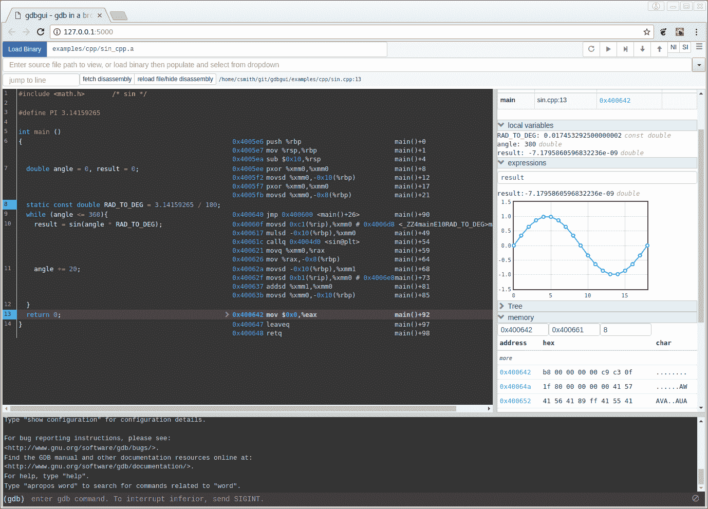
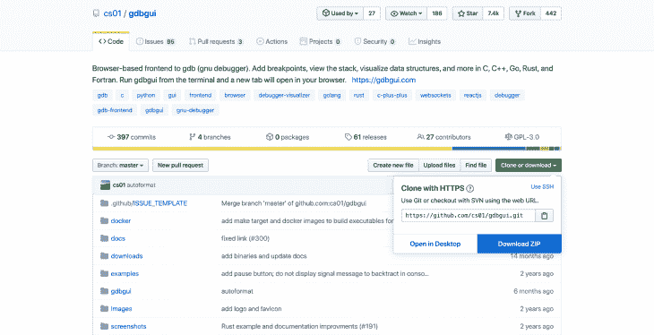
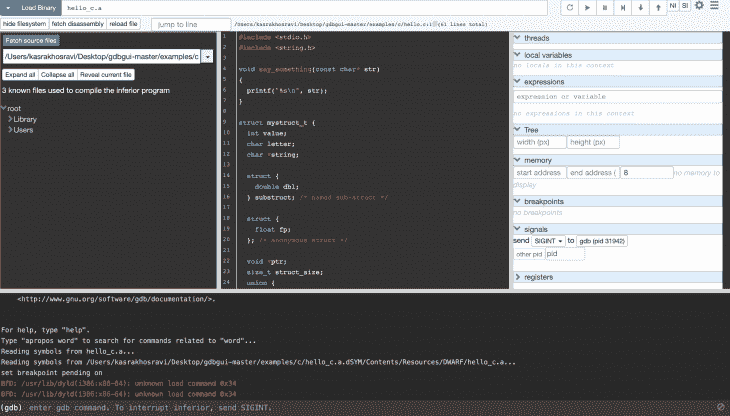
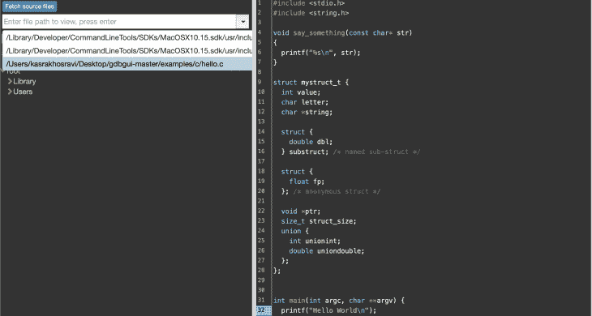
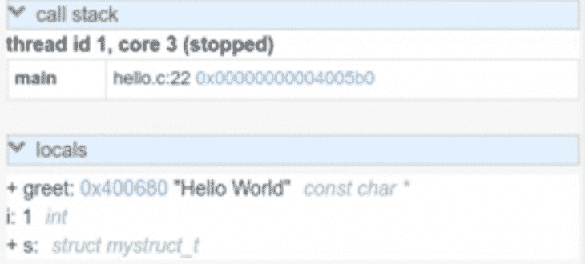
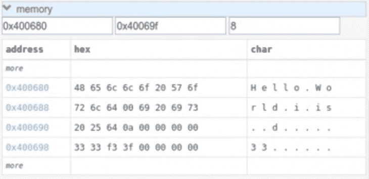
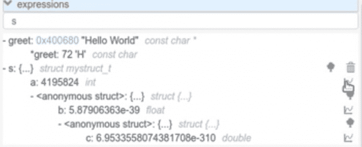
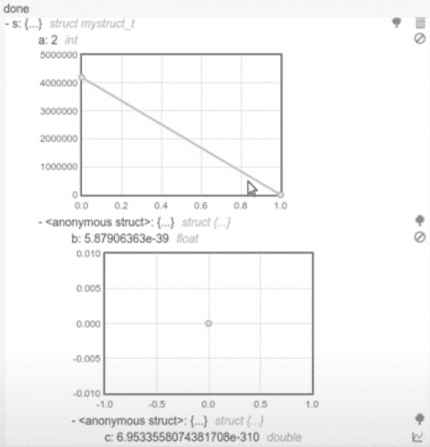
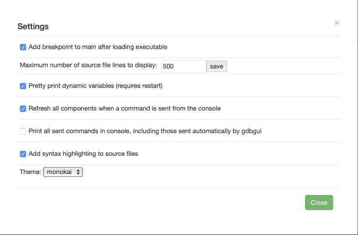

# 使用 gdbgui - LogRocket 博客进行可视化调试

> 原文：<https://blog.logrocket.com/visual-debugging-using-gdbgui/>

## 介绍

开发人员花费大量时间调试和维护当前的代码库。理解不同的调试方法至关重要。一些开发人员仍然喜欢更多的手动调试方式。还有许多快照工具，在代码运行的某个部分之后，它们会向您提供问题和错误的详细报告。这两种方法都是有益的，但是它们通常关注于错误发生的时间。借助调试器工具，我们可以看到错误是如何发生的。

在这篇文章中，我们将研究 [gdbgui](https://www.gdbgui.com/) ，一个 [gdb](https://www.gnu.org/software/gdb/) 的扩展，具有可视化调试能力，这将帮助我们调试编译语言。

## 什么是广发？

[gdb](https://www.gnu.org/software/gdb/) 对于调试 [C](https://en.wikipedia.org/wiki/C_(programming_language) 、 [C++](https://en.wikipedia.org/wiki/C%2B%2B) 、 [Go](https://en.wikipedia.org/wiki/Go_(programming_language) 、 [Rust](https://en.wikipedia.org/wiki/Rust_(programming_language)) 等编译语言来说是一个非常方便的工具。它适用于常见的操作系统，如 Mac、Windows 和 Linux。这个调试器可以在几个方面[帮助我们](https://www.tutorialspoint.com/gnu_debugger/what_is_gdb.htm)，例如:

*   当错误发生时，获得程序变量和上下文的概述
*   如果核心转储(特定时间的内存状态)是由于崩溃或非正常终止而发生的，我们可以理解是什么表达式语句导致了它
*   在程序运行时，在程序中引起问题的部分停止
*   在调试时测试和试验程序，以缩小范围或修复问题

虽然这些对我们的调试工作非常有帮助，但是您仍然需要在终端中运行调试命令，并且可能无法很好地了解程序的上下文。

## gdbgui 是什么？

gdbgui 是另一个构建在 gdb 之上的调试工具。主要区别在于 gdbgui 向开发人员公开了基于浏览器的前端，因此他们可以在调试器运行时添加断点、查看堆栈跟踪以及更改上下文和参数值。



Source: [https://www.gdbgui.com/screenshots/](https://www.gdbgui.com/screenshots/)

## gdbgui 架构

该库利用了 [WebSockets](https://developer.mozilla.org/en-US/docs/Web/API/WebSocket) 。每当前端调试工具启动时，就会建立一个 WebSocket 连接，这是浏览器和后端之间的通信通道。在每个建立的 WebSocket 之后，后端启动一个新的托管 gdb 子进程来解析输出，同时生成一个单独的子进程来不断检查其他子进程的输出。最后，它使用同一个 WebSocket 将输出传输到客户机。

## 装置

让我们在我们的机器上安装 gdbgui。如前所述，gdbgui 可以安装在各种操作系统上，但也可以远程运行。

根据你的操作系统，有几种方法可以在你的机器上安装 gdbgui，但是我将遵循最简单和最直接的方法。由于这个库依赖于 [Python 3](https://www.python.org/download/releases/3.0/) ，你需要小心遵循任何安装指南，因为它可能会干扰你机器的全局设置。

安装 gdbgui 的最佳方式是通过`[pipx](https://github.com/pipxproject/pipx)`。该工具允许您在隔离的环境中安装用 Python 编写的库和应用程序，同时允许您通过 shell 作为全局变量通过 shell 运行它们。这消除了许多由于版本不兼容而可能发生的麻烦。

通过[运行这些命令](https://www.gdbgui.com/installation/)开始:

```
// Step 1: Install pipx
python3 -m pip install --user pipx

// Step 2: Add new path in user path
python3 -m userpath append ~/.local/bin

// Step 3: Install gdbgui
pipx install gdbgui

// Or you can run gdbgui without installing
pipx run gdbgui
```

## 使用 gdbgui 调试

让我们使用 gdbgui 调试一个简单的 C++程序，以熟悉它的特性。

首先，使用页面右侧的下拉菜单将这个库下载到您的机器上。



Source: [https://github.com/cs01/gdbgui](https://github.com/cs01/gdbgui)

现在，在终端中运行以下命令:

```
// First, enter the directory for C example
cd gdbgui-master/examples/c

// Second, run the command to run the debugger
make
```

运行这些命令后，调试器应该会在您的浏览器中弹出。



乍一看，我们看到这个页面上有很多选项。但是我们需要考虑的一件事是，该工具的开发人员试图限制可用 GUI 选项的数量，以减少调试时的混乱。

在页面顶部，我们看到一个名为 *Load Binary* 的部分，我们可以用它来加载程序二进制文件(使用 gdbgui 运行位置的相对路径),还可以像在命令行中一样向它传递参数。请注意，这个部分只接受可执行文件，所以您不能只传递当前目录中的可执行文件而不期望它被编译。


在页面的右侧，我们有一个控制器部分，它将允许开发人员控制调试的一般流程，如从开始重新启动程序，继续直到下一个断点，向 gdb 进程发送“中断”信号以暂停和单步执行、进入或退出下一个函数调用。所有这些控件都有[键盘快捷键](https://www.gdbgui.com/gettingstarted/)。


在页面底部，您会看到一个输出部分，用于显示程序或 gdb 的输出。它还允许您在终端部分运行 gdb 命令。


当您加载可执行文件时，您会在页面中间看到应用了断点的源代码。此外，我们看到一个下拉部分，显示了用于编译可执行文件的所有源文件的列表。虽然没有必要在下拉菜单中指定源文件，但是对于 Rust 这样的调试场景，您可能需要通过在下拉菜单部分输入主源文件的名称并选择它来指导 gdbgui。



在右侧，您也可以看到一些面板。调用堆栈部分显示了我们在堆栈中某个断点的位置(文件和指令地址，它是代码中指向断点的指针)。我们还可以探索与被攻击的断点相关的局部变量。此外，通过单击此处的任何语言环境，我们可以看到一个详细的树形视图，该视图可以以可视化格式显示变量之间的复杂关系。



我们还有一个表达式部分，可以在程序的整个生命周期中持续观察某个值。对于一个在程序的不同序列中会发生变化的变量来说，这是很有趣的。


调试器的一个很酷的特性是它将内存地址转换成超链接，这样你就可以点击它们了。完成后，您可以在数据表中看到所有的内存地址，并识别它们指的是哪个字符。



使这个调试器与众不同的另一个可视化特性是能够在图表上监视特定变量的值。



如果您单击“表达式”部分的图表图标，您将看到一个同时带有 X 线和 Y 线的图表。如果表达式的值在调试器运行时发生变化，您将能够在图形上直观地看到这种变化。

最后，我们可以通过单击页面右上角的齿轮图标来浏览调试器的设置部分。许多设置都是不言自明的，比如在加载可执行文件后在 main 中添加一个断点。另外，如果您保留了在从终端发送命令时刷新组件的选项，那么您将能够在每个命令后刷新所有的可视视图(就像输入`n`来执行下一行)。你也可以在这里设置调试器的主题(我个人更喜欢黑暗模式，这就是为什么我把它设为`monokai`)。

最后，您可以选择打印控制台中的所有命令。选中此选项不仅会显示您运行的所有命令，还会显示 gdbgui 为了调试目的而在后台运行的所有命令。在大多数情况下，最好不要选中这个选项，因为它会使终端控制台变得嘈杂和难以阅读。



## 结论

您可以按照本指南中的说明以及 gdbgui 的官方 wiki 来测试调试流程。如果您没有合适的 IDE 调试器工具，并且希望在几秒钟内启动可视化调试器界面并开始调查问题，这样的工具可能会特别有帮助。

此外，请记住，C 不是您可以使用该工具调试的唯一语言。它还支持几种语言，比如 Rust 和 Go。然而，您可能需要在调试器环境中做一些小的调整，以使它也适用于那些语言。对于这些场景，请务必查看 [gdbgui 的官方文档](https://www.gdbgui.com/)，以熟悉正确的[设置指南](https://www.gdbgui.com/guides/)。

## 资源

[https://www.gdbgui.com/](https://www.gdbgui.com/)
[http://www . cs . Cornell . edu/courses/cs 312/2006 fa/LEC 26 . html](http://www.cs.cornell.edu/courses/cs312/2006fa/lectures/lec26.html)
[https://resources . infosecinstitute . com/category/certifications-training/malware-analysis-reverse-engineering/debug-malware-analysis/debug-basics/# gref](https://resources.infosecinstitute.com/category/certifications-training/malware-analysis-reverse-engineering/debug-malware-analysis/debugging-basics/#gref)
[https://www.tutorialspoint.com/gnu_debugger/what_is_gdb.htm](https://www.tutorialspoint.com/gnu_debugger/what_is_gdb.htm)

## 使用 [LogRocket](https://lp.logrocket.com/blg/signup) 消除传统错误报告的干扰

[](https://lp.logrocket.com/blg/signup)

[LogRocket](https://lp.logrocket.com/blg/signup) 是一个数字体验分析解决方案，它可以保护您免受数百个假阳性错误警报的影响，只针对几个真正重要的项目。LogRocket 会告诉您应用程序中实际影响用户的最具影响力的 bug 和 UX 问题。

然后，使用具有深层技术遥测的会话重放来确切地查看用户看到了什么以及是什么导致了问题，就像你在他们身后看一样。

LogRocket 自动聚合客户端错误、JS 异常、前端性能指标和用户交互。然后 LogRocket 使用机器学习来告诉你哪些问题正在影响大多数用户，并提供你需要修复它的上下文。

关注重要的 bug—[今天就试试 LogRocket】。](https://lp.logrocket.com/blg/signup-issue-free)