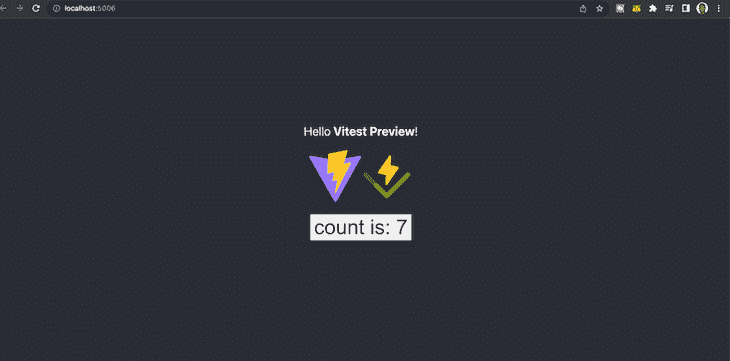

# 使用 Vitest 预览进行可视化调试的指南

> 原文：<https://blog.logrocket.com/visual-debugging-vitest-preview/>

可视化调试允许开发人员实时查看代码的执行情况，从而更容易识别和修复问题。当处理具有几个移动部分的复杂代码库时，这尤其有用。

在使用 Vitest Preview 进行测试和可视化调试之前，建议有使用 Vitest 或者类似于 [Jest](https://blog.logrocket.com/jest-testing-top-features/) 的测试框架进行单元测试的经验。如果你是 Vitest 单元测试的新手，我们已经写了一个[初学者友好指南](https://blog.logrocket.com/guide-vitest-automated-testing-vue-components/)，演示如何用 Vitest 测试一个前端应用程序。本指南将帮助您更好地理解单元测试，以及如何将它应用到您自己的项目中。

*向前跳转:*

## 为什么可视化调试很重要？

可视化调试很重要，原因有几个。首先，它帮助你找出错误。可视化调试使查明代码中错误和缺陷的来源变得更加容易，从而在尝试修复问题时节省您的时间和精力。

可视化调试允许开发人员看到他们的代码如何与系统的其他部分交互，从而提供对其行为的有价值的见解。此外，可视化调试有助于开发人员识别代码中的潜在性能问题，从而优化代码以获得更好的性能。

通过使识别和修复问题变得更容易，可视化调试帮助开发人员提高他们的生产力和效率。总的来说，它是保证软件可靠性和正确性的必备工具。

## Vitest 简介

Vitest 是一个新的单元测试框架，它是为速度而构建的。据[Vitest 的创作者、](https://twitter.com/antfu7) [Vite](https://vitejs.dev/) 的核心团队成员 Anthony Fu 介绍:

> 就像 Vite 在浏览器中的工作方式一样，Vitest 也知道你的模块的图形，这使得它能够进行智能检测，并且只重新运行相关的测试。感觉几乎像 HMR，但测试。

Vitest 最棒的地方在于，它会观察你的应用程序的所有依赖项和测试，并确保只有获得更新的部分才会重新运行。根据我使用这两个框架的经验，Jest 和 Vitest 在第一次运行时表现相似。同时，Vitest 在下一次重新运行时有更好的测试性能。这是因为 Vitest 只运行测试或业务逻辑中被更新的部分。

虽然这是一个非常强大的工具，但是如果前端开发人员能够可视化他们的测试，它会更加强大。

例如，当你运行一个添加了两个变量的测试，`A` + `B`，它应该返回`C`到屏幕上，你希望看到算法已经完成。结果成功地显示在屏幕上，正如预期的视觉效果。这就是 Vitest 预览的用武之地。

## 什么是 Vitest 预览？

Vitest Preview 通过允许您在浏览器中可视化您的测试，帮助您更快地编写和调试测试。如果你熟悉 [Jest](https://blog.logrocket.com/tag/jest/) ，你就会知道 Jest 社区有一个类似的调试工具， [Jest Preview](https://github.com/nvh95/jest-preview) ，由同一个开发者 Hung Viet Nguyen 创建。要了解更多关于 Jest 测试的信息，请点击查看我们的[视频指南。](https://www.youtube.com/watch?v=NHMIn723hQY)

2022 年 10 月 24 日， [Hung Viet Nguyen](https://twitter.com/hung_dev) 公开宣布启动 Vitest 预览版，声明如下:

> 我经常被问到的一个问题是“我能用 [@JestPreview](https://twitter.com/JestPreview) 换 [@vitest_dev](https://twitter.com/vitest_dev) 吗？”
> 
> 今天我推出的是 [@VitestPreview](https://twitter.com/VitestPreview) ，一个@JestPreview 的小哥哥，搭建在@vite_js 之上，对@vitest_dev 的支持一流，速度极快。

在本指南的其余部分，我将向您展示如何将 Vitest Preview 集成到您的 Vite 测试套件中，以帮助您更快、更直观地进行调试。

## 为调试设置 Vitest 预览

因为我们将专注于测试，所以我们将克隆我为本指南创建的现有的 [GitHub 库](https://github.com/ezesundayeze/vitest-preview-demo)。

首先，运行以下命令来克隆存储库并安装所有依赖项:

```
git clone https://github.com/ezesundayeze/vitest-preview-demo && npm install

```

您克隆的应用程序目录应该如下所示:

```
├── README.md
├── index.html
├── package-lock.json
├── package.json
├── public
│   └── vitest.svg
├── src
│   ├── App.css
│   ├── App.tsx
│   ├── assets
│   │   └── vite.svg
│   ├── hooks
│   │   └── useCounter.ts
│   ├── index.css
│   ├── main.jsx
│   ├── test
│   │   ├── App.test.tsx
│   │   └── setup.ts
│   ├── utils
│   │   └── test-utils.tsx
│   └── vite.env.d.ts
├── tsconfig.json
└── vite.config.js

```

克隆的应用程序是一个基本的 [React 项目](https://blog.logrocket.com/using-react-flow-plan-react-project/)，当点击**按钮**时，它会增加一个计数器。这是 React 项目的一个常见起点，通常称为 React Starter 应用程序。

为了能够使用 Vitest Preview 运行测试，我们在项目中安装了以下依赖项:

```
// package.json

"devDependencies": {
    "@testing-library/jest-dom": "^5.16.4",
    "@testing-library/react": "^12.1.5",
    "@testing-library/react-hooks": "^8.0.0",
    "@testing-library/user-event": "^13.5.0",
    "@types/react": "^18.0.21",
    "@types/react-dom": "^18.0.6",
    "@types/testing-library__jest-dom": "^5.14.5",
    "@vitejs/plugin-react": "^2.1.0",
    "jsdom": "^20.0.1",
    "npm-run-all": "^4.1.5",
    "vite": "^3.1.8",
    "vitest": "^0.24.3",
    "vitest-preview": "^0.0.1",
  }

```

### 创建您自己的项目

为了从头开始创建你自己的项目，你可以[使用 Vite 来搭建](https://vitejs.dev/guide/)项目并安装必要的依赖项，比如`Vitest`和`vitest-preview`，正如我们前面所看到的。然后，您可以使用`npm-run-all`并行运行 Vitest Preview 和 Vitest。为了方便起见，您可以将`npm-run-all`添加到您的`package.json`文件中。

例如，您可以在您的`package.json`文件中包含一个`script`，如下所示:

```
// package.json

...
"scripts": {
    "start": "npm-run-all -p vitest-preview test",
  },
...

```

### 寻址错误

我在使用 Vitest Preview 设置新项目时遇到的一个常见问题是以下错误:

```
Error: Cannot find module '…/build/Release/canvas.node'

```

或者

```
Error: Module did not self-register .../node_modules/canvas/build/Release/canvas.node

```

在[栈溢出](https://stackoverflow.com/search?q=Error%3A+Cannot+find+module+%E2%80%98%E2%80%A6%2Fbuild%2FRelease%2Fcanvas.node%E2%80%99)和其他论坛上有很多解决这个问题的建议，但是根据我的经验，简单地安装`canvas`依赖就解决了这个问题。即使后来我删除了依赖项，问题也没有再次出现。这种行为可能看起来很奇怪，但它在过去对我很有效。

如果你遇到这个问题，你可以试着安装`canvas`，看看它是否能解决这个问题。请记住，修复这个问题的具体步骤可能会根据您的具体设置和配置而有所不同，因此，咨询您正在使用的工具的[文档](https://www.vitest-preview.com/)并在必要时寻求社区帮助总是一个好主意。

## 使用 Vitest 预览进行可视化调试

现在您已经设置好了演示，让我们编写一个简单的测试。首先，打开`src/test/app.test.tsx`文件，编写一个测试，模拟七次`**button**`点击，然后验证`count`是否增加了七。

这是我们的测试:

```
// src/test/App.test.ts

import App from '../App';
import { render, screen, fireEvent } from '../utils/test-utils';
import { debug } from 'vitest-preview';

describe('Simple working test', () => {
  it('should increment count on click', async () => {
    render(<App />);
    const button = screen.getByRole('button');
    for (let i = 0; i < 7; i++) {
      fireEvent.click(button);
    }
    debug();
    expect(await screen.findByText(/count is: 7/i)).toBeInTheDocument();
  });
}); 

```

在上面的代码中，我们抓取了`button`元素并运行了一个循环，该循环迭代了七次，模拟了七次点击。然后，我们验证了七个渲染。

注意代码中的`debug`函数吗？这就是 Vitest Preview 被调用并施展魔法的地方。下面是我们正在测试的代码:

```
import { useCounter } from './hooks/useCounter';
import viteLogo from './assets/vite.svg';
import './App.css';
function App() {
  const { count, increment } = useCounter();
  return (
    <div className="App">
      <header className="App-header">
        <p>
          Hello <b>Vitest Preview</b>!
        </p>
        <div>
          
          
        </div>
        <p>
          <button className="counter" type="button" onClick={increment}>
            count is: {count}
          </button>
        </p>
        <p>
        </p>
      </header>
    </div>
  );
}
export default App;

```

虽然这是一个标准测试，但它的独特之处在于，我们可以预览并看到屏幕上呈现了计数 7，如下所示:



### 创建第二个测试

让我们为一个组件创建另一个测试，该组件有两个表单输入，当用户提交表单时，这两个表单输入接受数字并返回数字的总和。

这是我们的测试:

```
///src/test/Calculator.test.ts
import { render, screen, fireEvent } from "@testing-library/react";
import Calculator from "../Calculator";
import { debug } from "vitest-preview";

describe("Calculator", () => {
    it("should add two numbers and display the result", async () => {
        // Render the component
        render(<Calculator />);

        // Find the input fields and the button
        const input1 = screen.getByLabelText("First number:");
        const input2 = screen.getByLabelText("Second number:");
        const button = screen.getByRole("button", { name: "Add numbers" });

        // Enter values into the input fields
        fireEvent.change(input1, { target: { value: "2" } });
        fireEvent.change(input2, { target: { value: "3" } });

        // Click the button
        fireEvent.click(button);
        debug();
        // Assert that the result is displayed on the page
        expect(await screen.findByText("The result is: 5")).toBeInTheDocument();
    });
})

```

让我们也为它写代码:

```
// src/Calculator.tsx

import { useState } from "react";
import './App.css';
const Calculator = () => {
  // Declare two state variables, one for each input field
  const [num1, setNum1] = useState(0);
  const [num2, setNum2] = useState(0);
  // Declare a state variable for the result of the calculation
  const [result, setResult] = useState("");
  // Define a function to handle the form submission
  const handleSubmit = (event) => {
    event.preventDefault();
    // Convert the input values to numbers and add them
    const sum = Number(num1) + Number(num2);
    // Update the result state with the calculated sum
    setResult(sum);
  };
  return (
    <form onSubmit={handleSubmit}>
      <label>
        First number:
        <input
          type="number"
          value={num1}
          onChange={(event) => setNum1(event.target.value)}
        />
      </label>
      <label>
        Second number:
        <input
          type="number"
          value={num2}
          onChange={(event) => setNum2(event.target.value)}
        />
      </label>
      <button type="submit">Add numbers</button>
      {result && <div>The result is: {result}</div>}
    </form>
  );
};
export default Calculator;

```

以下是运行测试时的预览:


我没有在输入框中输入这些数字。测试按照我们描述的进行。然后，Vitest Preview 确保我们能够在浏览器中预览它。所有的测试都通过了，正如您在终端中和下面看到的:


正如您所知，Vitest Preview 在调试前端应用程序时非常有用，因为它允许您获得测试的实时反馈，直接模拟用户如何与您的应用程序交互，而不仅仅是拥有一个过程的心理模型。

## 结论

随着一些致力于增强开发者体验的工具的建立，前端开发变得越来越有趣。不管项目的规模如何，Vitest Preview 都是一个有价值的可视化测试和调试工具。为了进一步阅读，你应该检查一下[文档](https://www.vitest-preview.com/)。

## 您是否添加了新的 JS 库来提高性能或构建新特性？如果他们反其道而行之呢？

毫无疑问，前端变得越来越复杂。当您向应用程序添加新的 JavaScript 库和其他依赖项时，您将需要更多的可见性，以确保您的用户不会遇到未知的问题。

LogRocket 是一个前端应用程序监控解决方案，可以让您回放 JavaScript 错误，就像它们发生在您自己的浏览器中一样，这样您就可以更有效地对错误做出反应。

[](https://lp.logrocket.com/blg/javascript-signup)[https://logrocket.com/signup/](https://lp.logrocket.com/blg/javascript-signup)

[LogRocket](https://lp.logrocket.com/blg/javascript-signup) 可以与任何应用程序完美配合，不管是什么框架，并且有插件可以记录来自 Redux、Vuex 和@ngrx/store 的额外上下文。您可以汇总并报告问题发生时应用程序的状态，而不是猜测问题发生的原因。LogRocket 还可以监控应用的性能，报告客户端 CPU 负载、客户端内存使用等指标。

自信地构建— [开始免费监控](https://lp.logrocket.com/blg/javascript-signup)。