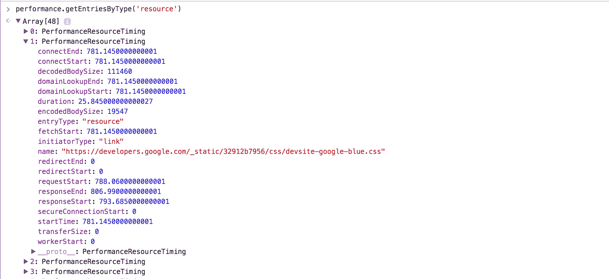

# 在 Chrome DevTools - LogRocket 博客中可视化后端性能

> 原文：<https://blog.logrocket.com/visualizing-backend-performance-in-the-chrome-devtools-bb6fd232540/>

# 在 Chrome DevTools 中可视化后端性能

## 

2017 年 3 月 29 日 2 分钟阅读 613

Chrome 的网络面板有许多有助于理解网络请求/响应性能的可视化工具。在这篇文章中，我将分解请求生命周期瀑布，并向您展示如何将后端跟踪信息传输到网络面板。

默认情况下，Chrome 将一个请求的生命周期分为 8 个部分:

`Queueing`和`Stalled`显示了浏览器执行请求之前需要等待的时间。在这个阶段，请求可能会被延迟，原因有几个。浏览器有时会在加载其他资源之前优先加载脚本和 CSS 等资源。此外，HTTP 1 请求最多允许 6 个并发 TCP 连接。

`DNS Lookup`、`Initial Connection`和`SSL`都是不言自明的——显示了在请求生命周期的各个部分花费的时间。

`Request sent`是浏览器向服务器发送请求所花费的时间。这一步通常很快，因为它只代表浏览器发送请求所花费的时间。

`Waiting (Time to first bite)`显示浏览器发出初始请求后，开始从服务器接收数据所需等待的时间。在此期间，服务器会做任何需要的工作来返回所请求的资源。在一个典型的 API 请求中，这是大部分延迟发生的地方，并且通常是开发人员对优化有最大控制的步骤。考虑到这一点，显示服务器“内部”发生的更细粒度的数据会很有帮助，我将很快对此进行解释。

最后，`Content Download`是在接收到“第一个字节”之后，从服务器接收整个字节流所花费的时间。这里的延迟主要取决于网络连接速度，但显然针对较小的资源进行优化将减少这一步的时间。

#### 发送后端计时

`Waiting (TTFB)`步骤中发生的事情可能有点神秘，因为服务器在响应请求时可以做许多事情。Chrome 有一个 API，用于使用`Server-Timing`头从服务器发送自定义计时:

在这个基本的 node/express 服务器中，您可以看到定时头的格式，这是我为`/`请求设置的。在这里，我硬编码了一些示例值，但是这些值通常是通过编程填充的。

然后，当我点击`/`路线时，计时显示在 Chrome 网络面板上。

手动构建`Server-Timing`头文件很容易，但是也有一些很好的助手库，比如`[server-timing](http://npmjs.com/package/server-timing)`(在 NPM 上)，它们有一个更干净的 API 来做这件事。

当您访问您的应用程序并注意到 QA 中的延迟时，发送`Server-Timing`标头非常有用，因为您可以了解服务器上的特定操作是否缓慢。然而，如果您使用像 LogRocket 这样的前端日志记录服务，这个 API 特别有用，它记录所有的网络请求和它们的头。然后，如果您正在调查一个挂起或非常慢的网络请求，您可以看到后端计时并找出哪里出错了。

但是，请记住，您暴露的任何计时信息都是公开可见的，因此如果您暴露了像`validate-password`这样的步骤的持续时间，理论上可能会帮助黑客使用计时攻击。

#### 额外收获:以编程方式使用资源计时

调用`performance.getEntriesByType('resource')`返回资源列表和它们各自的计时。这有助于在 JavaScript 控制台中分析计时，或者在您的应用程序中以编程方式抓取并发送到分析商店。

#### 更多资源

使用 [LogRocket](https://lp.logrocket.com/blg/signup) 消除传统错误报告的干扰

## [LogRocket](https://lp.logrocket.com/blg/signup) 是一个数字体验分析解决方案，它可以保护您免受数百个假阳性错误警报的影响，只针对几个真正重要的项目。LogRocket 会告诉您应用程序中实际影响用户的最具影响力的 bug 和 UX 问题。

然后，使用具有深层技术遥测的会话重放来确切地查看用户看到了什么以及是什么导致了问题，就像你在他们身后看一样。

LogRocket 自动聚合客户端错误、JS 异常、前端性能指标和用户交互。然后 LogRocket 使用机器学习来告诉你哪些问题正在影响大多数用户，并提供你需要修复它的上下文。

关注重要的 bug—[今天就试试 LogRocket】。](https://lp.logrocket.com/blg/signup-issue-free)

Focus on the bugs that matter — [try LogRocket today](https://lp.logrocket.com/blg/signup-issue-free).