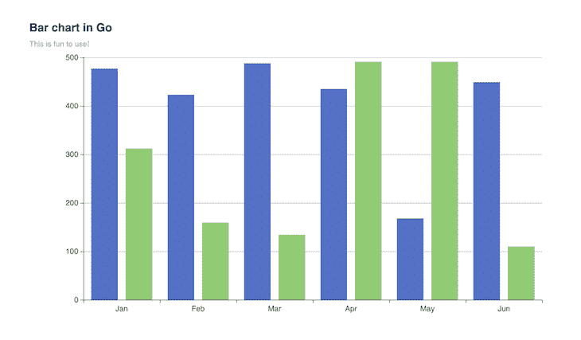
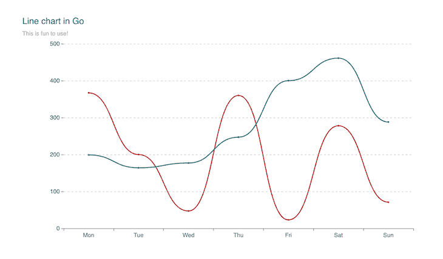
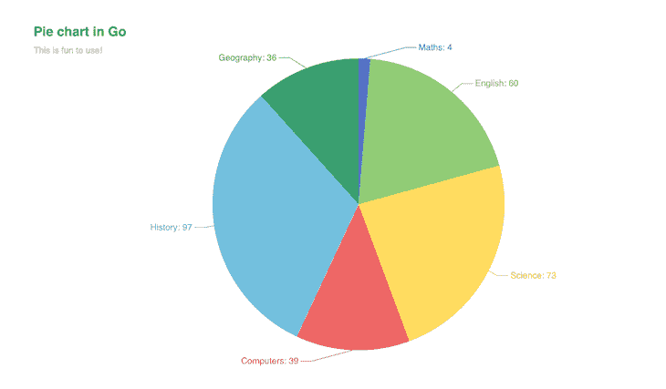
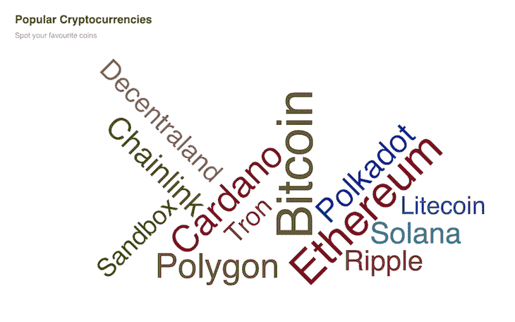

# 用 go-echarts 可视化 Golang 中的数据

> 原文：<https://blog.logrocket.com/visualizing-data-go-echarts/>

用图形和图表可视化数据会使理解变得容易得多。我们可以使用数据可视化库轻松生成干净漂亮的图表。

在本教程中，我们将学习如何使用`[go-echarts](https://github.com/go-echarts/go-echarts)`库在 Golang 中绘制数据。在 GitHub 上，它拥有超过 4k 的恒星，是 Go 中最受欢迎的生成图表的库之一。我们将学习如何设置和安装这个包，然后逐步介绍如何创建不同的图表，包括条形图、折线图、饼图和单词云。

`go-echarts`包括各种各样的定制选项，比如[多个 UI 主题](https://github.com/go-echarts/go-echarts/blob/master/types/themes.go)，您可以使用它们来进一步改善数据可视化的外观。`go-echarts`有适当的文档，并提供干净全面的 API。

Go 本身不提供创建可定制可视化的能力，但`go-echarts`提供了对多种数据输入格式和移动优化的支持。

要设置我们的项目并安装`go-echarts`，运行下面的代码:

```
mkdir learn_charts
cd learn_charts

go mod init learn_charts
go get -u github.com/go-echarts/go-echarts/...

touch main.go

```

现在，在你喜欢的编辑器中打开`main.go`文件，让我们开始吧！

## 在 Golang 中创建条形图

首先，让我们来看看如何创建条形图，这是一种最常见、最广泛使用的图表类型。当您想要显示组之间的分布或比较时，条形图是理想的选择。我们将在条形图中使用随机数据，并探索不同的选项来定制它。

首先，让我们编写一个函数来为条形图创建随机样本数据:

```
package main
import (
    "math/rand"
    "os"

    "github.com/go-echarts/go-echarts/v2/opts"
)
// generate random data for bar chart
func generateBarItems() []opts.BarData {
    items := make([]opts.BarData, 0)
    for i := 0; i < 6; i++ {
        items = append(items, opts.BarData{Value: rand.Intn(500)})
    }
    return items
}

```

现在，我们准备创建我们的条形图。为此，我们将初始化一个新的条形图，并设置像`title`和`legend`这样的全局选项。然后，我们将使用带有`generateBarItems()`函数的`AddSeries()`方法将数据填充到实例中。最后，我们将把图表呈现为一个 HTML 文件。或者，您可以使用 HTTP 服务器来呈现图表:

```
func createBarChart() {
    // create a new bar instance
    bar := charts.NewBar()

    // Set global options
    bar.SetGlobalOptions(charts.WithTitleOpts(opts.Title{
        Title:    "Bar chart in Go",
        Subtitle: "This is fun to use!",
    }))

    // Put data into instance
    bar.SetXAxis([]string{"Jan", "Feb", "Mar", "Apr", "May", "Jun"}).
        AddSeries("Category A", generateBarItems()).
        AddSeries("Category B", generateBarItems())
    f, _ := os.Create("bar.html")
    _ = bar.Render(f)
}

```

使用上面的命令，应该会创建一个名为`bar.html`的文件。在浏览器中打开它，您应该会看到您的第一个 Go 条形图。您可以随意添加自定义样式:



## 创建折线图

数据科学家通常使用折线图来跟踪一段时间内的变化。在我们的示例中，我们将创建一个包含随机数据的折线图，并比较两个随机类别。

首先，让我们为图表生成随机数据:

```
package main

import (
    "math/rand"
    "os"

    "github.com/go-echarts/go-echarts/v2/opts"
)

// generate random data for line chart
func generateLineItems() []opts.LineData {
    items := make([]opts.LineData, 0)
    for i := 0; i < 7; i++ {
        items = append(items, opts.LineData{Value: rand.Intn(500)})
    }
    return items
}

```

现在，我们准备创建一个折线图。为此，我们将为折线图初始化一个新实例，就像我们为条形图所做的那样。然后，我们将数据填充到实例中，并将图表呈现到 HTML 文件中:

```
func createLineChart() {
    // create a new line instance
    line := charts.NewLine()

    // set some global options like Title/Legend/ToolTip or anything else
    line.SetGlobalOptions(
        charts.WithInitializationOpts(opts.Initialization{
          Theme: types.ThemeInfographic
        }),
        charts.WithTitleOpts(opts.Title{
            Title:    "Line chart in Go",
            Subtitle: "This is fun to use!",
        })
    )

    // Put data into instance
    line.SetXAxis([]string{"Mon", "Tue", "Wed", "Thu", "Fri", "Sat", "Sun"}).
        AddSeries("Category A", generateLineItems()).
        AddSeries("Category B", generateLineItems()).
        SetSeriesOptions(charts.WithLineChartOpts(opts.LineChart{Smooth: true}))
    f, _ := os.Create("line.html")
    _ = line.Render(f)
}

```

在你的浏览器中打开`line.html`，你会看到一个如下图所示的图表:



## 创建饼图

当你比较整体的一部分时，饼图无疑是最好的选择。在我们的示例中，我们将创建一个包含随机数据的饼图来显示学生的销售分数分布。

让我们编写一个小函数来为我们的饼图创建样本随机数据:

```
package main

import (
    "math/rand"
    "os"

    "github.com/go-echarts/go-echarts/v2/opts"
)

// generate random data for pie chart
func generatePieItems() []opts.PieData {
    subjects := []string{"Maths", "English", "Science", "Computers", "History", "Geography"}
    items := make([]opts.PieData, 0)
    for i := 0; i < 6; i++ {
        items = append(items, opts.PieData{
            Name:  subjects[i],
            Value: rand.Intn(500)})
    }
    return items
}

```

现在，我们需要创建一个实例并添加定制。我们将添加额外的标签选项，并为饼图设置半径。请随意更改和使用选项:

```
func createPieChart() {
    // create a new pie instance
    pie := charts.NewPie()
    pie.SetGlobalOptions(
        charts.WithTitleOpts(
            opts.Title{
                Title:    "Pie chart in Go",
                Subtitle: "This is fun to use!",
            },
        ),
    )
    pie.SetSeriesOptions()
    pie.AddSeries("Monthly revenue",
        generatePieItems()).
        SetSeriesOptions(
            charts.WithPieChartOpts(
                opts.PieChart{
                    Radius: 200,
                },
            ),
            charts.WithLabelOpts(
                opts.Label{
                    Show:      true,
                    Formatter: "{b}: {c}",
                },
            ),
        )
    f, _ := os.Create("pie.html")
    _ = pie.Render(f)
}

```

在浏览器中打开`pie.html`,查看如下饼图:



## 创建单词云

词云通过用更大的字体突出显示数据集中最常用的词来显示它们。在我们的示例中，我们将使用关于加密货币流行程度的随机数据创建一个单词云。

让我们编写一个函数来为我们的词云创建样本随机数据:

```
package main

import (
    "math/rand"
    "os"

    "github.com/go-echarts/go-echarts/v2/opts"
)

var wordCloudData = map[string]interface{}{
    "Bitcoin":      10000,
    "Ethereum":     8000,
    "Cardano":      5000,
    "Polygon":      4000,
    "Polkadot":     3000,
    "Chainlink":    2500,
    "Solana":       2000,
    "Ripple":       1500,
    "Decentraland": 1000,
    "Tron":         800,
    "Sandbox":      500,
    "Litecoin":     200,
}

// generate random data for word cloud
func generateWordCloudData(data map[string]interface{}) (items []opts.WordCloudData) {
    items = make([]opts.WordCloudData, 0)
    for k, v := range data {
        items = append(items, opts.WordCloudData{Name: k, Value: v})
    }
    return
}

```

现在，我们需要创建一个实例并添加定制选项。首先，我们使用`charts.WithTitleOpts()`定义标题和副标题，然后我们将数据添加到 word cloud 图表实例中。请随意更改和使用选项:

```
func createWordCloud() {
    wc := charts.NewWordCloud()
    wc.SetGlobalOptions(
        charts.WithTitleOpts(opts.Title{
            Title:    "Popular Cryptocurrencies",
            Subtitle: "Spot your favourite coins",
        }))
    wc.AddSeries("wordcloud", generateWordCloudData(wordCloudData)).
        SetSeriesOptions(
            charts.WithWorldCloudChartOpts(
                opts.WordCloudChart{
                    SizeRange: []float32{40, 80},
                    Shape:     "cardioid",
                }),
        )
    f, _ := os.Create("word_cloud.html")
    _ = wc.Render(f)
}

```

在浏览器中打开`word_cloud.html`,查看如下所示的单词云:



在上面的单词云中，最常被命名的加密货币以最大的字体出现。在我们的情况下，我们可以推断这些包括比特币和以太坊。

## 摘要

在本文中，我们使用`go-echarts`库实践了一种在 Go 中可视化数据的更好方法。`go-echarts`为[提供了更多类型的图表](https://github.com/go-echarts/go-echarts/tree/master/charts)，比如热图、散点图和盒状图，按照我们上面使用的方法，这些图表很容易构建和填充。

或者，您可以考虑使用以下库在 Go 中构建图表:

*   [围棋图表](https://github.com/wcharczuk/go-chart):围棋基本图表库(3k 星)
*   Glot :构建在 gnuplot (350 星)之上的绘图库
*   [PTerm](https://github.com/pterm/pterm) :控制台中图表的 Go 模块(2k 星)

我希望你在本教程中学到了一些新东西。现在，您可以在自己的 Go web 应用程序中使用图表。编码快乐！

## 使用 [LogRocket](https://lp.logrocket.com/blg/signup) 消除传统错误报告的干扰

[](https://lp.logrocket.com/blg/signup)

[LogRocket](https://lp.logrocket.com/blg/signup) 是一个数字体验分析解决方案，它可以保护您免受数百个假阳性错误警报的影响，只针对几个真正重要的项目。LogRocket 会告诉您应用程序中实际影响用户的最具影响力的 bug 和 UX 问题。

然后，使用具有深层技术遥测的会话重放来确切地查看用户看到了什么以及是什么导致了问题，就像你在他们身后看一样。

LogRocket 自动聚合客户端错误、JS 异常、前端性能指标和用户交互。然后 LogRocket 使用机器学习来告诉你哪些问题正在影响大多数用户，并提供你需要修复它的上下文。

关注重要的 bug—[今天就试试 LogRocket】。](https://lp.logrocket.com/blg/signup-issue-free)