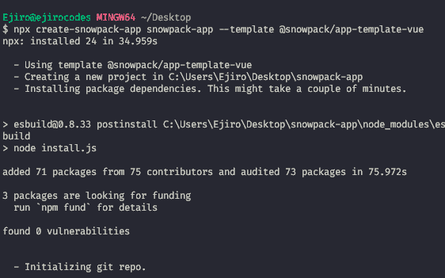

# Vite 与 Snowpack:前端构建工具的比较

> 原文：<https://blog.logrocket.com/vite-vs-snowpack-a-comparison-of-frontend-build-tools/>

Vite 和 Snowpack 都是前端构建工具，旨在提高生产率和改善开发人员的体验。在本文中，我们将比较 Vite 和 Snowpack，以确定如何以及何时使用每种工具。

## 简介:维特 vs .积雪场

[Vite](https://vitejs.dev/) 是由 [Vue](https://vuejs.org/) [的创造者](https://vuejs.org/)[尤雨溪](https://twitter.com/youyuxi/)推出的下一代前端构建工具。 [js](https://vuejs.org/) 。它是官方 [Vue CLI](https://cli.vuejs.org) 的替代产品，速度快得令人难以置信，因为它利用了[本机 es 模块](https://developer.mozilla.org/en-US/docs/Web/JavaScript/Guide/Modules)，并使用 [Rollup](https://rollupjs.org/) 来处理同一包中的开发和捆绑包。在功能上，它像一个预配置的 webpack 和 webpack-dev-server 一样工作，但是在速度上，它把两者都打败了。

Snowpack 还以速度为傲，自称是为现代网络设计的“快如闪电”的前端构建工具。在你的开发工作流程中，Snowpack 是 webpack 或 package 等更重、更复杂的打包器[的替代品。与 Vite 类似，它利用 JavaScript 的原生模块系统(](https://blog.logrocket.com/snowpack-vs-webpack/)[称为 ESM](https://developer.mozilla.org/en-US/docs/Web/JavaScript/Reference/Statements/import) )来避免不必要的工作，无论项目有多大，它都可以快速运行。

Vite 和 Snowpack 都是快速增长的前端构建工具，致力于通过尽可能高效地构建前端应用程序来改善开发人员的体验。

在接下来的部分中，我们将探索 Vite 和 Snowpack 的更多特性，以及如何在您的开发过程中使用它们。

## 脚手架

### 轻快地

为了开始使用 Vite，我们将使用 CLI 构建一个 Vue 和 Vite 项目， [@vite/create-app](https://github.com/vitejs/vite/blob/main/packages/create-app/README.md) 。为此，我们可以在终端中运行以下命令之一:

```
// with npm
npm init @vitejs/app my-vite-app --template vue

// with yarn
yarn create @vitejs/app my-vite-app --template vue

```


可以使用以下支持的模板之一来引导 Vite 应用程序:

*   `vanilla`
*   `vue`
*   `vue-ts`
*   `react`
*   `react-ts`
*   `preact`
*   `preact-ts`

完成后，`cd`进入项目目录，安装依赖项，并启动开发服务器:

```
// with npm
npm run dev

// with yarn
yarn dev

```

注意，尽管我们在这个例子中使用 Vite 和 Vue.js，Vite 也可以用在 React、Preact 或普通 JavaScript 应用程序中。

通过在项目目录根目录下的`vite.config.js`或`vite.config.ts`文件中添加更多选项，可以扩展和配置 Vite，使其超出默认配置。

### 积雪场

开始使用 Snowpack 最简单的方法是使用 [Create Snowpack App (CSA)](https://github.com/snowpackjs/snowpack/blob/main/create-snowpack-app/cli/README.md) 。借助 CSA 工具，我们可以使用 CSA 官方应用程序模板搭建一个已配置 Snowpack 的应用程序:

```
npx create-snowpack-app snowpack-app --template @snowpack/app-template-vue

```



阅读更多[此处](https://github.com/snowpackjs/snowpack/blob/main/create-snowpack-app/cli/README.md#official-app-templates)获取 Snowpack 中脚手架模板的完整列表。

## 特征

Vite 和 Snowpack 都有很棒的特性，未来还会继续开发和改进。在这一节中，我们将讨论这些非捆绑 JavaScript 工具的一些相似和不同的特性。

### 轻快地

#### 热模块更换(HMR)

Vite 提供了一个 HMR API。HMR 在应用程序运行时交换、添加或删除模块，无需完全重新加载。这可以显著加快开发过程，因为当对应用程序进行更改时，应用程序状态会保留下来。如果您在任何文件中进行任何更改，您会注意到这些更改的反映速度比在普通的 Vue 或 React 应用程序中快得多。

#### 以打字打的文件

Vite 完全支持开箱即用的`.ts` 文件。它使用一个叫做 [esbuild](https://github.com/evanw/esbuild) 的速度极快的 JavaScript 捆绑器将类型脚本代码转换成 JavaScript。

#### npm 依赖项解析

原生 ES 导入不支持类似`import { createApp } from 'vue'`的裸模块导入。相反，这样的导入会在浏览器中抛出一个错误，因为它不是包在我们的`node_modules`文件夹中的位置的相对路径。

Vite 在所有提供的 JavaScript 文件中检测这种裸模块导入，并将它们重写到解析的路径中，以反映包在`node_ modules`文件夹中的位置，以便浏览器可以正确处理它们。

#### 配置

要在 Vite 中扩展项目的配置，请在项目目录的根目录下的`vite.config.js`或`vite.config.ts`文件位置中扩展默认配置选项。

#### 文件支持

Vite 对 Vue 3 单文件组件(SFC)、Vue 3 JSX 组件和 Vue 2 组件有现成的支持。它还支持 JSX 文件(`.jsx`、`.tsx`)、CSS 文件导入、PostCSS、CSS 模块和 CSS 预处理程序，如 Sass、LESS 和 Stylus。

### 积雪场

#### 即时启动

Snowpack 的非捆绑开发服务器在 50 毫秒或更短时间内启动，即使项目规模扩大，也能保持快速运行。

#### 构建一次，永久缓存

我印象最深的一个特性是 Snowpack 在一次构建后缓存文件的能力。浏览器中的 JavaScript 原生模块系统使这成为可能。

#### 热模块更换(HMR)

与 Vite 类似，Snowpack 提供了一个 [HMR API](https://www.snowpack.dev/reference/hot-module-replacement) 。当构建一个 Snowpack 驱动的应用程序时，对文件所做的更改会通过浏览器刷新立即反映在浏览器上。

#### 针对生产进行优化

在撰写本文时，Snowpack 有一个由 esbuild 提供支持的[内置优化管道](https://www.snowpack.dev/guides/optimize-and-bundle#option-1%3A-built-in-optimizations)(尽管它仍然是一个实验性的功能)。Snowpack 官方文档还建议使用 [@snowpack/plugin-webpack](https://www.npmjs.com/package/@snowpack/plugin-webpack) 插件优化 Snowpack 驱动的应用程序。

## 构建时间和服务器启动时间

您可以在 300 毫秒内启动 Vite 中的 dev 服务器，因为不需要捆绑或编译。相反，当你打开你的 Vite 应用程序时，你将从服务器获得`index.html`。然后，浏览器将读取`index.html`并知道如何解析本机 ES 模块代码。

像 Vite 一样，Snowpack 的构建时间非常快，因为它在开发过程中为你的文件提供服务。因此，Snowpack 中的开发服务器可以在 50 毫秒或更短时间内启动。

使用 Snowpack，项目中的每个文件都可以被解释为函数，其中输入是文件的内容，输出是文件的缓存版本。因为根本没有进行捆绑，所以本地 dev 服务器会立即启动，并且只处理给定时间点所需的文件。这意味着即使你的项目变得非常大，启动受到的影响也是最小的。

## 生产捆绑包

Vite 使用 Rollup 进行生产，可以生产更小的捆绑包，因为它是基于 ESM 的。Vite 0.16.4 和更高版本支持异步块和 https 模式的自动 CSS 代码分割，这两者都可以提高生产构建的性能。

要在 Snowpack 中将您的站点构建成 web 原生 JS、CSS 和 HTML 文件，您可以使用`snowpack build`。这种“非捆绑”部署对于小型站点来说已经足够了，但是许多开发人员更喜欢优化和捆绑他们的最终站点以获得生产性能。

Snowpack 还可以在您的最终版本上运行各种优化来处理遗留浏览器支持，包括:代码缩减、代码拆分、树抖动、死代码消除、预加载、捆绑等等。

## 社区和生态系统

### 轻快地

即使 Vite 的版本 1 在 2020 年 10 月才发布，Vite.js 团队也在不断增加改进(例如，最近在 2021 年 1 月，Vite 现在支持全球导入)。迄今为止，已知有超过 5000 个存储库运行在 Vite 上，超过 110 名开发人员为该存储库做出了贡献。有趣的是，尽管是新人，Vite 的采用率却比 Snowpack 快。

### 积雪场

Snowpack 已经存在一段时间了，已经有超过 280 名开发者为其在 GitHub 上的知识库做出了贡献。也有近 4700 个知识库运行在 Snowpack 上。

## 学习曲线

在 Vite 和 Snowpack 中都很容易上手，因为两者都有一个 CLI，可以用来搭建一个已经配置好包的新项目。因此，这两个构建工具的学习曲线相当低，尤其是与 webpack 这样的 JavaScript 捆绑器相比[(尽管公平地说，web pack](https://blog.logrocket.com/benchmarking-bundlers-2020-rollup-parcel-webpack/)[有更多的功能](https://blog.logrocket.com/guide-performance-optimization-webpack/))。

## 证明文件

积雪场和 T2 维特都有很好的文档，非常简单明了。通过查看它们的文档并亲自尝试一些东西，您可以很容易地开始使用这两种工具。如果您熟悉现代 JavaScript 构建工具，您将能够在一两天内学会并使用这些构建工具。

## 结论

Vite 和 Snowpack 都拥有令人难以置信的速度，这在一定程度上是由于使用了非捆绑开发环境。虽然很难预测 web 开发的未来，但可以肯定地说，Vite 和 Snowpack 在这里说。毕竟，没有人喜欢等待 30 秒或更长的时间来启动他们的开发服务器或在 DOM 中反映更改！

## 进一步阅读和参考

请在下面的评论区告诉我你对这篇文章的看法。我在 Twitter 和 T2 GitHub 上社交。感谢您的阅读，敬请关注。

最后，看看 LogRocket 播客，PodRocket，看看我们最近在 Snowpack，webpack 上的一集！

## 您是否添加了新的 JS 库来提高性能或构建新特性？如果他们反其道而行之呢？

毫无疑问，前端变得越来越复杂。当您向应用程序添加新的 JavaScript 库和其他依赖项时，您将需要更多的可见性，以确保您的用户不会遇到未知的问题。

LogRocket 是一个前端应用程序监控解决方案，可以让您回放 JavaScript 错误，就像它们发生在您自己的浏览器中一样，这样您就可以更有效地对错误做出反应。

[](https://lp.logrocket.com/blg/javascript-signup)[https://logrocket.com/signup/](https://lp.logrocket.com/blg/javascript-signup)

[LogRocket](https://lp.logrocket.com/blg/javascript-signup) 可以与任何应用程序完美配合，不管是什么框架，并且有插件可以记录来自 Redux、Vuex 和@ngrx/store 的额外上下文。您可以汇总并报告问题发生时应用程序的状态，而不是猜测问题发生的原因。LogRocket 还可以监控应用的性能，报告客户端 CPU 负载、客户端内存使用等指标。

自信地构建— [开始免费监控](https://lp.logrocket.com/blg/javascript-signup)。