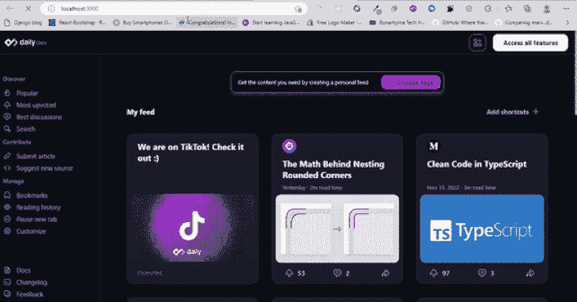
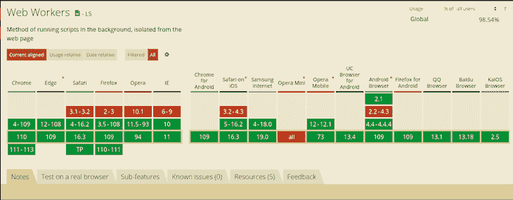

# 网络工作者、反应和打字稿

> 原文：<https://blog.logrocket.com/web-workers-react-typescript/>

Web workers 是 Web 浏览器在后台运行脚本而不干扰 UI 的一种方式。如果设置正确，web worker 可以从设置它的 JavaScript 或 TypeScript 代码发送和接收消息。在本文中，我们将[了解 web workers](https://blog.logrocket.com/how-to-improve-interface-responsiveness-with-web-workers/) 以及如何通过构建分页数据表，在带有 React 和 TypeScript 的项目中使用它们。

我们将通过长数组确定`length`、`filter`、`slice`和`map`，而不会影响我们的 web 应用程序的性能或 UX。本质上，我们将学习如何使用 web workerss 来提升 web 应用程序的性能，web worker 为我们提供了多线程能力来处理后台的长进程。

为了跟进，您可以[克隆源代码](https://github.com/bonarhyme/webworkers-typescript-react):



*向前跳转:*

## 什么是网络工作者？

web worker 是在网页后台运行的 JavaScript 进程。默认情况下，JavaScript 是单线程的。因此，JavaScript 只有一个线程或执行路径，即主线程，它同步执行网页上的所有 JavaScript 代码。

另一方面，Web workers 是一种浏览器特性，它允许您并行执行多个 JavaScript 线程，而不会干扰 DOM。

与主线程不同，web workers 不能访问和操作 DOM，但是他们可以使用 [XMLHttpRequest](https://developer.mozilla.org/en-US/docs/Web/API/XMLHttpRequest) 或 [Fetch](https://developer.mozilla.org/en-US/docs/Web/API/Fetch_API) 来执行 I/O。主线程不必执行所有的 JavaScript 代码，我们可以创建一个 web worker 来处理任何长时间运行的计算，确保主线程不会不堪重负。

要创建一个 worker 对象，可以使用`worker()`构造函数。请记住，web workers 是在全局上下文中运行的，这不同于`window`对象。

在 JavaScript 中，web workers 使开发人员能够实现多线程或真正的并发。并发系统是使用不同的并发模型实现的，这些并发模型指定线程应该如何交互来完成任务。并发模型的一个重要方面是线程是共享状态还是被隔离。

JavaScript 支持两种并发模型，即[角色模型](https://en.wikipedia.org/wiki/Actor_model)和共享内存。这两种并发模型都有优点和缺点，不同地使用工人，并且经常被归入术语“脱离主线程”架构。

截至 2023 年，所有主流浏览器都完全支持网络工作者，如下图所示:



请注意，只有当您的站点需要执行繁重的工作时，您才需要使用 web workers。

## 设置 React 和 TypeScript web worker 项目

为了设置我们的项目，我们将创建一个新文件夹来包含我们的代码；我给我的取名`app`。在您选择的代码编辑器中打开新文件夹，然后在您的终端中运行以下代码来设置 React 和 TypeScript 项目:

```
npx create-react-app ./ --template TypeScript

```

随着项目的建立，我们将在`src`中创建三个文件夹:

*   `components`:店铺`Loader.tsx`、`Pagination.tsx`、`Table.tsx`
*   `data`:存储`index.ts`文件
*   `longProcess`:店铺`count.ts`、`enums.ts`、`getData.ts`:

我们的文件夹和文件结构应该如下所示:

```
app
├── README.md
├── node_modules
├── package.json
├── tsconfig.json
├── .gitignore
├── public
│   ├── favicon.ico
│   ├── index.html
│   ├── logo192.png
│   ├── logo512.png
│   ├── manifest.json
│   └── robots.txt
└── src
    ├──components
    │   ├── Loader.tsx
    │   ├── Pagination.tsx
    │   └── Table.tsx
    |
    ├──data
    │   └── index.ts
    |
    ├──longProcesses
    │   ├── count.ts
    │   ├── enums.ts
    │   └── getData.ts
    ├── App.css
    ├── App.js
    ├── App.test.js
    ├── index.css
    ├── index.js
    ├── logo.svg
    ├── serviceWorker.js
    └── setupTests.js

```

要启动开发服务器，请在终端中运行`npm start`或`yarn start`。

## 准备打字稿数据

在`data/index.ts`中，我们将添加一个[长数组](https://raw.githubusercontent.com/bonarhyme/webworkers-typescript-react/main/src/data/index.ts)，它包含了 5000 个看起来类似如下的对象:

```
    {
      "albumId": 1,
      "id": 2,
      "title": "reprehenderit est deserunt velit ipsam",
      "url": "https://via.placeholder.com/600/771796",
      "thumbnailUrl": "https://via.placeholder.com/150/771796"
    },

```

### 创建枚举

[枚举](https://blog.logrocket.com/typescript-string-enums-guide/)定义了一组不变的命名常量或变量。enum 是 TypeScript 中的一个特殊类，它表示一组不可更改的变量，就像一个调用了`freeze`方法的对象。枚举确保在代码中始终使用正确的变量名，防止变量拼写错误时可能发生的错误。要了解更多关于在 TypeScript 中扩展枚举的信息，请查看我们的指南。

为了确保我们调用了正确的变量，我们必须在`longProcesses/enums.ts`中创建并导出`processList`和`ProfileEnum`，这些枚举将在文件中使用:

```
// longProcesses/enums.ts

export enum processList {
 count = "count",
 getData = "getData",
}

export enum ProfileEnum {
 albumId = "Album Id",
 id = "ID",
 title = "Title",
 url = "Url",
 thumbnailUrl = "Thumbnail",
}

```

## 建筑类型`App.ts`和`Generate`

TypeScript 最重要的特性之一是它检查[类型](https://blog.logrocket.com/write-fewer-tests-by-creating-better-typescript-types/)的能力。我们可以为任何变量、参数、对象或数组定义类型，确保我们总是使用正确的数据类型。

`App.ts`是我们应用的切入点。这里我们将定义四种类型，`LengthCountType`、`ProfileType`、`ProfileListType`和`GetDataType`。我们还将创建一个功能组件，它返回一个`jsx`，两个`section`组件嵌套在一个`div`中，如下面的代码所示:

```
// App.ts

type LengthCountType = {
  loading: boolean;
  value: number;
};

export type ProfileType = {
  albumId: number | string;
  id: number | string;
  title: string;
  url: string;
  thumbnailUrl: string;
};

export type ProfileListType = {
  loading: boolean;
  list: unknown & Array<ProfileType>;
  page: number;
};

export type GetDataType = {
  action: string;
  period: "initial" | "next" | "prev" | "pageNumber";
  thePageNumber: number;
};

export const listPageSize = 50;

const App = () => {
    return (
        <main className="main-container">
            <section className="count"></section>
            <section className="table-container"></section>
        </main>
    )
}

```

## 设计用于检查数组长度的 web worker

确定长数组的长度会阻塞 web 应用程序使用的单线程。然而，使用 web worker，我们可以在不阻塞线程的情况下成功地检查长数组的长度。我们将在`longProcesses/count.ts`中为此添加代码:

```
// longProcesses/count.ts

/* eslint-disable no-restricted-globals */
import { profiles } from "../data";
import { processList } from "./enums";

self.onmessage = (e: MessageEvent<string>) => {
  if (e.data === processList.count) {
    const findLength = profiles.length;

    self.postMessage(findLength);
  }
};

export {};

```

首先，我们禁用表明我们错误使用了`self`的错误。接下来，我们导入数组和`processList`枚举。然后，我们监听`onmessage`事件，当一条消息被发送到工人文件时，该事件被触发。

检查传递的数据是否等同于`count`枚举。如果是，我们将获得数据的长度，并将其发送回 DOM 中的原始文件。最后，为了防止 TypeScript 引发错误，请导出一个空对象。

### 创建`Loader`组件

`Loader`组件将指示进程何时在后台被处理。在`components/Loader.ts`中，添加以下代码:

```
// components/Loader.ts

import React from "react";

type Props = {
 color?: "black" | "white";
 size?: number;
 display?: "inline-block" | "block";
};

const Loader = ({
 color = "black",
 size = 20,
 display = "inline-block",
}: Props) => {
 return (
   <div
     style={{
       border: `4px solid ${color}`,
       width: `${size}px`,
       height: `${size}px`,
       borderRightColor: "transparent",
       borderRadius: "50%",
       display,
       margin: display === "block" ? "50px auto" : "none",
     }}
     className="loader"
   ></div>
 );
};

export default Loader;

```

我们来分解一下。`Loader`接受三个道具，`color`、`size`和`display`。它返回一个带有样式的`div`。它还有一个`loader`类，已经在`index.css`中进行了样式化，以引起旋转运动:

```
// index.css

.loader {
 animation: spinner 1s linear forwards infinite;
}

@keyframes spinner {
 from {
   transform: rotate(0deg);
 }

 to {
   transform: rotate(360deg);
 }
}

```

## 在 TypeScript 中使用`count` web worker

web worker 决定了我们拥有的长数组的长度。要使用`count` worker，打开`App.ts`并从 React 和`processList` enum 导入`useMemo`、`useEffect`和`useState`钩子:

```
// App.ts

import React, { useEffect, useMemo, useRef, useState } from "react";
import { processList } from "./longProcesses/enums";

```

在组件内部，我们将使用已经创建的`count.ts` worker 文件初始化一个新的 web worker:

```
// App.ts

// const App = () => {

  const counter: Worker = useMemo(
    () => new Worker(new URL("./longProcesses/count.ts", import.meta.url)),
    []
  );

```

接下来，我们将创建一个状态，为我们在本地存储数组的长度:

```
// App.ts

  const [lengthCount, setLengthCount] = useState<LengthCountType>({
    loading: true,
    value: 0,
  });

```

我们将使用初始化的`counter`向`useEffect`钩子内的`count`工作者发送一条消息:

```
// App.ts

  useEffect(() => {
    if (window.Worker) {
      counter.postMessage(processList.count);
    }
  }, [counter]);

```

然后，我们将为`lengthCount`状态创建一组适当的值:

```
  useEffect(() => {
    if (window.Worker) {
      counter.onmessage = (e: MessageEvent<string>) => {
        setLengthCount((prev) => ({
          ...prev,
          loading: false,
          value: Number(e.data) && Number(e.data),
        }));
      };
    }
  }, [counter]);

```

最后，我们将使用`lengthCount`状态在 UI 上呈现一个加载器和数组的长度:

```
// App.ts

    <section className="count">
        Total count of Profiles is{" "}
        <b>{lengthCount.loading ? <Loader size={14} /> : lengthCount.value}</b>
      </section>

```

在`counter`变量中，我们用`useMemo`包装 worker 实例，防止重新渲染时不必要的重新初始化。在函数内部，我们使用了`new Worker`方法，并传入了一个新的生成的 URL 实例，它包含了`count` worker 文件的路径。

`lengthCount`状态保持计数器的`loading`和`value`状态。第一个`useEffect`在第一次重新渲染时运行`count`工作器。本质上，它在向`count` worker 文件发送消息之前检查用户的浏览器是否支持 web workers。

第二个`useEffect`从`count`工作器接收响应，并将接收到的响应设置为`lengthCount`状态。

在标记中，我们在流程仍在运行时显示加载器，并在完成时显示值。

## 在 TypeScript 中创建一个 worker 来获取数据

从像我们这样的长阵列中获取数据会导致用户设备的延迟，从而导致糟糕的 UX；我们可以通过网络工作者来防止这种情况。

首先，我们将向`longProcesses/getData.ts`添加以下代码:

```
// getData.ts

/* eslint-disable no-restricted-globals */
import { GetDataType, listPageSize, ProfileListType } from "../App";
import { profiles } from "../data";
import { processList } from "./enums";

self.onmessage = (e: MessageEvent<string>) => {
  const data = JSON.parse(e.data) as GetDataType;

  if (data.action !== processList.getData) {
    return;
  }
  if (data.period === "initial") {
    const items = profiles.filter((item, index) => index < listPageSize);

    const response = {
      loading: false,
      list: items,
      page: data.thePageNumber,
    } as ProfileListType;

    self.postMessage(JSON.stringify(response));
  }
}

export {};

```

首先，我们导入在`App.ts`、数据列表和`processList`中定义的类型。然后，我们解析事件中返回的数据，并将其设置为`GetDataType`。我们检查动作的类型是否无效，动作的周期是否开始；如果是这样，我们将使用 [JavaScript `filter`方法](https://blog.logrocket.com/javascript-array-methods/)获取列表中的前 50 项，创建一个响应对象，然后将其作为`string`发布。

### 建造一张桌子

该表将在 UI 上显示项目列表。在`components/Table.tsx`中，添加以下代码:

```
import React from "react";
import { ProfileType } from "../App";
import { ProfileEnum } from "../longProcesses/enums";

type Props = {
  list: Array<ProfileType>;
};

const Table = ({ list }: Props) => {
  return (
    <div className="table">
      <table>
        <thead>
          <tr>
            <th>#</th>
            <th>{ProfileEnum.id}</th>
            <th>{ProfileEnum.title}</th>
            <th>{ProfileEnum.albumId}</th>
            <th>{ProfileEnum.thumbnailUrl}</th>
          </tr>
        </thead>
        <tbody>
          {list.length > 0 &&
            list.map((item, index: number) => {
              return (
                <tr key={item?.id}>
                  <td>{index + 1}</td>
                  <td>{item?.id}</td>
                  <td>{item?.title}</td>
                  <td>{item?.albumId}</td>
                  <td>
                    
                  </td>
                </tr>
              );
            })}
        </tbody>
      </table>
    </div>
  );
};

export default Table;

```

首先，我们导入`ProfileType`和`ProfileEnum`，然后为我们的`Table`组件定义一个`PropType`。接下来，我们创建一个返回`table`的`div`:

*   `table:`返回一个`thead`和`tbody`
*   `thead`:返回一个包含五个`th`的`tr`
*   `tbody`:包含一个`map`，返回一个`tr`
*   `tr`:返回五个`td`

为了提高性能，w e 使用`loading="lazy"` 属性使用延迟加载来生成图像。

## 在 TypeScript 中使用`getData` web worker

使用`getData` web worker 类似于我们使用`count` worker 的方式。首先，我们将使用下面的代码初始化一个新的 worker:

```
// App.ts

const getData: Worker = useMemo(
    () => new Worker(new URL("./longProcesses/getData.ts", import.meta.url)),
    []
  );

```

接下来，我们将定义本地状态来处理`profileList`状态:

```
// App.ts

  const [profileList, setProfileList] = useState<ProfileListType>({
    loading: true,
    list: [],
    page: 1,
  });

```

然后，我们将创建一个`useEffect`，在初始渲染时使用`getData`:

```
// App.ts

  useEffect(() => {
    if (window.Worker) {
      const request = {
        action: processList.getData,
        period: "initial",
        thePageNumber: profileList.page,
      } as GetDataType;

      getData.postMessage(JSON.stringify(request));
    }
    // eslint-disable-next-line react-hooks/exhaustive-deps
  }, []);

```

我们将创建另一个`useEffect`，它将处理从`getData` web worker 文件接收响应:

```
// App.ts

  useEffect(() => {
    if (window.Worker) {
      getData.onmessage = (e: MessageEvent<string>) => {
        const response = JSON.parse(e.data) as unknown as ProfileListType;

        setProfileList((prev) => ({
          ...prev,
          loading: response.loading,
          list: response.list,
          page: response.page,
        }));
      };
    }
  }, [getData]);

```

最后，我们将使用我们创建的`Table`组件显示数据:

```
    <section className="table-container">
        {profileList.loading ? (
          <Loader size={40} display="block" />
        ) : (
          <>
            <Table list={profileList.list} />
          </>
        )}
      </section>

```

在`getData`变量中，`useMemo`包装了 worker 实例，以防止重新渲染时不必要的重新初始化。在函数内部，我们使用了`new Worker`方法，并传入了一个新的生成的 URL 实例，它包含了`getData` worker 文件的路径。`profileList`状态在我们的应用程序中本地保存`getData`工作者的`loading`、`list`和`page`状态。

第一次重新渲染时，第一个`useEffect`运行`getData`。它检查用户的浏览器是否支持 web workers 它还包含一个请求对象，该对象在被发送到`getData`工作文件之前被字符串化。请求对象包含一个`action`、`period`和`thePageNumber`键-值对。第二个`useEffect`接收来自`getData`的响应，并将接收到的响应设置为`profileList`状态。

在标记中，我们在流程仍在运行时显示一个加载器，并在流程完成时呈现一个表。请记住，传递给元素的类是用来设计它们的样式的。

* * *

### 更多来自 LogRocket 的精彩文章:

* * *

当用户选择`next`和`prev`按钮或页码时，`pagination`组件将导航到某个页面。

为了实现该功能的 worker，我们将修改`longProcesses/getData.ts`中的`getData` worker，并向其添加以下代码:

```
// longProcesses/getData.ts

  if (
    data.period === "pageNumber" ||
    data.period === "next" ||
    data.period === "prev"
  ) {
    const items = profiles.slice(
      (data.thePageNumber - 1) * listPageSize,
      data.thePageNumber * listPageSize
    );
    const response = {
      loading: false,
      list: items,
      page: data.thePageNumber,
    } as ProfileListType;

    self.postMessage(JSON.stringify(response));
  }

```

从向`getData`工作者发送消息的文件中，我们将获得一个包含`period`键的`data`对象。在使用页码和列表页面大小分割页面之前，我们检查这个键是否等于`pageNumber`、`next`或`prev`。然后，创建一个`response`对象，并将响应作为字符串化的消息发布。

为了创建分页组件，我们将向`components/Pagination`添加以下代码，创建`pagination component.tsx`:

```
// Pagination.tsx

import React from "react";

type Props = {
  page: number;
  pages: number;
  pageClick: (page: number) => void;
  prevHandler: () => void;
  nextHandler: () => void;
};

const Pagination = ({
  page,
  pages,
  pageClick,
  prevHandler,
  nextHandler,
}: Props) => {
  return (
    <div className="pagination-container">
      <button className="prev" onClick={prevHandler} disabled={page === 1}>
        Prev
      </button>
      <ul className="pages-container">
        {[...Array(Math.ceil(pages)).keys()].map((x, i) => {
          return (
            <li
              key={i}
              className={page - 1 === i ? "active page-item" : "page-item"}
              onClick={() => {
                pageClick(x + 1);
              }}
            >
              {x + 1}
            </li>
          );
        })}
      </ul>
      <button className="next" onClick={nextHandler} disabled={page === pages}>
        Next
      </button>
    </div>
  );
};

export default Pagination;

```

首先，我们定义 props 类型，它包含`page`和`pages`，并且必须接受一个数字。`pageClick`、`prevHandler`和`nextHandler`必须接受一个函数。在`jsx`中，我们用一个类返回一个`div`。在`div`中，我们返回三个元素`button`、`ul`和第二个`button`。

第一个`button`包含一个类和一个运行`prevHandler`函数的`onclick`事件监听器。当当前页面是第一页时，它被禁用。`ul`包含一个类，并使用`pages`值返回一个数字数组。

我们使用一个`map`函数遍历新数组并返回一个`li`元素。每个`li`包含一个键，一个当`li`激活时改变的类。它还包含一个运行`pageClick`函数的`onClick`事件处理程序。

如果 TypeScript 抱怨将一个数字转换成数组，那么将下面的密钥对添加到您的`tsconfig.json`文件中的`compilerOption`对象中:

```
// tsconfig.json
    "downlevelIteration": true /** This fixes error when converting numbers to array of numbers*/,

```

最后一个按钮是`next`按钮，它接受一个类和一个运行`nextHandler`功能的`onClick`事件处理程序。当当前页面是最后一页时，它被禁用。

## 设计页面处理程序

页面处理程序是我们在使用组件时传递给它的函数。我们将创建的第一个函数是`handlePageNumber`，它将在用户点击页面时被调用:

```
  const handlePageNumber = (userSelectedPage: number) => {
    if (window.Worker) {
      const request = {
        action: processList.getData,
        period: "pageNumber",
        thePageNumber: userSelectedPage,
      } as GetDataType;

      getData.postMessage(JSON.stringify(request));
    }
  };

```

点击**上一页**按钮时，将调用第二个函数`prevHandler`:

```
  const prevHandler = (userSelectedPage: number) => {
    if (profileList.page === 1) {
      return;
    }

    if (window.Worker) {
      const request = {
        action: processList.getData,
        period: "prev",
        thePageNumber: userSelectedPage - 1,
      } as GetDataType;

      getData.postMessage(JSON.stringify(request));
    }
  };

```

我们的最后一个函数是`nextHandler`，当点击**下一个**按钮时会调用这个函数:

```
  const nextHandler = (userSelectedPage: number, thePageLength: number) => {
    if (userSelectedPage < thePageLength) {
      if (window.Worker) {
        const request = {
          action: processList.getData,
          period: "next",
          thePageNumber: userSelectedPage + 1,
        } as GetDataType;

        getData.postMessage(JSON.stringify(request));
      }
    }
  };

```

`handlePageNumber`接受`userSelectedPage`作为参数。然后我们检查浏览器是否支持 web workers。如果是这样，我们创建一个包含`action`、`period`和`thePageNumber`的`request`对象。我们将`request`作为字符串消息发送给`getData` web worker。

我们的下一个函数，`prevHandler`接受`userSelectedPage`作为`param`。我们检查当前页面是否是第一页，什么也不做。然后，我们创建一个请求对象。然而，我们将发送一个递减的`thePageNumber`键。

最后，`nextHandler`和前两个函数一样，但是，它接受两个道具。首先，我们检查`userSelectedPage`是否小于我们上面定义的`thePageLength`变量的值。另外，`thePageNumber`键递增。

要使用`[pagination](https://blog.logrocket.com/guide-pagination-load-more-buttons-infinite-scroll/)`组件，我们需要将其导入到`component/App.ts`中:

```
// App.ts

import Pagination from "./components/Pagination";

```

接下来，我们将在`Table`组件下添加以下标记:

```
// App.ts

  <Pagination
    page={profileList.page}
    pages={lengthCount.value / listPageSize}
    pageClick={(pageNumber) => {
      handlePageNumber(pageNumber);
    }}
    prevHandler={() => prevHandler(profileList.page)}
    nextHandler={() =>
      nextHandler(profileList.page, lengthCount.value / listPageSize)
    }
  />

```

首先，我们将`profileList.page`传递给页面，`lengthCount.value / listPageSize`传递给页面，`handlePageNumber`函数传递给`pageClick`属性。最后，我们将`prevHandler`和`nextHandler`传递给它们相应的道具。

### 为您的 web workers 添加样式

为了设计 web workers 的样式，我将使用下面的代码。但是，您可以使用自己选择的任何样式:

```
// index.css

body {
  margin: 0;
  font-family: -apple-system, BlinkMacSystemFont, "Segoe UI", "Roboto", "Oxygen",
    "Ubuntu", "Cantarell", "Fira Sans", "Droid Sans", "Helvetica Neue",
    sans-serif;
  -webkit-font-smoothing: antialiased;
  -moz-osx-font-smoothing: grayscale;
  padding-bottom: 4rem;
}

.loader {
  animation: spinner 1s linear forwards infinite;
}

@keyframes spinner {
  from {
    transform: rotate(0deg);
  }

  to {
    transform: rotate(360deg);
  }
}

.main-container {
  display: flex;
  flex-direction: column;
  align-items: center;
  padding-top: 2rem;
}

.count {
  padding: 2rem 0 3rem;
  font-size: 2rem;
  text-align: center;
}

.table-container {
  width: 95%;
  padding: 0 0.5rem;
  max-width: 700px;
}

table,
td,
th {
  border: 1px solid black;
  padding: 0.2rem;
}

table {
  border-collapse: collapse;
  width: 100%;
  min-height: 700px;
}

th {
  white-space: nowrap;
}

td {
  text-align: left;
  vertical-align: top;
}

td:first-child {
  font-weight: 300;
}

.pagination-container {
  display: flex;
  align-items: center;
  justify-content: center;
  margin: auto;
  gap: 1rem;
  width: 100%;
  max-width: 500px;
}

.pages-container {
  display: flex;
  list-style: none;
  gap: 0.5rem;
  overflow-x: scroll;
  padding-bottom: 0.5rem;
}

.pages-container > * {
  background-color: rgb(49, 150, 238);
  padding: 0.3rem;
  min-width: 40px;
  text-align: center;
  cursor: pointer;
  border: none;
  border-radius: 8px;
}

.page-item.active {
  background-color: blue;
  color: white;
}

.prev,
.next {
  padding: 0.6rem;
  text-align: center;
  cursor: pointer;
}

```

## 结论

使用带有 TypeScript 和 React 的 web workers 变得容易多了；我们现在可以在后台处理操作和繁重的任务，同时提升性能和改善 UX。

感谢阅读！我希望你喜欢这篇文章，如果你有任何问题，一定要留下评论。编码快乐！

## [LogRocket](https://lp.logrocket.com/blg/react-signup-general) :全面了解您的生产 React 应用

调试 React 应用程序可能很困难，尤其是当用户遇到难以重现的问题时。如果您对监视和跟踪 Redux 状态、自动显示 JavaScript 错误以及跟踪缓慢的网络请求和组件加载时间感兴趣，

[try LogRocket](https://lp.logrocket.com/blg/react-signup-general)

.

[ ](https://lp.logrocket.com/blg/react-signup-general) [](https://lp.logrocket.com/blg/react-signup-general) 

LogRocket 结合了会话回放、产品分析和错误跟踪，使软件团队能够创建理想的 web 和移动产品体验。这对你来说意味着什么？

LogRocket 不是猜测错误发生的原因，也不是要求用户提供截图和日志转储，而是让您回放问题，就像它们发生在您自己的浏览器中一样，以快速了解哪里出错了。

不再有嘈杂的警报。智能错误跟踪允许您对问题进行分类，然后从中学习。获得有影响的用户问题的通知，而不是误报。警报越少，有用的信号越多。

LogRocket Redux 中间件包为您的用户会话增加了一层额外的可见性。LogRocket 记录 Redux 存储中的所有操作和状态。

现代化您调试 React 应用的方式— [开始免费监控](https://lp.logrocket.com/blg/react-signup-general)。