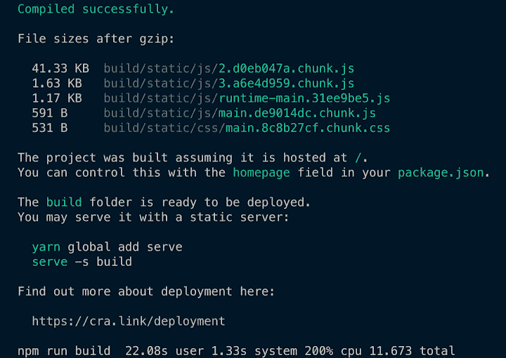
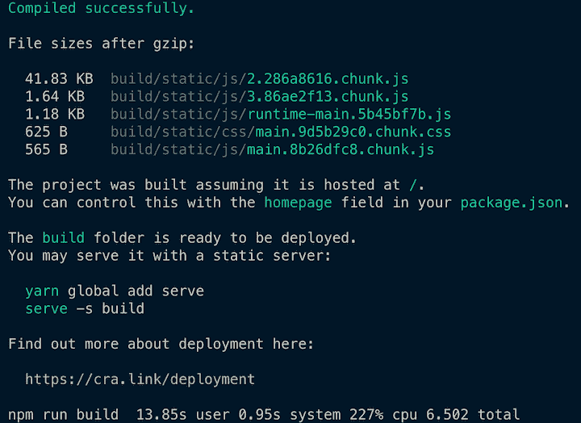

# webpack 或 esbuild:为什么不能两者兼得？

> 原文：<https://blog.logrocket.com/webpack-or-esbuild-why-not-both/>

使用像 [esbuild](https://github.com/evanw/esbuild) 这样的工具可以更快地构建。然而，如果你投资了[的 webpack](https://github.com/webpack/webpack) ，但仍然想利用更快的构建，有一个方法。

在本教程中，我们将向您展示如何通过 [esbuild-loader](https://github.com/privatenumber/esbuild-loader) 与 webpack 一起使用 esbuild。


## web 开发的世界正在演变

向那些饱受 JavaScript 疲劳之苦的人道歉，web 开发的世界正在再次进化。长期以来，通过某种基于 Node.js 的构建工具(如 webpack 或 rollup.js)来运行 JavaScript 和 TypeScript 是一种常见的做法。这些工具是用它们编译到的同一种语言编写的，即 JavaScript 或 TypeScript。

博客上的新成员是像 [esbuild](https://github.com/evanw/esbuild) 、 [Vite](https://github.com/vitejs/vite) 和 [swc](https://github.com/swc-project/swc) 这样的工具。这些工具和它们的前辈之间的显著区别是新的工具是用像 Go 和 Rust 这样的语言编写的。享受比 JavaScript 更好的性能。这转化为[显著更快的构建](https://blog.logrocket.com/fast-javascript-bundling-with-esbuild/)。

这些新工具具有变革性，很可能代表了 web 构建工具的未来。从长远来看，esbuild、 [Vite](https://blog.logrocket.com/getting-started-with-vite/) 和 friends 之类的工具很可能会取代当前的标准构建工具——web pack、rollups 等等。

然而，那是长期的。有很多项目已经在他们当前的构建工具上投入了大量资金——主要是 webpack。迁移到一个新的构建工具不是一件容易的事情。新项目可能以 Vite 开始，但是现有项目不太可能被移植。webpack 如此受欢迎是有原因的；它确实做了很多非常好的事情。它在大型项目中经受了考验，是成熟的，并且可以处理广泛的用例。

因此，如果您的团队想要更快的构建，但是没有时间进行大的迁移，您能做些什么吗？是的，有一个中间地带需要探索。

有一个相对较新的项目叫做 [esbuild-loader](https://github.com/privatenumber/esbuild-loader) 。由 [hiroki osame](https://twitter.com/privatenumbr) 开发的 esbuild-loader 是一个构建在 esbuild 之上的 webpack 加载器。它允许用户用自己替换掉`ts-loader`或`babel-loader`，这极大地提高了构建速度。

在此声明一点，我是 [ts-loader](https://github.com/TypeStrong/ts-loader) 的主要维护者，这是一个流行的类型脚本加载器，通常与 webpack 一起使用。然而，我强烈地感觉到这里最重要的是开发人员的生产力。作为基于 Node.js 的项目，`ts-loader`和`babel-loader`永远无法以同样的方式与`esbuild-loader`竞争。作为一门语言，Go 真的，嗯，Go！

虽然 esbuild 可能不适用于所有用例，但它适用于大多数任务。因此，`esbuild-loader`代表了一种中间立场——一种无需告别 webpack 就能获得 esbuild 提供的更快构建速度的早期方法。本演练将探索如何在 webpack 设置中使用`esbuild-loader`。

## 将现有项目迁移到 msbuild

将使用`babel-loader`或`ts-loader`的项目迁移到`esbuild-loader`非常简单。首先，安装依赖项:

```
npm i -D esbuild-loader

```

如果您目前正在使用`babel-loader`，请对您的`webpack.config.js`进行以下更改:

```
  module.exports = {
    module: {
      rules: [
-       {
-         test: /\.js$/,
-         use: 'babel-loader',
-       },
+       {
+         test: /\.js$/,
+         loader: 'esbuild-loader',
+         options: {
+           loader: 'jsx',  // Remove this if you're not using JSX
+           target: 'es2015'  // Syntax to compile to (see options below for possible values)
+         }
+       },

        ...
      ],
    },
  }

```

或者，如果您正在使用`ts-loader`，对您的`webpack.config.js`进行以下更改:

```
  module.exports = {
    module: {
      rules: [
-       {
-         test: /\.tsx?$/,
-         use: 'ts-loader'
-       },
+       {
+         test: /\.tsx?$/,
+         loader: 'esbuild-loader',
+         options: {
+           loader: 'tsx',  // Or 'ts' if you don't need tsx
+           target: 'es2015'
+         }
+       },

        ...
      ]
    },
  }

```

## 创建基线应用程序

让我们看看`esbuild-loader`在实践中是如何运作的。我们将使用 [Create React App](https://create-react-app.dev/) 创建一个新的 React 应用程序:

```
npx create-react-app my-app --template typescript

```

这将使用`my-app`目录中的 TypeScript 构建一个新的 React 应用程序。值得一提的是，Create React App 在幕后使用了`babel-loader`。

CRA 还使用 [Fork TS Checker Webpack 插件](https://github.com/TypeStrong/fork-ts-checker-webpack-plugin)来提供类型检查。这非常有用，因为 esbuild 只做编译，而[并不提供类型检查支持](https://esbuild.github.io/faq/#upcoming-roadmap)。所以幸运的是，我们仍然有那个插件。否则，我们将失去类型检查。

既然您已经理解了迁移到 esbuild 的优势，我们首先需要一个基线来理解使用`babel-loader`时的性能。我们将运行`time npm run build`来执行简单应用程序的构建:



我们的完整构建，打字稿类型检查，翻译，缩小等等，都花了 22.08 秒。现在的问题是，如果我们把 esbuild 放到这个组合中会发生什么？

## 介绍`esbuild-loader`

定制 Create React 应用构建的一种方式是运行`npm run eject`，然后定制 CRA 输出的代码。这样做没问题，但这意味着你无法跟上 CRA 的发展。另一种方法是使用一个工具，比如[Create React App Configuration Override(CRACO)](https://github.com/gsoft-inc/craco)，它允许你适当地调整配置。CRACO 将自己描述为“一个简单易懂的`create-react-app`配置层。”

让我们添加`esbuild-loader`和 CRACO 作为依赖项:

```
npm install @craco/craco esbuild-loader --save-dev

```

然后我们将交换我们的`package.json`中的各种`scripts`来使用`CRACO`:

```
"start": "craco start",
"build": "craco build",
"test": "craco test",

```

我们的应用程序现在使用 CRACO，但我们还没有配置它。因此，我们将在项目的根目录下添加一个`craco.config.js`文件。这就是我们用`esbuild-loader`替换`babel-loader`的地方:

```
const { addAfterLoader, removeLoaders, loaderByName, getLoaders, throwUnexpectedConfigError } = require('@craco/craco');
const { ESBuildMinifyPlugin } = require('esbuild-loader');

const throwError = (message) =>
    throwUnexpectedConfigError({
        packageName: 'craco',
        githubRepo: 'gsoft-inc/craco',
        message,
        githubIssueQuery: 'webpack',
    });

module.exports = {
    webpack: {
        configure: (webpackConfig, { paths }) => {
            const { hasFoundAny, matches } = getLoaders(webpackConfig, loaderByName('babel-loader'));
            if (!hasFoundAny) throwError('failed to find babel-loader');

            console.log('removing babel-loader');
            const { hasRemovedAny, removedCount } = removeLoaders(webpackConfig, loaderByName('babel-loader'));
            if (!hasRemovedAny) throwError('no babel-loader to remove');
            if (removedCount !== 2) throwError('had expected to remove 2 babel loader instances');

            console.log('adding esbuild-loader');

            const tsLoader = {
                test: /\.(js|mjs|jsx|ts|tsx)$/,
                include: paths.appSrc,
                loader: require.resolve('esbuild-loader'),
                options: { 
                  loader: 'tsx',
                  target: 'es2015'
                },
            };

            const { isAdded: tsLoaderIsAdded } = addAfterLoader(webpackConfig, loaderByName('url-loader'), tsLoader);
            if (!tsLoaderIsAdded) throwError('failed to add esbuild-loader');
            console.log('added esbuild-loader');

            console.log('adding non-application JS babel-loader back');
            const { isAdded: babelLoaderIsAdded } = addAfterLoader(
                webpackConfig,
                loaderByName('esbuild-loader'),
                matches[1].loader // babel-loader
            );
            if (!babelLoaderIsAdded) throwError('failed to add back babel-loader for non-application JS');
            console.log('added non-application JS babel-loader back');

            console.log('replacing TerserPlugin with ESBuildMinifyPlugin');
            webpackConfig.optimization.minimizer = [
                new ESBuildMinifyPlugin({
                    target: 'es2015' 
                })
            ];

            return webpackConfig;
        },
    },
};

```

这里发生了什么？该脚本在默认的 Create React 应用程序配置中查找`babel-loader`用法。将有两个:一个用于 TypeScript/JavaScript 应用程序代码(我们希望替换它)，另一个用于非应用程序 JavaScript 代码。不太清楚有什么非应用程序 JavaScript 代码，所以我们将把它留在原处；可能很重要。我们真正关心的代码是应用程序代码。

您不能使用`CRACO`删除单个加载程序，所以我们将两个都删除，并添加回非应用程序 JavaScript `babel-loader`。我们还将添加设置了`{ loader: 'tsx', target: 'es2015' }`选项的`esbuild-loader`，以确保我们可以处理 JSX/TSX。

最后，我们将使用 [Terser](https://github.com/terser/terser) 来代替 esbuild 的 JavaScript minification。

## 巨大的性能提升

我们的迁移完成了。下次我们构建时，我们将使用`esbuild-loader`运行 Create React 应用程序，而不会弹出。我们将再次运行`time npm run build`来执行一个简单应用程序的构建，并确定需要多长时间:



我们的完整构建、打字稿类型检查、翻译、缩小等等，都花了 13.85 秒。通过迁移到`esbuild-loader`，我们减少了大约三分之一的总编译时间。这是一个巨大的进步！

随着代码库的扩展和应用程序的增长，编译时间会急剧增加。有了`esbuild-loader`，您应该可以从您的构建时间中获得持续的好处。

## 通过理解上下文，更容易地调试 JavaScript 错误

调试代码总是一项单调乏味的任务。但是你越了解自己的错误，就越容易改正。

LogRocket 让你以新的独特的方式理解这些错误。我们的前端监控解决方案跟踪用户与您的 JavaScript 前端的互动，让您能够准确找出导致错误的用户行为。

[](https://lp.logrocket.com/blg/javascript-signup)

LogRocket 记录控制台日志、页面加载时间、堆栈跟踪、慢速网络请求/响应(带有标题+正文)、浏览器元数据和自定义日志。理解您的 JavaScript 代码的影响从来没有这么简单过！

[Try it for free](https://lp.logrocket.com/blg/javascript-signup)

.