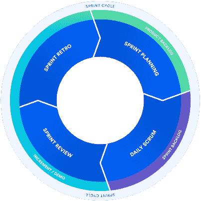

# scrum 会议的五种类型是什么？

> 原文：<https://blog.logrocket.com/product-management/what-are-five-types-of-scrum-meetings/>

根据[**Scrum**G**uide**](https://www.scrum.org/resources/scrum-guide)*的说法，Scrum 被定义为一个允许团队快速高效地交付复杂产品和功能的框架。然而，不管组织的框架和方法如何，普通的 scrum 会议经常会填满你的日程表。*

 *在本指南中，我们将向您介绍 scrum 的一般概念，并详细介绍五种类型的 scrum 会议。

scrum 会议的五种类型是:

1.  冲刺规划
2.  每日混战
3.  冲刺回顾
4.  冲刺回顾
5.  积压优化

* * *

## 目录

* * *

## 什么是 scrum 会议？

术语 scrum 会议描述了所有由 scrum 团队召开的定期会议，以确保更顺利的产品管理和开发，并且完全透明和自主。此外，scrum 会议有助于促进协作，同时为开发团队设定共同的期望和交付目标。

Source: [Bryan Marshall](https://www.bryanmarshall.com/scrum-meetings/)

## 什么是短跑？

为了更好地理解 scrum 会议的目的，首先必须理解什么是 sprints。

Source: [Atlassian](https://www.atlassian.com/agile/scrum/sprints)

根据**Scrum**指南*，一个典型的开发周期是两到三周或者一个月。这个开发阶段被称为冲刺或迭代。它很短，主要关注快速、增量的交付，更快的学习和迭代，而不是长期、全面的产品开发和交付。*

 *遵循 scrum 和 sprints 的目的是消除任何盲点，避免承担可能不符合最终用户最佳利益的功能。因此，scrum 会议是为了计划和运行 sprints 而定期召开的特定会议。

## scrum 中的五次会议是什么？

如上所述，scrum 由五个仪式组成，旨在促进合作，提高效率，优化产品开发过程，为最终用户创造最大价值。

让我们放大每个 scrum 仪式，关注产品经理在实施和执行[敏捷产品开发策略](https://blog.logrocket.com/four-agile-manifesto-values-explained/)中的角色。

### 1.冲刺规划

[冲刺计划会议](https://blog.logrocket.com/product-management/what-is-sprint-planning-guide-meeting-agenda-cheat-sheet/)是团队成员为即将到来的 2-3 周计划工作的会议。Sprint 计划会议通常是一个月 sprint 的全天会议，但是对于由 scrum master 管理的更短的 sprint，会议可以按比例缩短。

在 sprint 规划期间，产品负责人一次一个用户故事地运行优先化的 backlog，并向技术团队解释他们将通过每个故事创造的价值。然后，开发人员、测试人员和设计人员将用户故事分解成可操作的任务和子任务。一旦开发人员创建了所有的子任务，他们一致地在团队同意的点系统上评估每个用户故事。

积分系统框架的一个常见示例是使用 t 恤尺寸(S、M、L 和 XL)。一个团队甚至可能使用实际分数——2、5、8、13 等等。—基于对这些点代表什么以及如何测量它们的既定共识。值得注意的是，这些估计点并不表示时间；相反，它们代表了任务的复杂性、不确定性和依赖性。

在评估了 backlog 中所有优先任务之后，scrum master 根据与团队成员的协议将用户故事拉入 sprint backlog 中。最后，团队成员为冲刺设定一个目标，冲刺开始。

sprint 的目标是为最终用户生产和交付价值；完成 sprint 中的所有任务并不是 sprint 的目标。

在 sprint 规划会议之后，每个团队成员都应该对 sprint backlog 有一个清晰的认识——也就是说，在下一个 sprint 中将开发和交付什么，以及一个共同的 sprint 目标，说明与交付相关的用户价值。

> 如果已经确定了优先级，并且待办事项列表中包含了关于每个用户故事的完整信息，那么召开一个有效的 sprint 规划会议会更容易。产品负责人应该准备好所需的细节和信息，以帮助开发团队更好地理解故事，避免混淆。

#### 概括起来

*   sprint planning 的[目的是计划、评估和商定即将到来的 sprint 的可交付成果](https://www.scrum.org/resources/what-is-sprint-planning)
*   一个典型的 sprint 会议议程是从优先化的 backlog 中检查用户故事，创建任务和子任务，评估用户故事，将达成一致的故事数量拉入 sprint，设定 sprint 目标，并开始 sprint
*   sprint 会议的参与者是整个 scrum 团队，包括产品所有者、scrum master、开发人员、测试人员、设计人员，以及任何参与构建或开发产品或功能的人
*   sprint 规划的预期结果是建立一个共同的 sprint 目标，该目标由团队成员根据优先级、团队速度和对最终用户的价值实现共同决定

### 2.每日混战

每日 scrum 是一个 15 分钟的限时会议，更新进度并设定当天的目标。

每日 scrum 的目标，也称为每日站立，是分享每个团队成员为实现 sprint 目标所做的进展，以及当天的计划。每日 scrum 会议最重要的功能是提出任何可能阻碍团队实现其日常目标的障碍。

一种适合这一议程的日常讨论形式[在以前的*T**he**S**crum**G**uide*中建立，要求每个团队成员回答三个问题:](https://www.scrum.org/resources/what-is-a-daily-scrum)

1.  我昨天做了哪些有助于冲刺目标的事情？
2.  我今天将做些什么来为冲刺目标做出贡献？
3.  是否有任何障碍会阻碍我或我的团队的开发工作？

日常 scrum 的参与者是 scrum master 和开发团队。如果需要，产品负责人和其他利益相关者可以参加，但不是必须的。

每天的站立由 scrum master 组织和监控。scrum 主管的责任是让会议保持在任务上，避免让讨论转移到无关的领域。每天 scrum 分配的最长时间是 15 分钟。

> **专业提示**:每日站立不是汇报会。因为参与者每天都被问相同的三个股票问题，所以每天的 scrum 会变得单调。当讨论这些问题时，试着以对话的形式给出你的答案，而不是简单地罗列更新。

#### 概括起来

*   每日 scrum 是 scrum 主管和开发团队之间每天进行的 15 分钟同步会议
*   目标是给出进度更新，并强调任何可能阻碍开发任务的障碍

### 3.冲刺回顾

[sprint 评审](https://blog.logrocket.com/product-management/what-is-a-sprint-review-meeting-agenda-example/)是一个会议，开发团队在会上强调它在 sprint 期间完成的工作，向利益相关者演示，并解决他们在检查开发时可能遇到的任何问题。

在 sprint 评审期间，开发团队强调它在 sprint 期间完成的工作。通常，团队还会向涉众展示一个功能的现场演示。该演示为利益相关者提供了一个第一次看到功能运行并对其进行检查的机会。开发团队还讨论工作是否完成，或者是否需要额外的更改，以及任何剩余的障碍。

在一个更标准的设置中，产品负责人走完 sprint 期间完成的所有任务，开发人员演示它，利益相关者检查并给出反馈。有时，这些反馈会被添加到[产品待办事项](https://www.scrum.org/resources/what-is-a-product-backlog)中，以备将来冲刺。

随会议邀请发送一份详细的 sprint 评审会议议程是一个好主意。这样，所有相关各方都可以在会议之前做好准备。下面是一个 sprint 回顾会议议程的例子，你可以在计划自己的会议时参考。

冲刺评审是冲刺的倒数第二个事件。对于一个月的冲刺来说，时间限制为最多四个小时，尽管对于更短的冲刺来说时间通常会更短。

当安排好冲刺评审时，产品负责人向所有需要的参与者发送邀请，包括所有的涉众。产品负责人还负责促进对可能已经改变的市场或潜在产品用途的审查，推理出下一个最好的有价值的交付。

* * *

订阅我们的产品管理简讯
将此类文章发送到您的收件箱

* * *

此外，还应该对时间表、预算和产品功能的下一个预期版本的潜在功能进行评审。

> **Pro tip** :为了更有效地开会，提前准备好演示，准备好所有计划演示的测试用例。然后，对所有系统进行最终检查，确保一切正常运行，这样您就可以无障碍地进行演示了。

#### 概括起来

*   在 sprint 回顾中，scrum 团队解释了[哪些用户故事项目已经“完成”](https://www.leadingagile.com/2017/02/definition-of-done/)哪些还没有“完成”
*   开发团队讨论了在 sprint 过程中什么进展顺利，他们遇到了什么问题，以及他们的解决方案实现
*   开发人员展示他们的工作并回答利益相关者的问题
*   产品负责人讨论现有的产品积压。他们还根据进度讨论项目可能的目标和交付日期
*   整个团队就下一步要做什么进行协作，以便冲刺评审为后续的冲刺计划提供有价值的输入
*   sprint 评审的结果是一个修订的产品待定项，它定义了下一个 sprint 可能的产品待定项。产品所有者也可以调整总的积压工作来迎接新的机会

### 4.冲刺回顾

sprint 回顾会在 sprint 结束时举行，以评估哪些进展顺利，并反思在下一次 sprint 中必须改进的任何事情，以实现更高效的交付。

sprint 回顾的主要目的是评估最近的 sprint 在遵循的过程、涉及的人员、使用的工具、协作和关系方面进展如何。基于这种思考，团队将 sprint 期间进展顺利的事情列表与进展不顺利的事情列表以及潜在的改进列表结合起来。

任何可以改进团队工作方法和提高开发效率的事情都可以讨论。sprint 回顾提供了一个机会来讨论和计划这些修改，以免团队迷失在下一个交付的热潮中。

整个开发团队都参与到 sprint 回顾会中——包括测试人员、设计人员、产品负责人和主持会议的 scrum master。scrum master 还充当团队的 scrum 教练，确保团队坚持约定的工作方式，以在开发中创造效率。

sprint 回顾是一个有时间限制的事件，根据 sprint 的长度，可以是 1 到 3 个小时。

sprint 回顾的结果应该是团队可以在下一次 sprint 中采取的改进措施的清晰列表。

> **专业提示**:sprint 回顾会是 scrum 团队成员之间的私人会议。因此，会议的讨论应该是尊重和一般性的，避免人身侵犯。至关重要的是，团队成员在会议中能够舒服地分享他们的观点，而不会受到斥责或指责。

#### 概括起来

*   冲刺回顾的目标是反思和改进过程
*   整个 scrum 团队必须参与 sprint 回顾。scrum master 充当教练和推动者的角色
*   sprint 回顾议程可以包括任何可能改进开发团队工作方法和效率的东西
*   回顾的预期结果是在下一次冲刺中可以改进的可操作项目的列表

### 5.积压优化

[backlog 精化](https://blog.logrocket.com/product-management/what-is-backlog-grooming-aka-refinement/)，也称为 Backlog 梳理，是一个可选的 scrum 事件，帮助产品所有者对 Backlog 项目和细节故事进行优先排序，为开发做准备。

在待定项细化期间，产品负责人和一些或所有团队成员一起评审待定项。这个会议的目的是对准备开发的故事进行优先排序。

此外，产品负责人可以讨论用户故事，从技术角度或关于设计约束的角度获得更多信息。根据任何新的信息，产品所有者可以选择[创建一个新的用户故事](https://www.atlassian.com/agile/project-management/user-stories)或者用相关信息更新现有的用户故事。

backlog 精化会议的议程还包括删除旧的、不相关的用户故事来清理 backlog。

积压优化没有具体的时间表。可以根据需要频繁安排，也可以根本不安排。产品负责人促成这些会议，并根据需要邀请相关方。Backlog 精化确保了 backlog 仍然被相关的、详细的项目和它们的优先级填充。

> **Pro** **tip** :与开发团队一起频繁、简短地细化待办事项清单，可以鼓励开发人员进行健康的讨论和参与，在团队中创建更多关于用户价值的共识。它还有助于促进更顺利的冲刺计划，并减少冲刺过程中的潜在障碍。

#### 概括起来

*   Backlog 精化不是一个常规的 scrum 事件，但是可以按照产品负责人的要求来组织
*   Backlog 精化确保优先化的、准备好开发的项目/用户故事，以支持更平滑的 sprint 规划

## 结论

对敏捷产品开发的欣赏正在整个市场传播开来。敏捷工作方式的好处是不可否认的。新的框架正在发展，以提高价值和效率，并使组织更容易过渡到敏捷实践。

Scrum 是最早定义的产品开发过程之一。它被过渡到敏捷产品开发的组织广泛采用，因为它更简单，并在团队层面上确定了清晰的步骤，以促进更平稳的发展。

scrum 框架增强了产品思维，这对于成功的产品交付是必不可少的。产品思维是理解并接受你的任务的责任和义务，同时在日常工作中享受自主和自由。

Scrum 会议是 scrum 框架的基石。当正确执行时，它们使团队在变得敏捷的同时达到他们期望的产品目标。Scrum 会议不仅仅是要遵循的过程；它们使产品开发团队能够快速开发和交付结果，并为学习和迭代留出空间。

## [LogRocket](https://lp.logrocket.com/blg/pm-signup) 产生产品见解，从而导致有意义的行动

[LogRocket](https://lp.logrocket.com/blg/pm-signup) 确定用户体验中的摩擦点，以便您能够做出明智的产品和设计变更决策，从而实现您的目标。

使用 LogRocket，您可以[了解影响您产品的问题的范围](https://logrocket.com/for/analytics-for-web-applications)，并优先考虑需要做出的更改。LogRocket 简化了工作流程，允许工程和设计团队使用与您相同的[数据进行工作](https://logrocket.com/for/web-analytics-solutions)，消除了对需要做什么的困惑。

让你的团队步调一致——今天就试试 [LogRocket](https://lp.logrocket.com/blg/pm-signup) 。

[Bindiya Thakkar Follow](https://blog.logrocket.com/author/bindiyathakkar/) Experienced product manager and product owner with a demonstrated history of working in the Omni channel and digital tools. Skilled in product management, digital strategy, roadmapping, business strategy, and user experience.**