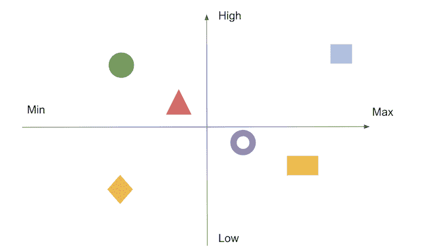
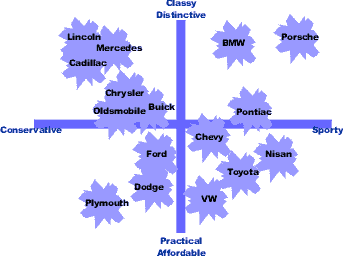
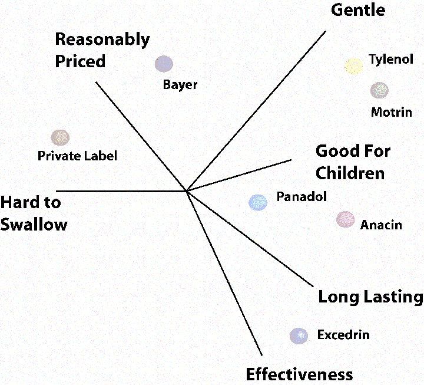
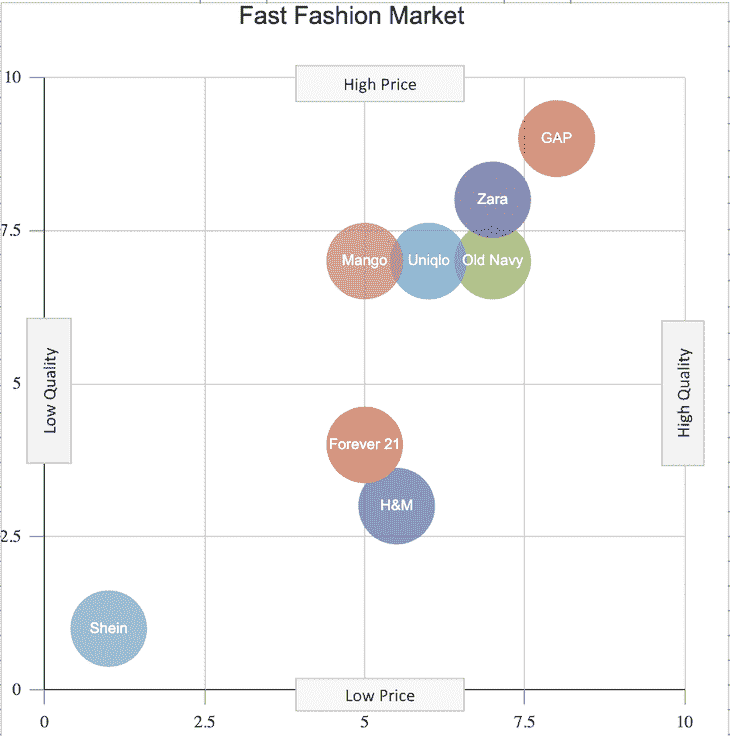
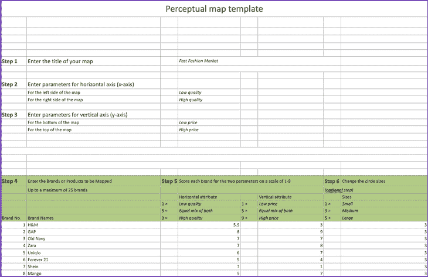

# 什么是感知地图，如何构建感知地图(模板)

> 原文：<https://blog.logrocket.com/product-management/what-is-a-perceptual-map-how-to-build-template/>

在本指南中，我们将描述什么是感知地图，解释它与定位地图的区别，并回顾各种类型的感知地图。我们还将逐步构建您自己的地图，并提供一个[感知地图模板](https://docs.google.com/spreadsheets/d/181NxELeoTVqMU7udoFczU1bliobm_QOHO24nqEGhctI/edit#gid=374859058)来帮助您开始。

* * *

## 目录

* * *

## 什么是感知地图？

According to the dictionary entry that appears when you google the term, [perceptual](https://www.google.com/search?q=perceptual+meaning&oq=perceptual+meanin&aqs=chrome.0.69i59i131i433i512j69i57j0i512l8.5248j1j7&sourceid=chrome&ie=UTF-8) means “relating to the ability to interpret or become aware of something through the senses.” A perceptual map is a visual aid that shows how consumers perceive a product compared to its competitors in the market. In other words, it lays out consumers’ perception of various brands in a product category.

感知图是一种图表，它说明了产品及其竞争对手在某些参数上的位置。

感知地图不仅能帮助你识别产品的当前位置，还能帮助你理解它未来的发展方向。市场研究人员和企业分析感知地图，以确定竞争优势和劣势，并绘制路径来寻求新的机会。

## 感知地图与定位地图

一张感知地图和一张[定位地图](https://blog.logrocket.com/product-management/what-is-product-positioning-examples-strategies-template/)不是一回事。感知地图表明客户如何感知给定类别中的各种产品，而定位地图则评估品牌的实际特征。

换句话说:感知地图代表客户的感知，这可能是对的或错的，而定位地图代表现实。

乍一看，这些地图可能看起来很相似，但是它们分析不同的参数并表示不同的数据。

## 感知地图的类型

有两种主要类型的感知地图:

### 二维的

二维感知图是产品管理和营销中最常用的标准类型，因为它易于理解和分析。

下面是一个二维感知地图的例子:

### 多维的

多维感知地图具有多于两个维度的参数，并且品牌是针对多个参数绘制的。这些地图绘制复杂，可能难以理解。使用多维地图的好处在于，它可以提供关于产品对多个参数的感知的深入信息。

以下是多维感知地图的示例:

上面的例子是针对多个参数绘制的止痛药多维感知图，这些参数包括温和性、有效性、有效性持续时间、对儿童的适用性和价格。

地图显示，Motrin 对儿童有益且温和，而 Excedrin 有效且持久。基于某些参数，品牌被进一步分成两个部分，这有助于识别现有产品中缺少的功能，或者调整营销策略，以将产品导向特定的位置。

## 为什么要用感知地图？

感知地图使您能够分析客户对您的产品有什么样的看法以及如何看待您的产品。因此，它是[营销和产品团队](https://blog.logrocket.com/product-management/product-marketing-manager-job-description-role-skills/)的重要工具。

具体来说，感知地图有助于产品和营销团队:

### 确定新产品的市场缺口

感知地图根据顾客的感知，根据两个或多个参数展示品牌。如果仔细分析，产品经理可以发现客户需求和现有产品之间的差距。

从客户的角度来看感知图时，关注表明未满足市场需求的差距是很有用的。这可以让你开始研究新产品如何满足这些需求。

### 发起有效的营销活动

企业还可以使用感知地图分析近期营销活动或近期营销组合变化的表现。事实上，感知地图是[制定营销战略](https://blog.logrocket.com/product-management/pragmatic-marketing-framework-explained-examples/)的首选工具。

### 增强品牌形象

感知地图有助于企业了解客户对其产品的看法，这对于了解如何通过添加新功能来满足他们的需求至关重要。这种洞察力有助于支持[功能采用](https://blog.logrocket.com/product-management/why-product-adoption-strategy-crucial-b2b-scenarios/)、[客户满意度](https://blog.logrocket.com/product-management/customer-satisfaction-survey-templates-examples-questions/)和品牌认同。

### 了解细分市场

最后，感知地图可以帮助您更好地了解细分市场，分析竞争对手在一段时间内的定位，评估客户不断变化的需求，并跟踪一段时间内引入目标细分市场的新产品。

## 产品经理如何使用感知地图？

感知地图可以帮助[产品经理](https://blog.logrocket.com/product-management/what-does-a-product-manager-do-role-responsibilities/)识别潜在的新功能，以改善[客户体验](https://blog.logrocket.com/product-management/what-is-product-experience-examples-how-to-improve-px/)或将感知转向企业希望的方向。产品经理可以分析竞争对手的产品，以了解哪些具体功能可能有助于他们各自的地位。

除了构思新功能，感知地图还能帮助产品经理发现机会[推出全新产品](https://blog.logrocket.com/product-management/what-is-a-product-launch-plan-how-to-create/)，努力解决客户未满足的需求。

## 如何构建感知地图

最好是做市场调查，了解你的产品和目标市场的竞争对手。您可以[进行客户调查](https://blog.logrocket.com/product-management/customer-satisfaction-survey-templates-examples-questions/)，针对您想要分析的参数提出问题。根据答案，您可以根据所选参数绘制品牌图。

让我们一步步地了解构建感知地图的过程:

1.  [选择你的参数](#choose-your-parameters)
2.  [确定你的竞争对手](#identify-your-competitors)
3.  [创建感知地图](#create-a-perceptual-map)
4.  [分发您的地图](#distribute-your-map)

### 1.选择您的参数

首先，您需要选择客户在购买您的产品时可能会考虑的参数。这些参数必须与目标市场和您的业务目标相关。

考虑进行一次市场调查，重点是你想了解的参数。焦点小组或彻底的二级市场研究也可以帮助你理解绘制感知地图的潜在参数。

可用于绘制地图的参数包括(但不限于):

*   价格
*   质量
*   客户服务
*   经济
*   便利
*   设计

另一个需要考虑的重要方面是客户的棘手问题。想一想你的产品是如何吸引顾客的，是什么让他们选择竞争对手的产品。基于客户痛点和业务目标仔细选择行业相关参数有助于构建准确的感知图。

以快速时尚市场为例。在比较品牌时，有许多参数需要考虑，如质量、潮流、价格等。

为了绘制我们的示例感知图，我选择了质量和价格作为两个参数。我想了解顾客如何看待快时尚类别中不同品牌的价格和质量。

### 2.识别你的竞争对手

下一步是确定你的竞争对手。想出至少 7 到 10 个品牌，和你的产品一起标在感知图上。

为了最终确定这份清单，你可以在焦点小组会议上让顾客说出替代产品的名称，也可以和你的团队一起集思广益。二次调查还可以帮助您确定竞争对手的名单，您可以使用焦点小组研究进一步验证这些名单。

* * *

订阅我们的产品管理简讯
将此类文章发送到您的收件箱

* * *

进行[竞争分析](https://blog.logrocket.com/product-management/what-is-competitive-analysis-template-examples-tutorial/)可以帮助你了解你的直接和间接竞争对手，以及他们相对于你的优势和劣势。

在进行竞争分析时，详细了解你的目标受众，了解你所有的[产品服务](https://blog.logrocket.com/product-management/what-is-product-portfolio-management/)、目标市场和营销策略是很有帮助的。竞争分析可能是一个耗时的过程，但它对于确定您的主要竞争对手至关重要，这使得创建感知地图的过程更加容易。

回到我们的快时尚例子，我们可以考虑其他主要的全球快时尚品牌，如 H&M，Zara，优衣库，Gap，Old Navy，Forever 21，Shein 和 Mango。

### 3.创建感知地图

一旦您选择了参数和竞争对手列表，请选择两个最相关的参数，并开始在二维地图上绘制您的竞争对手。

首先将所有竞争对手放在地图上，然后将您的产品放在地图的最后。这将迫使你在把你的产品添加到地图上之前分析竞争格局。

如果您已经进行了市场调查，下一步是为每个品牌定义 1-9 分。

我们来看看手机的例子。我们可以假设我们要考虑的参数是价格(低-高)和质量(低-高)。创建一个关于用户如何感知品牌的调查，评分范围为 1-9，并在表格中列出结果。然后，基于每个品牌的参数值在二维尺度上创建感知图。

在这种情况下，质量可以是 x 轴，值为 1-9，价格可以绘制在 y 轴上，最低值在底部，最高值在顶部:

| **#** | **品牌名称** | **质量** | **价格** |
| 一 | 海恩斯莫里斯 | 5.5 | 3 |
| 2 | 缝隙 | 8 | 9 |
| 3 | 旧海军 | 七 | 七 |
| 四 | 西班牙一品牌 | 七 | 8 |
| 5 | 优衣库（日本服装品牌名） | 6 | 七 |
| 6 | 永远 21 | 5 | 四 |
| 七 | 一家专注于女性快时尚的跨境 B2C 互联网企业 | 一 | 一 |
| 8 | 芒果 | 5 | 七 |

在气泡图中标出品牌后，感知图如下所示:

### 4.分发您的地图

与利益相关者分享您的地图，了解他们对顾客对产品的看法。这是[吸引关键利益相关者](https://blog.logrocket.com/product-management/what-stakeholder-management-tools-techniques/)并开始讨论产品目前的位置和公司需要它的位置的好方法。基于这一点，你可能会考虑改变营销策略，以引导产品的位置朝着目标。

感知地图的真正价值在于，在发起营销活动或改变营销策略后，评估品牌在一段时间内的地位。随着时间的推移，市场上会增加新产品，市场需求也会发生变化。这使得分析一段时间内的感知图变得更加重要。

如果有任何显著的变化，如市场变化、新产品的推出等，一定要更新你的感知地图。然后，您应该与关键利益相关者分享更新后的感知图。

## 感知地图模板

点击[此处](https://docs.google.com/spreadsheets/d/181NxELeoTVqMU7udoFczU1bliobm_QOHO24nqEGhctI/edit#gid=374859058)访问免费的[感知地图模板](https://docs.google.com/spreadsheets/d/181NxELeoTVqMU7udoFczU1bliobm_QOHO24nqEGhctI/edit#gid=374859058)，您可以以此为起点创建自己的感知地图。按照上述步骤，使用通过焦点小组和/或调查收集的数据生成感知图。

Download this [perceptual map template](https://docs.google.com/spreadsheets/d/181NxELeoTVqMU7udoFczU1bliobm_QOHO24nqEGhctI/edit#gid=374859058) for free.

*精选图片来源:[icon scout](https://iconscout.com/icon/graph-217)*

## [LogRocket](https://lp.logrocket.com/blg/pm-signup) 产生产品见解，从而导致有意义的行动

[LogRocket](https://lp.logrocket.com/blg/pm-signup) 确定用户体验中的摩擦点，以便您能够做出明智的产品和设计变更决策，从而实现您的目标。

使用 LogRocket，您可以[了解影响您产品的问题的范围](https://logrocket.com/for/analytics-for-web-applications)，并优先考虑需要做出的更改。LogRocket 简化了工作流程，允许工程和设计团队使用与您相同的[数据进行工作](https://logrocket.com/for/web-analytics-solutions)，消除了对需要做什么的困惑。

让你的团队步调一致——今天就试试 [LogRocket](https://lp.logrocket.com/blg/pm-signup) 。

[Monica Dhiman Follow](https://blog.logrocket.com/author/monicadhiman/) I am passionate about solving business problems by bringing the team together and removing impediments. I started my career as a business analyst before moving into product management. I am a Certified Scrum Master and I also write my thoughts about product management at [MonicaDhiman.com](http://monicadhiman.com).