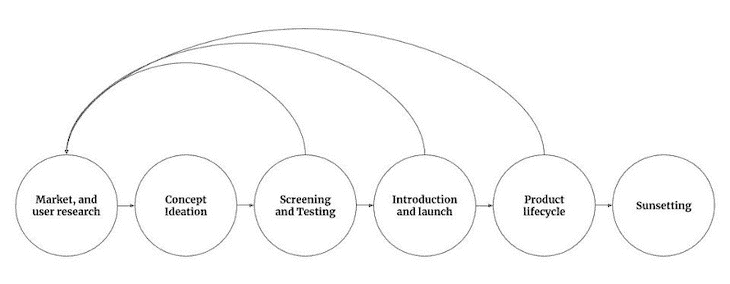

# 什么是产品计划，如何通过 6 个步骤来制定

> 原文：<https://blog.logrocket.com/product-management/what-is-a-product-plan-how-to-create/>

每当我读到下一个热门的、具有独角兽潜力的新创业公司时，我都会情不自禁地想到 *Pinky 和大脑*。

90 年代中期的动画电视连续剧中的两个有名无实的角色都是转基因实验室老鼠。大脑是超智能的；Pinky，不太喜欢。

大脑的主要目标？统治世界:

> ***Pinky** :啧啧，脑子。我们今晚要做什么？*
> 
> ***大脑**:我们每天晚上都做同样的事情，小指。试图接管世界。*

在每一集里，Brain 都设计了一个邪恶而不成熟的计划——例如，操纵世界上最大的磁铁形成废弃的卫星来拼写“Brain 是你的统治者”——最终总是失败。

这和产品管理有什么关系？

## 设计一个接管世界的产品计划

如果你想用你的产品产生影响，解决你客户的所有问题，不要像 Brain 一样；在你开始寻求市场主导地位之前，花点时间设计一个产品计划。

创建[路线图](https://blog.logrocket.com/product-management/how-to-build-product-roadmap-overview-examples/)和[积压订单](https://blog.logrocket.com/product-management/product-vs-sprint-vs-release-backlog/)是一个很好的开始，但是产品规划涵盖的范围更广。

在本指南中，我们将定义产品计划的含义、重要性以及创建产品计划的组成部分和步骤。

* * *

## 目录

* * *

## 什么是产品计划？

产品规划涵盖了公司开发成功产品必须执行和做出的所有步骤、活动和决策。

产品可以被定义为一种输入输出设备。输入是[客户价值主张](https://blog.logrocket.com/product-management/what-is-product-market-fit-measure-examples/#how-to-achieve-product-market-fit)，输出是公司的利润。产品规划包括从输入到输出你需要在内部做的所有事情。

它始于公认的客户需求——毕竟，客户不只是购买产品，他们购买的是[该产品能为他们](https://blog.logrocket.com/product-management/what-is-jobs-to-be-done-framework-examples/)解决他们遇到的问题。从商业角度来看，当产品达到其有用性的终点时，它就结束了。

## 产品策划的目的是什么？

产品规划包括有助于实现特定结果的行动和组成部分。[产品管理](https://blog.logrocket.com/product-management)就是实现结果。

在进入“如何做”和“做什么”之前，让我们首先通过概述产品规划的六个目标来理解为什么产品规划很重要:

1.  [公司生存](#company-survival)
2.  [满足客户需求](#meet-customer-needs)
3.  [增加销售额](#increase-sales)
4.  [了解并管理优势和劣势](#understand-and-manage-strengths-and-weaknesses)
5.  [更好地管理容量](#better-manage-capacity)
6.  [有效计划](#plan-effectively)

### 1.公司生存

老虎的眼睛，适者生存——或者如吹牛老爹所说，[这是关于本杰明的](https://www.youtube.com/watch?v=0c58ppLPJcQ)。

产品规划让你专注、保持活力，并了解自己的创新能力。它还能帮助你明确如何在竞争激烈的市场中引入、发展和淘汰产品。

### 2.满足客户需求

顾客是任何产品的核心。全面的产品规划将帮助你了解并满足客户的需求。这反过来帮助您通过[产品导向的增长飞轮](https://blog.logrocket.com/product-management/what-is-product-led-growth-strategies-principles-examples)快速将客户从评估者转变为冠军。

### 3.增加销售额

你的产品可能领先几光年，为客户问题提供了出色的解决方案，但如果他们对解决方案不感兴趣，不购买产品，你的产品就失败了。

例如，虚拟现实似乎终于找到了[产品-市场契合度](https://blog.logrocket.com/product-management/what-is-product-market-fit-measure-examples/)。然而，虚拟现实技术并不新鲜。

在 90 年代，虚拟现实处于上升趋势，预测的销售潜力超出了图表。不幸的是，VR 系统如[虚拟男孩](https://en.wikipedia.org/wiki/Virtual_Boy)未能交付；它糟糕的人体工程学和乏味的立体效果让用户头疼不已。

有了更好的产品规划，任天堂本可以打造出更复杂的产品来满足顾客的期望，从而提高销量。

### 4.了解并管理优势和劣势

产品规划可以让你自省，根据市场需求分析自己的优势和劣势。你的产品在哪些方面做得非常好？有哪些特质使其区别于竞争对手？你的产品缺少什么，竞争对手做得更好的是什么？

通过问和回答这样的问题，你会更好地了解你的产品可以利用什么，需要改进什么。

### 5.更好地管理容量

每个公司有什么共同点？资本、物质和人力资源方面的有限资源。产品规划使您能够以最佳方式规划这些产品，并充分利用它们。

### 6.有效地计划

当你在制造产品时，你有许多竞争优先权。你会投资新功能，增强和改进现有功能，[减少技术债务](https://blog.logrocket.com/product-management/what-is-technical-debt-examples-prioritize-avoid/)，还是花更多时间在[改进发现和交付流程](https://blog.logrocket.com/product-management/dual-track-agile-continuous-discovery/)？产品规划使您能够满足您的长期战略计划。

## 6 产品规划的考虑因素

现在我们明白了为什么产品规划是必不可少的，你如何着手去做呢？

创建成功的产品计划需要考虑以下因素:

1.  [开发前的研究](#research-before-development)
2.  [选择送货方式](#choose-a-delivery-method)
3.  [协调活动](#coordinate-activities)
4.  [设定价格](#set-a-price)
5.  [将产品商业化](#commercialize-the-product)
6.  [放弃无利可图的产品](#abandon-unprofitable-products)

### 1.开发前的研究

开始行动的能量:检查。相信它会成功:检查。

验证该想法是否能满足客户的需求？[蜂鸣器声音]。

在深入产品开发之前，先从扩展市场和用户研究开始。其中收集的见解将帮助您确定您的产品必须满足哪些特征和要求才能满足客户的需求。

### 2.选择交付方式

条条大路通罗马。问题是，哪个效率最高？

这一点在产品交付时更加适用。哪种交付方式将使您能够按照客户的需求开发您的产品或功能？

### 3.协调活动

产品规划旨在协调围绕产品及其投资的所有计划和活动。这样做可以提高你的竞争地位，争取市场领先地位。它还能帮助您快速应对不断变化的市场环境。

### 4.设定价格

产品规划帮助您确定产品的理想价位。

* * *

订阅我们的产品管理简讯
将此类文章发送到您的收件箱

* * *

在产品规划期间收集的见解可以帮助您确定最佳定价策略。例如，你的产品是最适合基于价值的、有竞争力的、价格撇除的、顾客加成的、渗透的、经济的还是动态定价的？

### 5.将产品商业化

产品规划帮助你发现和验证产品的生存能力、可行性和合意性。

合意性是指对顾客需求的满足和产品的商业化。这一措施有助于你确保生存能力，并有望获得利润。

产品规划还考虑如何最好地[将产品推向市场](https://blog.logrocket.com/product-management/what-is-go-to-market-strategy-examples-guide/)，并持续[衡量上市后的成功](https://blog.logrocket.com/product-management/how-to-measure-success-after-product-launch/)。

### 6.放弃无利可图的产品

所有美好的事物最终都会结束。产品的每一个决策都是商业决策，总有一天对产品或产品特性的进一步投资会变得无利可图。

在这一点上，必须决定是否终止产品或功能。

在整个产品生命周期中，良好的产品规划有助于您认识到何时应该放弃产品，并以一种对客户影响最小的结构化方式将其淘汰。

## 如何用 6 个步骤创建产品计划

好了，闲聊够了。是时候深入产品规划流程了。

产品规划包括六个步骤:

1.  [市场和用户研究](#market-and-user-research)
2.  [概念构思](#concept-ideation)
3.  [筛选和测试](#screening-and-testing)
4.  [介绍和发布](#introduction-and-launch)
5.  [产品生命周期](#product-lifecycle)
6.  [日落](#sunsetting)

### 1.市场和用户研究

在您开始构建之前，了解您试图解决的问题、市场驱动因素、竞争对手和客户需求至关重要。通过市场调查，你可以对上述所有问题产生深刻的见解。

[竞争分析](https://blog.logrocket.com/product-management/what-is-competitive-analysis-template-examples-tutorial/)是市场研究的一部分，是一种识别和分析竞争对手的结构化方法。

两者都是为了识别市场，调查[市场定位](https://blog.logrocket.com/product-management/what-is-product-positioning-examples-strategies-template/)，并分析企业的成功。

通过对新业务特别重要的客户细分研究，更大的客户群被划分成具有人物角色的不同群体。

人物角色构成了用户研究的基础，用户研究的目的是了解潜在客户的问题、习惯、兴趣、动机等等。

### 2.概念思维

一个伟大的产品始于一个伟大的概念和对这个概念的初步验证。这一步可以说是最有趣、最有创意的一步。

在概念开发阶段，您通过计算它解决已识别问题的能力、易用性、客户的成本、应用程序的外观等来定义您要构建的东西。

这个过程步骤中的一个关键步骤是产品发现和用户研究的继续，这使你能够发现人物角色所面临的问题和解决方案的目标。

概念构思来源可以是外部的，也可以是内部的。从外部来看，市场和用户研究影响概念构思。在内部，概念创意来自销售、客户支持、营销、工程、设计师、用户研究、高管和投资者。

### 3.筛选和测试

在筛选和测试期间，对概念构思阶段产生的想法进行严格评估。

目标是整理出与[产品愿景](https://blog.logrocket.com/product-management/what-is-a-product-vision-statement-examples/)不一致、不受欢迎和/或不切实际的想法。

评估之后，下一步是[严格地对想法进行优先排序](https://blog.logrocket.com/product-management/sprint-backlog-how-to-prioritize-examples/)。正如汉兰达所说，“[只能有一个](https://highlander.fandom.com/wiki/There_can_be_only_one)”这并不是说你应该只测试一个想法；这只是意味着你应该首先追求最有前途的测试。

有大量的[优先级框架](https://blog.logrocket.com/product-management/product-feature-prioritization-frameworks-strategies/)可供选择，其中最常用的包括:

一旦你有了一个优先列表，你应该设计一个假设并进行实验来验证或否定它。

在产品测试中，客户有机会试用样机。这有助于您了解客户是否理解产品理念，他们喜欢或不喜欢它的什么，以及他们最终是否会购买和使用它。

作为一个整体，概念构思、筛选和测试通常包含在[双菱形](https://blog.logrocket.com/product-management/6-product-management-frameworks-you-should-know/#double-diamond)方法中，这是一个帮助您发现、定义、开发和交付解决方案的设计流程。

### 4.介绍和发布

经过几次反复的筛选和测试之后，新的特性和可用性改进被认为已经准备好了，可以进行开发和发布了。

这一步，创意转化为产品。安排活动以确保[成功的产品发布](https://blog.logrocket.com/product-management/what-is-a-product-launch-plan-how-to-create/)和高[采用率](https://blog.logrocket.com/product-management/why-product-adoption-strategy-crucial-b2b-scenarios/)是项目经理的工作。

准备就绪后，产品就可以上市和商业化了。如果你的产品规划是合理的，它应该准备好与现有产品竞争，并最大化市场份额和利润。

### 5.产品生命周期

产品上线后，真正的乐趣才开始。现在是时候衡量和分析使用情况，以收集关于您的产品发布是否成功的新见解。

使用这些见解，您可以修改和增强产品，引入新功能，提高可用性，并帮助产品从介绍阶段进入增长阶段。

在某一点上，你将达到产品成熟期。客户数量和销售额会稳定下来。最终，对该产品的新投资将很难产生额外收入。竞争将变得越来越具有挑战性。

最终，产品会下降，顾客数量和销售额也会随之下降。这可能是由于现有的竞争或更先进、更能满足客户需求的新产品的推出。

想想随身听是如何被随身听超越的，随身听又是如何被 mp3 播放器超越的，最后是你手机上的一个应用程序。

### 6.日落方向

当一个产品在走下坡路时，是时候淘汰它了。日落也被称为生命的终结，通常涉及贬低产品。

虽然对一个你孕育、培育并看着它成长的产品说再见可能感觉很难，但是让一个产品寿终正寝是产品生命周期中非常自然的一部分。

在日落阶段，勤奋是很重要的。您应该设计一个剧本或清单，以确保所有的活动，例如沟通、代码清理等等，都包含在生命周期的最后阶段。

*精选图片来源:[icon scout](https://iconscout.com/icon/map-and-location-2569358)*

## [LogRocket](https://lp.logrocket.com/blg/pm-signup) 产生产品见解，从而导致有意义的行动

[LogRocket](https://lp.logrocket.com/blg/pm-signup) 确定用户体验中的摩擦点，以便您能够做出明智的产品和设计变更决策，从而实现您的目标。

使用 LogRocket，您可以[了解影响您产品的问题的范围](https://logrocket.com/for/analytics-for-web-applications)，并优先考虑需要做出的更改。LogRocket 简化了工作流程，允许工程和设计团队使用与您相同的[数据进行工作](https://logrocket.com/for/web-analytics-solutions)，消除了对需要做什么的困惑。

让你的团队步调一致——今天就试试 [LogRocket](https://lp.logrocket.com/blg/pm-signup) 。

[Klaas Hermans Follow](https://blog.logrocket.com/author/klaashermans/) Lifetime in digital and innovation, ensuring value delivery. I enjoy energizing and motivating teams that create and exceed product expectations.