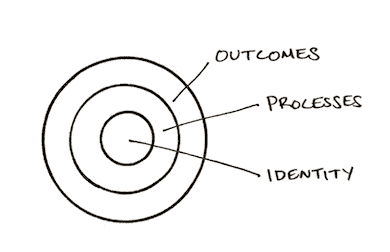
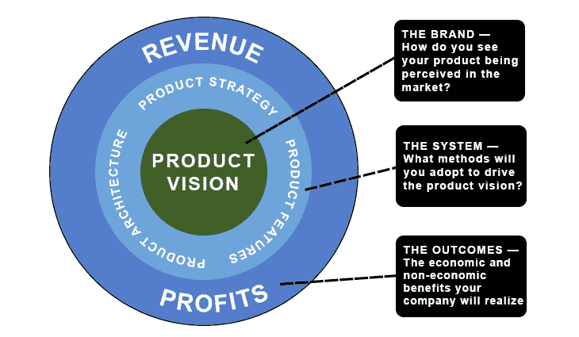

# 什么是产品愿景陈述？示例概述

> 原文：<https://blog.logrocket.com/product-management/what-is-a-product-vision-statement-examples/>

几年前，我遇到了 V2MOM，发现这是一种独特的方式来思考任何超出执行范围的实体。第一个问题是定义愿景声明。

我在这方面的研究产生了一个有趣的[视频](https://youtu.be/LJhG3HZ7b4o)，它展示了如何不写产品愿景(上下文是一个使命陈述，但想法是一样的)。如果你看了视频，你会注意到一个善意的活动是如何迅速付诸东流的。

另一种解释产品愿景的方式是从专利权利要求的角度。它不能太窄，因为竞争对手会想办法绕过它，也不能太宽，因为专利局会拒绝它。

事实上，创造产品愿景需要更多的艺术而不是科学。在本指南中，我们将向您展示如何创建一个好的产品愿景陈述，讨论谁负责制定和执行它，并重点介绍一些推动现实产品开发的产品愿景陈述示例。

* * *

## 目录

* * *

## 什么是产品愿景陈述？

产品愿景陈述描述了产品的长期预期结果。愿景声明的目标是通过允许每个人持续参与来确定实现共同目标的方法，从而推动价值体系。

一个成功的产品愿景应该进一步分解和定义与愿景声明一致的产品策略、路线图和功能。愿景声明不能是指令性的。

Source: [James Clear](https://jamesclear.com/identity-based-habits)

此外，愿景声明不是直接增加收入或底线。原子习惯，由詹姆斯·明摆着的一本书，解释了[基于身份的习惯](https://jamesclear.com/identity-based-habits)。

本质上，ID 就像一个愿景声明——你的品牌和其他人将你与什么联系起来，而不是你的收入和盈利能力。

一份好的愿景声明应该能够引出领先的关键绩效指标(例如，每周跑步五次，每次 30 分钟)，而不是落后的关键绩效指标(减掉 30 磅)。是的，减掉 30 磅是必要的，但这不是愿景声明的主要焦点。

## 谁负责定义产品愿景？

我不认为一项活动有多个所有者。当每个人都有责任时，没有人是。

那么，谁来负责产品愿景呢？简单的答案很简单:产品经理。

想想看:谁负责整合营销、销售、法律和工程领域的所有讨论，最重要的是，谁最了解他们所服务的市场？

产品经理还必须能够通过定义产品愿景来激励他们的团队。与公司愿景不同，产品愿景可以是一个协作过程。需要来自多个团队(尤其是 R&D、销售和营销)的代表，以敏锐的跨团队合作意识快速定义产品愿景。

## 什么是好的产品愿景陈述？

既然我们已经了解了什么是产品愿景，以及谁负责定义它，那么让我们聚焦于一些成功的产品愿景陈述所共有的品质。

### 由外向内

愿景声明必须建立在对市场需求的深刻理解上。换句话说，它应该展示价值创造。

例如，如果一个产品想要表达它对开源社区的支持，它也必须展示为什么这是至关重要的。换句话说，产品的意图不仅仅是促进与开源社区的合作，而是展示为什么产品对它所服务的社区至关重要。

### 有界限的

为了提供背景，让我们参考介绍中提到的视频中使用的披萨店示例。

[https://www.youtube.com/embed/LJhG3HZ7b4o](https://www.youtube.com/embed/LJhG3HZ7b4o)

视频

使命宣言来自于此:

> "提供威克郡最好吃的披萨"

对此:

> “面向家庭的最高品质娱乐解决方案。”

它是如何从一家披萨店变成提供娱乐解决方案的？这份使命宣言过于雄心勃勃。

同时，你不希望一个愿景陈述变得停滞不前；产品愿景应该一直在发展。然而，基础应该是对市场的更好理解或向不同垂直领域扩张的明确机会。

换句话说，如果你的产品愿景是解决世界饥饿问题，那么你可能想多了。

### 鼓舞人心的

一个清晰的产品愿景需要呈现一个未来的状态，并表达为什么这个未来的状态对于产品所服务的市场是至关重要的。

这句话看起来好像价值获取是一个重要的主题。作为潜台词，确实是，因为你的高管需要向他们的利益相关者解释产品的价值。

* * *

订阅我们的产品管理简讯
将此类文章发送到您的收件箱

* * *

关键在于，您的客户可以将此视为隧道尽头的光明。致力于这一愿景的团队发现这是一件值得超越的事情。

### 相关的

我将在这里提供一个不同的类比。我们讨论了我负责的制造解决方案的消费模型。给点上下文，厂商有几条线，每条线有多台机器。

对于制造商来说，两个因素至关重要。首先是预测年度成本的能力。第二点尤为重要:[快速理解定价模型](https://www.productfocus.com/product-management-resources/journal-articles/pricing-how-to-price/)。

定价模式应该是买方的主要利益相关者能够很好地沟通的。例如，对生产线或机器的引用将是有效的，因为利益相关者固有地理解它。

在讨论定价模型时，我的同事说:“让我们以会话为参考点。”他所指的会话是服务器上并行会话的数量。如果要尝试的话，这将是我最后一次和制造商进行这样的讨论！

我建议我的同事将这一点带回产品愿景。将那些致力于实现这一愿景的人视为你的客户。问问你自己，他们能理解你的陈述吗？

## 如何撰写产品愿景陈述

在构思愿景陈述时，想象自己在介绍产品的会议上面对观众(潜在客户)。从“我们相信”开始，用两到三句话完成陈述。

这个概念与亚马逊著名的新闻稿没有什么不同。不过删节版应该能引起观众的共鸣。

创建产品愿景需要领域知识以及对客户痛点和未满足需求的内在理解。

在某些情况下，我从棘手问题的项目列表开始，并将它们归类到更大的类别中以识别模式。在另一个场景中，它是为了捕捉用户的旅程，以及我们的产品在其他情况下如何适应这个故事。

我从来没有在筒仓里写过产品愿景。我通常会给一些不同背景的人打电话(例如，产品架构师、产品经理、销售主管等。)来帮助构思愿景。

我们花不超过 30 分钟到一个小时写第一个版本。当我和我的领导一起工作时，产品愿景声明可能会经历更多的迭代。我这样做是因为它推动了理解的一致性；游戏里每个人都有皮肤，视觉走有机传播路线。

没有打造完美产品愿景的灵丹妙药。我能提供的最接近的建议是:召集你的团队，保持 10K 水平，用两到三句话概括。此外，避免过度思考——创建产品愿景陈述最多不要超过一两个小时。

你的产品愿景声明就是你的品牌；你的观众应该和它联系起来。产品策略和路线图是实现愿景的方法。最终的结果是顶线和底线。

一份好的愿景声明能促成一个合理的产品策略。市场细分、定价、生态系统合作伙伴关系和分期(MVP 到全面上市)等战略要素应该自然地从愿景中产生。它应该有助于构建正确的功能集，更重要的是，有助于解决与愿景直接冲突的功能)。

## 产品愿景示例及其驱动因素

与其在消费品上编造产品愿景，不如让我们回顾两个真实世界的产品愿景陈述(出于显而易见的原因，不是逐字逐句的)并解释它们成功的原因。

### 产品愿景陈述示例 1

以下示例是制造解决方案的产品愿景陈述:

> 该解决方案能够推动制造流程各个方面的优化(从原材料接收到成品运输)，促进正确的组织行为，直观且易于部署和集成，并可根据客户需求进行扩展。

首先，我采访了团队的几个成员，包括产品经理。令我惊讶的是，根本没有产品愿景。与我交谈过的每个人对这个产品可以或应该做什么都有不同的想法。

然后，我们讨论了我们的设想，以及制造商应该如何与我们的产品建立联系，以提高流程效率、减少浪费、提高生产率、提供上下文洞察力和直观性。

另一个方面是，每个制造商都有独特的需求，我们希望产品符合他们的需求(所以他们为他们使用的东西付费，没有任何不必要的附加)。愿景限制了产品的应用。这不是一个企业资源规划系统；它本身并不做质量检查，而是利用质量检查来改进流程。它直接使团队能够将工作分解为类似乐高的产品架构、反映该方法的定价策略以及推动无缝集成的合作伙伴策略。

声明中遗漏的内容同样重要。产品愿景并没有规定产品应该做什么。例如，它没有提到自动化，用机器取代人，或人工智能驱动的机会。它远离解决方案，而是专注于棘手问题。

### 产品愿景陈述示例 2

以下是全损产品的产品愿景陈述示例:

> 从提交索赔到购买类似车辆，为保险消费者提供顺畅的体验，自动化流程，减少人为错误，并使流程链中的每个人都能在适当的时间访问相关信息。

这个例子也是特定于某个行业的，它提供了交付卓越客户体验的总体目标。它表明了自动化的一些关键思想，但没有深入细节。

例如，自动化可能意味着几件事，从电子签名到偿还未偿贷款。这些应该来源于将愿景分解为战略和产品路线图的定义。

## 产品愿景和公司愿景有什么不同？

从概念上讲，公司愿景和产品愿景是相似的。它们是一盏指路明灯，但不会告诉你如何驾驶你的车到达终点。

然而，公司愿景声明通常是由高管层决定的，尤其是大型高管层。处于较低层级的员工会跟随。

产品愿景不能与公司愿景相冲突。然而，这是一个更加民主的过程。有可能让关键利益相关者参与协作(并因此买入)。

## [LogRocket](https://lp.logrocket.com/blg/pm-signup) 产生产品见解，从而导致有意义的行动

[LogRocket](https://lp.logrocket.com/blg/pm-signup) 确定用户体验中的摩擦点，以便您能够做出明智的产品和设计变更决策，从而实现您的目标。

使用 LogRocket，您可以[了解影响您产品的问题的范围](https://logrocket.com/for/analytics-for-web-applications)，并优先考虑需要做出的更改。LogRocket 简化了工作流程，允许工程和设计团队使用与您相同的[数据进行工作](https://logrocket.com/for/web-analytics-solutions)，消除了对需要做什么的困惑。

让你的团队步调一致——今天就试试 [LogRocket](https://lp.logrocket.com/blg/pm-signup) 。

[Harish Natarahjan Follow](https://blog.logrocket.com/author/harishnatarahjan/) Harish brings 18+ years of product, strategy and technology expertise, delivering solutions in mission-critical environments in public safety, discrete manufacturing, and insurance verticals.