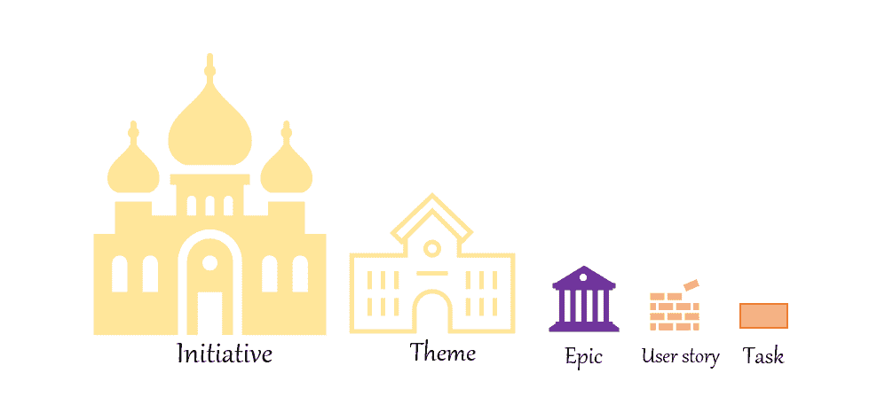
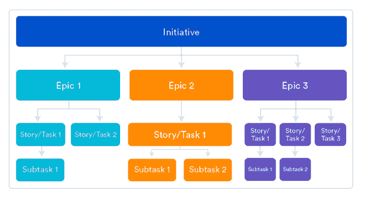
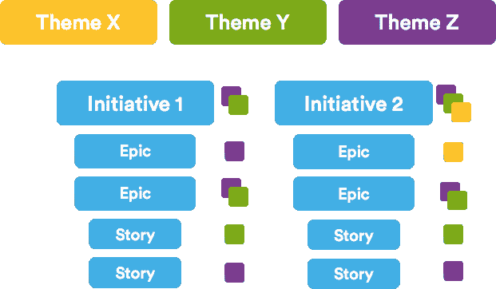

# 敏捷中的史诗是什么？带示例的完整指南

> 原文：<https://blog.logrocket.com/product-management/what-is-an-epic-in-agile-guide-examples/>

* * *

## 目录

* * *

## 什么是敏捷开发？

敏捷开发是一个迭代的过程，通过培养和拥抱持续学习的文化，它使软件开发团队能够加速他们的上市时间。敏捷团队通过实践来学习。

在产品开发中，战略和路线图基于来自市场的数据和见解，而市场总是在不断发展。产品团队必须足够动态，以适应不断变化的需求和用户需求。这是敏捷宣言中概述的核心[敏捷价值观。](https://blog.logrocket.com/product-management/four-agile-manifesto-values-explained/#responding-to-change-over-following-a-plan)

仅仅预测用户需求是不够的，因为用户需求是不断发展的。敏捷开发团队在[短暂的迭代冲刺](https://blog.logrocket.com/product-management/what-are-five-types-of-scrum-meetings/)中工作，这为他们提供了交付复杂产品所需的灵活性和实用性。

## 什么是史诗？

epic 是由多个构建块和场景组成的特性或功能。史诗来源于主题或计划，可以分割成更小的片段，称为[用户故事](https://en.wikipedia.org/wiki/User_story)。

一部史诗可以跨越多个 sprints，团队，甚至项目。主题、史诗和用户故事在关注领域的不同层次上共享相同的战略目标。

考虑建造房子的例子。如果一个计划就像建造底层，一个史诗就像建造一个厨房，一个用户故事就像建造一堵墙，每一块砖都是一项任务。

敏捷开发将一个广泛的[产品愿景](https://blog.logrocket.com/product-management/what-is-a-product-vision-statement-examples/)分解成小的、可实现的任务，这些任务产生频繁更新的结果。

就像盖房子一样，产品开发的生命周期会让人觉得不堪重负。对于从事产品工作的每个人来说，从哪里开始的方向可能并不明显。但是它有助于将更大的计划分解成几个主题——例如，建立基础和底层。

你可以将它进一步分解成史诗——例如，建造每个房间——然后甚至进一步建造一面墙。这让我们更清楚地了解了我们今天需要实现的目标，以便朝着[战略计划](https://blog.logrocket.com/product-management/product-strategy-frameworks-examples/)取得有意义的进展。

在大型组织中，有几个跨职能团队参与产品开发，epics 帮助每个人在开发目标、依赖关系和优先级方面达成一致。

## 史诗与用户故事与计划

根据组织的规模、产品的复杂性，计划、主题和史诗的组成可能在维度上有所不同。较小的产品或组织可能只有一个顶层。然而，如果在一个组织的范围内使用规模的设计，基本思想是相同的。

一个[产品路线图](https://blog.logrocket.com/product-management/how-to-build-product-roadmap-overview-examples/)归结为更小的、可实现的任务。在任何产品开发周期中，多个特性同时满足用户的需求。但这并不意味着产品需要在[发布](https://blog.logrocket.com/product-management/what-is-a-product-launch-plan-how-to-create/)时完全开发完成所有功能。

敏捷开发的核心价值是快速交付和边做边学。将主题分成不同的层次有助于缩短从构思到执行的产品开发生命周期。

这种细分也有助于通过将计划划分为更易管理的[最小可行产品(MVP)](https://blog.logrocket.com/product-management/what-is-minimum-viable-product-mvp-how-to-define/)来确定优先级。MVP 可以在短时间内开发并发布给用户，允许团队学习和迭代，验证想法，并根据需要调整路线图。

Source: Atlassian

不管你如何构建主题/计划、史诗和用户故事的层次结构，每一层都是有目的的。

### 主题和倡议

主题和计划定义了产品愿景。大的想法被分割成战略目标。

Source: Atlassian

主题的目的是成为北极星，提供整个组织的重点领域的清晰图片。

该计划可以是缩小市场差距、解决棘手问题、创新、市场适应性等。

### 史诗

史诗是产品路线图的实现。该计划被进一步分割成已定义的功能进行开发。

当涉及到[优先级](https://blog.logrocket.com/product-management/what-is-backlog-grooming-aka-refinement/)时，Epics 在组织和产品开发之间建立了一致性。

### 用户故事

用户故事以用户为中心，由用户价值驱动。

即使产品愿景和路线图来自组织内部，开发也应该始终完全以用户为中心。用户故事有助于开发团队与用户产生共鸣，并从客户的角度阐明产品所产生的价值。

## 如何写一部史诗

史诗是一个特性的高级需求。撰写史诗时，你的目标是让利益相关者与你的产品愿景和路线图保持一致。为了实现清晰和集中的一致性，您应该提供所有相关信息，包括任何依赖关系，澄清任何误解，并建立一个具有可衡量目标的明确方向。

合作是好的史诗般描述的关键。虽然[产品经理](https://blog.logrocket.com/product-management/what-does-a-product-manager-do-role-responsibilities/)负责编写一份史诗般的规范，但他们并不被期望成为各个层面的专家。在创建 epic spec 文档时，与您的团队协作讨论并协调解决方案设计、UX 设计和客户之旅。尽早引入所有需要的知识和专业技能，以避免以后陷入困境。

## 史诗包括什么

每次开发都是不同的，所以不同的产品会有不同的规格。一些史诗包括了具体的细节，而另一些只强调了高层次的需求。

一个 epic 至少应该包括产品团队需要的最基本的信息，以开始用户故事和优先化任务，尽可能有效地解决客户的需求。

基本史诗的结构如下:

1.  [简介](#introduction)
2.  [产品要求](#product-requirements)
3.  [工程要求](#engineering-requirements)
4.  [设计要求](#design-requirements)
5.  [KPI 指标](#kpis-and-metrics)

### 介绍

简介应该概述“为什么”和“什么”——优先考虑和开发特性的原因以及要解决的用户痛点。您还应该包括用于衡量绩效的[指标和 KPI](https://blog.logrocket.com/product-management/what-metrics-kpis-product-managers-track/)。

此外，您可以提供的任何文档或早期的线框都有助于建立对成功交付的目标和路径的共同理解。一些需要考虑的事项:

*   特性总结和开发它们的原因
*   绩效指标和 KPI
*   特定文档的链接
*   营销计划和法律要求(如有)
*   早期的线框

### 产品要求

epic 的一个基本目标是建立对发展目标的共同理解。epic 应该包括特性的功能性和非功能性需求。

* * *

订阅我们的产品管理简讯
将此类文章发送到您的收件箱

* * *

例如，[产品需求文档](https://blog.logrocket.com/product-management/how-to-write-product-requirements-documents-prds/)可能会提到多种语言或多种设备的可用性。

### 设计要求

你应该总是与 UX 设计师合作来写设计需求。他们是专家，并且肯定会从他们无数的用户测试经验中分享他们的见解。

产品设计要求的例子可能包括:

*   在何处放置每个设备的搜索功能
*   对简化未来小组讨论的原型的请求

### 工程要求

在 epic 中编译高层需求时，您应该努力与目标架构保持一致。像技术堆栈或解决方案设计一样，在早期阶段的考虑将帮助你[更准确地估计](https://blog.logrocket.com/product-management/planning-poker-agile-estimation-scrum/)并最大限度地提高效率。

例如，假设工程团队想要创建一个 API 来集成一些现有的数据库功能，以获取歌曲列表。在创建 epic 的初始阶段调查这些机会有助于您[避免招致无意的技术债务](https://blog.logrocket.com/product-management/what-is-technical-debt-examples-prioritize-avoid/#how-to-avoid-inadvertent-technical-debt)。

### KPI 和指标

KPI 指导每个产品开发周期。一套具体的度量标准和目标将帮助团队集中精力并积极地达到既定的目标。

KPI 应该是有形的和可衡量的。模糊的 KPI 没有价值，也不能激励行动。起初，一些 KPI 可能看起来不可度量，但是在与数据分析师一致之后，总有一种方法可以用数字来度量开发价值。

例如，提高客户满意度是一个很好的 KPI，但有点模糊。相反，尝试添加一些指标，如净推广者分数(NPS)或用户在一个会话中与新功能交互的次数。

## 史诗的真实例子

让我们考虑一个音乐流应用程序的例子来演示一个史诗是如何构成的。假设您想在应用程序中添加搜索功能。该数据库包含来自全球的 100 多万首歌曲，这是您的产品的一个关键优势，因此搜索功能被认为是让用户能够直观地找到他们正在寻找的任何音乐的关键。

使用下面的 epic 模板，我们的 epic 将如下所示:

与此示例保持一致，与填充上述模板的项目相关的 epic spec 文档可能如下所示:

### 介绍

新的搜索功能将允许用户缩小搜索范围，并提供建议来帮助他们立即找到他们想要听的音乐。

我们的研究表明，86%的用户对搜索功能感兴趣。由于搜索音乐最常见的问题是人们不记得或不认识歌曲的名字，因此语音搜索服务显示出最大的需求。

我们预计这一功能将使每位用户平均播放的歌曲数量增加 10%，这将使每月使用该应用的时间增加约 30%。

### 产品要求

*   用户可以从应用程序中的多个合适的页面开始搜索
*   用户可以开始语音搜索
*   搜索功能中的人工智能集成
*   自定义搜索建议
*   应该包括跟踪每一页

### 设计要求

*   在列表中显示不同类别的搜索建议
*   设计应该遵循可访问性规则

### 工程要求

*   仅在新的后端系统中构建新的 API
*   与 AI 集成团队共享的依赖关系

### KPI

*   转化率:推荐歌曲列表的点击量
*   使用语音搜索:平均。每个用户每个会话的使用

一份好的 epic spec 文档将有助于您在整个团队和组织中促进协作并达成一致。史诗也使编写用户故事、精简和优先处理待办事项变得更容易，并且[运行更顺畅的 scrum](https://blog.logrocket.com/product-management/what-are-five-types-of-scrum-meetings/) 。

## 结论

在敏捷开发中，所有的框架、结构和过程都是按照一个原则创建的:灵活并快速交付以迭代学习的能力。

任何过程或文档的主要目标是创建一致性，避免误解，并在加速上市时间的同时最小化无意中的技术债务。

*精选图片来源:[icon scout](https://iconscout.com/icon/child-task-1437533)*

## [LogRocket](https://lp.logrocket.com/blg/pm-signup) 产生产品见解，从而导致有意义的行动

[LogRocket](https://lp.logrocket.com/blg/pm-signup) 确定用户体验中的摩擦点，以便您能够做出明智的产品和设计变更决策，从而实现您的目标。

使用 LogRocket，您可以[了解影响您产品的问题的范围](https://logrocket.com/for/analytics-for-web-applications)，并优先考虑需要做出的更改。LogRocket 简化了工作流程，允许工程和设计团队使用与您相同的[数据进行工作](https://logrocket.com/for/web-analytics-solutions)，消除了对需要做什么的困惑。

让你的团队步调一致——今天就试试 [LogRocket](https://lp.logrocket.com/blg/pm-signup) 。

[Bindiya Thakkar Follow](https://blog.logrocket.com/author/bindiyathakkar/) Experienced product manager and product owner with a demonstrated history of working in the Omni channel and digital tools. Skilled in product management, digital strategy, roadmapping, business strategy, and user experience.