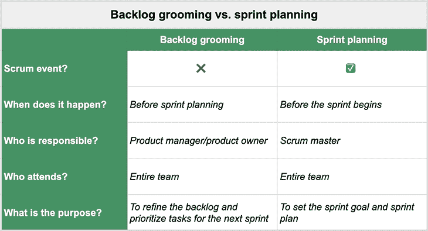
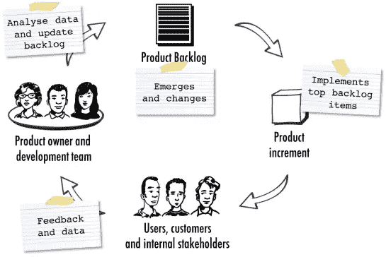
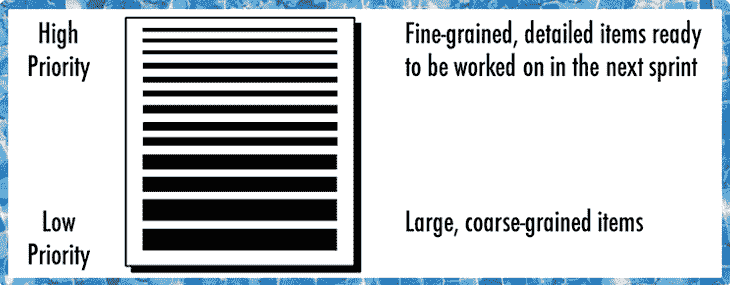

# 什么是积压整理(又名积压精化)？

> 原文：<https://blog.logrocket.com/product-management/what-is-backlog-grooming-aka-refinement/>

单词“backlog”的字面意思是藏在火后面以备后用的木头。最常见的是，这个术语被形象地用来表示将来要开始或继续的任务的积累。

在敏捷世界中，待办事项整理指的是细化和优先化任务列表的过程，以确保产品开发团队在下一次冲刺中有足够的工作要做。

在本指南中，我们将全面概述待办事项整理(也称为待办事项细化)流程，解释它与 sprint 规划的不同之处，并概述提示和最佳实践，以确保您从待办事项整理会议中获得最大收益。

* * *

## 目录

* * *

## 什么是积压整理？

Backlog 整理是一个过程，在这个过程中，产品所有者和产品经理与整个团队一起评审、讨论和优先处理 backlog 中的用户故事列表。待办事项是团队工作的优先任务列表。待办事项可能包括产品缺陷、新特性、技术债务、UI 变更等。

待办事项列表中的项目需要非常详细地定义，然后整理——即，与团队讨论，以确保每个人都理解需要做什么。积压工作梳理会议也为团队提供了一个与产品经理和产品所有者协商的机会。然后，产品经理和所有者详细说明后续步骤，加强待定项升级到的总体产品策略，并概述团队在完成一组待定项后应该达到的目标。

既然我们已经理解了什么是积压整理，让我们回顾一下它在 scrum 过程中的位置。

Source: [Bryan Marshall](https://www.bryanmarshall.com/scrum-meetings/)

Scrum 是一个敏捷框架，它定义了一套规则、角色、职责和会议，以增量的方式开发软件产品。目标是更快地以更小的块交付，并随着您向最后阶段的进展适应反馈。

根据 [scrum 框架](https://blog.logrocket.com/product-management/what-are-five-types-of-scrum-meetings/)，团队经历以下事件:

*   Sprint——团队处理 sprint 待办事项的限时事件
*   [冲刺计划](https://blog.logrocket.com/product-management/what-is-sprint-planning-guide-meeting-agenda-cheat-sheet/) —团队根据故事点评估经过培训的用户故事。这个事件定义了 sprint 的目标以及下一次 sprint 需要完成的工作
*   [每日 scrum](https://blog.logrocket.com/product-management/the-daily-scrum-meeting-overview-best-practices-anti-patterns/)——追踪团队向冲刺目标进展的每日事件
*   [冲刺评审](https://blog.logrocket.com/product-management/what-is-a-sprint-review-meeting-agenda-example/) —团队与产品负责人和关键利益相关者一起评审冲刺阶段完成的工作
*   冲刺回顾——一旦一个冲刺完成，团队将聚在一起讨论在未来的冲刺中可以改进的地方，并为完成的工作互相祝贺

在冲刺开始之前，*，*团队需要一个产品 backlog。积压整理是确保产品积压准备好供团队工作的过程。

## 积压整理与冲刺规划

理解冲刺计划和[积压整理](https://blog.logrocket.com/product-management/what-is-backlog-grooming-aka-refinement/)之间的区别很重要。Sprint planning 是 scrum master 进行的一项 scrum 活动，为即将到来的 Sprint 制定一个 sprint 计划和目标。Sprint 计划发生在 sprint 开始之前和 backlog 整理会议之后，并且是有时间限制的(一个月的 sprint 最多 8 小时)。

积压整理发生在冲刺规划之前。在积压工作梳理会议中，团队对 sprint 规划期间要讨论的积压任务进行优先级排序。基于这种讨论，开发人员承诺致力于一组选定的用户故事。

scrum master 确保根据冲刺速度、团队成员的假期计划等，为下一次冲刺计划足够多的用户故事。一旦完成了冲刺计划，冲刺就可以开始了。

下表说明了待办事项整理和冲刺计划之间的主要区别:

## 积压整理应该在什么时候进行？

积压整理发生在 sprint 规划会议之前。

举个例子，假设一个 sprint 从周一开始，持续两周。以下是以下事件发生的时间:

*   冲刺回顾会将在冲刺的最后一天——在这种情况下，周五晚上——在下一次冲刺开始之前举行
*   **冲刺计划**可以在周一冲刺开始前的周五或周四进行(或者，最糟糕的情况是，在冲刺开始前的周一早上，这取决于每个人的空闲时间和准备会议的时间)
*   **待办事项整理**由产品负责人根据他们的可用性进行

从产品、设计和技术的角度来看，用户故事一旦准备好，产品负责人通常会主持会议。如果一个 sprint 在星期一开始，那么在 sprint 开始之前的星期一到星期五之间的任何时候都可以进行积压整理。如果它发生在星期五，那么 sprint 计划可能会被推到星期一早上，在 sprint 开始之前。

下面的图表显示了在上述三种情况下，从星期一开始的 sprint 的待办事项整理、sprint 回顾和 sprint 规划会议的时间安排:

这种安排积压工作的时间保证了在 sprint 计划期间，积压工作被优先化、被讨论、被估计，并准备好被讨论。没有一个 backlog 整理会议，团队就不能进行 sprint 计划会议，因此也就不能开始 sprint。

## 谁会参加积压工作整理会议？

整个团队都参与了待办事项整理。因此，产品经理、产品负责人、scrum master、开发人员、设计人员、QA 和所有其他利益相关者都需要参加培训会议。积压工作整理会议通常由产品负责人领导。

## 在待办事项整理会话中做了什么？

在典型的 backlog 整理会议中，产品负责人根据 backlog 中的用户故事带领团队完成新的功能和设计。该会议也是团队讨论产品愿景和战略、产品路线图或任何需要澄清的未决问题的机会。

Source: [Roman Pichler](https://www.romanpichler.com/blog/refining-the-product-backlog/)

完成待办事项列表整理是为了确保待办事项列表中的用户故事是优先的、最新的，并且可供开发人员处理。您的待办事项列表整理会议议程应该设计成让开发人员在开始处理待办事项列表中的用户故事时，对他们需要做的事情有相同的认识。

积压工作梳理会议的目标是让团队能够更高效地交付更好的产品。领导团队的产品负责人负有维护产品待办事项列表和进行梳理会议以沟通团队后续步骤的重要责任。

* * *

订阅我们的产品管理简讯
将此类文章发送到您的收件箱

* * *

积压工作整理会议的最终目标有两个:

*   用开发人员执行计划所需的所有细节更新 backlog 项目
*   根据产品路线图和战略调整团队

## 如何运行一个成功的待办事项梳理会议:技巧和最佳实践

积压整理是产品负责人与其他关键利益相关者合作进行的一项持续活动。在整理待办事项时，产品负责人必须删除任何不必要的项目，对剩余项目进行优先级排序，用清晰简洁的验收标准定义用户情景，并在与工程团队进行会议之前提供必要的技术细节和设计。

一个 backlog 可以包含数百个或者更多的项目，所以使用标签和史诗对它们进行分类是很重要的。一个良好组织和分类的 backlog 将使产品所有者和工程团队的工作在即将到来的 sprints 中变得更加容易。

下面是一些成功进行待办事项整理会话的技巧和最佳实践。

### 定义用户情景以避免混淆/不确定性

产品负责人将尽他们最大的能力来定义用户故事，但是有时候开发人员仍然需要进一步的解释。backlog 梳理会议为团队提供了一个提问和寻求用户故事澄清的机会，以避免任何混淆。

关于用户故事的描述或接受标准的不一致会导致开发人员实现半生不熟的故事或导致意外结果的故事。在这种情况下，在审查期间，产品负责人会提供更多的澄清，并将用户故事发回给开发人员，以便按预期进行修改和实现。不难看出这种反复可能会延迟特性的交付。

### 根据新的见解添加新的用户故事

有时在准备阶段，团队会发现在执行新功能之前必须完成另一项任务。因此，它必须创造一个新的用户故事。在这种情况下，添加新的用户故事可以确保团队在处理 backlog 中的任务时不会出现空白或遗漏的步骤。

### 分配/重新分配故事点

团队使用故事点评估经过整理的用户故事。开发人员估计完成与用户故事相关的任务所需的工作量。通常，一个故事点代表一天的努力。基于开发者之间建立的共识，用户故事被分配一个故事点值。

### 将广泛的用户故事分解成更小的项目

该团队分解了估计需要三天以上才能完成的用户故事。较大的用户故事被分解成较小的部分，因为花太多时间在一个长的用户故事上违背了敏捷原则。被分成多个更小的独立故事的用户故事比更长的用户故事更易测试。

### 删除过时的用户故事和任务

产品路线图是一个流动的文档。它可能基于各种参数而发展，例如组织战略的变化、市场或用户行为的转变，或者新竞争对手的到来。

积压需要定期更新和重新排列，以跟上产品路线图的变化。在这个过程中，用户故事和任务变得过时是很常见的，所以一旦你从涉众那里得到明确的指示，你就应该从待办事项列表中删除这些不相关的项目。

### 重新排列用户故事的优先级

产品负责人根据产品路线图的变化，重新确定用户故事的优先级。在 backlog 整理会议期间，团队可能会发现在开始处理用户故事之前需要完成的步骤或任务。

例如，需要 API 与另一个平台集成的特性可能需要在应用程序上开发 UI 之前完成。因此，这个额外的 API 集成任务必须优先考虑。在这个场景中，API 集成的任务被创建并置于要实现的实际功能之上。

### 识别障碍并最小化与积压项目相关的风险

当团队讨论待办事项时，识别任何可能阻碍进展的障碍是至关重要的。根据问题的类型，将整个、单独的会议用于一个或一组路障可能是有利的。

团队必须致力于在冲刺开始前尽快解决任何可预见的障碍。如果没有做到这一点，那么应该从优先用户故事列表中删除该条目。在 sprint 中包含一个路障，会阻止团队看到用户故事的完成。

## 深层框架是什么？

2010 年，产品管理大师 Roman Pichler 和 Mike Cohn 提出了积压整理的深度框架。DEEP 规定如下:

为了确保产品积压深入并保持下去，你必须定期整理或提炼它。整理产品积压是一个持续的协作过程，涉及到产品所有者和团队。

深度框架作为一个指南，帮助产品经理和所有者有效地管理产品积压。DEEP 代表:

*   适当详述
*   估计的
*   紧急的
*   优先处理

让我们放大这四个属性:

### 适当详述

待办事项中的每一项都必须用所有适当的细节进行彻底的解释。

例如，假设一个用户故事描述了将要实现的功能以及验收标准。特征描述和验收标准不充分；用户故事还必须附上所有相关的设计和技术领导写的技术细节。

也就是说，并不是所有的待办事项都是一样的。深度框架规定，高优先级的项目应该比低优先级的项目描述得更详细。这有助于保持 backlog 的简洁，并确保最有可能在下一个 sprint 中实现的特性能够及时准备好。

Source: [Roman Pichler](https://www.romanpichler.com/blog/make-the-product-backlog-deep/)

对于一个完整的用户故事，它还必须链接到阻止它的其他故事。否则，还必须完成其他依赖项。

### 估计的

团队必须估计完成待办事项中所有项目所需的时间和资源。最初提供的粗略估计可以在 sprint 规划期间进行修改；当开发人员遇到一些可能影响 sprint 的额外信息时，这通常是必要的。

### 紧急的

backlog 是一个动态的工件，根据产品路线图不断变化。随着需求的增加，新的故事被添加，过时的用户故事被删除。

例如，假设您有一组来自路线图的特性，并且您从涉众那里收到了一个包含另一个特性的需求。基于这种变化，产品负责人需要在 backlog 中放置额外的故事。与此同时，可能还有另一个以前出现在优先列表中的功能，但根据更新的产品路线图，现在已经退居二线。因此，这一项需要从待办事项中删除。

### 优先处理

待办事项必须按优先顺序列出。产品负责人负责确定哪些待办事项应该按照什么顺序完成。这告诉团队如何处理待办事项，以及在开始其他任务之前必须完成哪些任务。

## 结论

健康的积压是高效、无压力和增量软件产品开发的先决条件。根据本指南中讨论的技巧和最佳实践，您应该拥有运行有效的积压工作整理会议所需的所有工具，从而成功开发产品(并及时交付)。

*精选图片来源:[icon scout](https://iconscout.com/icon/agile-prioritize-2310243)*

## [LogRocket](https://lp.logrocket.com/blg/pm-signup) 产生产品见解，从而导致有意义的行动

[LogRocket](https://lp.logrocket.com/blg/pm-signup) 确定用户体验中的摩擦点，以便您能够做出明智的产品和设计变更决策，从而实现您的目标。

使用 LogRocket，您可以[了解影响您产品的问题的范围](https://logrocket.com/for/analytics-for-web-applications)，并优先考虑需要做出的更改。LogRocket 简化了工作流程，允许工程和设计团队使用与您相同的[数据进行工作](https://logrocket.com/for/web-analytics-solutions)，消除了对需要做什么的困惑。

让你的团队步调一致——今天就试试 [LogRocket](https://lp.logrocket.com/blg/pm-signup) 。

[Monica Dhiman Follow](https://blog.logrocket.com/author/monicadhiman/) I am passionate about solving business problems by bringing the team together and removing impediments. I started my career as a business analyst before moving into product management. I am a Certified Scrum Master and I also write my thoughts about product management at [MonicaDhiman.com](http://monicadhiman.com).