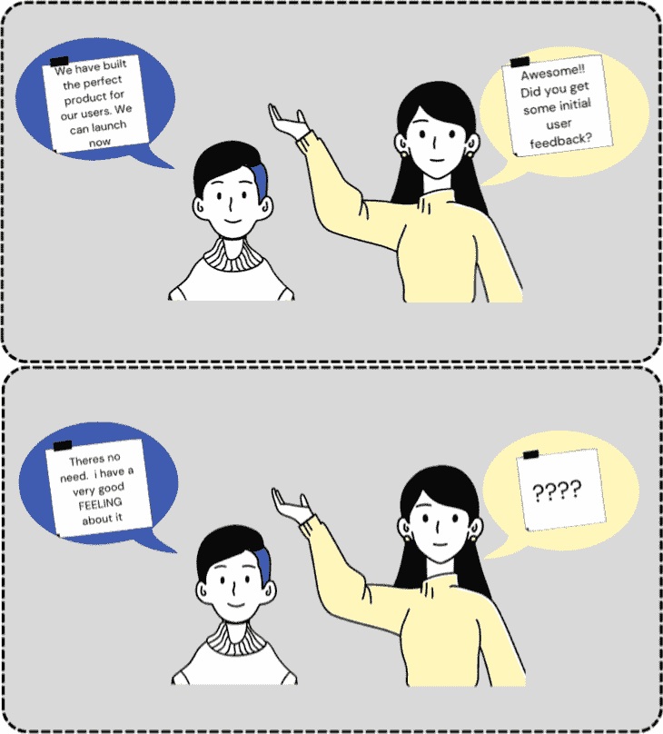
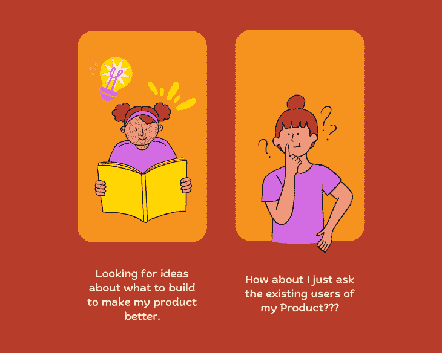

# 什么是 beta 测试以及如何测试

> 原文：<https://blog.logrocket.com/product-management/what-is-beta-testing-how-to-do-it/>

你是否曾经购买和使用过一个产品，并对自己说，“这是谁设计的？谁批准发布的？”要么这个产品对你这个用户来说毫无意义，要么它充满了 bug 和错误。听起来熟悉吗？

如果你没有因为使用一个糟糕的、有缺陷的或不精确的产品而感到愤怒和困惑，上面的推文很好地说明了这种情绪的代价。

作为一个[产品经理](https://blog.logrocket.com/product-management/product-manager-career-path/)，最不希望的就是被揍。这伤害了你的身体和自尊。这就是为什么你应该在把你的产品投放到市场之前测试它。

在本指南中，我将向你展示如何避免打击，甚至可能通过测试赢得你的客户的拥抱。

* * *

## 目录

* * *

## 作为产品经理应该做的测试

产品经理可以也应该进行许多测试，以确保团队能够交付一流的产品。这些活动不分先后，包括:

*   **概念测试**验证你想转化为产品的想法
*   **A/B 测试**，你提供两种不同的产品，看看哪种性能更好
*   **多元测试**确定您的产品的两个以上变体中哪一个表现最佳
*   阿尔法测试通过让员工在内部使用来确定你的产品是否满足业务需求
*   **软件测试**确保软件按设计运行，并识别错误和性能问题。在大多数团队中，这是由 QA 专家完成的
*   **用户观察测试**监测人们如何在没有你干预的情况下使用产品。根据我的经验，这是有趣的部分，因为用户很有趣，充满了惊喜😃
*   **Beta 测试**，这是本指南的重点

作为一个产品经理，你不应该感到有压力去为每一个发布做所有这些测试。根据可用资源和您试图从测试中获得的数据，选择最相关的测试。

## 什么是 beta 测试？

项目经理需要在[产品开发流程](https://blog.logrocket.com/product-management/product-managers-role-each-product-lifecycle-stage/)的每个阶段收集信息，以帮助衡量、学习，然后为他们的用户设计正确的解决方案。

Beta 测试是一项重要的活动，可以帮助产品经理[验证产品假设](https://blog.logrocket.com/product-management/what-is-minimum-viable-product-mvp-how-to-define/#hypothesis-validation)并从真实用户那里收集初步反馈。产品团队离产品太近，以至于看不到问题或识别不正常的行为，这是很常见的。

Beta 测试给了 PMs 一双全新的眼睛来看待产品。最重要的是，这些额外的眼睛属于产品的实际用户，他们很可能会告诉你他们的真实感受。这一开始可能会有点疼，但对产品和业务的长期生存能力来说是至关重要的。

## 为什么要进行 beta 测试？

在将产品推向更广泛的市场之前，Beta 测试是预测潜在问题和缺陷的一个很好的方法。

测试人员通常能更好地观察产品团队在开发和其他测试会议中忽略的东西。这使得产品团队能够收集有意义的用户反馈和关于产品的输入，否则他们不会从内部利益相关者那里得到。

此外，beta 测试是一项有价值的工作，因为它使产品团队能够:

*   快速收集数据
*   发射前监控[啮合](https://blog.logrocket.com/product-management/what-product-management-metrics-matter-most-to-pms/#engagement-usage-metrics)和[保持](https://blog.logrocket.com/product-management/6-product-management-frameworks-you-should-know/#aarrr-metrics)
*   识别以前未检测到的错误和功能问题
*   发布前根据需要调整产品
*   观察实际结果
*   逐步向核心用户群介绍[产品特性](https://blog.logrocket.com/product-management/what-are-product-features-define-examples/)

## 如何进行 beta 测试

Beta 测试分三个阶段进行:

1.  [准备和设计](#preparation-and-design)
2.  [进行 beta 测试](#conducting-the-beta-test)
3.  [测试后反馈和沟通](#post-test-feedback-and-communication)

### 准备和设计

准备和设计阶段包括以下步骤:

1.  [定义目标和指标](#define-goals-and-metrics)
2.  [确保目标和指标一致](#ensure-alignment-on-goals-and-metrics)
3.  [设置测试日期和持续时间](#set-test-dates-and-duration)
4.  [召集你的测试人员](#gather-your-beta-testers)
5.  [设置测试环境](#set-up-the-test-environment)

#### 定义目标和指标

你和你的团队应该清楚测试的具体内容和原因。无法衡量的就无法管理。

beta 测试的一些[指标和 KPI](https://blog.logrocket.com/product-management/what-metrics-kpis-product-managers-track/)示例:

*   检测到错误
*   按功能划分的用户参与度
*   NPS 分数
*   产品可用性

#### 确保目标和指标一致

项目经理常犯的一个错误是在没有利益相关者参与的情况下设定目标。

对于 QA 和 AB 测试来说，你可以做到这一点，但是 beta 测试需要面向客户的团队的投入，他们需要不断地与用户保持联系。自然，这些团队能够很好地接收对产品团队有价值的客户反馈。

此外，beta 测试的结果可能会决定运营团队工作方式的改变，所以从一开始就让他们参与进来总是好的。

#### 设置测试日期和持续时间

beta 测试不应该运行太长时间。测试时间安排不当会导致数据失真和用户兴趣下降。更不用说，你还有一个[产品发布会要计划](https://blog.logrocket.com/product-management/what-is-a-product-launch-plan-how-to-create/)。

同时，beta 测试不应该太短；它需要足够长，以便您能够正确地收集数据。我建议在 14-60 天内对典型特性进行 beta 测试。行业、目标和产品类型都会对此产生影响。

#### 召集你的测试人员

你不会让任何人进入你的空间，那么你为什么会让任何人加入你的测试组呢？项目经理需要明确测试的目标受众。

您的产品很可能有不止一种用户类型，所以您需要确定您是想要所有用户类型的结果，还是更愿意专注于一种用户类型。

我建议在你的 beta 测试社区中招募一个多样化的、有代表性的用户群。

测试人员是一个不同的品种。没有他们，产品团队会怎样？它们通常是:

*   早期产品采用者
*   愿意花时间测试你的产品并给你反馈
*   相当投入；你的产品提供的解决方案应该能解决他们的实际问题

您可以在以下位置找到测试版用户:

*   在社交媒体上
*   在线社区中
*   在您专门为之构建的组织和行业中
*   你的用户群；不要害怕问！
*   你的销售和客户服务团队；他们每天都在接触真实的和潜在的用户

根据您测试的产品类型，您可能还想让测试版用户签署合法的条款和条件以及保密协议。

有时很难找到测试用户。建立一个你可以在一段时间内接触到的测试用户群是一个很好的实践。这样，你就不需要每次想测试一个产品的时候都搜索新用户。

你应该让用户能够很容易地选择加入或退出 beta 测试。如果你有资源，你也可以考虑提供奖励。理想情况下，这种激励应该是金钱补偿以外的东西。毕竟人们普遍喜欢免费的东西！

* * *

订阅我们的产品管理简讯
将此类文章发送到您的收件箱

* * *

为了避免在测试期间重复回答相同的问题，您应该提前为测试用户准备好以下资源:

*   入职材料
*   民众
*   指导性文件
*   博客帖子
*   常见问题文档
*   反馈材料
*   调查

#### 设置测试环境

Beta 测试发生在产品发布之前，这意味着该产品还不能公开发布。您希望建立一个尽可能接近生产就绪且易于访问的环境。

### 进行测试

在[产品管理](https://blog.logrocket.com/product-management)中，很少有一刀切的做法。Beta 测试也不例外。

进行 beta 测试的方法有很多，这取决于产品的类型、测试的内容以及用户的可用性。但是作为一个通用框架，您应该这样做:

1.  **发布公告** —向您已经收集的测试组或潜在的测试用户组发送公告。这可以通过电子邮件、博客帖子、社区帖子，甚至电话活动来分发有关测试版的信息(例如，持续时间、如何参与、任何激励措施等)。)
2.  **板载测试用户** —指导用户如何使用你的新产品或新功能，并帮助他们集中注意力
3.  **监控行为** *—* 使用[分析跟踪 beta 测试期间的实际行为](https://blog.logrocket.com/product-management/what-metrics-kpis-product-managers-track/)。有时候，用户与你的应用程序交互的方式可能会让你吃惊

### 测试后的反馈和沟通

完成测试后，您应该采取以下步骤:

*   **收集反馈** —从你的测试人员那里收集尽可能多的反馈。如果可能的话，获得定量和定性的反馈
*   **感谢你的测试版用户** —对参与测试的用户表示感谢，并告知他们下一步的行动。例如，如果你希望他们将来成为测试用户，现在是时候通知他们了
*   **分享下一步***——*向你的测试版用户解释路线图上的下一步是什么。记住，这些是你产品的实际用户，所以你要让他们对你的产品保持兴奋，即使他们对他们刚刚测试的功能给出了负面的反馈

*精选图片来源:[icon scout](https://iconscout.com/icon/fuel-sample-1842014)*

## [LogRocket](https://lp.logrocket.com/blg/pm-signup) 产生产品见解，从而导致有意义的行动

[LogRocket](https://lp.logrocket.com/blg/pm-signup) 确定用户体验中的摩擦点，以便您能够做出明智的产品和设计变更决策，从而实现您的目标。

使用 LogRocket，您可以[了解影响您产品的问题的范围](https://logrocket.com/for/analytics-for-web-applications)，并优先考虑需要做出的更改。LogRocket 简化了工作流程，允许工程和设计团队使用与您相同的[数据进行工作](https://logrocket.com/for/web-analytics-solutions)，消除了对需要做什么的困惑。

让你的团队步调一致——今天就试试 [LogRocket](https://lp.logrocket.com/blg/pm-signup) 。

[Yewande Oyebo Follow](https://blog.logrocket.com/author/yewandeoyebo/) I'm passionate about delivering impactful products that solve real-life problems. The last eight years of my career has been an interesting journey of working multiple roles in the tech industry and experimenting with entrepreneurship.