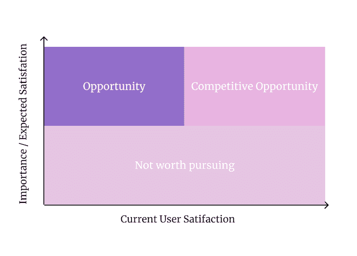
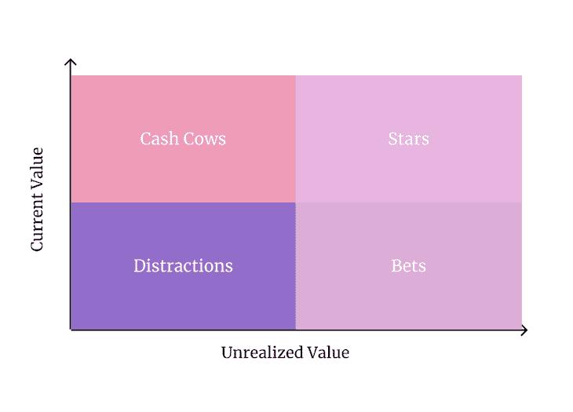

# 什么是商业价值以及如何衡量它

> 原文：<https://blog.logrocket.com/product-management/what-is-business-value-how-to-measure-it/>

近年来，商业价值几乎成了一个时髦词。突然间，每个人都想关注价值和结果。

当然，这是一个很好的前进方向。我们最终克服了敏捷宣言中的“工作软件是进步的主要衡量标准”的原则，并决定主要关注价值。

但是，你如何定义价值，更不用说量化了？价值是一个如此难以捉摸的术语，以至于精确地衡量它是不可能的。

然而，有一些评估价值的有用的替代物。我们可以将这些代理分为两类:当前价值和未实现价值。

* * *

## 目录

* * *

## 电流值

当前价值是产品今天交付的价值。

当前价值是关于衡量产品目前交付的价值类型。我们的产品越有价值，就越能:

*   竞争者的进入门槛更高
*   保持率[越高](https://blog.logrocket.com/product-management/what-is-customer-retention-rate-how-to-calculate/)和流失率[越低](https://blog.logrocket.com/product-management/product-managers-role-each-product-lifecycle-stage/#churn-rate)
*   更多产品货币化的可能性

我们可以通过了解[客户](#customer-satisfaction)和[员工](#employee-satisfaction)的满意度以及[企业获取价值的效率](#revenue-per-employee)来衡量价值。

### 客户满意度

我们都想知道我们的客户到底有多满意，但是很难衡量真正的满意度。用户自己通常很难定义他们到底有多满意。

然而，有几个代理可以帮助我们描绘出我们在满足客户方面有多好的总体情况:

### 员工满意度

公司不仅应该向股东和客户传递价值，还应该向员工传递价值。让员工开心有很多原因:

*   快乐的员工为顾客提供更好的服务，从而带来更快乐的顾客
*   满意度越高，留存率越高；更高的保留率导致更低的招聘成本和更好的知识保留率
*   这是应该做的事情

一些表明员工满意度的指标包括:

### 每个员工的收入

老实说，收入承诺通常是我们创造新产品和新业务的主要原因之一。

虽然衡量收入本身很好，但每个员工的收入可能是一个更精确的指标。它不仅告诉我们挣了多少钱，还告诉我们工作效率有多高。

一家需要 20 名员工才能创造 100 万美元收入的公司，比一家需要 400 名员工才能实现同样结果的公司更有效率(假设我们在一个垂直行业内进行比较)。

公司越大，管理费用越高。最近的裁员证明了盲目扩大规模的低效。不要盲目地雇佣新人，而是专注于优化现有员工的收入。

但是，使用员工满意度作为衡量指标。以牺牲员工满意度为代价来关注收入会适得其反。

## 未实现价值

未实现价值是指如果组织满足了潜在客户和用户的所有需求，它所能达到的潜在未来价值。

未实现价值告诉我们还剩多少。它帮助我们确定是否有进一步增长的空间。了解这种未来潜力有助于我们做出决策，例如:

*   投资哪种产品
*   我们是否应该保持我们的战略或支点
*   如果我们当前的目标市场足以实现我们的业务目标

有时候，投资一个当前价值低但未实现价值高的产品，比投资一个没有新价值可捕捉的最有价值的产品要好。

我们可以通过测量来评估未实现的价值:

*   可用市场份额
*   客户满意度差距

### 可用市场份额

你可获得的可用市场和当前市场份额之间的差异告诉你当前市场有多大吸引力。

如果你的 SOM 是 10，000 家企业，而你目前服务的是 2，000 家，那么就有很多未实现的价值。毕竟，在最好的情况下，你可以增长高达 500%。

如果你已经为 10，000 家企业中的 8，000 家提供服务，情况就不同了。剩下的 20%的市场可能不值得争论。也许是时候扩展到更有趣的市场了？

### 客户满意度差距

增加市场份额并不是增加产品的唯一途径。另一个选择是向当前用户群交付更多的价值(因此，开更多的账单)。

您可以通过缩小[客户期望体验和当前体验](https://blog.logrocket.com/product-management/what-is-product-experience-examples-how-to-improve-px/)之间的差距来提高您的价值。

衡量这种差距的方法之一是机会评分。请您的用户打分:

1.  他们对当前产品的关键领域有多满意/不满意？
2.  他们期望的满意度是多少？或者，某个特定区域对他们有多重要？

具有高重要性(或预期满意度)和低到平均的当前满意度的因素会产生差距。我们通过缩小这些差距来创造价值。

## 利用商业价值做出明智的决策

一旦你估算了当前价值和未实现价值，你可以用一个简单的 2×2 图表来看看你应该优先考虑什么。该矩阵将帮助您区分四种类型的产品:

*   **星星** —这些代表你的核心产品。你已经是这里的主要玩家了，而且还有很大的发展空间。把你的注意力放在这里
*   **摇钱树***——*尽管这里有很强的价值产品，但增长空间很小。尽可能长时间地专注于优化和捍卫价值，但不要在这里计划大的波动
*   **赌注***——*你还没有一个确定的价值主张，但有巨大的增长潜力。同时下注的数量应该取决于你的风险偏好，但根据经验，至少应该有一个在进行中
*   **杂念***——*既有低当前价值又有低未实现价值的产品，都只是杂念。杀了他们

这个矩阵也在更精细的层次上工作。不确定应该关注哪些产品特性？尝试评估他们的简历和紫外线，并以此为基础确定你的[优先事项](https://blog.logrocket.com/product-management/product-feature-prioritization-frameworks-strategies/)。

正确使用时，业务价值是一个强大的指标。用它来评估你目前的地位，估计你未来的潜力，并计划一条途径来弥合他们之间的差距。

* * *

订阅我们的产品管理简讯
将此类文章发送到您的收件箱

* * *

*精选图片来源:[icon scout](https://iconscout.com/icon/chart-growth-1913955)*

## [LogRocket](https://lp.logrocket.com/blg/pm-signup) 产生产品见解，从而导致有意义的行动

[LogRocket](https://lp.logrocket.com/blg/pm-signup) 确定用户体验中的摩擦点，以便您能够做出明智的产品和设计变更决策，从而实现您的目标。

使用 LogRocket，您可以[了解影响您产品的问题的范围](https://logrocket.com/for/analytics-for-web-applications)，并优先考虑需要做出的更改。LogRocket 简化了工作流程，允许工程和设计团队使用与您相同的[数据进行工作](https://logrocket.com/for/web-analytics-solutions)，消除了对需要做什么的困惑。

让你的团队步调一致——今天就试试 [LogRocket](https://lp.logrocket.com/blg/pm-signup) 。

[Bart Krawczyk Follow](https://blog.logrocket.com/author/bartkrawczyk/) Learning how to build beautiful products without burning myself out (again). Writing about what I discovered along the way.