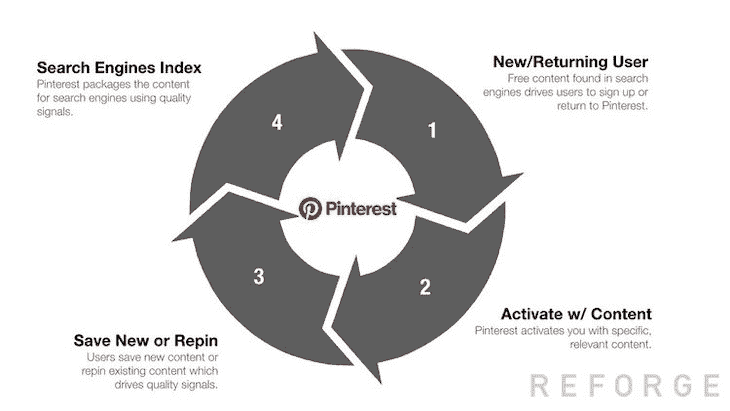

# 什么是获客成本，如何降低？

> 原文：<https://blog.logrocket.com/product-management/what-is-customer-acquisition-cost-how-to-reduce/>

获得新客户至关重要，而且不是免费的。

无论你用什么方法来吸引新用户，总会有一些相关的成本。这可能像购买脸书广告一样简单，也可能是更间接的费用，比如付钱给内容作者写一篇 SEO 友好的博客文章。

如果你了解用户获取的成本结构，你就可以作用于它并优化它。长期来看，更低的获客成本带来更多的用户或资金用于产品开发。

因为产品本身在获取用户方面起着至关重要的作用，所以每个[产品经理](https://blog.logrocket.com/product-management/what-does-a-product-manager-do-role-responsibilities/)都应该对他们的增长引擎有一个坚实的理解。

* * *

## **目录**

* * *

## 什么是客户获取成本(CAC)？

简单来说，客户获取成本(CAC)就是获取新客户所花的钱。

客户获取成本有不同的组成部分。确切的价格结构取决于您的增长模式，可能包括:

*   销售团队的工资和奖金
*   销售代表出差的费用
*   营销团队的工资和奖金
*   广告费用
*   伙伴关系和活动费用

## 如何计算客户获取成本(CAC)

要计算平均客户获取成本(CAC ),请将所有获取成本合并，然后将该数字除以给定时期内获得的新客户数量。

计算 CAC 的公式如下:

For a practical example, let’s say that, in June, you spent:

*   营销团队 8000 美元
*   15000 美元的付费谷歌广告

同时，你获得了 40 个新客户。

上例中的 CAC 计算如下:

在这个场景中，6 月份获得一个新客户的成本是 575 美元。

## 客户获取成本应该有多高？

在上面的例子中，我们计算出我们的客户获取成本为 575 美元。然而，数字本身并不能告诉我们这是一个坏的还是好的结果。

虽然你希望你的 CAC 越低越好，但是高获客成本不一定是坏事。

最佳 CAC 在很大程度上取决于顾客的终身价值(LTV)。终生价值告诉我们，平均来说，一个客户在他的一生中为我们提供了多少收入。

## 如何计算客户终身价值(LTV)

要计算客户终身价值(LTV)，将客户的平均价值乘以他们的平均寿命。

计算平均客户终身价值的公式如下:

例如，对于 SaaS 产品，我们可以使用:

*   平均客户价值=平均每月订阅成本
*   平均客户寿命=生产前的平均服务月数

因此，如果平均订阅费用为 40 美元，用户平均使用两年，那么:

计算了生命周期价值和客户获取成本后，我们可以得出 LTV/CAC 比率:

### 什么是“好的”客户终身价值(LTV)？

根据一般经验，3 或更高是一个健康的比率——意味着你赚的钱至少是你获得每个客户的三倍。

这意味着，如果每个客户的 LTV 是 30，000 美元，那么即使每个客户的 CAC 高达 5，000 美元也是完全可以的。另一方面，如果你从每个新用户身上只赚到 4 美元，那么 3 美元的 CAC 就非常高了。

在某些情况下，降低 LTV/CAC 比率可能是有益的，如果从长远来看它能让你获得更多的客户。想象两种情况，在这两种情况下，LTV 都是 100 美元。

*   **场景 1** *—* 花费 10，000 美元进行营销，获得 1，000 名用户(LTV 总计= 100，000 美元)
*   **场景 2** *—* 花费 20，000 美元进行营销，获得 1，500 名用户(LTV 总计= 150，000 美元)

从技术上讲，方案 1 的 LTV/CAC 比率为 10，比方案 2 的 7.5 更有利，但是当我们计算时，第二个方案的总利润更高:

*   **场景 1** *—* 1，000 x 100 美元–10，000 美元= 90，000 美元的收入
*   **场景 2** *—* 1，500 x 100 美元–20，000 美元= 130，000 美元收入

当然，这个例子是简化的，不包括维护每个活跃用户的成本。关键是对于多高的 CAC 或 LTV/CAC 比率没有一个完美的答案。在每种情况下，这都归结于数学。

根据一般经验，CAC 越低，LTV/CAC 比率越高越好。

## 如何降低客户获取成本

客户获取成本稳步上升。在过去的五年里，它已经增长了大约 60 %,并且还将继续增长。

CAC 上升的原因包括:

*   日益激烈的竞争
*   [横幅失明](https://blog.hubspot.com/marketing/banner-blindness)
*   新的隐私和跟踪法规

这种不断增加的客户获取成本对大多数企业来说是一个严重的威胁。为了降低这些风险，你应该尽你所能降低他们的购买成本。

* * *

订阅我们的产品管理简讯
将此类文章发送到您的收件箱

* * *

降低客户获取成本的策略包括:

### 最大化转化率

转化率是影响平均客户获取成本的关键因素之一。

如果你为每个访问者支付 0.20 美元，你的访问者-客户转换率是 1%，那么你需要 100 个访问者(20 美元)才能得到一个客户。如果你把转换率提高到 2%，你需要一半的访问者数量，而花费只有一半(10 美元)。

当涉及到最小化整体 CAC 时，最大化转换率是您可以做的最有效的活动之一。

### 提高针对性

当你向错误的人展示广告，或者你的销售人员接触了错误的业务类型，你就是在浪费钱。

你的目标越不集中，接近错误的人而赔钱的可能性就越大。

专一是关键。定义你的产品目标用户角色的类型，并确保你的获取努力集中在那个角色上。不要只是往墙上扔钱。

### 尝试增长战略

尝试你的收购策略，就像你尝试你的[产品与市场的契合度](https://blog.logrocket.com/product-management/what-is-product-market-fit-measure-examples/)一样。

尝试不同的信息、图片或广告/电子邮件标题。看看什么能转化最好的，双倍下注赢家，削减输家，继续实验。这需要时间和大量失败的活动来发现最终用户真正的共鸣。

你的第一次活动、电子邮件或宣传片永远不会是你最好的一次。你尝试的越多，你获得新用户的机会就越多，而且越便宜。

### 构建成长循环

增长循环是新用户间接带来更多用户的机制。Pinterest 就是一个很好的例子:

1.  用户通过搜索引擎找到了一张新的 Pinterest 照片
2.  用户创建一个帐户。
3.  用户重新打印图像或上传新图像
4.  搜索引擎将图片编入索引
5.  重复

健康的增长循环是降低客户获取成本的最终解决方案。一个理想的循环甚至可以让你免费获取新用户。

### 掌握一条成长通道

最容易赔钱的方法之一是[同时投资多个增长渠道](https://blog.logrocket.com/product-management/product-growth-channels-strategies-examples/)。

发展产品有多种方式，包括:

通常，有一种增长渠道最适合该产品。目标是找到它，并调整产品和策略，以最大限度地发挥其潜力。

不要试图掌握所有的分销渠道。只会让你的客户获取成本疯掉。

## 关键要点

客户获取成本(CAC)告诉我们获取新用户的成本有多高。给定的 CAC 是高还是低取决于总体 LTV/CAC 比率和最终投资回报。

由于竞争加剧和新的数据隐私法，获取新用户的成本逐年增加。出于这个原因，企业家和产品经理应该寻找方法来最小化他们的总体客户获取成本。

尽管有许多降低 CAC 的微观策略和增长技巧，但最重要的是:

*   选择正确的增长渠道
*   创造健康的成长循环
*   瞄准正确的受众
*   转化率最大化
*   尝试增长战略

不要忽视你的[收购策略](https://blog.logrocket.com/product-management/why-product-adoption-strategy-crucial-b2b-scenarios/)。如果没人用，你的产品再好也没用。

*精选图片来源:[icon scout](https://iconscout.com/icon/graph-1567975)*

## [LogRocket](https://lp.logrocket.com/blg/pm-signup) 产生产品见解，从而导致有意义的行动

[LogRocket](https://lp.logrocket.com/blg/pm-signup) 确定用户体验中的摩擦点，以便您能够做出明智的产品和设计变更决策，从而实现您的目标。

使用 LogRocket，您可以[了解影响您产品的问题的范围](https://logrocket.com/for/analytics-for-web-applications)，并优先考虑需要做出的更改。LogRocket 简化了工作流程，允许工程和设计团队使用与您相同的[数据进行工作](https://logrocket.com/for/web-analytics-solutions)，消除了对需要做什么的困惑。

让你的团队步调一致——今天就试试 [LogRocket](https://lp.logrocket.com/blg/pm-signup) 。

[Bart Krawczyk Follow](https://blog.logrocket.com/author/bartkrawczyk/) Learning how to build beautiful products without burning myself out (again). Writing about what I discovered along the way.