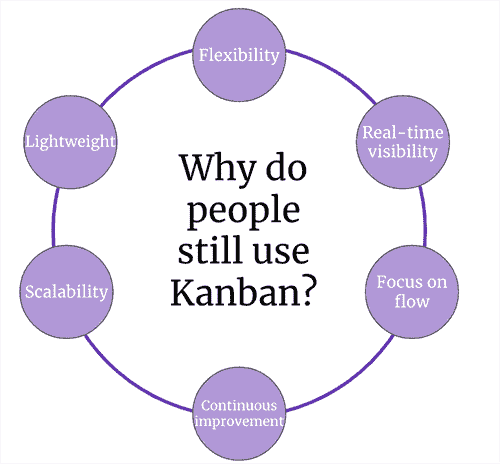

# 什么是看板，为什么组织要使用它？

> 原文：<https://blog.logrocket.com/product-management/what-is-kanban-why-do-organizations-use-it/>

在敏捷开发中，当讨论工作和改进的方式时，我们经常提到一些框架——scrum、看板、SAFe、DAD 等等。

在这篇文章中，我们将关注看板方法，以及为什么人们今天仍然使用它。我们将回顾它的起源、好处、如何在实践中大规模实施，以及它面临的挑战。

* * *

## 目录

* * *

## 什么是看板？

看板是敏捷开发中最古老的框架之一。它的目的是可视化工作和工作状态，以便在开发团队和组织的其余部分之间创建透明度。目标是实时可视化能力、正在进行的工作和优先级，以提示下一步行动并保持工作顺利进行。

丰田的工业工程师大野泰一在 20 世纪 70 年代创造了“看板”这个术语。他通过评估零部件供应的新系统创造了它。看板通过沿着生产线发送的指令卡系统对其进行管理。

“看板”一词在日语中的意思是广告牌或视觉标志。看板是一种管理和组织工作以最大化效率和灵活性的方法。在现代，它通常用于制造和软件开发，但也可以应用于任何涉及任务协调的领域。

当敏捷工作方式处于初始阶段时，看板是帮助建立敏捷开发基础的首批框架之一。

尽管已经使用了很多年，看板仍然是许多组织中使用最广泛的框架之一，并且在适应敏捷工作方式时经常被用作基础框架。

## 为什么还有人用看板？

答案很简单:因为它的简单和灵活。

在当今数字化的时代，事物发展迅速，人们期望不断地快速交付新的开发成果。这需要一种方法来跟踪和理解正在进行的工作和已确定工作的状态。

看板是可视化工作状态和理解下一个最佳行动以保持流程进行的最简单的方式。它有助于防止瓶颈，并在早期清楚地看到潜在的障碍，从而实现流程的平稳运行。

看板框架既可以用于短期项目，如网页设计，也可以用于长期项目，如产品开发。通过使用看板，团队可以将大任务分解成更小的可管理的块，并一次专注于一项任务。这有助于他们专注于手头的任务，并以更好的结果实现速度。

尽管有其他先进的敏捷方法，人们仍然使用看板有几个原因。

### 灵活性

看板可以适应不同团队和组织的需求。它不是规定性的，允许团队以最适合他们的方式工作。

### 实时可见性

该方法提供了对工作过程的实时可见性，允许团队轻松地看到当前正在处理什么任务以及还需要做什么。这防止了流程中的瓶颈和延迟。

### 关注流动

作为看板的一部分，团队被鼓励专注于定期交付小的、增量的改进。这确保了团队总是在进步，并且工作按时完成。

### 持续改进

[持续改进流程](https://blog.logrocket.com/product-management/what-is-continuous-improvement-process-methodologies/)允许团队根据需要不断审查和调整他们的流程，确保他们始终以最佳状态工作。

### 可量测性

看板可以根据团队的规模和工作的复杂程度扩大或缩小，允许所有规模的团队实施它。

### 轻量级性质

使用这种方法很容易，不需要大量的前期规划或文档。这使得团队开始使用它不那么令人生畏。

看板可以适应不同团队和组织的需求，提供一种简单而强大的方法来管理和组织工作。这是团队和组织的普遍选择。

## 如何在实践中实施看板

在开始实施看板之前，就如何使用看板制定清晰的指导方针和流程。指南的几个例子可以是:将票据移动到下一列需要什么，以及在移动时我们应该从列表中检查什么？

一旦你的指导方针制定好了，有几个简单的步骤，基本的看板系统就可以付诸实践了。

为了在您的产品组织中成功实施看板，让所有团队成员参与到流程中是非常重要的。这包括开发人员、设计人员、管理人员和其他利益相关者。通过让每个人都参与看板系统，你可以确保每个人都朝着相同的目标努力，并且每个人都理解系统是如何工作的。

* * *

订阅我们的产品管理简讯
将此类文章发送到您的收件箱

* * *

此外，为如何使用看板建立清晰的指南也很重要。这包括对可以分配给每个团队成员的任务数量设置限制，以及建立如何将任务从一列移动到另一列的过程。

最后，查看看板并根据需要定期进行调整也很重要。这包括删除已完成的任务，并在新信息可用时重新评估优先级。通过定期审查董事会，您可以确保系统按预期运行，并且您的团队朝着其目标稳步前进。

## 规模化看板

最近，看板在试图适应敏捷开发方法的大型遗留组织中流行起来。他们希望在更高的层次上对每个计划进行优先排序并获得完整的描述。

由于看板方法的简单性，它很容易与任何可扩展的敏捷框架集成，以确保更大组织中的透明性——在更大的组织中，各个部门经常各自为政。要创建这种标准视图并打破孤岛，组织需要达成共识。

除了软件开发之外，看板在组织的其他部分也很流行，包括市场营销、内容创建等。这是因为它遵循一个简单的过程:定义您的目标，创建任务，将任务分配给成员，跟踪进度，并根据需要进行调整。

这允许团队调整他们的策略，并在需要时快速做出改变。它也反过来帮助软件开发团队，因为现在整个组织可以理解并遵循相似的工作方式。它使沟通更容易，并最大限度地减少额外的文档，以满足不同部门所需的不同工作方式。

将看板与其他敏捷框架相结合，可以成为改进当前流程的一种强有力的方式。然而，要做到这一点，你首先需要理解看板的原理。然后，您需要确定正确的敏捷框架，并确定需要改进的地方。

从小的试点项目开始，将看板整合到您现有的流程中，然后持续改进和教育您的团队，并定期衡量成功。这样，您就可以成功地将看板与其他敏捷框架集成起来。

看板可以在任何级别、任何规模下使用。通过使用“战略看板”方法，管理层可以使用看板在更高的层次上对计划进行优先级排序。这种方法包括使用看板和方法在组织的战略层面可视化、管理和优先化计划。

### 大规模实施看板的步骤

首先，创建一个看板，并在更高的层次上添加所有的计划，以在组织中创建透明度。

明确说明如何将计划从一列移动到另一列。这将有助于确保流程的一致性，以便每个人都能理解。例如，如果计划被所有参与开发的跨职能团队批准，并且被划分了优先级并分配了时间和资源，那么计划只能从 backlog 移动到下一列。

接下来，定期审查董事会并进行必要的调整，包括重新评估优先级，删除已完成的计划，并进行任何必要的流程更改。

向利益相关者传达[计划的状态，并获得他们的反馈](https://blog.logrocket.com/product-management/what-stakeholder-management-tools-techniques/)。这将有助于确保每个人都在同一页上，并且计划与组织的整体战略相一致。在这个场景中，利益相关者是与 UX、营销、销售等计划一起工作的 CFT。

接下来，[跟踪诸如交付时间、周期时间和在制品等指标](https://blog.logrocket.com/product-management/what-metrics-kpis-product-managers-track/)以确定计划的成功。这是极其重要的。管理层将能够根据需要进行调整，并确保计划与组织的整体战略保持一致。

通过这种方式，在管理层优先考虑计划的同时，具有充分的透明度。整个组织将在未来避免冲突和阻碍，并帮助 CFT 顺利开展工作。

## 看板的常见挑战

尽管看板有好处，但它也不是没有挑战。一个常见的问题是，团队成员可能会对他们盘子里的任务数量感到不知所措，特别是如果看板没有定期更新的话。为了防止这种情况，定期检查董事会并删除任何已完成的任务或不再相关的任务是很重要的。

另一个挑战是团队成员可能不愿意将任务从一个列转移到另一个列，因为他们可能觉得他们没有满意地完成任务。或者，如果没有适当的标准，例如将项目移动到下一列的清单，他们可能会移动得太快。

与你的团队定期回顾，以确定工作方式是否有助于他们的日常工作，或者是否需要一些改进。获得反馈，尝试改变工作方式。团队的需求可能会根据他们在各自项目中所处的成熟度级别而变化。

## 结论

产品经理可以利用看板。这是可视化、管理和优先化产品开发过程的一个很好的工具。看板有助于区分产品特性的优先级、限制正在进行的工作、明确过程策略、审查和调整、与利益相关者交流以及衡量成功。

通过遵循这些步骤，产品经理可以确保产品开发过程与组织的整体战略相一致，并且团队专注于最重要的功能。像任何其他框架或工作方式一样，这种方法也需要根据团队在任何特定点的需求不断改进和变化。

由于看板框架的简单性和灵活性，它对于团队的需求是高度可塑的，这使得它很容易适应。

*精选图片来源:[icon scout](https://iconscout.com/icon/scrum-task-board-5338938)*

## [LogRocket](https://lp.logrocket.com/blg/pm-signup) 产生产品见解，从而导致有意义的行动

[LogRocket](https://lp.logrocket.com/blg/pm-signup) 确定用户体验中的摩擦点，以便您能够做出明智的产品和设计变更决策，从而实现您的目标。

使用 LogRocket，您可以[了解影响您产品的问题的范围](https://logrocket.com/for/analytics-for-web-applications)，并优先考虑需要做出的更改。LogRocket 简化了工作流程，允许工程和设计团队使用与您相同的[数据进行工作](https://logrocket.com/for/web-analytics-solutions)，消除了对需要做什么的困惑。

让你的团队步调一致——今天就试试 [LogRocket](https://lp.logrocket.com/blg/pm-signup) 。

[Bindiya Thakkar Follow](https://blog.logrocket.com/author/bindiyathakkar/) Experienced product manager and product owner with a demonstrated history of working in the Omni channel and digital tools. Skilled in product management, digital strategy, roadmapping, business strategy, and user experience.