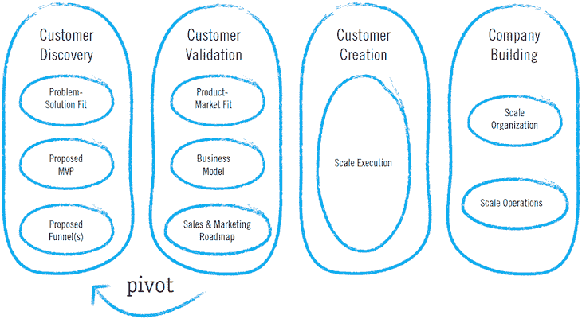
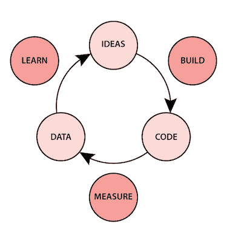

# 什么是精益产品管理，如何应用？

> 原文：<https://blog.logrocket.com/product-management/what-is-lean-product-management-how-to-apply/>

精益产品管理是一种方法学，旨在通过在开发过程的每一步削减过剩产品和灌输客户反馈，帮助组织更快地将产品推向市场。

在本指南中，我们将向您介绍精益方法，看一个著名的例子，并探索在您的组织中推广精益思想的方法。

* * *

## 目录

* * *

## 什么是精益方法论？

精益创业的概念最早是由美国企业家兼作家埃里克·里斯(Eric Ries)在他广受好评的书《精益创业 》中提出的。用里斯的话说:

> “精益创业法教你如何创业——如何掌舵、何时转向、何时坚持——并以最大加速度发展业务。”

每年，90%的创业公司会失败。这与行业无关；所有垂直行业的创业失败率大致相同。此外，70%的初创公司会在最初的两到五年内失败。低效的方法、冗余的工作流程和欠考虑的组织结构是这些失败背后的一些常见原因。

## 什么是精益产品管理？

精益是指通过消除浪费向客户提供价值。精益产品管理意味着将精益启动原则应用于产品开发生命周期。

精益启动方法建议开发一个[最小可行产品(MVP)](https://blog.logrocket.com/product-management/what-is-minimum-viable-product-mvp-how-to-define/) ，然后使用[构建-测量-学习反馈循环](https://medium.com/@dominic_11011/build-measure-learn-cycle-ace388a13b4d)，进一步改进产品。

Source: [Nima Torabi](https://medium.com/neemz-product/customer-development-a-product-managers-top-priority-6fa6b948464)

精益产品管理为产品团队提供了一个持续测试和验证他们所学知识的框架——这是敏捷软件开发的一个重要原则。一旦你接受了这种经过验证的学习过程，重点仍然是客户价值，从而帮助[优化产品与市场的契合度](https://blog.logrocket.com/product-management/what-is-product-market-fit-measure-examples/)。

## 精益方法示例

20 世纪 30 年代，丰田公司发明了[丰田生产系统](https://www.lean.org/lexicon-terms/toyota-production-system/)，旨在消除浪费，以最低的生产成本在最短的时间内为客户提供最优质的产品。

丰田生产体系基于两大支柱:

1.  [准时制(JIT)](https://leanmanufacturingtools.org/just-in-time-jit-production/) ，它建立了避免任何过量生产维护的流程
2.  [Jidoka](https://www.lean.org/lexicon-terms/jidoka/) ，发现异常时自动停止工作

丰田的精益思维过程是如何运作的？2000 年，这家汽车制造商推出了 14 种新产品——比通用汽车的整个产品清单都要重要。

丰田的持续成功导致了精益思想在各行各业的兴起，从制造业到零售业，再到医疗保健、建筑等。世界各地的产品经理将精益原则应用于产品开发流程，使用最少的资源将产品更快地推向市场。

## 为什么要采用精益方法？

精益产品管理有助于为产品开发过程提供结构。精益方法有许多好处，其中之一是可以帮助产品团队:

*   缩短上市时间
*   保持对重要事物的关注
*   整合客户反馈
*   组织结构，消除不必要的过程
*   降低构建产品的成本
*   使用 MVP 快速验证假设

## 产品管理中的精益原则:四个 r

精益制造旨在减少浪费和消除不必要的流程，以优化生产和降低成本。在此过程中做出的决策可以在制造过程中立即显示结果。例如，如果有缺陷的产品即将停产，制造商可能会增加质量检查以最大限度地减少缺陷。

产品开发过程完全是另一回事。产品开发生命周期是一个更复杂的过程，通过这个过程，新产品首先被设计，然后被制造。在产品投放市场之前，对设计或功能的必要调整可能不会出现。

让我们深入了解精益产品管理的原则，以理解这种方法如何帮助您的团队生产成功的产品。精益产品管理支持四个 r:

1.  [可重复使用的知识](#1-reusable-knowledge)
2.  [责任团队](#2-responsible-team)
3.  [清除废物](#3-remove-waste)
4.  [定期客户反馈](#4-regular-customer-feedback)

### 1.可重用知识

产品经理必须在团队中推广知识共享文化。

必须对设计、[产品要求](https://blog.logrocket.com/product-management/how-to-write-product-requirements-documents-prds/)、分析、开发的功能、发布的版本等进行记录。这种知识必须能被整个团队所了解。

其他实践，如代码注释和对开发人员的定期培训，也有助于精益产品开发。

### 2.负责的团队

根据精益(和敏捷)指导方针，[人是你的组织中最重要的部分](https://blog.logrocket.com/product-management/four-agile-manifesto-values-explained/#individuals-and-interactions-over-processes-and-tools)，因此，应该完全信任[来计划他们自己的工作](https://blog.logrocket.com/product-management/12-agile-manifesto-principles-how-to-adopt-them/#11-trust-your-team)。所有团队成员必须互相尊重。

精益鼓励在团队中培养和奖励能力。灌输结对编程，帮助开发人员互相学习，鼓励团队合作。

### 3.清除废物

在开发过程中消除浪费的活动(甚至是对客户无用的特性)是精益产品开发的一个关键原则。精益团队应该在发布一个特性之前移除任何错误或缺陷。您还应该弥合跨职能团队和利益相关者之间的沟通差距，以[建立共识并简化决策过程](https://blog.logrocket.com/product-management/build-consensus-product-direction-5-tips/)。

### 4.定期客户反馈

引入客户反馈机制，帮助你的团队关注客户的需求。QA 团队必须在发布之前测试构建，深入了解客户需求，识别任何缺陷，以确保尽早解决问题。

产品经理必须与客户成功或支持团队合作，以便从客户那里获得关于新功能的及时反馈。这使他们能够[计划进一步迭代产品](https://blog.logrocket.com/product-management/why-you-need-perfectly-groomed-backlog-sprint-planning/)以满足客户需求。

## 精益在产品管理中是如何应用的？

现在我们了解了精益产品管理的概念，作为产品经理，你如何应用这种思维方式？

您可以通过引入精益实践和参与团队来逐步走向精益产品管理。随着时间的推移，产品团队将会接受这种变化，并在工作中应用精益思想。

以下是一些可以帮助你在组织中实施精益产品管理的活动。

### 市场分析

市场分析是在产品生命周期的大部分时间里持续进行的活动。需要进行市场分析来跟踪不断变化的客户需求和新出现的竞争对手。

产品经理努力实现产品与市场的契合，而不是简单地把产品塞进市场。精益产品经理尤其知道他们什么时候需要慢下来，[分析产品数据](https://blog.logrocket.com/product-management/what-metrics-kpis-product-managers-track/)，并在向市场发布产品之前实施任何必要的调整。

### 业务流程图

业务流程映射是对业务流程从头到尾的一步一步的可视化指导*。*在产品管理中，流程图可用于展示产品从构思到实施以及最终发布的过程。

过程中的每一步都应该被不断地评估，以确定是否有任何任务可以被消除、简化或合并，从而更快地将产品推向市场。

* * *

订阅我们的产品管理简讯
将此类文章发送到您的收件箱

* * *

### 价值流

价值流映射类似于业务流程映射。然而，与业务流程图不同的是，业务流程图更多的是关于改进流程，而价值流图的中心是为客户创造价值。

### 精益启动

Source: [Dominic Rogers](https://medium.com/@dominic_11011/build-measure-learn-cycle-ace388a13b4d)

精益启动流程是关于构建-测量-学习反馈循环的。它指导产品驱动的组织构思和构建 MVP，并快速发布到市场。

测量产品的性能，然后根据客户的反馈开始下一次迭代。最终目标是发布根据客户需求定制的优化产品。

学习和记录经验教训是这一过程的重要组成部分。目标是减少浪费，专注于核心特性，以最小的花费产生一个可销售的 MVP，并持续迭代。

## 项目经理在精益产品开发中的角色是什么？

对于产品经理来说，把资源花在不能充分或准确满足客户需求的功能上实在是太诱人了。同样，一些组织在创造和推出产品时没有清晰的产品战略。

当产品团队不知道他们为什么要建造他们正在建造的东西时，很难按照精益原则和价值观来运作。

为了成功实施精益产品管理，产品经理必须:

### 识别客户问题

产品经理的工作是像客户一样思考，发现他们面临的问题。识别客户问题的方法有很多，比如进行简短的调查，召开焦点小组会议，监控客户评论和投诉。

诀窍是评估哪些问题 a)最重要，b)影响的客户数量最多，然后[相应地对待办事项进行优先级排序](https://blog.logrocket.com/product-management/what-is-backlog-grooming-aka-refinement/)。

### 分析可用数据，制定假设，并验证它们

用户旅程、评论和使用指标都是产品经理需要跟踪的有价值的数据点。您应该通过引入新功能和监控采用率来不断试验，以验证您的假设。根据客户反馈，总有改进现有功能的余地。

### 根据客户问题确定产品路线图的优先顺序

产品经理必须监督路线图的创建，强调客户问题并概述解决方案的优先级，以与产品开发流程中的关键利益相关方保持一致。

### 合作构思新功能

一个好的产品经理会让他们的团队提出新的想法来帮助解决客户的问题。当人们聚在一起集思广益并建立共同目标时，产品开发过程总是更高效(也更愉快),而不是各自为战。

## 结论

根据其最简单的定义，精益产品管理提供了一套创造成功产品的指导方针。

进一步说，精益产品管理帮助你在正确的时间发布正确的产品。

产品经理代表客户的声音，这应该取代上层管理人员设定的任何要求。[根据产品路线图调整领导力](https://blog.logrocket.com/product-management/how-to-communicate-product-strategy/)对于以客户为中心的项目经理来说是一项至关重要的任务。

精益产品管理原则帮助产品经理专注于创造以客户为中心的产品，同时消除浪费。如果做得正确，精益方法可以帮助你支持和验证你的假设，并以促进一致性和持续改进的方式展示你的领导路线图。

*精选图片来源:[icon scout](https://iconscout.com/icon/agile-transition-4801792)*

## [LogRocket](https://lp.logrocket.com/blg/pm-signup) 产生产品见解，从而导致有意义的行动

[LogRocket](https://lp.logrocket.com/blg/pm-signup) 确定用户体验中的摩擦点，以便您能够做出明智的产品和设计变更决策，从而实现您的目标。

使用 LogRocket，您可以[了解影响您产品的问题的范围](https://logrocket.com/for/analytics-for-web-applications)，并优先考虑需要做出的更改。LogRocket 简化了工作流程，允许工程和设计团队使用与您相同的[数据进行工作](https://logrocket.com/for/web-analytics-solutions)，消除了对需要做什么的困惑。

让你的团队步调一致——今天就试试 [LogRocket](https://lp.logrocket.com/blg/pm-signup) 。

[Monica Dhiman Follow](https://blog.logrocket.com/author/monicadhiman/) I am passionate about solving business problems by bringing the team together and removing impediments. I started my career as a business analyst before moving into product management. I am a Certified Scrum Master and I also write my thoughts about product management at [MonicaDhiman.com](http://monicadhiman.com).