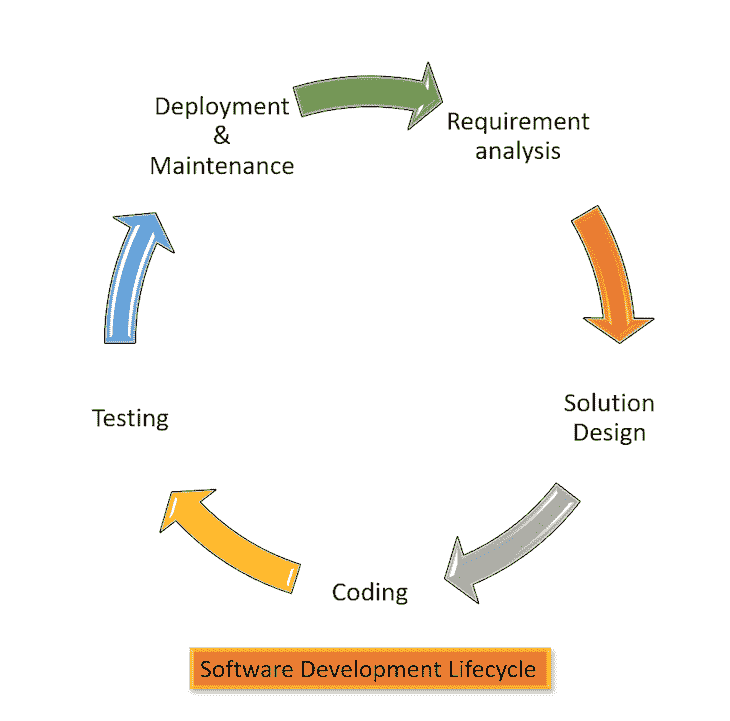

# 什么是产品开发生命周期？5 个阶段和示例

> 原文：<https://blog.logrocket.com/product-management/what-is-product-development-lifecycle-stages-examples/>

* * *

## 目录

* * *

## 什么是产品开发生命周期(PDLC)？

[产品开发框架](https://blog.logrocket.com/product-management/6-product-management-frameworks-you-should-know/)使产品团队能够应对不断发展的市场变化，快速解决客户需求。产品开发生命周期定义了团队在产品过时之前向最终用户交付有价值的产品所必须经历的阶段。

产品开发生命周期(PDLC)是产品生命周期管理的一个子集，它专注于每个阶段的构建和交付。

## 产品开发生命周期的 5 个阶段是什么？

产品开发生命周期经历五个阶段。根据组织和产品的规模，这五个阶段可以分为以下几个步骤:

1.  [构思](#ideation)
2.  [概念化](#conceptualization)
3.  [设计](#designing)
4.  [开发](#development)
5.  [交货](#delivery)

让我们更详细地探索 PDLC 中的每一步，并检查整个过程中[产品经理的角色](https://blog.logrocket.com/product-management/product-managers-role-each-product-lifecycle-stage/)。

### 1.思维能力

对于大多数产品经理来说，构思是有趣的部分。想法可以随时随地冒出来。即便如此，大多数还是被遗忘或者永不见天日。

在[产品管理](https://blog.logrocket.com/product-management/)中，构思是包含在所有框架中的适当步骤。有许多行之有效的方法可以提取伟大的想法和概念，比如头脑风暴、思维导图、黑客马拉松等。

人们不指望产品经理独自设计下一个伟大的想法。相反，他们应该促进讨论，鼓励从事产品工作的主题专家发挥创造力，产生新的概念。

这一步旨在为用户创造许多解决相关问题的想法，筛选最有影响力的概念，并将其带入下一阶段。

一旦收集了所有的选项，团队就对它们进行筛选，以确定哪些选项符合基本标准，如可行性、数量、竞争对手、目标群体等。，以缩小列表范围。有许多行之有效的方法来筛选列表，例如使用影响矩阵，然后进行成本评估和 SWOT 分析。

### 2.概念化

在概念化阶段，想法变得有形。这个阶段旨在验证概念是否值得开发，是否可能为最终用户产生价值。

有许多方法可以测试和建立一个概念。根据这一步所需工作的大小，它可以分为两个子步骤:[原型制作](#prototyping)和[测试和分析](#testing-and-analysis)。

#### 样机研究

原型制作可以简单到在纸上画几个设计框架。原型也可以是一个更复杂的交互式设计，使用像 [InVision](https://www.invisionapp.com/freehand/ss-freehand-gen-digital-whiteboard?utm_source=google&utm_campaign=DG_SS_G_NAM_Search_Brand&utm_medium=paid_search&utm_term=invision&utm_content=InVision%20Brand&gclid=Cj0KCQjwj7CZBhDHARIsAPPWv3eR7GMyDrqDX1yXkQzbKSugKCy7aNC0EomuDEeIibR-CAbXGO0lbYgaAotcEALw_wcB) 这样的工具来制作。你可以根据想法的规模和影响来决定前进的方向。

在选择原型方法之前，您必须定义:

*   **目标市场** —详细描述消费者群体，确定你的产品和服务在他们日常生活中的位置，这将有助于从一开始就设计出正确的设计
*   **价值主张**——定义您的功能对消费者群体的价值，这将符合预期
*   成功指标 —在产品开发中，尽早知道你的想法是否朝着正确的方向发展是至关重要的。为了评估成功，[定义具体的衡量标准和明确的目标](https://blog.logrocket.com/product-management/what-are-okrs-how-to-write-templates-examples/)

#### 测试和分析

测试一个概念有多种方法。用户测试、调查、A/B 测试、 [alpha](https://blog.logrocket.com/product-management/what-is-alpha-testing-definition-process-examples/) 和 [beta](https://blog.logrocket.com/product-management/what-is-beta-testing-how-to-do-it/) 测试等。每个计划都是不同的，方法也因组织的需求而异。

在测试和分析步骤中，您需要回答的最重要的问题是:

*   **可用性** —功能是否易于理解和使用？
*   **价值** —功能是否为最终用户创造了良好的价值？
*   **便利性** —功能是否符合用户的期望？
*   **定价** —用户愿意为新产品或新功能支付多少钱？

### 3.设计

当产品已经从测试和分析中发展出来，当你有了上述所有问题的答案并最终确定了一个解决方案时，你就准备好前进了。

设计步骤对于评估和规划至关重要。同样，良好的基础有助于确保您的团队以正确的方式构建产品。

设计阶段包括以下考虑事项:

#### 规划

技术专家处理建筑设计的细节。这包括定义可行性、技术堆栈和所需的能力，确定依赖关系，以及规划开发和测试。

然后，产品经理可以根据从设计和初步规划中收集的所有信息来规划预算，以构建和推出实际的产品。

#### 循环

在设计阶段，可以根据测试和分析的结果进行迭代。[开发团队](https://blog.logrocket.com/product-management/3-scrum-roles-agile/#developers)可能还会考虑一种比迭代可能提议的更好的方法来构建产品。

十有八九，开发团队是由技术专家组成的，所以决策应该是协作和包容的。

### 4.发展

当产品处于开发阶段时，是时候规划解决方案的实际开发路线图和技术实现了。这一步还包括质量保证和测试。开发步骤的目标是为交付给最终用户的新功能做准备。

在这个步骤中，整个开发团队聚集在一起，在开发策略上保持一致。这包括规划依赖项、第三方集成(如果需要的话)，以及考虑构建和交付可靠产品所需的所有非功能性需求。

[MVP 规划](https://blog.logrocket.com/product-management/what-is-minimum-viable-product-mvp-how-to-define/)包括冲刺阶段的初步计划和将特性分组(例如，必须拥有、应该拥有、最好拥有)，以及开发和资源分配的[评估和时间计划](https://blog.logrocket.com/product-management/planning-poker-agile-estimation-scrum/)。一旦完成，每个 MVP 都应该准备好发布给最终用户。

团队还必须就质量保证策略达成一致，这涉及到不同级别的测试(例如，系统测试、集成测试、回归测试等)。)以及建立一个故障安全机制和备份计划，以防发布失败。

### 5.交付

即使你的产品检查了所有正确的框，如果你不以战略的方式将其商业化，它也不会在正确的时间到达正确的受众。

市场上有一些非凡的产品从来没有达到他们应得的成功水平，因为人们不了解他们。终端用户没有时间或精力去评估哪些产品最值得他们花费时间和精力；公司的工作是有效地推销其产品。

最后，一个好的交付计划对产品的成败和质量一样重要。

* * *

订阅我们的产品管理简讯
将此类文章发送到您的收件箱

* * *

在制定交付计划时，如果需要，产品经理应该让[营销专家](https://blog.logrocket.com/product-management/product-marketing-manager-job-description-role-skills/)、分析人员和销售人员参与进来。在产品生命周期的开始和结束时，让接近最终用户的人参与进来，可以确保整个过程的完整循环。

#### 启动计划

[产品发布计划](https://blog.logrocket.com/product-management/what-is-a-product-launch-plan-how-to-create/)应该清楚地阐明你是计划向你的整个客户群一次性发布新功能，还是进行一轮涉及选定用户组的 beta 测试。

产品经理可以依靠主题专家的输入来确定细分市场和市场，以推出具有最大影响力的功能。但是，在一天结束时，启动计划的最终决定权在首相手中。

#### 营销活动

当产品面向最终用户时，或者如果产品正在产生收入，围绕该功能计划营销活动以增加其覆盖范围并实现最大影响是至关重要的。

为了准备营销活动，产品经理应该制定预算并估计投资回报率，以便在发布前获得管理层批准的营销计划。然后，营销专家可以在产品经理的参与下开展实际活动。

## PDLC 与 SDLC:有什么区别？

[软件开发生命周期(SDLC)](https://phoenixnap.com/blog/software-development-life-cycle#:~:text=Software%20Development%20Life%20Cycle%20is,%2C%20Test%2C%20Deploy%2C%20Maintain.) 专注于以尽可能快的速度、低成本和最高的效率开发产品。

软件开发生命周期的五个阶段是:

1.  需求分析
2.  解决方案设计
3.  履行
4.  测试
5.  部署和维护

产品开发生命周期(PDLC)和软件开发生命周期(SDLC)的根本区别是焦点和目标。PDLC 是一个总体过程，关注产品整体，而 SDLC 是 PDLC 的一个子集，关注产品开发的技术实现。

因为 PDLC 侧重于以合适的方式将正确的产品和功能推向市场，所以从构思到交付的过程通常需要更长的时间。SDLC 关注于交付高质量的产品实现，所以在下一个过程周期恢复之前，周期可能会有几个冲刺那么长。

## 产品开发生命周期实例

为了展示产品开发生命周期在实践中是什么样子，让我们以一家零售服装连锁店为例，该连锁店发现需要改造其数字平台，以适应由于公共健康状况而不太愿意亲自前往商店的客户。

在构思阶段，会产生多个想法，包括新设计、在家尝试、虚拟现实机会等。然后使用成本评估、用户影响和 [SWOT 分析](https://en.wikipedia.org/wiki/SWOT_analysis)矩阵对这些想法进行排序，并为下一个概念化步骤确定优先级。

让我们选择概念化步骤中的重新设计选项。首先，使用新设计创建一个原型，并在市场上进行分析，进行一些用户测试和多种机会的 A/B 测试。经过分析，得出的结论是，重新设计本身不会产生太大的影响，除非结合一些虚拟试验的附加功能。

这种重新设计的概念，包括虚拟试验，然后转移到设计阶段，在设计阶段，架构师仔细检查当前的系统，分析可行性，评估技术和技术堆栈，确定所需的能力和依赖性，等等。

其次，根据测试结果迭代设计并最终确定。

最后，成功指标—例如，转化率增加 15%，客户满意率价值主张增加 10%，收入增加 10%，等等。—被定义为目标。

一旦创建了具体的概念，完成了预算和计划，并且想法得到了最终批准，它就进入了开发阶段，在这个阶段，团队考虑技术实现、资源分配、时间估计和依赖性的计划。最后，团队计划测试和质量保证，并估计上市时间。

一旦产品经理有了预计的上市时间，他们就可以开始制定推出计划和营销活动，以使改版后的网站商业化。目标是最大限度地提高流量和对新的虚拟试用功能的认识，将其作为新的独特卖点。

产品生命周期并不在交付时结束；这是一个循环，而不是一个线性的过程。一旦交付，团队将对绩效进行持续评估，确定任何新的需求，然后从构思开始，重新开始 PDLC 过程。

## 摘要

产品开发生命周期是一个识别市场需求并组建团队以快速开发并向客户交付价值的过程。

构思和概念化步骤旨在推断出最适合的产品。设计和开发步骤旨在提高效率。最后，交付和商业化步骤帮助您以正确的方式向最终用户交付产品。

产品经理在开发周期的每个阶段都扮演着至关重要的角色。项目经理负责收集每个阶段的能力和专业知识，以计划和执行产品，从想法到对最终用户有价值且适合市场的有形事物。

与[敏捷开发](https://blog.logrocket.com/product-management/four-agile-manifesto-values-explained/)中的每个过程一样，产品生命周期管理过程旨在通过学习和迭代快速有效地交付价值。

*精选图片来源:[icon scout](https://iconscout.com/icon/refresh-1754122)*

## [LogRocket](https://lp.logrocket.com/blg/pm-signup) 产生产品见解，从而导致有意义的行动

[LogRocket](https://lp.logrocket.com/blg/pm-signup) 确定用户体验中的摩擦点，以便您能够做出明智的产品和设计变更决策，从而实现您的目标。

使用 LogRocket，您可以[了解影响您产品的问题的范围](https://logrocket.com/for/analytics-for-web-applications)，并优先考虑需要做出的更改。LogRocket 简化了工作流程，允许工程和设计团队使用与您相同的[数据进行工作](https://logrocket.com/for/web-analytics-solutions)，消除了对需要做什么的困惑。

让你的团队步调一致——今天就试试 [LogRocket](https://lp.logrocket.com/blg/pm-signup) 。

[Bindiya Thakkar Follow](https://blog.logrocket.com/author/bindiyathakkar/) Experienced product manager and product owner with a demonstrated history of working in the Omni channel and digital tools. Skilled in product management, digital strategy, roadmapping, business strategy, and user experience.